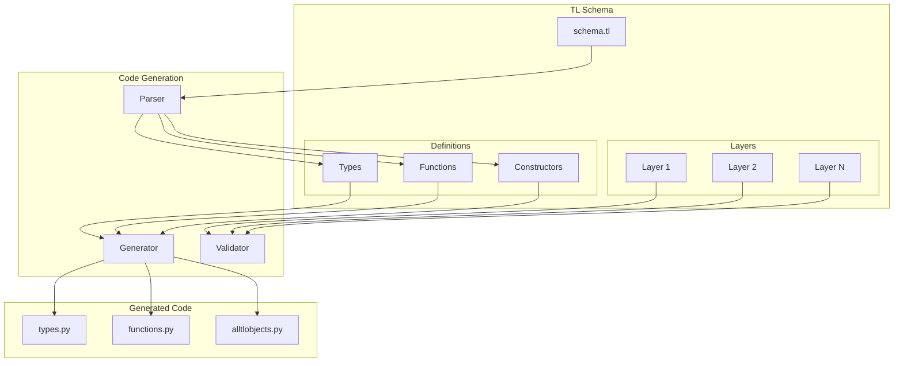
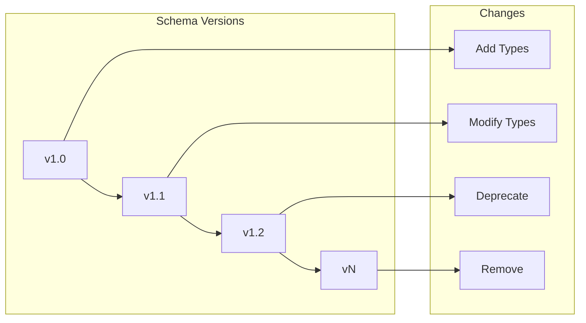

# TL Schema

---
**Navigation:** [← API Layer](README.md) | [Home](../index.md) | [Up](../index.md) | [Types and Functions →](types-functions.md)

---

## Overview

Type Language (TL) is a formal language for describing data structures and functions used in MTProto. Telethon automatically generates Python code from Telegram's TL schema, providing type-safe access to all Telegram API methods and types.

## TL Language Basics

### Schema Structure



### TL Syntax

```bnf
// Basic TL syntax
declaration ::= combinator-declaration | partial-type-application | final-declaration

combinator-declaration ::= full-combinator-id [ "{" var ":" type-expr "}" ] arg* "=" result-type ";"

full-combinator-id ::= lc-ident-ns "#" hex-digit*

arg ::= var-ident ":" [ multiplicity "*" ] [ "{" var ":" type-expr "}" ] type-term

result-type ::= type-expr [ "<" type-expr ">" ]

type-expr ::= type-term | "!" type-expr | type-expr "+" type-expr

type-term ::= "(" type-expr ")" | var-ident | lc-ident-ns | uc-ident-ns | "#"
```

## Schema Components

### 1. Types

Types define data structures that can be sent and received.

```tl
// Basic type definition
user#938458c1 id:long access_hash:long first_name:string last_name:string username:string phone:string photo:UserProfilePhoto status:UserStatus = User;

// Type with flags (optional fields)
message#85d6cbe2 flags:# id:int from_id:flags.8?Peer peer_id:Peer date:int message:string media:flags.9?MessageMedia = Message;

// Bare types (no constructor ID)
int ? = Int;
long ? = Long;
string ? = String;
bytes ? = Bytes;
```

### 2. Functions

Functions define RPC methods that can be invoked.

```tl
// Function definition
messages.sendMessage#520c3870 flags:# peer:InputPeer message:string random_id:long reply_to:flags.0?InputReplyTo entities:flags.3?Vector<MessageEntity> = Updates;

// Function with multiple return types
auth.sendCode#a677244f phone_number:string api_id:int api_hash:string settings:CodeSettings = auth.SentCode;

// Vector results
messages.getMessages#63c66506 id:Vector<InputMessage> = messages.Messages;
```

### 3. Constructors

Constructors are specific implementations of abstract types.

```tl
// Multiple constructors for one type
inputPeerEmpty#7f3b18ea = InputPeer;
inputPeerSelf#7da07ec9 = InputPeer;
inputPeerChat#35a95cb9 chat_id:long = InputPeer;
inputPeerUser#dde8a54c user_id:long access_hash:long = InputPeer;
inputPeerChannel#27bcbbfc channel_id:long access_hash:long = InputPeer;
```

## Code Generation Process

### 1. Schema Parsing

```python
class TLParser:
    """
    Parses TL schema files into structured data.
    """
    
    def __init__(self):
        self.types = {}
        self.functions = {}
        self.constructors = {}
        
    def parse_schema(self, schema_text):
        """Parse TL schema text."""
        lines = schema_text.split('\n')
        
        for line in lines:
            line = line.strip()
            if not line or line.startswith('//'):
                continue
                
            if '=' in line:
                self._parse_definition(line)
                
    def _parse_definition(self, line):
        """Parse a single TL definition."""
        # Extract components
        match = re.match(
            r'([a-zA-Z0-9_.]+)#([0-9a-f]+)\s+(.*?)\s*=\s*([a-zA-Z0-9_.]+);',
            line
        )
        
        if match:
            name = match.group(1)
            constructor_id = int(match.group(2), 16)
            args = self._parse_args(match.group(3))
            result_type = match.group(4)
            
            definition = TLDefinition(
                name=name,
                constructor_id=constructor_id,
                args=args,
                result_type=result_type
            )
            
            if '.' in name:  # It's a function
                self.functions[name] = definition
            else:  # It's a type
                self.types[name] = definition
                self.constructors[constructor_id] = definition
```

### 2. Code Generation

```python
class CodeGenerator:
    """
    Generates Python code from parsed TL definitions.
    """
    
    def generate_type(self, definition):
        """Generate Python class for a type."""
        template = '''
class {class_name}(TLObject):
    """
    {docstring}
    
    Constructor ID: 0x{constructor_id:08x}
    
    Attributes:
        {attributes}
    """
    
    CONSTRUCTOR_ID = 0x{constructor_id:08x}
    SUBCLASS_OF_ID = 0x{subclass_id:08x}
    
    def __init__(self, {init_args}):
        {init_body}
        
    def to_bytes(self):
        return struct.pack('<I', self.CONSTRUCTOR_ID) + {serialization}
        
    @classmethod
    def from_bytes(cls, data):
        {deserialization}
        return cls({return_args})
'''
        
        return template.format(
            class_name=self._to_class_name(definition.name),
            docstring=self._generate_docstring(definition),
            constructor_id=definition.constructor_id,
            subclass_id=self._get_subclass_id(definition.result_type),
            attributes=self._format_attributes(definition.args),
            init_args=self._format_init_args(definition.args),
            init_body=self._generate_init_body(definition.args),
            serialization=self._generate_serialization(definition.args),
            deserialization=self._generate_deserialization(definition.args),
            return_args=self._format_return_args(definition.args)
        )
```

### 3. Type System

```python
class TLType:
    """
    Represents a TL type with its properties.
    """
    
    def __init__(self, name, bare=False, generic_arg=False):
        self.name = name
        self.bare = bare  # No constructor ID
        self.generic_arg = generic_arg  # Like !X
        
        # Built-in types
        self.CORE_TYPES = {
            'int': (4, 'i', int),
            'long': (8, 'q', int),
            'int128': (16, '16s', bytes),
            'int256': (32, '32s', bytes),
            'double': (8, 'd', float),
            'string': (-1, None, str),
            'bytes': (-1, None, bytes),
            'true': (0, None, bool),
            'Bool': (4, None, bool),
            'date': (4, 'i', datetime),
        }
        
    def is_core_type(self):
        """Check if this is a built-in type."""
        return self.name in self.CORE_TYPES
        
    def get_size(self):
        """Get size in bytes (-1 for variable)."""
        if self.is_core_type():
            return self.CORE_TYPES[self.name][0]
        return -1
        
    def get_pack_format(self):
        """Get struct pack format."""
        if self.is_core_type():
            return self.CORE_TYPES[self.name][1]
        return None
```

## Flag System

### Flag Implementation

```python
class FlaggedArg:
    """
    Represents an optional argument controlled by flags.
    """
    
    def __init__(self, flag_index, arg_type):
        self.flag_index = flag_index
        self.arg_type = arg_type
        
    def is_present(self, flags):
        """Check if this argument is present."""
        return bool(flags & (1 << self.flag_index))
        
    def serialize(self, value, flags):
        """Serialize if present in flags."""
        if value is not None:
            flags |= (1 << self.flag_index)
            return self.arg_type.serialize(value), flags
        return b'', flags
        
    def deserialize(self, data, flags):
        """Deserialize if present in flags."""
        if self.is_present(flags):
            return self.arg_type.deserialize(data)
        return None
```

### Flag Usage Example

```python
# TL definition with flags
# message#85d6cbe2 flags:# out:flags.1?true mentioned:flags.4?true media:flags.9?MessageMedia = Message;

class Message(TLObject):
    def __init__(self, out=None, mentioned=None, media=None, **kwargs):
        self.out = out
        self.mentioned = mentioned
        self.media = media
        
        # Calculate flags
        self.flags = 0
        if self.out is not None:
            self.flags |= (1 << 1)
        if self.mentioned is not None:
            self.flags |= (1 << 4)
        if self.media is not None:
            self.flags |= (1 << 9)
```

## Vector Handling

### Vector Implementation

```python
class Vector(TLObject):
    """
    Represents a vector (list) of TL objects.
    """
    
    CONSTRUCTOR_ID = 0x1cb5c415
    
    def __init__(self, items, item_type):
        self.items = items
        self.item_type = item_type
        
    def to_bytes(self):
        """Serialize vector to bytes."""
        # Vector constructor ID
        data = struct.pack('<I', self.CONSTRUCTOR_ID)
        
        # Number of items
        data += struct.pack('<I', len(self.items))
        
        # Serialize each item
        for item in self.items:
            if isinstance(self.item_type, CoreType):
                data += self.item_type.serialize(item)
            else:
                data += item.to_bytes()
                
        return data
        
    @classmethod
    def from_bytes(cls, data, item_type):
        """Deserialize vector from bytes."""
        reader = BinaryReader(data)
        
        # Skip constructor ID
        reader.read_int()
        
        # Read count
        count = reader.read_int()
        
        # Read items
        items = []
        for _ in range(count):
            if isinstance(item_type, CoreType):
                items.append(item_type.deserialize(reader))
            else:
                items.append(item_type.from_bytes(reader))
                
        return cls(items, item_type)
```

## Layer System

### Layer Management

```python
class LayerManager:
    """
    Manages API layer compatibility.
    """
    
    CURRENT_LAYER = 139
    
    def __init__(self):
        self.layer_changes = {
            # Layer: [(old_name, new_name, change_type)]
            138: [
                ('inputMediaInvoice', 'inputMediaInvoice', 'modified'),
                ('messages.getMessagesViews', 'messages.getMessagesViews', 'modified'),
            ],
            139: [
                ('phone.joinGroupCall', 'phone.joinGroupCall', 'added'),
                ('phone.leaveGroupCall', 'phone.leaveGroupCall', 'added'),
            ]
        }
        
    def wrap_request(self, request):
        """Wrap request in current layer."""
        from .functions import InitConnectionRequest, InvokeWithLayerRequest
        
        # Wrap in layer
        request = InvokeWithLayerRequest(
            layer=self.CURRENT_LAYER,
            query=request
        )
        
        # Wrap in init connection if needed
        if not self._initialized:
            request = InitConnectionRequest(
                api_id=self.api_id,
                device_model=self.device_model,
                system_version=self.system_version,
                app_version=self.app_version,
                system_lang_code=self.system_lang_code,
                lang_pack='',
                lang_code=self.lang_code,
                query=request
            )
            
        return request
```

## Schema Evolution

### Versioning Strategy



### Backward Compatibility

```python
class CompatibilityLayer:
    """
    Handles backward compatibility for schema changes.
    """
    
    def __init__(self):
        self.aliases = {
            # Old name -> new name
            'sendMessageUploadAudioAction': 'sendMessageUploadAudioAction_73',
            'userEmpty': 'userEmpty_200',
        }
        
        self.deprecated = {
            # Deprecated type -> replacement
            'messages.sendEncrypted': 'messages.sendEncryptedV2',
        }
        
    def resolve_type(self, type_name):
        """Resolve type name considering compatibility."""
        # Check aliases
        if type_name in self.aliases:
            return self.aliases[type_name]
            
        # Check deprecated
        if type_name in self.deprecated:
            logger.warning(
                f'{type_name} is deprecated, use {self.deprecated[type_name]}'
            )
            
        return type_name
```

## Performance Optimization

### Lazy Loading

```python
class LazyTLObject:
    """
    TL object that deserializes fields on demand.
    """
    
    def __init__(self, constructor_id, data):
        self._constructor_id = constructor_id
        self._data = data
        self._cache = {}
        self._deserialized = False
        
    def __getattr__(self, name):
        """Deserialize field on first access."""
        if name not in self._cache:
            if not self._deserialized:
                self._deserialize_all()
                
        return self._cache.get(name)
        
    def _deserialize_all(self):
        """Deserialize all fields."""
        # Find type definition
        definition = TL_OBJECTS[self._constructor_id]
        
        # Deserialize fields
        reader = BinaryReader(self._data)
        for field in definition.fields:
            value = field.deserialize(reader)
            self._cache[field.name] = value
            
        self._deserialized = True
```

### Serialization Caching

```python
class CachedTLObject(TLObject):
    """
    TL object that caches serialized form.
    """
    
    def __init__(self, *args, **kwargs):
        super().__init__(*args, **kwargs)
        self._serialized_cache = None
        self._cache_valid = True
        
    def __setattr__(self, name, value):
        """Invalidate cache on attribute change."""
        super().__setattr__(name, value)
        if hasattr(self, '_cache_valid'):
            self._cache_valid = False
            
    def to_bytes(self):
        """Return cached bytes if valid."""
        if not self._cache_valid or self._serialized_cache is None:
            self._serialized_cache = super().to_bytes()
            self._cache_valid = True
            
        return self._serialized_cache
```

## Best Practices

### Schema Usage

1. **Use Generated Code**: Don't manually create TL objects
2. **Check Layer Compatibility**: Ensure client supports server layer
3. **Handle Schema Updates**: Plan for schema evolution
4. **Validate Input**: Check required fields before sending
5. **Use Type Hints**: Leverage generated type information

### Code Generation

1. **Keep Schema Updated**: Regularly update from official source
2. **Version Generated Code**: Track schema version in code
3. **Test Changes**: Validate generated code after updates
4. **Document Custom Types**: Add docstrings to generated code
5. **Optimize Common Paths**: Cache frequently used objects

## Next Steps

- Continue to [Types and Functions](types-functions.md) for generated API
- See [Custom Types](custom-types.md) for wrapper objects
- Explore [API Versioning](versioning.md) for layer management

---
**Navigation:** [← API Layer](README.md) | [Home](../index.md) | [Up](../index.md) | [Types and Functions →](types-functions.md)

---