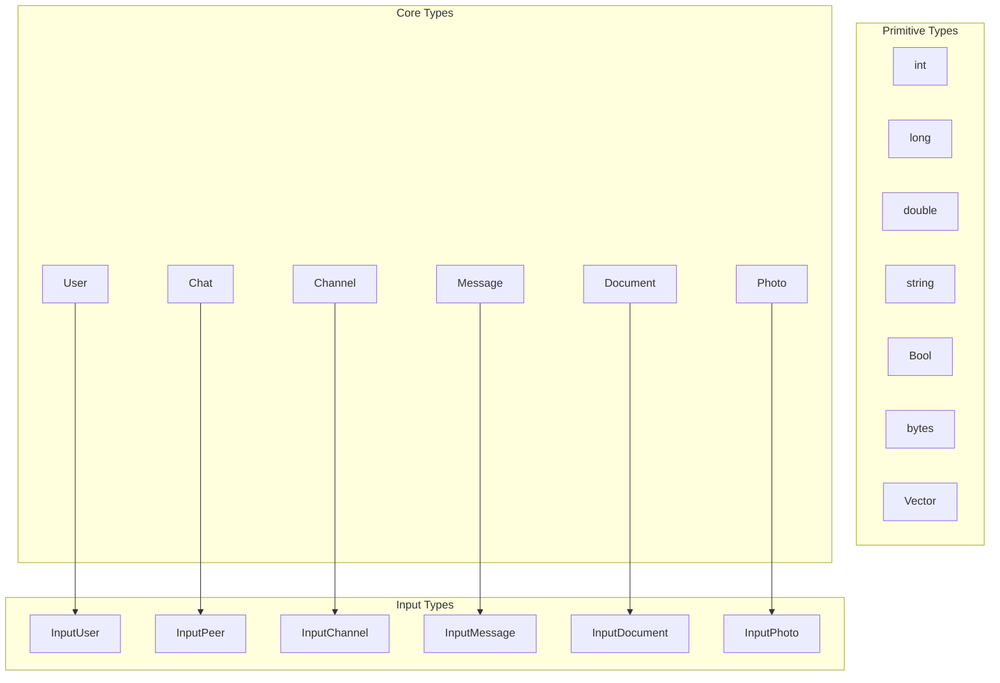

# Types and Functions

---
**Navigation:** [← TL Schema](tl-schema.md) | [Home](../index.md) | [Up](../index.md) | [Custom Types →](custom-types.md)

---

## Overview

Telethon's API layer consists of types (data structures) and functions (RPC methods) that directly map to Telegram's API. This document covers the most commonly used types and functions, their relationships, and usage patterns.

## Type Categories

### Basic Types



## User Types

### User Object

```python
class User(TLObject):
    """
    Represents a Telegram user or bot.
    """
    
    # Constructor ID
    CONSTRUCTOR_ID = 0x3ff6ecb0
    
    # Attributes
    id: int                      # Unique user ID
    is_self: bool               # Is this the current user
    contact: bool               # Is in contacts
    mutual_contact: bool        # Mutual contact
    deleted: bool               # Account deleted
    bot: bool                   # Is a bot
    bot_chat_history: bool      # Bot can access chat history
    bot_nochats: bool           # Bot can't be added to groups
    verified: bool              # Verified account
    restricted: bool            # Restricted account
    min: bool                   # Minimal info available
    bot_inline_geo: bool        # Bot supports inline geo
    support: bool               # Is support account
    scam: bool                  # Marked as scam
    apply_min_photo: bool       # Apply min photo
    fake: bool                  # Marked as fake
    access_hash: int            # Access hash for API calls
    first_name: str             # First name
    last_name: Optional[str]    # Last name
    username: Optional[str]     # Username
    phone: Optional[str]        # Phone number
    photo: Optional[UserProfilePhoto]  # Profile photo
    status: Optional[UserStatus]       # Online status
    bot_info_version: Optional[int]    # Bot info version
    restriction_reason: Optional[List[RestrictionReason]]
    bot_inline_placeholder: Optional[str]  # Bot inline placeholder
    lang_code: Optional[str]    # Language code
    
    def get_display_name(self) -> str:
        """Get user's display name."""
        if self.first_name and self.last_name:
            return f"{self.first_name} {self.last_name}"
        elif self.first_name:
            return self.first_name
        elif self.username:
            return f"@{self.username}"
        else:
            return f"User {self.id}"
            
    def get_input_user(self) -> InputUser:
        """Convert to InputUser for API calls."""
        if self.is_self:
            return InputUserSelf()
        else:
            return InputUser(
                user_id=self.id,
                access_hash=self.access_hash
            )
```

### UserStatus Types

```python
# Online status types
class UserStatusOnline(TLObject):
    """User is online."""
    expires: int  # Online until

class UserStatusOffline(TLObject):
    """User is offline."""
    was_online: int  # Last seen time

class UserStatusRecently(TLObject):
    """User was online recently."""
    pass

class UserStatusLastWeek(TLObject):
    """User was online last week."""
    pass

class UserStatusLastMonth(TLObject):
    """User was online last month."""
    pass

class UserStatusEmpty(TLObject):
    """No status information."""
    pass
```

## Chat Types

### Chat vs Channel

```python
class Chat(TLObject):
    """
    Represents a basic group chat.
    """
    
    CONSTRUCTOR_ID = 0x41cbf256
    
    id: int                     # Chat ID
    title: str                  # Chat title
    photo: ChatPhoto           # Chat photo
    participants_count: int    # Number of participants
    date: int                  # Creation date
    version: int               # Version for updates
    migrated_to: Optional[InputChannel]  # Migrated to supergroup
    admin_rights: Optional[ChatAdminRights]
    default_banned_rights: Optional[ChatBannedRights]
    
    # Flags
    creator: bool              # User created this chat
    kicked: bool               # User was kicked
    left: bool                 # User left the chat
    deactivated: bool          # Chat was deactivated
    call_active: bool          # Call is active
    call_not_empty: bool       # Call has participants
    

class Channel(TLObject):
    """
    Represents a supergroup or channel.
    """
    
    CONSTRUCTOR_ID = 0x8261ac61
    
    id: int                    # Channel ID
    title: str                 # Channel title
    username: Optional[str]    # Public username
    photo: ChatPhoto          # Channel photo
    date: int                 # Creation date
    version: int              # Version number
    restriction_reason: Optional[List[RestrictionReason]]
    admin_rights: Optional[ChatAdminRights]
    banned_rights: Optional[ChatBannedRights]
    default_banned_rights: Optional[ChatBannedRights]
    participants_count: Optional[int]  # Participant count
    
    # Flags
    creator: bool             # User created this channel
    left: bool                # User left/not joined
    broadcast: bool           # Is broadcast channel
    verified: bool            # Verified channel
    megagroup: bool           # Is supergroup
    restricted: bool          # Restricted channel
    signatures: bool          # Messages have signatures
    min: bool                 # Minimal info
    scam: bool                # Marked as scam
    has_link: bool            # Has linked chat
    has_geo: bool             # Has location
    slowmode_enabled: bool    # Slow mode enabled
    call_active: bool         # Call is active
    call_not_empty: bool      # Call has participants
    fake: bool                # Marked as fake
    
    def get_input_channel(self) -> InputChannel:
        """Convert to InputChannel."""
        return InputChannel(
            channel_id=self.id,
            access_hash=self.access_hash
        )
```

## Message Types

### Message Structure

```python
class Message(TLObject):
    """
    Represents a message in a chat.
    """
    
    CONSTRUCTOR_ID = 0x38116ee0
    
    # Core fields
    id: int                    # Message ID
    peer_id: Peer             # Where message was sent
    from_id: Optional[Peer]   # Who sent the message
    message: str              # Message text
    date: int                 # Send date
    
    # Reply/Forward
    reply_to: Optional[MessageReplyHeader]
    fwd_from: Optional[MessageFwdHeader]
    
    # Media
    media: Optional[MessageMedia]
    entities: Optional[List[MessageEntity]]
    
    # Edit info
    edit_date: Optional[int]
    edit_hide: bool
    
    # Additional info
    views: Optional[int]
    forwards: Optional[int]
    replies: Optional[MessageReplies]
    reactions: Optional[MessageReactions]
    
    # Flags
    out: bool                 # Outgoing message
    mentioned: bool           # User was mentioned
    media_unread: bool        # Media not viewed
    silent: bool              # Silent message
    post: bool                # Channel post
    from_scheduled: bool      # Scheduled message
    legacy: bool              # Legacy message
    pinned: bool              # Pinned message
    
    def get_sender(self) -> Optional[Union[User, Channel]]:
        """Get message sender."""
        if not self.from_id:
            return None
            
        if isinstance(self.from_id, PeerUser):
            return self._client.get_entity(self.from_id.user_id)
        elif isinstance(self.from_id, PeerChannel):
            return self._client.get_entity(self.from_id.channel_id)
            
    def get_chat(self) -> Union[User, Chat, Channel]:
        """Get chat where message was sent."""
        if isinstance(self.peer_id, PeerUser):
            return self._client.get_entity(self.peer_id.user_id)
        elif isinstance(self.peer_id, PeerChat):
            return self._client.get_entity(self.peer_id.chat_id)
        elif isinstance(self.peer_id, PeerChannel):
            return self._client.get_entity(self.peer_id.channel_id)
```

### Message Media Types

```python
# Media type hierarchy
class MessageMedia(TLObject):
    """Base class for message media."""
    pass

class MessageMediaPhoto(MessageMedia):
    """Photo media."""
    photo: Photo
    ttl_seconds: Optional[int]

class MessageMediaDocument(MessageMedia):
    """Document media (files, videos, audio)."""
    document: Document
    ttl_seconds: Optional[int]

class MessageMediaWebPage(MessageMedia):
    """Web page preview."""
    webpage: WebPage

class MessageMediaGeo(MessageMedia):
    """Geographic location."""
    geo: GeoPoint

class MessageMediaContact(MessageMedia):
    """Contact information."""
    phone_number: str
    first_name: str
    last_name: str
    vcard: str
    user_id: int

class MessageMediaPoll(MessageMedia):
    """Poll."""
    poll: Poll
    results: PollResults
```

## Common Functions

### Message Functions

```python
# Send message
class SendMessageRequest(TLFunction):
    """Send a message to a peer."""
    
    CONSTRUCTOR_ID = 0x520c3870
    
    peer: InputPeer              # Where to send
    message: str                 # Message text
    random_id: int              # Random ID for deduplication
    
    # Optional parameters
    reply_to_msg_id: Optional[int]
    reply_markup: Optional[ReplyMarkup]
    entities: Optional[List[MessageEntity]]
    schedule_date: Optional[int]
    silent: bool = False
    background: bool = False
    clear_draft: bool = False
    no_webpage: bool = False
    
    # Returns Updates
    RESPONSE_TYPE = Updates

# Edit message
class EditMessageRequest(TLFunction):
    """Edit a message."""
    
    CONSTRUCTOR_ID = 0x48f71778
    
    peer: InputPeer
    id: int                     # Message ID to edit
    message: Optional[str]      # New text
    media: Optional[InputMedia] # New media
    reply_markup: Optional[ReplyMarkup]
    entities: Optional[List[MessageEntity]]
    schedule_date: Optional[int]
    no_webpage: bool = False
    
    RESPONSE_TYPE = Updates

# Delete messages
class DeleteMessagesRequest(TLFunction):
    """Delete messages."""
    
    CONSTRUCTOR_ID = 0xe58e95d2
    
    id: List[int]               # Message IDs
    revoke: bool = False        # Delete for everyone
    
    RESPONSE_TYPE = AffectedMessages
```

### User Functions

```python
# Get users
class GetUsersRequest(TLFunction):
    """Get user information."""
    
    CONSTRUCTOR_ID = 0x0d91a548
    
    id: List[InputUser]         # Users to get
    
    RESPONSE_TYPE = List[User]

# Get full user info
class GetFullUserRequest(TLFunction):
    """Get full user information."""
    
    CONSTRUCTOR_ID = 0xb60f5918
    
    id: InputUser
    
    RESPONSE_TYPE = UserFull

# Update profile
class UpdateProfileRequest(TLFunction):
    """Update current user's profile."""
    
    CONSTRUCTOR_ID = 0x78515775
    
    first_name: Optional[str]
    last_name: Optional[str]
    about: Optional[str]
    
    RESPONSE_TYPE = User

# Update username
class UpdateUsernameRequest(TLFunction):
    """Update username."""
    
    CONSTRUCTOR_ID = 0x3e0bdd7c
    
    username: str
    
    RESPONSE_TYPE = User
```

### Chat Functions

```python
# Get chats
class GetChatsRequest(TLFunction):
    """Get chat information."""
    
    CONSTRUCTOR_ID = 0x49e9528f
    
    id: List[int]               # Chat IDs
    
    RESPONSE_TYPE = Chats

# Get full chat
class GetFullChatRequest(TLFunction):
    """Get full chat information."""
    
    CONSTRUCTOR_ID = 0xaeb00b34
    
    chat_id: int
    
    RESPONSE_TYPE = ChatFull

# Create chat
class CreateChatRequest(TLFunction):
    """Create a new group chat."""
    
    CONSTRUCTOR_ID = 0x09cb126e
    
    users: List[InputUser]      # Initial members
    title: str                  # Chat title
    
    RESPONSE_TYPE = Updates

# Add chat user
class AddChatUserRequest(TLFunction):
    """Add user to chat."""
    
    CONSTRUCTOR_ID = 0xf24753e3
    
    chat_id: int
    user_id: InputUser
    fwd_limit: int              # Forward history limit
    
    RESPONSE_TYPE = Updates
```

### Channel Functions

```python
# Get channels
class GetChannelsRequest(TLFunction):
    """Get channel information."""
    
    CONSTRUCTOR_ID = 0x0a7f6bbb
    
    id: List[InputChannel]
    
    RESPONSE_TYPE = Chats

# Join channel
class JoinChannelRequest(TLFunction):
    """Join a channel/supergroup."""
    
    CONSTRUCTOR_ID = 0x24b524c5
    
    channel: InputChannel
    
    RESPONSE_TYPE = Updates

# Leave channel
class LeaveChannelRequest(TLFunction):
    """Leave a channel/supergroup."""
    
    CONSTRUCTOR_ID = 0xf836aa95
    
    channel: InputChannel
    
    RESPONSE_TYPE = Updates

# Create channel
class CreateChannelRequest(TLFunction):
    """Create a new channel/supergroup."""
    
    CONSTRUCTOR_ID = 0x3d5fb10f
    
    title: str
    about: str
    
    # Flags
    broadcast: bool = False     # Create channel vs supergroup
    megagroup: bool = False     # Create supergroup
    for_import: bool = False    # For import
    geo_point: Optional[InputGeoPoint]
    address: Optional[str]
    
    RESPONSE_TYPE = Updates
```

## Working with Types

### Type Conversion

```python
class TypeConverter:
    """
    Utilities for converting between types.
    """
    
    @staticmethod
    def to_input_peer(entity) -> InputPeer:
        """Convert entity to InputPeer."""
        if isinstance(entity, User):
            if entity.is_self:
                return InputPeerSelf()
            return InputPeerUser(
                user_id=entity.id,
                access_hash=entity.access_hash
            )
            
        elif isinstance(entity, Chat):
            return InputPeerChat(chat_id=entity.id)
            
        elif isinstance(entity, Channel):
            return InputPeerChannel(
                channel_id=entity.id,
                access_hash=entity.access_hash
            )
            
        elif isinstance(entity, InputPeer):
            return entity
            
        else:
            raise TypeError(f"Cannot convert {type(entity)} to InputPeer")
            
    @staticmethod
    def to_input_user(user) -> InputUser:
        """Convert to InputUser."""
        if isinstance(user, User):
            if user.is_self:
                return InputUserSelf()
            return InputUser(
                user_id=user.id,
                access_hash=user.access_hash
            )
            
        elif isinstance(user, InputUser):
            return user
            
        elif isinstance(user, int):
            # Assume user ID
            return InputUser(user_id=user, access_hash=0)
            
        else:
            raise TypeError(f"Cannot convert {type(user)} to InputUser")
```

### Type Validation

```python
class TypeValidator:
    """
    Validates TL types.
    """
    
    @staticmethod
    def validate_message(message: Message) -> List[str]:
        """Validate message object."""
        errors = []
        
        if not message.id:
            errors.append("Message ID is required")
            
        if not message.peer_id:
            errors.append("Peer ID is required")
            
        if not message.date:
            errors.append("Date is required")
            
        if message.message is None and message.media is None:
            errors.append("Message must have text or media")
            
        return errors
        
    @staticmethod
    def validate_user(user: User) -> List[str]:
        """Validate user object."""
        errors = []
        
        if not user.id:
            errors.append("User ID is required")
            
        if not user.access_hash and not user.is_self:
            errors.append("Access hash required for non-self users")
            
        if not user.first_name and not user.deleted:
            errors.append("First name required for active users")
            
        return errors
```

## Best Practices

### Type Usage

1. **Use Appropriate Input Types**: Convert entities to Input* types for API calls
2. **Handle Optional Fields**: Always check Optional fields before use
3. **Cache Entities**: Store full entities to avoid repeated API calls
4. **Validate Types**: Validate types before sending to API
5. **Handle Type Updates**: Types can change, handle version differences

### Function Calls

1. **Set Random IDs**: Always set random_id for messages
2. **Handle Rate Limits**: Respect flood wait errors
3. **Use Batch Operations**: Get multiple entities in one call
4. **Check Permissions**: Verify permissions before operations
5. **Handle Errors**: Properly handle RPC errors

## Next Steps

- Continue to [Custom Types](custom-types.md) for custom type creation
- See [API Versioning](versioning.md) for version handling
- Review [Error Handling](../internals/errors.md) for error types

---
**Navigation:** [← TL Schema](tl-schema.md) | [Home](../index.md) | [Up](../index.md) | [Custom Types →](custom-types.md)

---