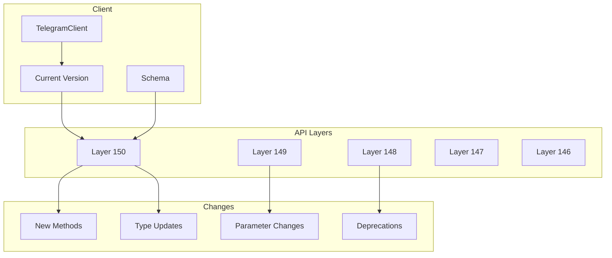

# API Versioning

---
**Navigation:** [← Custom Types](custom-types.md) | [Home](../index.md) | [Up](../index.md) | [Internals →](../internals/README.md)

---

## Overview

Telegram's API evolves continuously with new features, types, and methods being added regularly. Telethon implements a robust versioning system to handle API changes while maintaining backward compatibility and enabling access to new features.

## Layer System

### Understanding Layers



### Layer Definition

```python
# Current layer version
LAYER = 150

class Layer:
    """
    Represents an API layer version.
    """
    
    def __init__(self, version: int):
        self.version = version
        self.schema = self._load_schema(version)
        self.constructors = {}
        self.functions = {}
        
        self._parse_schema()
        
    def _load_schema(self, version: int):
        """Load schema for specific layer version."""
        schema_file = f"tl/schema/layer{version}.tl"
        
        with open(schema_file, 'r') as f:
            return f.read()
            
    def _parse_schema(self):
        """Parse schema to extract types and functions."""
        parser = TLParser(self.schema)
        
        for constructor in parser.constructors:
            self.constructors[constructor.id] = constructor
            
        for function in parser.functions:
            self.functions[function.id] = function
            
    def supports_constructor(self, constructor_id: int) -> bool:
        """Check if layer supports constructor."""
        return constructor_id in self.constructors
        
    def supports_function(self, function_id: int) -> bool:
        """Check if layer supports function."""
        return function_id in self.functions
```

## Version Management

### Schema Evolution

```python
class SchemaVersion:
    """
    Tracks schema changes between versions.
    """
    
    def __init__(self, from_version: int, to_version: int):
        self.from_version = from_version
        self.to_version = to_version
        self.changes = self._analyze_changes()
        
    def _analyze_changes(self):
        """Analyze changes between schema versions."""
        old_layer = Layer(self.from_version)
        new_layer = Layer(self.to_version)
        
        changes = {
            'added_constructors': [],
            'removed_constructors': [],
            'added_functions': [],
            'removed_functions': [],
            'modified_types': [],
            'modified_functions': []
        }
        
        # Find added/removed constructors
        old_ids = set(old_layer.constructors.keys())
        new_ids = set(new_layer.constructors.keys())
        
        changes['added_constructors'] = list(new_ids - old_ids)
        changes['removed_constructors'] = list(old_ids - new_ids)
        
        # Find modified types
        for cid in old_ids & new_ids:
            if self._has_changed(old_layer.constructors[cid], 
                               new_layer.constructors[cid]):
                changes['modified_types'].append(cid)
                
        return changes
        
    def get_migration_guide(self):
        """Generate migration guide for version upgrade."""
        guide = []
        
        if self.changes['removed_constructors']:
            guide.append("⚠️ Removed Types:")
            for cid in self.changes['removed_constructors']:
                guide.append(f"  - {self._get_name(cid)}")
                
        if self.changes['removed_functions']:
            guide.append("⚠️ Removed Functions:")
            for fid in self.changes['removed_functions']:
                guide.append(f"  - {self._get_name(fid)}")
                
        if self.changes['modified_types']:
            guide.append("⚠️ Modified Types:")
            for cid in self.changes['modified_types']:
                guide.append(f"  - {self._get_name(cid)}")
                
        return '\n'.join(guide)
```

### Version Negotiation

```python
class VersionNegotiator:
    """
    Handles version negotiation with server.
    """
    
    def __init__(self, client):
        self.client = client
        self.client_layer = LAYER
        self.server_layer = None
        
    async def negotiate(self):
        """Negotiate layer version with server."""
        # Send initConnection with our layer
        result = await self.client(
            InitConnectionRequest(
                api_id=self.client.api_id,
                device_model=self.client.device_model,
                system_version=self.client.system_version,
                app_version=self.client.app_version,
                system_lang_code=self.client.lang_code,
                lang_pack='',
                lang_code=self.client.lang_code,
                query=InvokeWithLayerRequest(
                    layer=self.client_layer,
                    query=GetConfigRequest()
                )
            )
        )
        
        # Extract server layer from config
        self.server_layer = self._extract_layer(result)
        
        if self.server_layer > self.client_layer:
            logger.warning(
                f"Server uses layer {self.server_layer}, "
                f"client uses {self.client_layer}. "
                "Consider updating Telethon."
            )
        elif self.server_layer < self.client_layer:
            logger.info(
                f"Using compatibility mode for layer {self.server_layer}"
            )
            
        return self.server_layer
```

## Backward Compatibility

### Compatibility Layer

```python
class CompatibilityLayer:
    """
    Provides backward compatibility for older API versions.
    """
    
    def __init__(self, target_layer: int):
        self.target_layer = target_layer
        self.adapters = self._load_adapters()
        
    def adapt_request(self, request):
        """Adapt request to target layer."""
        request_type = type(request)
        
        if request_type in self.adapters:
            return self.adapters[request_type].adapt(request)
            
        return request
        
    def adapt_response(self, response):
        """Adapt response from target layer."""
        response_type = type(response)
        
        if response_type in self.adapters:
            return self.adapters[response_type].adapt_response(response)
            
        return response

class RequestAdapter:
    """
    Adapts requests between layer versions.
    """
    
    def __init__(self, from_layer: int, to_layer: int):
        self.from_layer = from_layer
        self.to_layer = to_layer
        
    def adapt(self, request):
        """Adapt request to target layer."""
        # Example: SendMessageRequest changed in layer 147
        if isinstance(request, SendMessageRequest):
            if self.to_layer < 147 and hasattr(request, 'noforwards'):
                # Remove parameter not supported in older layer
                adapted = copy.copy(request)
                delattr(adapted, 'noforwards')
                return adapted
                
        return request
```

### Migration Helpers

```python
class MigrationHelper:
    """
    Helps migrate code between API versions.
    """
    
    @staticmethod
    def migrate_type(old_type, new_layer: int):
        """Migrate type to new layer version."""
        migrations = {
            # Layer 145 -> 146: User.status became optional
            (User, 146): lambda u: MigrationHelper._migrate_user_146(u),
            
            # Layer 147 -> 148: Message.reactions added
            (Message, 148): lambda m: MigrationHelper._migrate_message_148(m),
        }
        
        key = (type(old_type), new_layer)
        if key in migrations:
            return migrations[key](old_type)
            
        return old_type
        
    @staticmethod
    def _migrate_user_146(user):
        """Migrate User to layer 146."""
        if not hasattr(user, 'status'):
            user.status = UserStatusEmpty()
        return user
        
    @staticmethod
    def _migrate_message_148(message):
        """Migrate Message to layer 148."""
        if not hasattr(message, 'reactions'):
            message.reactions = None
        return message
```

## Schema Updates

### Update Detection

```python
class SchemaUpdateChecker:
    """
    Checks for schema updates.
    """
    
    def __init__(self):
        self.current_layer = LAYER
        self.update_url = "https://api.github.com/repos/telegramdesktop/tdesktop/commits"
        self.schema_path = "Telegram/SourceFiles/mtproto/scheme/api.tl"
        
    async def check_for_updates(self):
        """Check if newer schema is available."""
        try:
            # Get latest schema from Telegram Desktop repo
            async with aiohttp.ClientSession() as session:
                # Get latest commit
                async with session.get(self.update_url) as resp:
                    commits = await resp.json()
                    
                # Check schema file in latest commit
                for commit in commits[:5]:  # Check last 5 commits
                    schema_url = (
                        f"https://raw.githubusercontent.com/"
                        f"telegramdesktop/tdesktop/{commit['sha']}/"
                        f"{self.schema_path}"
                    )
                    
                    async with session.get(schema_url) as resp:
                        if resp.status == 200:
                            content = await resp.text()
                            layer = self._extract_layer_version(content)
                            
                            if layer > self.current_layer:
                                return {
                                    'available': True,
                                    'current': self.current_layer,
                                    'latest': layer,
                                    'commit': commit['sha']
                                }
                                
        except Exception as e:
            logger.error(f"Failed to check for updates: {e}")
            
        return {'available': False}
        
    def _extract_layer_version(self, schema: str) -> int:
        """Extract layer version from schema."""
        match = re.search(r'// LAYER (\d+)', schema)
        if match:
            return int(match.group(1))
        return 0
```

### Schema Generator

```python
class SchemaGenerator:
    """
    Generates Python code from TL schema.
    """
    
    def __init__(self, schema: str):
        self.schema = schema
        self.parser = TLParser(schema)
        
    def generate(self):
        """Generate Python code from schema."""
        # Generate types
        types_code = self._generate_types()
        
        # Generate functions
        functions_code = self._generate_functions()
        
        # Generate all TL objects module
        all_tl = self._generate_all_tl()
        
        return {
            'types.py': types_code,
            'functions.py': functions_code,
            'all_tl.py': all_tl
        }
        
    def _generate_types(self):
        """Generate type classes."""
        code = [
            "# Auto-generated from TL schema",
            f"# Layer {self.parser.layer}",
            "",
            "from .tlobject import TLObject",
            "",
        ]
        
        for constructor in self.parser.constructors:
            code.extend(self._generate_type_class(constructor))
            code.append("")
            
        return '\n'.join(code)
        
    def _generate_type_class(self, constructor):
        """Generate single type class."""
        lines = [
            f"class {constructor.name}(TLObject):",
            f'    """',
            f'    {constructor.description}',
            f'    """',
            f'    CONSTRUCTOR_ID = 0x{constructor.id:08x}',
            f'    SUBCLASS_OF = "{constructor.type}"',
            '',
        ]
        
        # Add attributes
        for param in constructor.params:
            type_hint = self._get_type_hint(param.type)
            lines.append(f'    {param.name}: {type_hint}')
            
        return lines
```

## Version-Specific Features

### Feature Detection

```python
class FeatureDetector:
    """
    Detects available features based on layer version.
    """
    
    # Feature introduction mapping
    FEATURES = {
        'reactions': 148,
        'topics': 149,
        'no_forwards': 147,
        'spoilers': 144,
        'custom_emoji': 146,
        'voice_chat_2': 145,
        'paid_media': 150,
    }
    
    def __init__(self, layer: int):
        self.layer = layer
        
    def supports(self, feature: str) -> bool:
        """Check if feature is supported."""
        if feature not in self.FEATURES:
            return False
            
        return self.layer >= self.FEATURES[feature]
        
    def get_available_features(self) -> List[str]:
        """Get all available features."""
        return [
            feature for feature, min_layer in self.FEATURES.items()
            if self.layer >= min_layer
        ]
        
    def get_missing_features(self) -> Dict[str, int]:
        """Get features not available in current layer."""
        return {
            feature: min_layer
            for feature, min_layer in self.FEATURES.items()
            if self.layer < min_layer
        }
```

### Conditional Functionality

```python
class ConditionalClient:
    """
    Client with version-aware functionality.
    """
    
    def __init__(self, client):
        self.client = client
        self.features = FeatureDetector(client.layer)
        
    async def send_message(self, entity, message, **kwargs):
        """Send message with version-aware features."""
        # Check for unsupported parameters
        if 'noforwards' in kwargs and not self.features.supports('no_forwards'):
            logger.warning("noforwards not supported in current layer, ignoring")
            kwargs.pop('noforwards')
            
        if 'spoiler' in kwargs and not self.features.supports('spoilers'):
            logger.warning("spoilers not supported in current layer, ignoring")
            kwargs.pop('spoiler')
            
        return await self.client.send_message(entity, message, **kwargs)
        
    async def add_reaction(self, message, reaction):
        """Add reaction if supported."""
        if not self.features.supports('reactions'):
            raise NotImplementedError(
                f"Reactions require layer {self.FEATURES['reactions']} or higher"
            )
            
        return await self.client(
            SendReactionRequest(
                peer=message.input_chat,
                msg_id=message.id,
                reaction=reaction
            )
        )
```

## Version Documentation

### API Changes Tracker

```python
class APIChangesTracker:
    """
    Tracks API changes between versions.
    """
    
    def __init__(self):
        self.changes = self._load_changes()
        
    def _load_changes(self):
        """Load API change history."""
        return {
            150: {
                'date': '2023-10-15',
                'changes': [
                    'Added paid media support',
                    'New story privacy settings',
                    'Enhanced bot payments API'
                ]
            },
            149: {
                'date': '2023-08-20',
                'changes': [
                    'Forum topics support',
                    'Improved message threading',
                    'New admin rights'
                ]
            },
            148: {
                'date': '2023-06-10',
                'changes': [
                    'Message reactions',
                    'Reaction notifications',
                    'Custom emoji reactions'
                ]
            }
        }
        
    def get_changes_since(self, layer: int) -> List[Dict]:
        """Get all changes since specific layer."""
        return [
            {'layer': l, **info}
            for l, info in self.changes.items()
            if l > layer
        ]
        
    def get_breaking_changes(self, from_layer: int, to_layer: int) -> List[str]:
        """Get breaking changes between versions."""
        breaking = []
        
        for layer in range(from_layer + 1, to_layer + 1):
            if layer in self.BREAKING_CHANGES:
                breaking.extend(self.BREAKING_CHANGES[layer])
                
        return breaking
```

## Best Practices

### Version Handling

1. **Always Check Layer**: Verify layer compatibility before using new features
2. **Graceful Degradation**: Provide fallbacks for older layers
3. **Update Regularly**: Keep schema updated with latest changes
4. **Test Compatibility**: Test with different layer versions
5. **Document Requirements**: Clearly state minimum layer requirements

### Migration Strategy

1. **Incremental Updates**: Update layer versions incrementally
2. **Test Thoroughly**: Test all functionality after updates
3. **Maintain Compatibility**: Keep backward compatibility when possible
4. **Communicate Changes**: Inform users about breaking changes
5. **Provide Migration Tools**: Help users migrate their code

## Next Steps

- Explore [Update Handling](../internals/updates.md) for version-aware updates
- Review [Error Handling](../internals/errors.md) for version-specific errors
- See [TL Schema](tl-schema.md) for schema structure

---
**Navigation:** [← Custom Types](custom-types.md) | [Home](../index.md) | [Up](../index.md) | [Internals →](../internals/README.md)

---