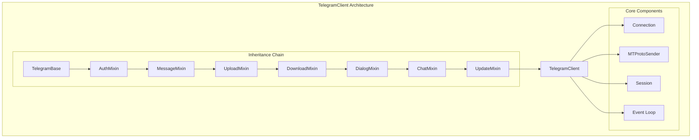

# Client Implementation

---
**Navigation:** [← Event Flow](../diagrams/event-flow.md) | [Home](../index.md) | [Mixins →](mixins.md)

---

## Overview

The client implementation section covers the architecture and implementation details of the TelegramClient class and its components. This includes the mixin pattern used to organize functionality, the base client structure, and the client lifecycle management.

## Section Contents

### [Mixins](mixins.md)
Detailed documentation of all client mixins that provide specific functionality:
- AuthMixin - Authentication and authorization
- MessageMixin - Message sending and management
- UploadMixin - File upload operations
- DownloadMixin - File download operations
- DialogMixin - Dialog and conversation management
- ChatMixin - Chat and channel operations
- UpdateMixin - Update handling and events

### [Base Client](base.md)
Core TelegramClient implementation:
- Client initialization and configuration
- Connection management
- Request processing
- State management
- Core utilities and helpers

### [Client Lifecycle](lifecycle.md)
Complete lifecycle of a TelegramClient:
- Initialization phase
- Connection establishment
- Authentication flow
- Active operation
- Disconnection and cleanup
- Error recovery

## Architecture Overview



## Quick Start

```python
from telethon import TelegramClient

# Create client
client = TelegramClient('session', api_id, api_hash)

# Connect and authenticate
async with client:
    # Client is connected and ready
    await client.send_message('username', 'Hello!')
```

## Key Features

- **Modular Design**: Functionality organized into focused mixins
- **Async/Await**: Full asyncio support for concurrent operations
- **Type Safety**: Strong typing with Python type hints
- **Error Handling**: Comprehensive error handling and recovery
- **Event System**: Powerful event-driven architecture
- **Session Management**: Persistent session storage
- **Multi-DC Support**: Automatic data center migration

## Next Steps

- Start with [Mixins](mixins.md) to understand component architecture
- Continue to [Base Client](base.md) for core implementation
- Review [Client Lifecycle](lifecycle.md) for operational details

---
**Navigation:** [← Event Flow](../diagrams/event-flow.md) | [Home](../index.md) | [Mixins →](mixins.md)

---