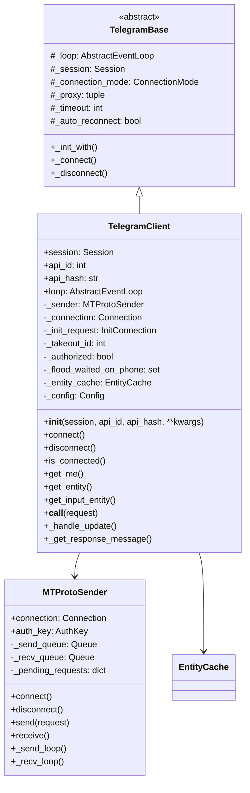

# Base Client

---
**Navigation:** [← Mixins](mixins.md) | [Home](../index.md) | [Up](../index.md) | [Client Lifecycle →](lifecycle.md)

---

## Overview

The TelegramClient class is the main entry point for interacting with Telegram's API. It combines all mixins to provide a complete client implementation with connection management, request handling, and state management.

## TelegramClient Architecture



## Core Implementation

### Client Initialization

```python
class TelegramClient(UpdateMixin, ChatMixin, DialogMixin, 
                    DownloadMixin, UploadMixin, MessageMixin, 
                    AuthMixin, TelegramBase):
    """
    Full-featured Telegram client implementation.
    """
    
    def __init__(
        self,
        session,
        api_id,
        api_hash,
        *,
        connection=ConnectionTcpFull,
        use_ipv6=False,
        proxy=None,
        local_addr=None,
        timeout=10,
        request_retries=5,
        connection_retries=5,
        retry_delay=1,
        auto_reconnect=True,
        sequential_updates=False,
        flood_sleep_threshold=60,
        raise_last_call_error=False,
        device_model=None,
        system_version=None,
        app_version=None,
        lang_code='en',
        system_lang_code='en',
        loop=None,
        base_logger=None,
        receive_updates=True
    ):
        """
        Initialize a new Telegram client.
        
        Args:
            session: Session to use for this client
            api_id: API ID from my.telegram.org
            api_hash: API hash from my.telegram.org
            connection: Connection class to use
            use_ipv6: Whether to use IPv6
            proxy: Proxy settings
            timeout: Timeout for requests
            auto_reconnect: Automatically reconnect on disconnection
            loop: Event loop to use
        """
        super().__init__()
        
        # Session and API credentials
        self.session = session
        self.api_id = int(api_id)
        self.api_hash = api_hash
        
        # Event loop
        self._loop = loop or asyncio.get_event_loop()
        
        # Connection settings
        self._connection = connection
        self._use_ipv6 = use_ipv6
        self._proxy = proxy
        self._local_addr = local_addr
        self._timeout = timeout
        self._auto_reconnect = auto_reconnect
        
        # Request settings
        self._request_retries = request_retries
        self._connection_retries = connection_retries
        self._retry_delay = retry_delay
        self._flood_sleep_threshold = flood_sleep_threshold
        self._raise_last_call_error = raise_last_call_error
        
        # Device information
        self._device_model = device_model or platform.node()
        self._system_version = system_version or platform.system()
        self._app_version = app_version or __version__
        self._lang_code = lang_code
        self._system_lang_code = system_lang_code
        
        # Internal state
        self._sender = None
        self._updates_handle = None
        self._authorized = None
        self._state_cache = StateCache(None, self._log)
        self._entity_cache = EntityCache()
        self._init_request = None
        self._takeout_id = None
        
        # Update handling
        self._sequential_updates = sequential_updates
        self._receive_updates = receive_updates
        self._event_builders = []
        self._conversations = {}
        self._parse_mode = Default
        
        # Flood wait handling
        self._flood_waited_on_phone = set()
        self._flood_wait_callback = None
```

### Connection Management

```python
async def connect(self):
    """
    Connects to Telegram servers.
    """
    if self._sender and self._sender.is_connected():
        return
        
    # Create MTProto sender
    self._sender = MTProtoSender(
        self.session.auth_key,
        self._connection,
        self._loop,
        retries=self._connection_retries,
        delay=self._retry_delay,
        auto_reconnect=self._auto_reconnect,
        update_callback=self._handle_update if self._receive_updates else None,
        auth_key_callback=self._auth_key_callback
    )
    
    # Determine DC to connect to
    dc = self.session.dc_id
    if dc is None:
        dc = DEFAULT_DC_ID
        
    # Get DC configuration
    dc_config = self._get_dc_config(dc)
    
    # Connect
    await self._sender.connect(
        dc_config.ip_address,
        dc_config.port,
        dc_id=dc,
        proxy=self._proxy,
        local_addr=self._local_addr,
        timeout=self._timeout,
        use_ipv6=self._use_ipv6
    )
    
    # Send initial request
    await self._send_init_request()
    
    # Check authorization
    self._authorized = await self.is_user_authorized()
    
    # Start update handler
    if self._receive_updates:
        self._updates_handle = self._loop.create_task(self._update_loop())

async def disconnect(self):
    """
    Disconnects from Telegram servers.
    """
    if self._updates_handle:
        self._updates_handle.cancel()
        
    if self._sender:
        await self._sender.disconnect()
        self._sender = None
        
    # Clear caches
    self._state_cache.reset()
    self._entity_cache.clear()
    
    # Save session
    await self.session.save()
```

### Request Processing

```python
async def __call__(self, request, ordered=False, flood_sleep_threshold=None):
    """
    Invokes a raw MTProto request.
    
    Args:
        request: The TL request to execute
        ordered: Whether this request needs ordered updates
        flood_sleep_threshold: Override flood sleep threshold
        
    Returns:
        The result of the request
    """
    if not self._sender:
        raise ConnectionError('Client is not connected')
        
    # Apply takeout ID if active
    if self._takeout_id:
        request = InvokeWithTakeoutRequest(self._takeout_id, request)
        
    # Handle flood sleep
    flood_sleep_threshold = flood_sleep_threshold or self._flood_sleep_threshold
    
    for attempt in range(self._request_retries):
        try:
            # Send request
            future = self._sender.send(request, ordered=ordered)
            result = await future
            
            # Handle specific results
            if isinstance(result, UpdatesTooLong):
                await self.catch_up()
                
            return result
            
        except FloodWaitError as e:
            if e.seconds <= flood_sleep_threshold:
                await asyncio.sleep(e.seconds)
            else:
                raise
                
        except (ConnectionError, TimeoutError) as e:
            if attempt == self._request_retries - 1:
                raise
                
            # Reconnect and retry
            await self._reconnect()
```

### Entity Management

```python
async def get_entity(self, entity):
    """
    Gets the full entity for the given entity ID, username, or input entity.
    
    This method will make API calls to fetch the entity if not cached.
    """
    try:
        # Try to get input entity (uses cache)
        input_entity = await self.get_input_entity(entity)
    except ValueError:
        # Not found in cache, need to fetch
        if isinstance(entity, str):
            # Username
            return await self._get_entity_from_string(entity)
        else:
            raise
            
    # Get full entity from input entity
    if isinstance(input_entity, InputPeerUser):
        return await self(GetUsersRequest([
            InputUser(input_entity.user_id, input_entity.access_hash)
        ]))[0]
    elif isinstance(input_entity, InputPeerChat):
        return (await self(GetChatsRequest([input_entity.chat_id])))[0]
    elif isinstance(input_entity, InputPeerChannel):
        return (await self(GetChannelsRequest([
            InputChannel(input_entity.channel_id, input_entity.access_hash)
        ])))[0]

async def get_input_entity(self, peer):
    """
    Gets the input entity for the given entity.
    
    This method uses the entity cache and does not make API calls.
    """
    # Check if already an input entity
    if isinstance(peer, (InputPeerUser, InputPeerChat, InputPeerChannel)):
        return peer
        
    # Try cache first
    try:
        return self._entity_cache.get_input_entity(peer)
    except KeyError:
        pass
        
    # Try to resolve
    if isinstance(peer, str):
        # Parse username/phone/invite link
        return await self._resolve_entity(peer)
    elif hasattr(peer, 'SUBCLASS_OF_ID'):
        # It's a TL type
        return utils.get_input_peer(peer)
    else:
        # Try to get it as an ID
        return self._entity_cache.get_input_entity(int(peer))
```

### State Management

```python
class StateCache:
    """
    Caches update state for efficient synchronization.
    """
    
    def __init__(self, initial_state, logger):
        self._logger = logger
        self._pts = initial_state.pts if initial_state else None
        self._qts = initial_state.qts if initial_state else None
        self._date = initial_state.date if initial_state else None
        self._seq = initial_state.seq if initial_state else None
        self._channels = {}
        
    def update(self, update):
        """Update the state cache with new update."""
        if hasattr(update, 'pts'):
            self._pts = update.pts
        if hasattr(update, 'qts'):
            self._qts = update.qts
        if hasattr(update, 'date'):
            self._date = update.date
        if hasattr(update, 'seq'):
            self._seq = update.seq
            
        # Channel state
        if hasattr(update, 'channel_id'):
            channel_id = update.channel_id
            if channel_id not in self._channels:
                self._channels[channel_id] = ChannelState()
            self._channels[channel_id].update(update)
    
    def get_update_request(self):
        """Get request to fetch missing updates."""
        if self._pts is None:
            # Initial sync
            return GetStateRequest()
        else:
            # Get difference since last known state
            return GetDifferenceRequest(
                pts=self._pts,
                qts=self._qts,
                date=self._date
            )
```

### Configuration

```python
@property
def config(self):
    """Get current client configuration."""
    return self._config

async def _load_config(self):
    """Load configuration from server."""
    self._config = await self(GetConfigRequest())
    
    # Update DC addresses
    for dc in self._config.dc_options:
        self._dc_options[dc.id] = dc
        
    # Update size limits
    self._file_size_limit = self._config.file_size_max
    self._message_size_limit = self._config.message_length_max
```

## Context Manager Support

```python
async def __aenter__(self):
    """Async context manager entry."""
    await self.connect()
    return self

async def __aexit__(self, exc_type, exc_val, exc_tb):
    """Async context manager exit."""
    await self.disconnect()
    
def __enter__(self):
    """Sync context manager entry."""
    return self._loop.run_until_complete(self.__aenter__())
    
def __exit__(self, exc_type, exc_val, exc_tb):
    """Sync context manager exit."""
    return self._loop.run_until_complete(self.__aexit__(exc_type, exc_val, exc_tb))
```

## Helper Methods

### Response Message Handling

```python
def _get_response_message(self, request, result, input_chat):
    """
    Extract the response message from various result types.
    """
    if isinstance(result, UpdateShort):
        return self._process_short_update(result)
    elif isinstance(result, Updates):
        return self._find_message_in_updates(request, result)
    elif isinstance(result, UpdatesCombined):
        return self._find_message_in_updates(request, result)
    else:
        return None
        
def _find_message_in_updates(self, request, updates):
    """Find the message created by our request in updates."""
    random_id = getattr(request, 'random_id', None)
    if not random_id:
        return None
        
    for update in updates.updates:
        if isinstance(update, (UpdateNewMessage, UpdateNewChannelMessage)):
            if update.message.random_id == random_id:
                return update.message
                
    return None
```

### Utility Methods

```python
@property
def loop(self):
    """The event loop used by this client."""
    return self._loop
    
@property
def disconnected(self):
    """Future that resolves when the client disconnects."""
    return self._sender.disconnected if self._sender else None
    
def is_connected(self):
    """Check if the client is connected."""
    return self._sender and self._sender.is_connected()
    
async def is_user_authorized(self):
    """Check if the user is authorized."""
    if self._authorized is None:
        try:
            # This request is cheap and won't fail if not authorized
            await self(GetUsersRequest([InputUserSelf()]))
            self._authorized = True
        except UnauthorizedError:
            self._authorized = False
            
    return self._authorized
```

## Best Practices

### Client Usage

1. **Use Context Managers**: Always use `async with` for automatic cleanup
2. **Handle Disconnections**: Implement reconnection logic for long-running clients
3. **Cache Entities**: Use `get_input_entity` to avoid repeated API calls
4. **Batch Requests**: Group multiple requests when possible
5. **Handle Errors**: Implement proper error handling for network issues

### Performance Tips

1. **Reuse Clients**: Don't create new clients unnecessarily
2. **Use Sessions**: Persist sessions to avoid re-authentication
3. **Limit Concurrent Requests**: Avoid overwhelming the server
4. **Implement Caching**: Cache frequently accessed data
5. **Monitor Rate Limits**: Respect flood wait errors

## Next Steps

- Continue to [Client Lifecycle](lifecycle.md) for operational details
- Review [MTProto Sender](../network/mtproto-sender.md) for protocol details
- See [Session Management](../sessions/overview.md) for persistence

---
**Navigation:** [← Mixins](mixins.md) | [Home](../index.md) | [Up](../index.md) | [Client Lifecycle →](lifecycle.md)

---