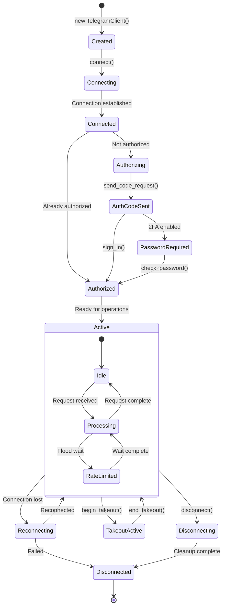
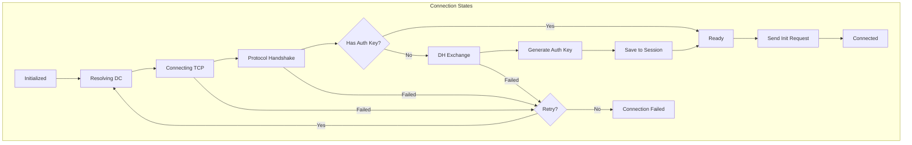
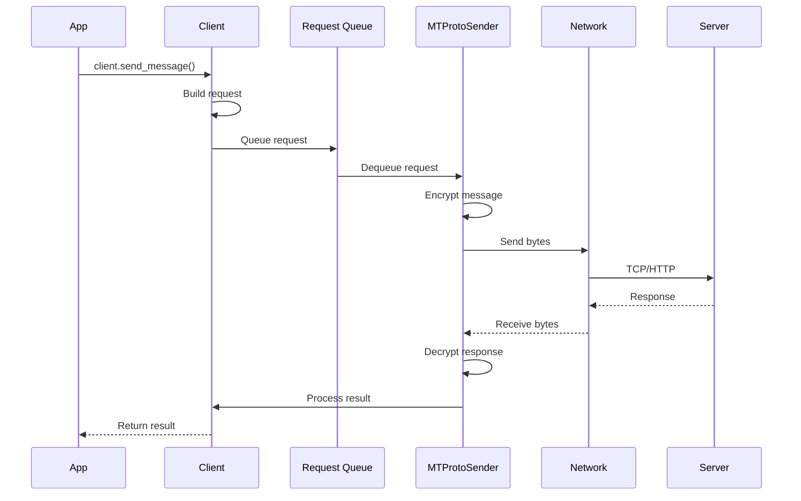
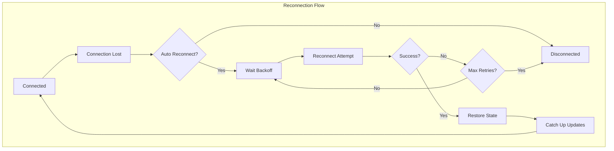
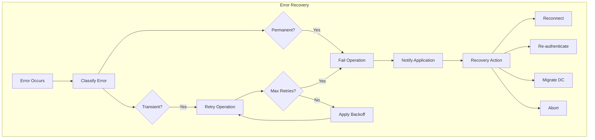

# Client Lifecycle

---
**Navigation:** [← Base Client](base.md) | [Home](../index.md) | [Up](../index.md) | [Core →](../core/README.md)

---

## Overview

The TelegramClient lifecycle encompasses all phases from initialization through connection, operation, and disconnection. Understanding this lifecycle is crucial for building robust applications and handling edge cases properly.

## Lifecycle Phases



## Initialization Phase

### Client Creation

```python
# Basic initialization
client = TelegramClient(
    'session_name',
    api_id,
    api_hash
)

# Advanced initialization with options
client = TelegramClient(
    StringSession(session_string),  # Session type
    api_id,
    api_hash,
    
    # Connection options
    connection=ConnectionTcpMTProxyRandomizedIntermediate,
    proxy=('proxy.example.com', 443, 'secret'),
    
    # Behavior options
    auto_reconnect=True,
    request_retries=5,
    flood_sleep_threshold=60,
    
    # Device info
    device_model='MyApp',
    system_version='1.0',
    app_version='1.0',
    
    # Event loop
    loop=custom_loop,
    
    # Updates
    receive_updates=True,
    sequential_updates=False
)
```

### Initialization Steps

```mermaid
sequenceDiagram
    participant App
    participant Client as TelegramClient
    participant Session
    participant Loop as Event Loop

    App->>Client: TelegramClient(...)
    Client->>Session: Load session data
    Session-->>Client: Auth key, DC info
    Client->>Loop: Setup event loop
    Client->>Client: Initialize caches
    Client->>Client: Setup handlers
    Client-->>App: Client instance
```

## Connection Phase

### Connection Process

```python
async def connection_example():
    """Example of connection lifecycle."""
    client = TelegramClient('session', api_id, api_hash)
    
    try:
        # Connect to Telegram
        await client.connect()
        
        # Check if we're authorized
        if not await client.is_user_authorized():
            # Need to authenticate
            await client.send_code_request(phone)
            code = input('Enter code: ')
            
            try:
                await client.sign_in(phone, code)
            except SessionPasswordNeededError:
                password = getpass.getpass('2FA Password: ')
                await client.sign_in(password=password)
        
        # Now we're connected and authorized
        me = await client.get_me()
        print(f'Logged in as {me.username}')
        
    except Exception as e:
        print(f'Failed to connect: {e}')
        raise
```

### Connection State Machine



## Authentication Phase

### Authentication Flow

```python
class AuthenticationFlow:
    """Manages the authentication lifecycle."""
    
    async def authenticate_user(self, client, phone):
        """Complete user authentication flow."""
        # Step 1: Request code
        sent_code = await client.send_code_request(phone)
        
        # Step 2: Handle different code types
        if sent_code.type == SentCodeTypeApp:
            print("Code sent to Telegram app")
        elif sent_code.type == SentCodeTypeSms:
            print("Code sent via SMS")
        elif sent_code.type == SentCodeTypeCall:
            print("You will receive a call")
        
        # Step 3: Get code from user
        code = await self.get_code_from_user()
        
        # Step 4: Sign in
        try:
            user = await client.sign_in(phone, code)
            return user
        except PhoneCodeInvalidError:
            print("Invalid code, please try again")
            # Retry logic
        except SessionPasswordNeededError:
            # Step 5: Handle 2FA
            return await self.handle_2fa(client)
    
    async def handle_2fa(self, client):
        """Handle two-factor authentication."""
        password = await self.get_password_from_user()
        
        try:
            user = await client.sign_in(password=password)
            return user
        except PasswordHashInvalidError:
            print("Invalid password")
            # Retry logic
```

### Bot Authentication

```python
async def authenticate_bot(client, bot_token):
    """Bot authentication is simpler."""
    await client.connect()
    await client.sign_in(bot_token=bot_token)
    
    bot = await client.get_me()
    print(f'Bot @{bot.username} is ready')
```

## Active Operation Phase

### Request Processing Lifecycle



### Update Handling Lifecycle

```python
class UpdateLifecycle:
    """Manages update processing lifecycle."""
    
    async def update_loop(self, client):
        """Main update processing loop."""
        while client.is_connected():
            try:
                # Receive updates
                update = await client._receive_update()
                
                # Process update
                await self.process_update(client, update)
                
            except asyncio.CancelledError:
                # Graceful shutdown
                break
            except Exception as e:
                # Log and continue
                logger.error(f"Error in update loop: {e}")
    
    async def process_update(self, client, update):
        """Process a single update through its lifecycle."""
        # Step 1: Validate update
        if not self.validate_update(update):
            return
        
        # Step 2: Update state cache
        client._state_cache.update(update)
        
        # Step 3: Handle gaps
        if self.has_gap(update):
            await self.handle_gap(client, update)
            return
        
        # Step 4: Build event
        event = client._build_event(update)
        
        # Step 5: Dispatch to handlers
        await client._dispatch_event(event)
```

## Reconnection Lifecycle

### Automatic Reconnection



### Reconnection Implementation

```python
class ReconnectionManager:
    """Manages client reconnection lifecycle."""
    
    def __init__(self, client):
        self.client = client
        self.attempts = 0
        self.max_attempts = 5
        self.base_delay = 1
        
    async def handle_disconnection(self):
        """Handle unexpected disconnection."""
        if not self.client._auto_reconnect:
            return
        
        while self.attempts < self.max_attempts:
            try:
                # Wait with exponential backoff
                delay = self.base_delay * (2 ** self.attempts)
                await asyncio.sleep(delay)
                
                # Attempt reconnection
                await self.reconnect()
                
                # Success - reset attempts
                self.attempts = 0
                return
                
            except Exception as e:
                logger.error(f"Reconnection attempt {self.attempts} failed: {e}")
                self.attempts += 1
        
        # Max attempts reached
        logger.error("Failed to reconnect after maximum attempts")
    
    async def reconnect(self):
        """Perform reconnection."""
        # Step 1: Disconnect cleanly
        await self.client._sender.disconnect()
        
        # Step 2: Re-establish connection
        await self.client.connect()
        
        # Step 3: Catch up on missed updates
        await self.client.catch_up()
        
        # Step 4: Resume operations
        logger.info("Successfully reconnected")
```

## Takeout Session Lifecycle

### Takeout Flow

```python
async def takeout_lifecycle(client):
    """Example of takeout session lifecycle."""
    # Start takeout session
    async with client.takeout() as takeout:
        # Takeout session is active
        # Can download all data without affecting online status
        
        # Download all messages
        async for message in takeout.iter_messages(None, limit=None):
            process_message(message)
        
        # Download all media
        async for message in takeout.iter_messages(None, filter=InputMessagesFilterPhotos):
            await takeout.download_media(message)
    
    # Takeout session automatically ended
```

## Disconnection Phase

### Graceful Shutdown

```python
class GracefulShutdown:
    """Manages graceful client shutdown."""
    
    async def shutdown(self, client):
        """Perform graceful shutdown."""
        try:
            # Step 1: Cancel update loop
            if client._updates_handle:
                client._updates_handle.cancel()
                try:
                    await client._updates_handle
                except asyncio.CancelledError:
                    pass
            
            # Step 2: Flush pending requests
            await self.flush_pending_requests(client)
            
            # Step 3: Save session state
            await client.session.save()
            
            # Step 4: Close connection
            if client._sender:
                await client._sender.disconnect()
            
            # Step 5: Cleanup resources
            await self.cleanup_resources(client)
            
        except Exception as e:
            logger.error(f"Error during shutdown: {e}")
    
    async def flush_pending_requests(self, client):
        """Send any pending requests before shutdown."""
        if client._sender:
            await client._sender.flush()
    
    async def cleanup_resources(self, client):
        """Clean up client resources."""
        # Clear caches
        client._entity_cache.clear()
        client._state_cache.reset()
        
        # Close file handles
        for file_handle in client._open_files:
            file_handle.close()
        
        # Clear event handlers
        client._event_handlers.clear()
```

## Error Recovery Lifecycle

### Error Recovery Flow



## Best Practices

### Lifecycle Management

1. **Use Context Managers**: Ensures proper cleanup
   ```python
   async with TelegramClient(...) as client:
       # Client is connected and will be properly disconnected
   ```

2. **Handle Authentication States**: Check authorization before operations
   ```python
   if not await client.is_user_authorized():
       await authenticate_user(client)
   ```

3. **Implement Reconnection Logic**: For long-running applications
   ```python
   client = TelegramClient(..., auto_reconnect=True)
   ```

4. **Graceful Shutdown**: Always disconnect properly
   ```python
   try:
       # Operations
   finally:
       await client.disconnect()
   ```

5. **Monitor Connection State**: React to connection changes
   ```python
   @client.on(events.Disconnected)
   async def on_disconnect():
       logger.warning("Client disconnected")
   ```

### Error Handling

1. **Catch Specific Exceptions**: Handle known error cases
2. **Implement Retry Logic**: For transient failures
3. **Log Lifecycle Events**: For debugging and monitoring
4. **Save State Regularly**: Prevent data loss
5. **Test Edge Cases**: Connection loss, rate limits, etc.

## Monitoring and Debugging

### Lifecycle Events

```python
class LifecycleMonitor:
    """Monitor client lifecycle events."""
    
    def __init__(self, client):
        self.client = client
        self.events = []
        
        # Register lifecycle callbacks
        client.on_connect = self.on_connect
        client.on_disconnect = self.on_disconnect
        client.on_auth = self.on_auth
    
    async def on_connect(self):
        """Called when client connects."""
        self.events.append({
            'type': 'connect',
            'timestamp': datetime.now(),
            'dc_id': self.client.session.dc_id
        })
    
    async def on_disconnect(self):
        """Called when client disconnects."""
        self.events.append({
            'type': 'disconnect',
            'timestamp': datetime.now(),
            'reason': self.client.disconnect_reason
        })
    
    async def on_auth(self):
        """Called when client authenticates."""
        self.events.append({
            'type': 'auth',
            'timestamp': datetime.now(),
            'user_id': self.client.get_me().id
        })
```

## Next Steps

- Explore [Core Dependencies](../core/dependencies.md) for implementation details
- Review [Error Handling](../internals/errors.md) for error recovery
- See [Network Flow](../diagrams/network-flow.md) for protocol details

---
**Navigation:** [← Base Client](base.md) | [Home](../index.md) | [Up](../index.md) | [Core →](../core/README.md)

---