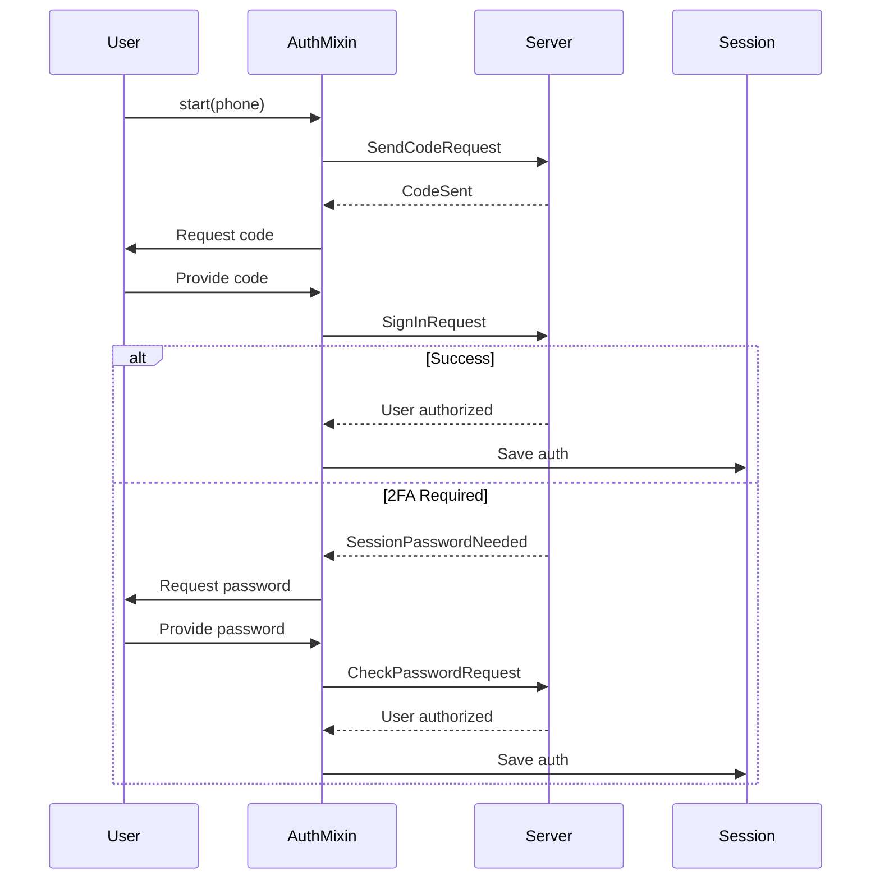
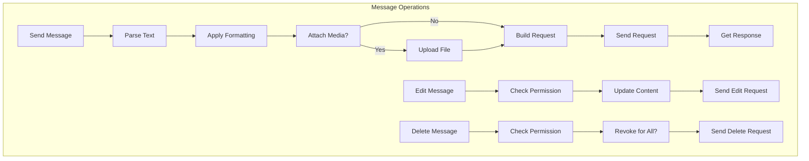

# Client Mixins

---
**Navigation:** [← Client](README.md) | [Home](../index.md) | [Up](../index.md) | [Base Client →](base.md)

---

## Overview

Telethon uses a mixin pattern to organize client functionality into focused, reusable components. Each mixin provides a specific set of features, making the codebase modular and maintainable.

## Mixin Architecture

```mermaid
classDiagram
    class TelegramBase {
        <<abstract>>
        +session: Session
        +api_id: int
        +api_hash: str
        +_sender: MTProtoSender
        +_loop: asyncio.AbstractEventLoop
        +connect()
        +disconnect()
        +is_connected()
    }
    
    class AuthMixin {
        +start()
        +sign_in()
        +sign_up()
        +send_code_request()
        +log_out()
        +edit_2fa()
        +check_password()
    }
    
    class MessageMixin {
        +send_message()
        +edit_message()
        +delete_messages()
        +forward_messages()
        +get_messages()
        +iter_messages()
        +pin_message()
    }
    
    class UploadMixin {
        +upload_file()
        +send_file()
        +_upload_file()
        +_get_thumb()
        +_get_attributes()
    }
    
    class DownloadMixin {
        +download_media()
        +download_profile_photo()
        +download_file()
        +iter_download()
        +_download_file()
    }
    
    class DialogMixin {
        +get_dialogs()
        +iter_dialogs()
        +get_drafts()
        +iter_drafts()
        +edit_folder()
        +delete_dialog()
    }
    
    class ChatMixin {
        +get_participants()
        +iter_participants()
        +get_permissions()
        +get_stats()
        +kick_participant()
        +edit_permissions()
        +edit_admin()
    }
    
    class UpdateMixin {
        +add_event_handler()
        +remove_event_handler()
        +list_event_handlers()
        +catch_up()
        +_handle_update()
        +_dispatch_event()
    }
    
    TelegramBase <|-- AuthMixin
    AuthMixin <|-- MessageMixin
    MessageMixin <|-- UploadMixin
    UploadMixin <|-- DownloadMixin
    DownloadMixin <|-- DialogMixin
    DialogMixin <|-- ChatMixin
    ChatMixin <|-- UpdateMixin
```



## AuthMixin

### Purpose
Handles all authentication-related operations including login, signup, two-factor authentication, and session management.

### Key Methods

```python
class AuthMixin:
    """Authentication and authorization methods."""
    
    async def start(
        self,
        phone=None,
        password=None,
        *,
        bot_token=None,
        force_sms=False,
        code_callback=None,
        first_name='New User',
        last_name='',
        max_attempts=3
    ):
        """
        Convenience method to start the client.
        
        This method combines connection and authentication:
        - For user accounts: requests code, signs in
        - For bots: uses bot token
        - Handles 2FA if needed
        """
        await self.connect()
        
        if not await self.is_user_authorized():
            if bot_token:
                await self.sign_in(bot_token=bot_token)
            else:
                # User authentication flow
                await self.send_code_request(phone, force_sms=force_sms)
                
                if code_callback:
                    code = await code_callback()
                else:
                    code = input('Enter code: ')
                    
                try:
                    await self.sign_in(phone, code)
                except SessionPasswordNeededError:
                    if password:
                        await self.sign_in(password=password)
                    else:
                        password = getpass.getpass('2FA password: ')
                        await self.sign_in(password=password)
    
    async def send_code_request(
        self,
        phone,
        *,
        force_sms=False
    ):
        """Request authentication code."""
        phone = utils.parse_phone(phone)
        phone_hash = self._phone_code_hash.get(phone)
        
        if force_sms:
            result = await self(ResendCodeRequest(phone, phone_hash))
        else:
            result = await self(SendCodeRequest(phone))
            
        self._phone_code_hash[phone] = result.phone_code_hash
        return result
    
    async def sign_in(
        self,
        phone=None,
        code=None,
        *,
        password=None,
        bot_token=None,
        phone_code_hash=None
    ):
        """Sign in to Telegram."""
        if bot_token:
            # Bot authentication
            result = await self(ImportBotAuthorizationRequest(
                flags=0,
                api_id=self.api_id,
                api_hash=self.api_hash,
                bot_auth_token=bot_token
            ))
        elif password:
            # 2FA authentication
            pwd = await self(GetPasswordRequest())
            result = await self(CheckPasswordRequest(
                await pwd.compute_check(password)
            ))
        else:
            # Regular authentication
            result = await self(SignInRequest(
                phone, phone_code_hash, code
            ))
            
        self._authorized = True
        self.session.save()
        return result.user
```

### Authentication Flow



## MessageMixin

### Purpose
Provides comprehensive message handling functionality including sending, editing, deleting, and retrieving messages.

### Key Methods

```python
class MessageMixin:
    """Message-related functionality."""
    
    async def send_message(
        self,
        entity,
        message='',
        *,
        reply_to=None,
        attributes=None,
        parse_mode=None,
        formatting_entities=None,
        link_preview=True,
        file=None,
        thumb=None,
        force_document=False,
        clear_draft=False,
        buttons=None,
        silent=None,
        background=None,
        supports_streaming=None,
        schedule=None,
        comment_to=None
    ):
        """
        Send a message to the specified entity.
        
        Features:
        - Text messages with formatting
        - File attachments
        - Reply to messages
        - Inline keyboards
        - Scheduled messages
        """
        entity = await self.get_input_entity(entity)
        
        if file:
            # Delegate to send_file for media
            return await self.send_file(
                entity, file, caption=message,
                reply_to=reply_to, attributes=attributes,
                parse_mode=parse_mode, force_document=force_document,
                thumb=thumb, buttons=buttons, silent=silent,
                supports_streaming=supports_streaming,
                schedule=schedule
            )
            
        # Parse message text
        message, entities = await self._parse_message_text(
            message, parse_mode, formatting_entities
        )
        
        # Build request
        request = SendMessageRequest(
            peer=entity,
            message=message,
            no_webpage=not link_preview,
            reply_to_msg_id=reply_to,
            clear_draft=clear_draft,
            silent=silent,
            background=background,
            reply_markup=self.build_reply_markup(buttons),
            entities=entities,
            schedule_date=schedule
        )
        
        result = await self(request)
        return self._get_response_message(request, result, entity)
    
    async def iter_messages(
        self,
        entity,
        limit=None,
        *,
        offset_date=None,
        offset_id=0,
        max_id=0,
        min_id=0,
        add_offset=0,
        search=None,
        filter=None,
        from_user=None,
        wait_time=None,
        ids=None,
        reverse=False,
        reply_to=None,
        scheduled=False
    ):
        """
        Iterate through messages in a chat.
        
        Supports:
        - Filtering by various criteria
        - Search functionality
        - Pagination
        - Real-time updates
        """
        # Implementation details...
```

### Message Operations Flow



## UploadMixin

### Purpose
Handles file uploads including chunking, parallel uploads, progress tracking, and various file types.

### Key Methods

```python
class UploadMixin:
    """File upload functionality."""
    
    async def upload_file(
        self,
        file,
        *,
        part_size_kb=None,
        file_name=None,
        use_cache=True,
        key=None,
        iv=None,
        progress_callback=None
    ):
        """
        Upload a file to Telegram servers.
        
        Features:
        - Automatic chunking for large files
        - Progress callbacks
        - File caching
        - Encryption support
        """
        if isinstance(file, (InputFile, InputFileBig)):
            return file  # Already uploaded
            
        # Get file info
        file_size = os.path.getsize(file) if isinstance(file, str) else len(file)
        
        # Check cache
        if use_cache:
            cached = self._get_cached_file(file)
            if cached:
                return cached
                
        # Determine upload method
        is_big = file_size > 10 * 1024 * 1024  # 10 MB
        
        if is_big:
            return await self._upload_big_file(
                file, file_size, part_size_kb,
                file_name, progress_callback
            )
        else:
            return await self._upload_small_file(
                file, file_size, part_size_kb,
                file_name, progress_callback
            )
```

## DownloadMixin

### Purpose
Manages file downloads with support for streaming, resumption, and progress tracking.

### Key Methods

```python
class DownloadMixin:
    """File download functionality."""
    
    async def download_media(
        self,
        message,
        file=None,
        *,
        thumb=None,
        progress_callback=None
    ):
        """
        Download media from a message.
        
        Automatically handles:
        - Different media types
        - Thumbnail downloads
        - Progress reporting
        - File naming
        """
        if isinstance(message, Message):
            media = message.media
        else:
            media = message
            
        if not media:
            return None
            
        # Determine download parameters
        input_location = utils.get_input_location(media)
        
        # Download file
        return await self.download_file(
            input_location,
            file,
            file_size=media.size,
            progress_callback=progress_callback
        )
```

## DialogMixin

### Purpose
Provides dialog (conversation) management including listing, filtering, and organizing chats.

### Key Methods

```python
class DialogMixin:
    """Dialog and conversation management."""
    
    async def iter_dialogs(
        self,
        limit=None,
        *,
        offset_date=None,
        offset_id=0,
        offset_peer=InputPeerEmpty(),
        ignore_pinned=False,
        ignore_migrated=False,
        folder=None,
        archived=None
    ):
        """
        Iterate through dialogs (conversations).
        
        Features:
        - Pagination support
        - Folder filtering
        - Archived chats
        - Pinned chat handling
        """
        # Implementation...
```

## ChatMixin

### Purpose
Handles chat and channel operations including participant management, permissions, and administration.

### Key Methods

```python
class ChatMixin:
    """Chat and channel functionality."""
    
    async def iter_participants(
        self,
        entity,
        limit=None,
        *,
        search='',
        filter=None,
        aggressive=False
    ):
        """
        Iterate through chat participants.
        
        Supports various filters:
        - Admins only
        - Specific permissions
        - Search by name
        - Recent actions
        """
        # Implementation...
```

## UpdateMixin

### Purpose
Manages the event system including handler registration, update processing, and event dispatching.

### Key Methods

```python
class UpdateMixin:
    """Update and event handling."""
    
    def add_event_handler(
        self,
        callback,
        event=None
    ):
        """
        Register an event handler.
        
        Examples:
        - @client.on(events.NewMessage)
        - client.add_event_handler(func, events.NewMessage)
        """
        # Implementation...
    
    async def _dispatch_update(self, update):
        """
        Process and dispatch updates to handlers.
        """
        # Convert update to event
        event = self._build_event(update)
        
        # Find and execute matching handlers
        for handler in self._event_handlers:
            if handler.matches(event):
                await handler.callback(event)
```

## Best Practices

### Mixin Design Principles

1. **Single Responsibility**: Each mixin handles one aspect of functionality
2. **Minimal Dependencies**: Mixins should minimize inter-dependencies
3. **Clear Interfaces**: Public methods should have clear, consistent APIs
4. **Error Handling**: Each mixin handles its own errors appropriately
5. **Documentation**: All public methods should be well-documented

### Usage Guidelines

1. **Method Chaining**: Many methods return self for chaining
2. **Async Context**: Use async context managers when possible
3. **Entity Resolution**: Pass entity objects instead of IDs when possible
4. **Progress Callbacks**: Implement progress callbacks for long operations
5. **Error Recovery**: Handle network errors gracefully

## Next Steps

- Continue to [Base Client](base.md) for core implementation details
- See [Client Lifecycle](lifecycle.md) for operational flow
- Review [API Layer](../api/tl-schema.md) for underlying protocol

---
**Navigation:** [← Client](README.md) | [Home](../index.md) | [Up](../index.md) | [Base Client →](base.md)

---