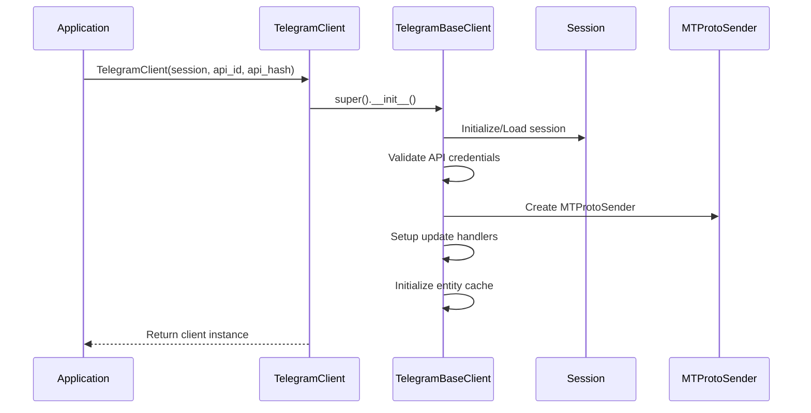
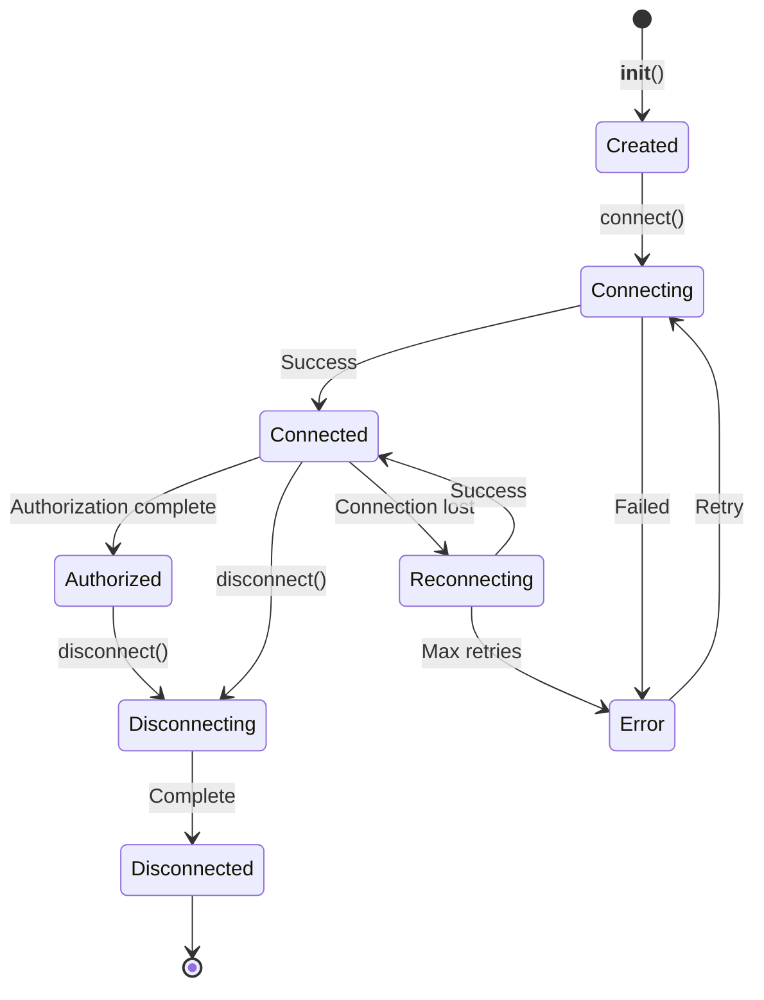
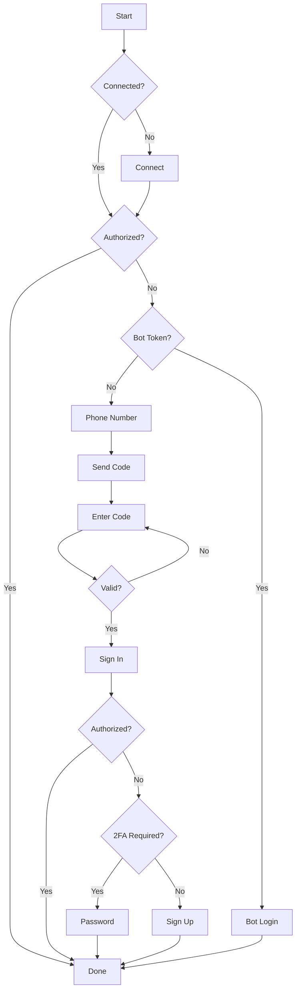
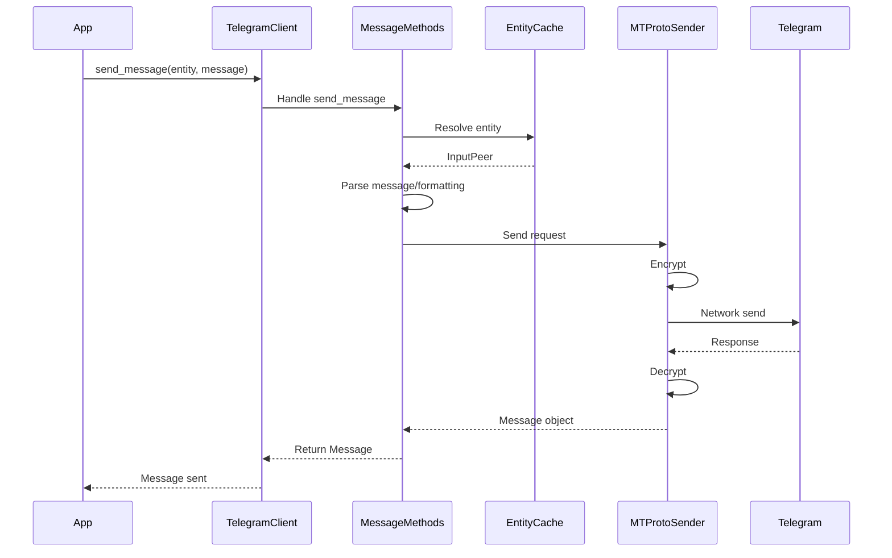
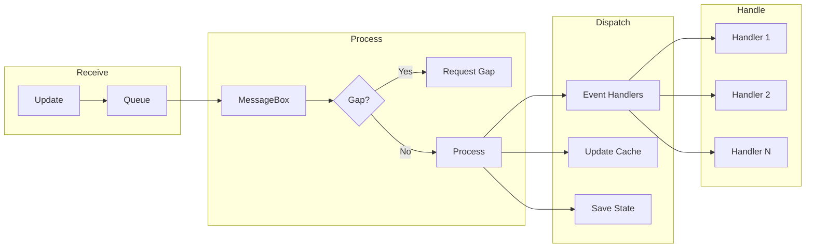
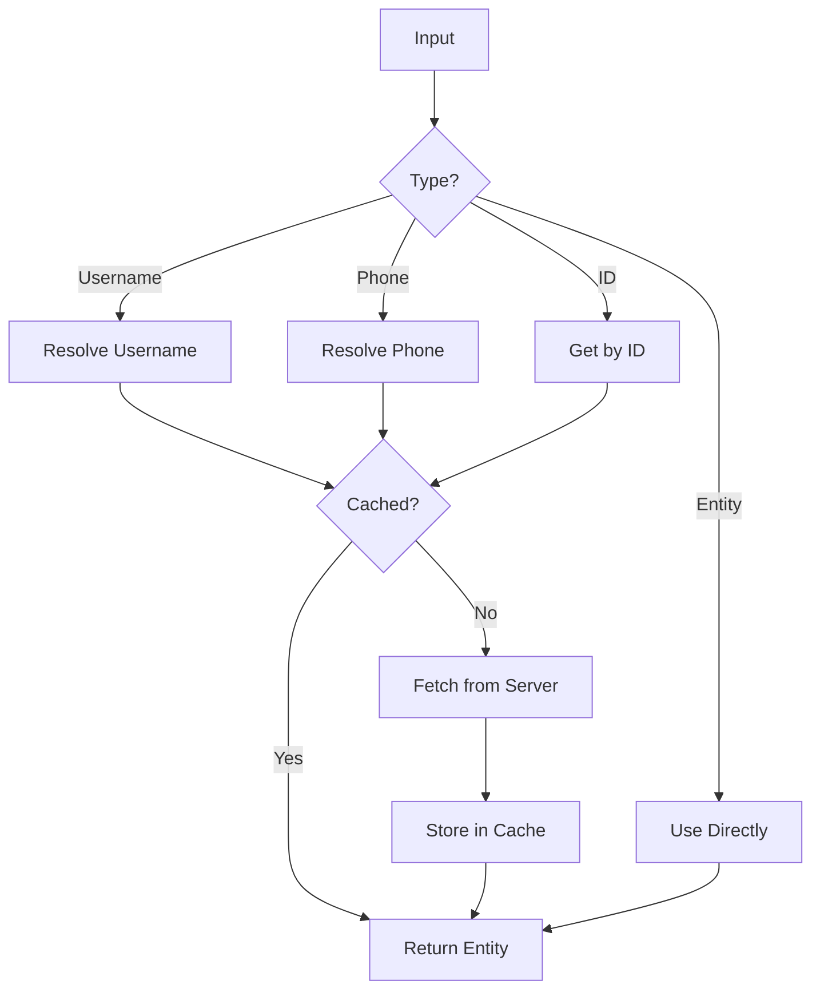
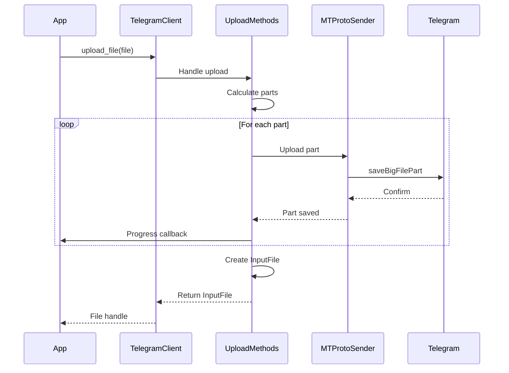
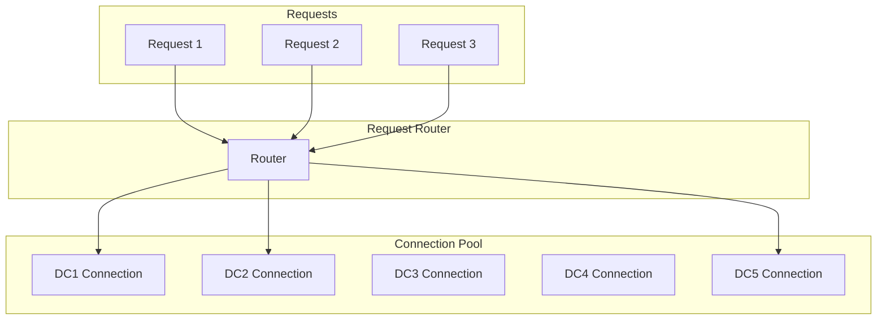

# TelegramClient Architecture

---
**Navigation:** [← Client Architecture](../client/README.md) | [Home](../index.md) | [Up](../index.md) | [Client Mixins →](mixins.md)

---

## Overview

`TelegramClient` is the main interface for interacting with Telegram's API. It combines multiple mixins to provide a comprehensive set of features while maintaining clean separation of concerns.

## Architecture Design

```mermaid
classDiagram
    class TelegramClient {
        +session: Session
        +api_id: int
        +api_hash: str
        +loop: asyncio.AbstractEventLoop
        +flood_sleep_threshold: int
        +__init__(session, api_id, api_hash)
        +start()
        +connect()
        +disconnect()
        +run_until_disconnected()
    }
    
    class TelegramBaseClient {
        <<abstract>>
        #_sender: MTProtoSender
        #_session: Session
        #_entity_cache: EntityCache
        #_updates_queue: asyncio.Queue
        #_authorized: bool
        +is_connected() bool
        +disconnect()
        -_init_session()
        -_init_sender()
    }
    
    class AccountMethods {
        +take_screenshot()
        +end_takeout()
    }
    
    class AuthMethods {
        +start()
        +sign_in()
        +sign_up()
        +send_code_request()
        +log_out()
        +edit_2fa()
        +qr_login()
    }
    
    class MessageMethods {
        +send_message()
        +send_file()
        +edit_message()
        +delete_messages()
        +forward_messages()
        +iter_messages()
        +get_messages()
        +pin_message()
    }
    
    class ChatMethods {
        +iter_participants()
        +get_participants()
        +kick_participant()
        +get_permissions()
        +get_stats()
        +iter_admin_log()
        +action()
    }
    
    class DialogMethods {
        +iter_dialogs()
        +get_dialogs()
        +iter_drafts()
        +get_drafts()
        +edit_folder()
        +delete_dialog()
    }
    
    class DownloadMethods {
        +download_media()
        +download_profile_photo()
        +download_file()
        +iter_download()
        -_download_file()
    }
    
    class UploadMethods {
        +send_file()
        +upload_file()
        -_upload_file()
        -_get_thumb()
    }
    
    TelegramBaseClient <|-- AccountMethods
    AccountMethods <|-- AuthMethods
    AuthMethods <|-- DownloadMethods
    DownloadMethods <|-- DialogMethods
    DialogMethods <|-- ChatMethods
    ChatMethods <|-- MessageMethods
    MessageMethods <|-- UploadMethods
    UploadMethods <|-- MessageParseMethods
    MessageParseMethods <|-- UserMethods
    UserMethods <|-- TelegramClient
```



## Client Initialization

### Constructor Flow



### Configuration Options

```python
client = TelegramClient(
    session,                    # Session name or instance
    api_id,                     # Telegram API ID
    api_hash,                   # Telegram API hash
    
    # Connection settings
    connection=ConnectionTcpFull,
    use_ipv6=False,
    proxy=None,
    timeout=10,
    request_retries=5,
    connection_retries=5,
    retry_delay=1,
    auto_reconnect=True,
    sequential_updates=False,
    flood_sleep_threshold=60,
    
    # Advanced settings
    device_model=None,
    system_version=None,
    app_version=None,
    lang_code='en',
    system_lang_code='en',
    
    # Security
    security_checks=True,
    
    # Performance
    receive_updates=True,
    max_concurrent_downloads=None,
)
```

## Connection Management

### Connection Lifecycle



### Connection Methods

```python
class TelegramClient:
    async def connect(self) -> bool:
        """
        Establishes connection to Telegram servers.
        Returns True if successful.
        """
        # Initialize DC connection
        # Perform handshake
        # Start receiving updates
        
    async def disconnect(self):
        """
        Gracefully disconnects from Telegram.
        Saves session state.
        """
        # Stop update handlers
        # Close connection
        # Save session
        
    def is_connected(self) -> bool:
        """Check if client is connected"""
        
    async def is_user_authorized(self) -> bool:
        """Check if user is authorized"""
```

## Authentication Flow

### Start Method

```python
async def start(
    self,
    phone=None,
    password=None,
    *,
    bot_token=None,
    force_sms=False,
    code_callback=None,
    first_name='',
    last_name='',
    max_attempts=3
):
    """
    Interactive authentication flow.
    Handles both user and bot authentication.
    """
```

### Authentication State Machine



## Message Handling

### Send Message Flow



### Message Methods

```python
# Sending messages
await client.send_message(entity, message, **kwargs)
await client.send_file(entity, file, **kwargs)
await client.forward_messages(entity, messages, from_peer)

# Getting messages
messages = await client.get_messages(entity, limit=10)
async for message in client.iter_messages(entity):
    process(message)

# Editing/Deleting
await client.edit_message(entity, message, new_text)
await client.delete_messages(entity, message_ids)
```

## Update Handling

### Update Processing Pipeline



### Event Registration

```python
# Decorator style
@client.on(events.NewMessage(pattern='hello'))
async def handler(event):
    await event.reply('Hi!')

# Function style
async def handler(event):
    await event.reply('Hi!')
    
client.add_event_handler(handler, events.NewMessage(pattern='hello'))

# Remove handler
client.remove_event_handler(handler)

# List handlers
handlers = client.list_event_handlers()
```

## Entity Management

### Entity Resolution



### Entity Methods

```python
# Get entity information
entity = await client.get_entity('username')
entity = await client.get_entity(1234567)
entity = await client.get_entity('+1234567890')

# Get input entity (for API calls)
input_entity = await client.get_input_entity('username')

# Get peer ID
peer_id = utils.get_peer_id(entity)

# Get current user
me = await client.get_me()
```

## File Operations

### Upload Process



### Download Process

```python
# Download media
path = await client.download_media(message)

# Download with progress
def callback(current, total):
    print(f'{current}/{total}')

await client.download_media(
    message,
    file='path/to/save',
    progress_callback=callback
)

# Streaming download
async for chunk in client.iter_download(media):
    process_chunk(chunk)
```

## Performance Considerations

### Connection Pooling



### Concurrent Operations

```python
# Concurrent message sending
tasks = [
    client.send_message(chat1, 'Hello'),
    client.send_message(chat2, 'Hi'),
    client.send_message(chat3, 'Hey')
]
await asyncio.gather(*tasks)

# Concurrent downloads
async def download_all(messages):
    tasks = [client.download_media(m) for m in messages]
    return await asyncio.gather(*tasks)
```

## Error Handling

### Error Recovery Strategy

```python
class TelegramClient:
    async def _request(self, request):
        """
        Handles request with automatic retry and error recovery
        """
        for attempt in range(self._request_retries):
            try:
                return await self._sender.send(request)
                
            except ConnectionError:
                # Reconnect and retry
                await self._reconnect()
                
            except FloodWaitError as e:
                # Handle rate limiting
                if e.seconds < self.flood_sleep_threshold:
                    await asyncio.sleep(e.seconds)
                else:
                    raise
                    
            except InvalidDCError as e:
                # Switch DC and retry
                await self._switch_dc(e.dc)
```

## Best Practices

### Client Usage

1. **Use Context Managers**
   ```python
   async with TelegramClient(...) as client:
       # Client connects and disconnects automatically
       await client.send_message(...)
   ```

2. **Handle Specific Errors**
   ```python
   try:
       await client.send_message(...)
   except FloodWaitError as e:
       await asyncio.sleep(e.seconds)
   ```

3. **Use Iter Methods for Large Results**
   ```python
   # Good: Memory efficient
   async for message in client.iter_messages(chat):
       process(message)
       
   # Avoid for large results
   messages = await client.get_messages(chat, limit=10000)
   ```

4. **Cache Entities**
   ```python
   # Cache entity for reuse
   entity = await client.get_entity('username')
   
   # Use cached entity
   await client.send_message(entity, 'Hello')
   await client.send_message(entity, 'World')
   ```

## Extension Points

### Custom Client

```python
class MyClient(TelegramClient):
    async def send_hello(self, entity):
        """Custom convenience method"""
        return await self.send_message(entity, 'Hello!')
        
    async def download_all_photos(self, chat):
        """Download all photos from a chat"""
        photos = []
        async for msg in self.iter_messages(chat, filter=InputMessagesFilterPhotos):
            photo = await self.download_media(msg)
            photos.append(photo)
        return photos
```

## Next Steps

- Continue to [Client Mixins](mixins.md) for mixin details
- See [Base Client](base-client.md) for base implementation
- Explore [Event System](../events/architecture.md) for event handling

---
**Navigation:** [← Client Architecture](../client/README.md) | [Home](../index.md) | [Up](../index.md) | [Client Mixins →](mixins.md)

---