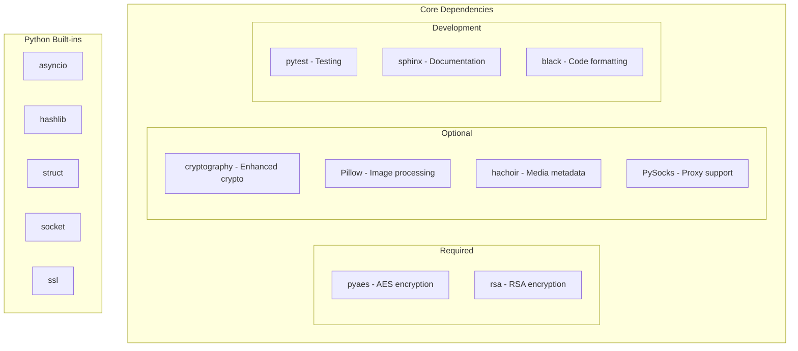

# Core Components

---
**Navigation:** [← Client Lifecycle](../client/lifecycle.md) | [Home](../index.md) | [Dependencies →](dependencies.md)

---

## Overview

The core components section documents the fundamental building blocks and dependencies that Telethon relies on. This includes external libraries, internal utilities, and architectural patterns that form the foundation of the library.

## Section Contents

### [Dependencies](dependencies.md)
Complete overview of Telethon's dependencies:
- Required Python packages
- Optional dependencies for enhanced functionality
- Version requirements and compatibility
- Dependency management strategies

## Core Architecture

## Key Principles

- **Minimal Dependencies**: Core functionality requires only essential packages
- **Optional Enhancements**: Additional features available with extra dependencies
- **Pure Python**: No C extensions required for basic operation
- **Cross Platform**: Works on all major platforms
- **Type Safety**: Full type annotations throughout

## Next Steps

- Continue to [Dependencies](dependencies.md) for detailed dependency information
- Return to [Home](../index.md) for other documentation sections

---
**Navigation:** [← Client Lifecycle](../client/lifecycle.md) | [Home](../index.md) | [Dependencies →](dependencies.md)

---