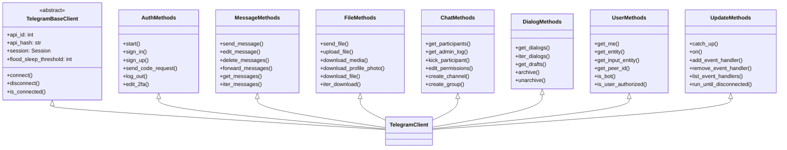
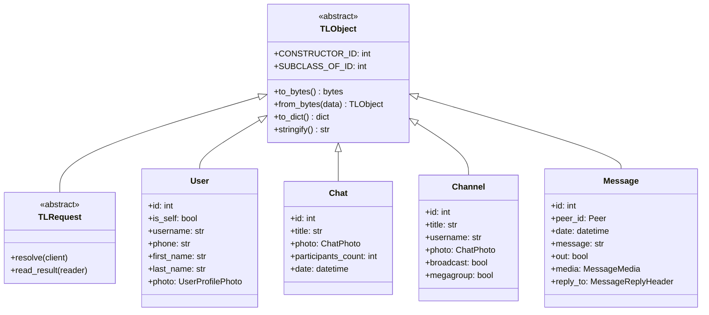
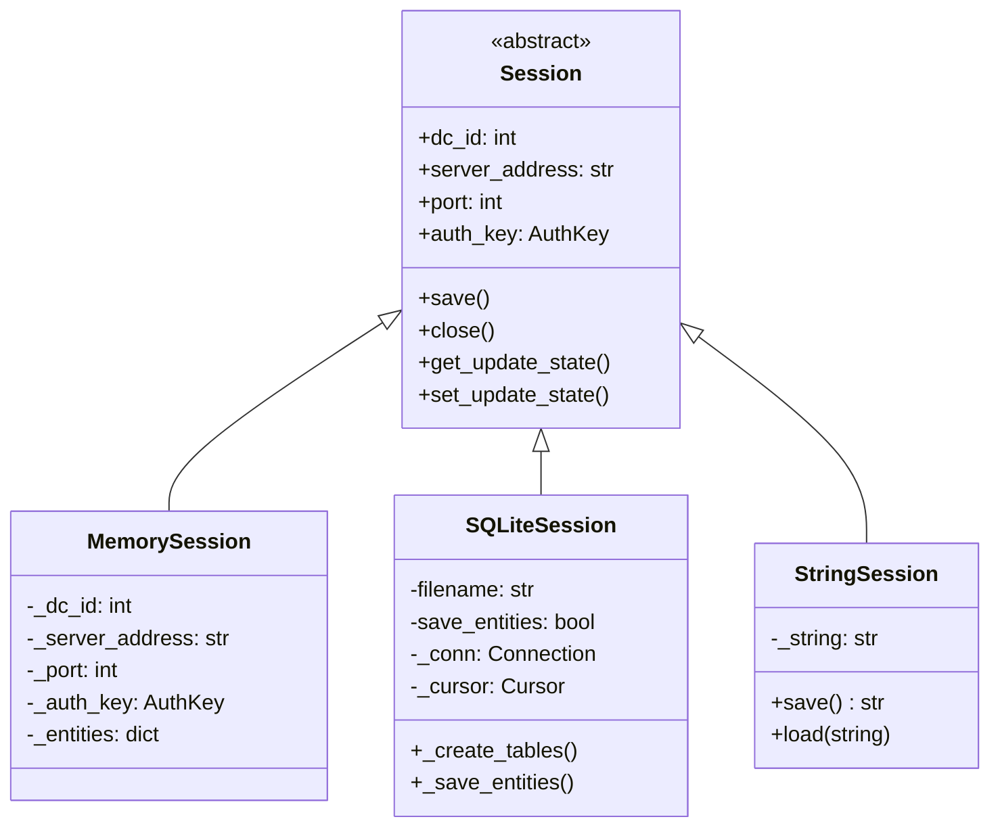
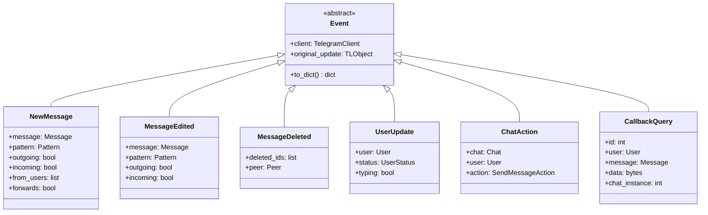
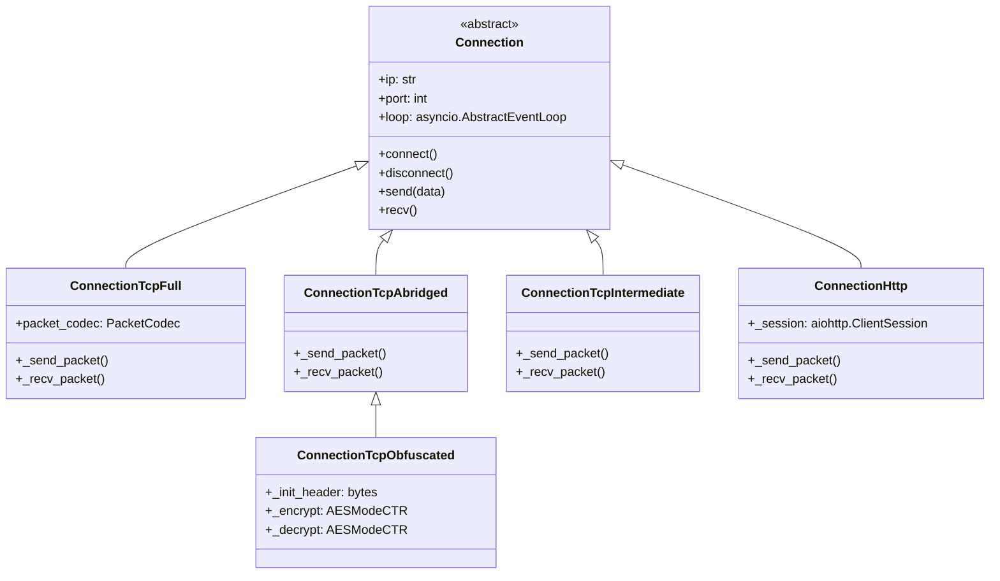
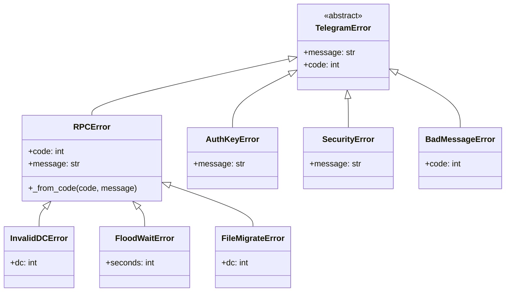
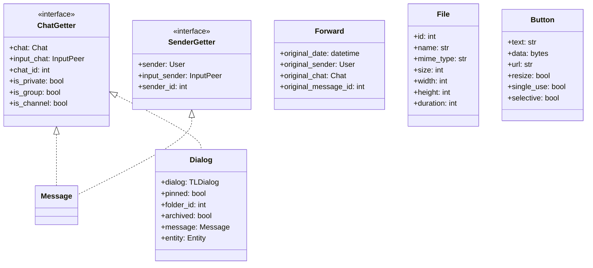

# Class Hierarchy

---
**Navigation:** [← Core Components](components.md) | [Home](../index.md) | [Up](../index.md) | [Module Organization →](module-organization.md)

---

## Overview

Telethon's class hierarchy follows a well-structured object-oriented design that promotes code reuse, maintainability, and clear separation of concerns. The hierarchy uses multiple inheritance patterns, particularly mixins, to compose functionality.

## Main Class Hierarchy



## TL Object Hierarchy



## Session Hierarchy



## Event Hierarchy



## Connection Hierarchy



## Error Hierarchy



## Custom Type Hierarchy



## Inheritance Patterns

### 1. Mixin Pattern
```python
class TelegramClient(
    UserMethods,
    MessageMethods,
    FileMethods,
    ChatMethods,
    DialogMethods,
    UpdateMethods,
    AuthMethods,
    TelegramBaseClient
):
    """
    Compose functionality through multiple inheritance.
    Each mixin provides a specific set of methods.
    """
    pass
```

### 2. Abstract Base Classes
```python
from abc import ABC, abstractmethod

class Session(ABC):
    """Abstract base for session implementations"""
    
    @abstractmethod
    def save(self):
        """Save session state"""
        pass
    
    @abstractmethod
    def get_auth_key(self):
        """Get authorization key"""
        pass
```

### 3. Protocol Classes
```python
from typing import Protocol

class ChatGetter(Protocol):
    """Protocol for objects that have chat information"""
    
    @property
    def chat(self) -> Chat:
        """Get the chat"""
        ...
    
    @property
    def chat_id(self) -> int:
        """Get the chat ID"""
        ...
```

## Design Benefits

### Separation of Concerns
- Each mixin handles a specific domain
- Clear boundaries between components
- Easy to understand and maintain

### Code Reusability
- Common functionality in base classes
- Mixins can be reused in different contexts
- Protocol classes enable duck typing

### Extensibility
- New mixins can be added easily
- Inheritance allows customization
- Abstract classes define contracts

### Type Safety
- Clear type hierarchies
- Protocol classes for structural typing
- Generated classes maintain type information

## Implementation Examples

### Creating a Custom Client
```python
class CustomClient(MessageMethods, AuthMethods, TelegramBaseClient):
    """Custom client with only messaging and auth"""
    
    def __init__(self, session, api_id, api_hash):
        super().__init__(session, api_id, api_hash)
        # Custom initialization
```

### Extending Events
```python
class CustomEvent(NewMessage):
    """Extended message event with custom logic"""
    
    def __init__(self, message):
        super().__init__(message)
        self.custom_field = self._process_custom()
    
    def _process_custom(self):
        # Custom processing
        pass
```

### Custom Session Implementation
```python
class RedisSession(Session):
    """Session backed by Redis"""
    
    def __init__(self, redis_client):
        self._redis = redis_client
    
    def save(self):
        # Save to Redis
        pass
    
    def get_auth_key(self):
        # Get from Redis
        pass
```

## Next Steps

- Continue to [Module Organization](module-organization.md) for package structure
- See [Dependencies](dependencies.md) for dependency management
- Explore [TelegramClient](../client/telegram-client.md) for client implementation

---
**Navigation:** [← Core Components](components.md) | [Home](../index.md) | [Up](../index.md) | [Module Organization →](module-organization.md)

---