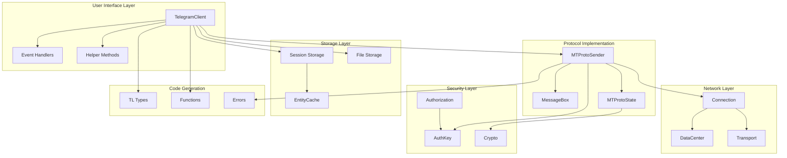
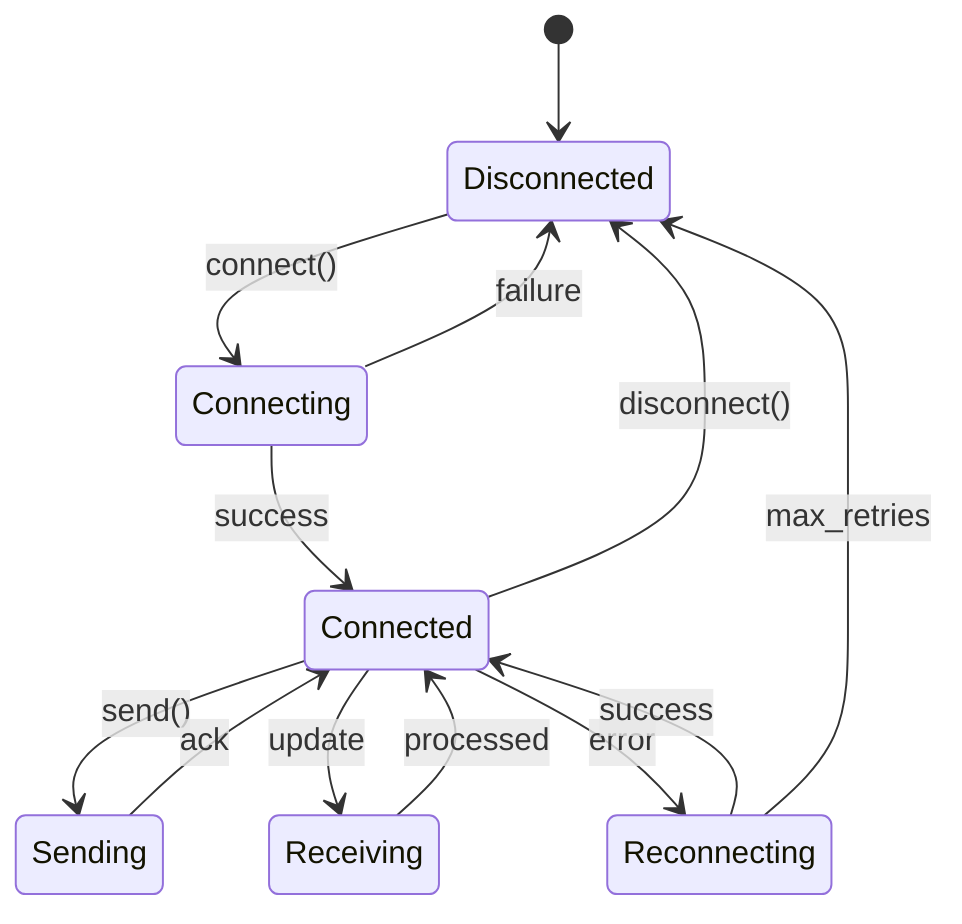
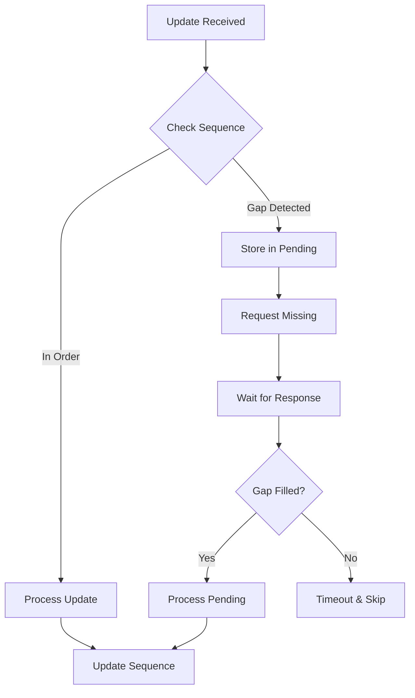
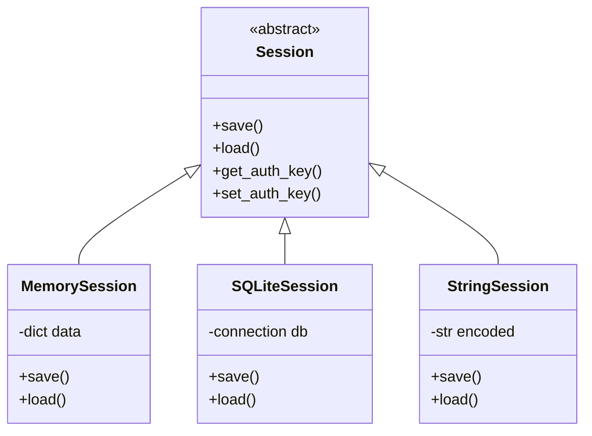
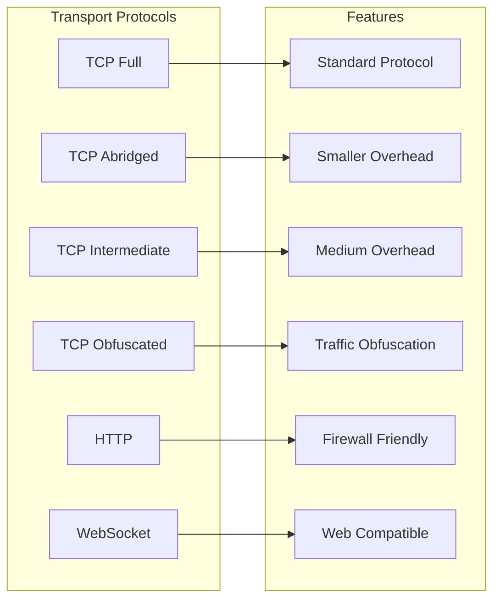
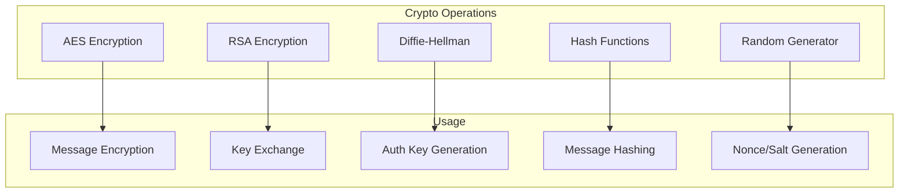
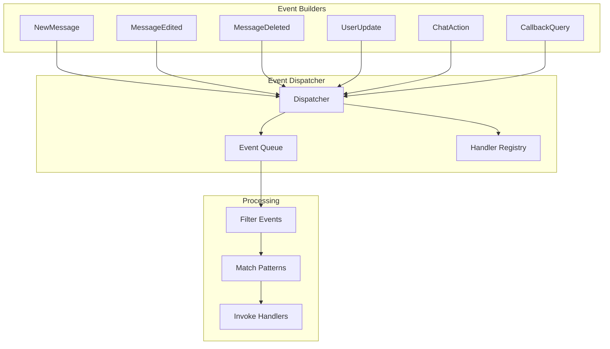
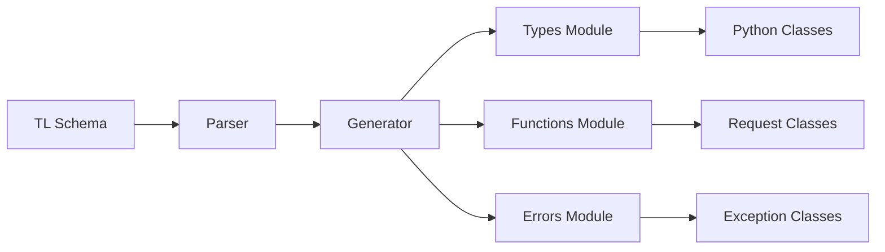
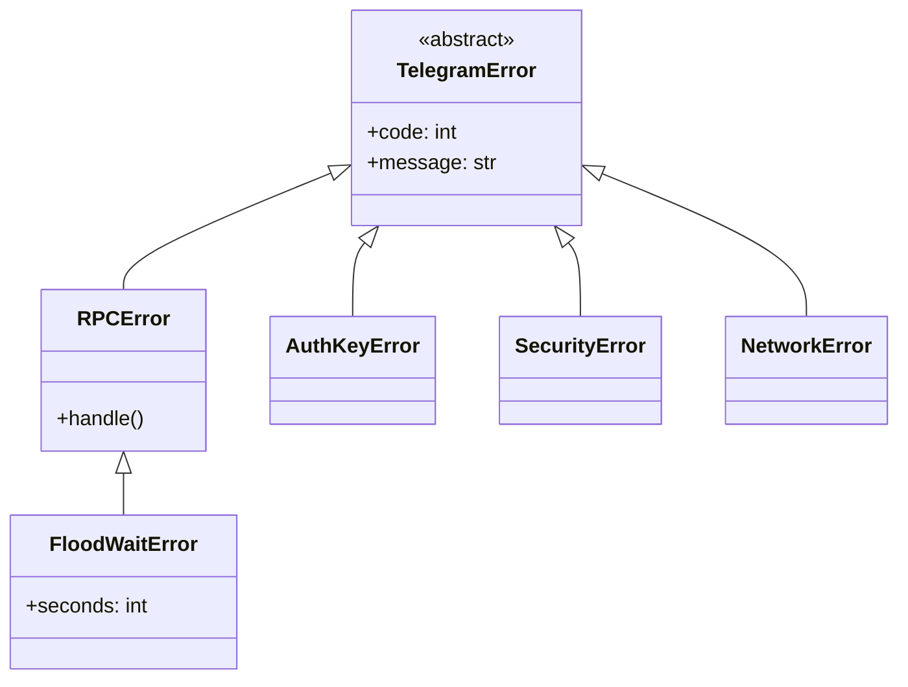
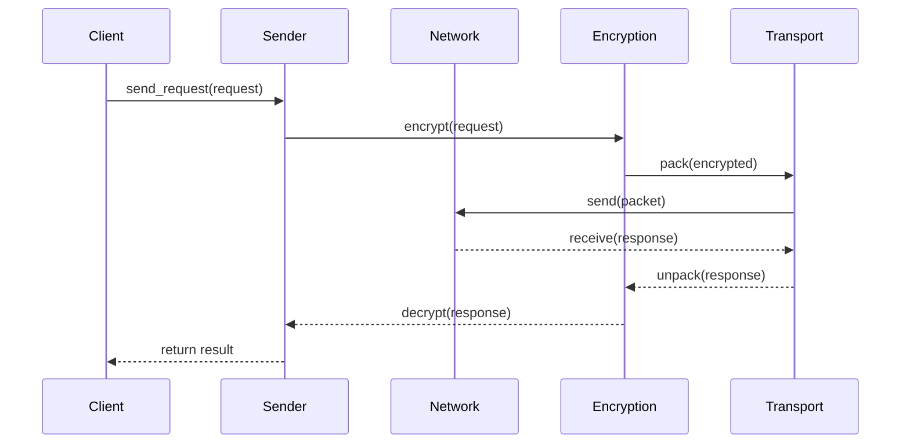

# Core Components

---
**Navigation:** [← Design Principles](../overview/design-principles.md) | [Home](../index.md) | [Up](../index.md) | [Class Hierarchy →](class-hierarchy.md)

---

## Component Overview

Telethon's architecture consists of several core components that work together to provide a complete Telegram client implementation. Each component has specific responsibilities and interacts with others through well-defined interfaces.

## Component Architecture Diagram



## 1. TelegramClient

The main entry point for users, orchestrating all other components.

### Responsibilities
- High-level API methods
- Session management
- Event dispatching
- Entity resolution
- File operations

### Key Features
```python
class TelegramClient:
    """Main client combining all functionality"""
    
    def __init__(self, session, api_id, api_hash):
        # Initialize components
        self.session = session
        self._sender = MTProtoSender(...)
        self._entity_cache = EntityCache()
        self._event_builders = []
        
    async def connect(self):
        """Establish connection to Telegram"""
        
    async def send_message(self, entity, message):
        """High-level message sending"""
```

### Component Integration
- Uses mixins for modular functionality
- Delegates protocol handling to MTProtoSender
- Manages session persistence
- Coordinates event handling

## 2. MTProtoSender

The heart of the protocol implementation, handling all MTProto communication.

### Responsibilities
- Message encryption/decryption
- Request queue management
- Response handling
- Connection state management
- Automatic reconnection

### Architecture


### Key Methods
```python
class MTProtoSender:
    async def connect(self, connection):
        """Establish secure connection"""
        
    async def send(self, request):
        """Send encrypted request"""
        
    async def receive(self):
        """Receive and decrypt response"""
        
    def _encrypt_message(self, data):
        """Apply MTProto encryption"""
        
    def _decrypt_message(self, data):
        """Decrypt MTProto message"""
```

## 3. MessageBox

Handles update sequencing and gap detection for reliable message delivery.

### Responsibilities
- Track update sequence numbers
- Detect missing updates (gaps)
- Request missing updates
- Maintain chronological order
- Handle different update types

### Gap Detection Algorithm


### Implementation
```python
class MessageBox:
    def __init__(self):
        self.seq = 0
        self.pending = {}
        
    def process_update(self, update):
        """Process update maintaining order"""
        if update.seq == self.seq + 1:
            self._apply_update(update)
            self.seq = update.seq
            self._process_pending()
        else:
            self._handle_gap(update)
```

## 4. Session Storage

Persists client state across restarts.

### Responsibilities
- Store authentication keys
- Cache entity information
- Maintain update state
- Track server configuration
- Manage file references

### Storage Backends


### Data Structure
```python
# Session stores:
{
    'auth_key': bytes,          # Authorization key
    'layer': int,               # Protocol layer
    'salt': int,                # Server salt
    'dc_id': int,               # Data center
    'server_address': str,      # DC address
    'port': int,                # DC port
    'entities': [               # Cached entities
        {'id': int, 'hash': int, 'username': str}
    ],
    'update_state': {           # Update tracking
        'pts': int,
        'qts': int,
        'date': int,
        'seq': int
    }
}
```

## 5. Connection Layer

Manages network connections and transport protocols.

### Responsibilities
- Establish TCP/HTTP connections
- Handle transport protocols
- Manage connection lifecycle
- Implement retries and timeouts
- Support multiple transport types

### Transport Types


### Connection Lifecycle
```python
class Connection:
    async def connect(self):
        """Establish connection"""
        self._socket = await self._create_socket()
        await self._handshake()
        
    async def send(self, data):
        """Send data with transport encoding"""
        packet = self._transport.pack(data)
        await self._socket.send(packet)
        
    async def receive(self):
        """Receive and decode data"""
        packet = await self._socket.receive()
        return self._transport.unpack(packet)
```

## 6. Cryptography Module

Implements all cryptographic operations required by MTProto.

### Components


### Security Features
- AES-256 in IGE mode
- RSA-2048 for key exchange
- SHA-256 for hashing
- Secure random generation
- Perfect forward secrecy

## 7. Entity Cache

Caches user and chat information for efficient access.

### Responsibilities
- Store entity metadata
- Resolve usernames to IDs
- Track access patterns
- Implement cache eviction
- Handle cache invalidation

### Cache Structure
```python
class EntityCache:
    def __init__(self, limit=1000):
        self._entities = {}  # id -> entity
        self._usernames = {}  # username -> id
        self._phones = {}     # phone -> id
        self._access = OrderedDict()  # LRU tracking
        
    def add(self, entity):
        """Add entity to cache"""
        self._ensure_space()
        self._entities[entity.id] = entity
        self._track_access(entity.id)
        
    def get(self, identifier):
        """Retrieve entity by id/username/phone"""
```

## 8. Event System

Manages event registration and dispatching.

### Components


### Event Flow
```python
class EventDispatcher:
    def __init__(self):
        self._handlers = defaultdict(list)
        
    def add_handler(self, event_type, handler):
        """Register event handler"""
        self._handlers[event_type].append(handler)
        
    async def dispatch(self, update):
        """Dispatch update to handlers"""
        event = self._build_event(update)
        for handler in self._handlers[type(event)]:
            if await handler.filter(event):
                await handler.callback(event)
```

## 9. TL (Type Language) Layer

Auto-generated code from Telegram's schema.

### Generation Process


### Generated Structure
```python
# Generated type example
class Message(TLObject):
    def __init__(self, id, peer_id, date, message, **kwargs):
        self.id = id
        self.peer_id = peer_id
        self.date = date
        self.message = message
        # ... more fields
        
    def to_bytes(self):
        """Serialize to bytes"""
        
    @classmethod
    def from_bytes(cls, data):
        """Deserialize from bytes"""
```

## 10. Error Handling

Comprehensive error management system.

### Error Hierarchy


## Component Interactions

### Request Processing Flow


## Next Steps

- Continue to [Class Hierarchy](class-hierarchy.md) for detailed class relationships
- See [Module Organization](module-organization.md) for package structure
- Explore [TelegramClient](../client/telegram-client.md) for client details

---
**Navigation:** [← Design Principles](../overview/design-principles.md) | [Home](../index.md) | [Up](../index.md) | [Class Hierarchy →](class-hierarchy.md)

---