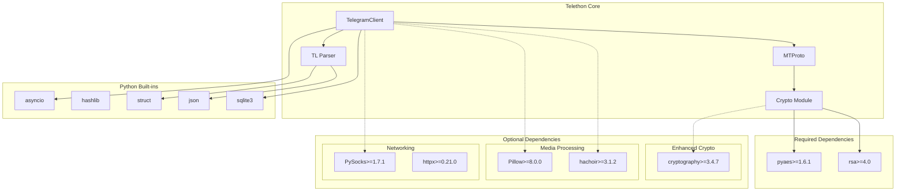

# Dependencies

---
**Navigation:** [← Core](README.md) | [Home](../index.md) | [Up](../index.md)

---

## Overview

Telethon is designed to have minimal required dependencies while offering optional dependencies for enhanced functionality. This document details all dependencies, their purposes, and version requirements.

## Dependency Architecture



## Required Dependencies

### pyaes (>=1.6.1)

**Purpose**: Pure Python AES encryption implementation for MTProto

```python
# Used for AES-IGE encryption in MTProto
from pyaes import AESModeOfOperationIGE

def encrypt_ige(plaintext: bytes, key: bytes, iv: bytes) -> bytes:
    """Encrypt data using AES-IGE mode."""
    aes = AESModeOfOperationIGE(key, iv)
    return aes.encrypt(plaintext)
```

**Why Required**:
- MTProto uses AES-256-IGE for message encryption
- Pure Python implementation ensures compatibility
- No C extensions needed

**Installation**:
```bash
pip install pyaes>=1.6.1
```

### rsa (>=4.0)

**Purpose**: RSA encryption for DH key exchange

```python
# Used for RSA encryption in authorization
import rsa

def encrypt_with_rsa(data: bytes, public_key: rsa.PublicKey) -> bytes:
    """Encrypt data with RSA public key."""
    return rsa.encrypt(data, public_key)
```

**Why Required**:
- Required for initial DH parameter exchange
- Used to encrypt DH parameters with server's RSA key
- Pure Python implementation

**Installation**:
```bash
pip install rsa>=4.0
```

## Optional Dependencies

### cryptography (>=3.4.7)

**Purpose**: Enhanced cryptographic operations

```python
# Faster AES operations when available
try:
    from cryptography.hazmat.primitives.ciphers import Cipher, algorithms, modes
    from cryptography.hazmat.backends import default_backend
    
    def fast_aes_ige_encrypt(plaintext: bytes, key: bytes, iv: bytes) -> bytes:
        """Fast AES-IGE using cryptography library."""
        # Implementation using cryptography
        pass
except ImportError:
    # Fall back to pyaes
    fast_aes_ige_encrypt = encrypt_ige
```

**Benefits**:
- 10-50x faster encryption/decryption
- Hardware acceleration support
- Additional cryptographic primitives

**Installation**:
```bash
pip install telethon[cryptg]  # Includes cryptography
```

### Pillow (>=8.0.0)

**Purpose**: Image processing and thumbnail generation

```python
# Used for automatic thumbnail generation
from PIL import Image

def generate_thumbnail(image_path: str, size: tuple = (320, 320)) -> bytes:
    """Generate thumbnail for image."""
    img = Image.open(image_path)
    img.thumbnail(size, Image.Resampling.LANCZOS)
    
    # Save to bytes
    from io import BytesIO
    buffer = BytesIO()
    img.save(buffer, format='JPEG')
    return buffer.getvalue()
```

**Benefits**:
- Automatic thumbnail generation
- Image format conversion
- EXIF data handling
- Image resizing and optimization

**Installation**:
```bash
pip install Pillow>=8.0.0
```

### hachoir (>=3.1.2)

**Purpose**: Extract metadata from media files

```python
# Used for extracting video/audio metadata
from hachoir.parser import createParser
from hachoir.metadata import extractMetadata

def get_video_metadata(video_path: str):
    """Extract metadata from video file."""
    parser = createParser(video_path)
    if not parser:
        return None
        
    metadata = extractMetadata(parser)
    return {
        'duration': metadata.get('duration'),
        'width': metadata.get('width'),
        'height': metadata.get('height'),
        'has_audio': metadata.get('nb_audio_channel', 0) > 0
    }
```

**Benefits**:
- Automatic media attribute detection
- Support for many file formats
- No external tools required

**Installation**:
```bash
pip install hachoir>=3.1.2
```

### PySocks (>=1.7.1)

**Purpose**: SOCKS proxy support

```python
# Enable SOCKS proxy support
client = TelegramClient(
    'session',
    api_id,
    api_hash,
    proxy=('socks5', 'proxy.example.com', 1080, True, 'username', 'password')
)
```

**Benefits**:
- SOCKS4/SOCKS5 proxy support
- HTTP proxy support
- Authentication support

**Installation**:
```bash
pip install PySocks>=1.7.1
```

### httpx (>=0.21.0)

**Purpose**: HTTP transport alternative

```python
# Use HTTP transport instead of TCP
from telethon.network import ConnectionHttp

client = TelegramClient(
    'session',
    api_id,
    api_hash,
    connection=ConnectionHttp
)
```

**Benefits**:
- Firewall-friendly transport
- Better compatibility with corporate networks
- Async HTTP/2 support

**Installation**:
```bash
pip install httpx>=0.21.0
```

## Python Built-in Dependencies

### asyncio

**Purpose**: Asynchronous I/O and event loop

```python
import asyncio

# Core of Telethon's async operations
async def main():
    async with TelegramClient(...) as client:
        await client.send_message('me', 'Hello!')

asyncio.run(main())
```

**Usage**:
- Event loop management
- Concurrent operations
- Network I/O
- Task scheduling

### hashlib

**Purpose**: Cryptographic hashing

```python
import hashlib

# Used for various hash operations
def calculate_sha256(data: bytes) -> bytes:
    """Calculate SHA-256 hash."""
    return hashlib.sha256(data).digest()

def calculate_md5(data: bytes) -> bytes:
    """Calculate MD5 hash for file IDs."""
    return hashlib.md5(data).digest()
```

**Usage**:
- SHA-1/SHA-256 for MTProto
- MD5 for file fingerprints
- PBKDF2 for passwords

### struct

**Purpose**: Binary data serialization

```python
import struct

# Used for TL serialization
def pack_int(value: int) -> bytes:
    """Pack integer as little-endian bytes."""
    return struct.pack('<i', value)

def unpack_int(data: bytes) -> int:
    """Unpack little-endian bytes as integer."""
    return struct.unpack('<i', data)[0]
```

**Usage**:
- TL schema serialization
- Binary protocol handling
- Network byte order conversion

### sqlite3

**Purpose**: Session persistence

```python
import sqlite3

# Used for SQLite session storage
class SQLiteSession:
    def __init__(self, filename):
        self.conn = sqlite3.connect(filename)
        self._create_tables()
    
    def save_auth_key(self, auth_key: bytes):
        """Save authorization key to database."""
        self.conn.execute(
            'INSERT OR REPLACE INTO auth_keys (dc_id, auth_key) VALUES (?, ?)',
            (self.dc_id, auth_key)
        )
```

**Usage**:
- Session data storage
- Entity cache persistence
- Update state tracking

## Development Dependencies

### pytest (>=6.2.5)

**Purpose**: Testing framework

```bash
# Run tests
pytest tests/
```

### sphinx (>=4.3.2)

**Purpose**: Documentation generation

```bash
# Build documentation
sphinx-build -b html docs/ docs/_build/
```

### black (>=21.12b0)

**Purpose**: Code formatting

```bash
# Format code
black telethon/
```

### mypy (>=0.910)

**Purpose**: Static type checking

```bash
# Type check
mypy telethon/
```

## Version Compatibility

### Python Version Support

```python
# Telethon supports Python 3.7+
import sys

if sys.version_info < (3, 7):
    raise RuntimeError("Telethon requires Python 3.7+")
```

### Dependency Version Matrix

| Telethon Version | Python | pyaes | rsa | cryptography | Pillow |
|-----------------|--------|-------|-----|--------------|--------|
| 1.24.x          | 3.7+   | 1.6.1+| 4.0+| 3.4.7+      | 8.0.0+ |
| 1.25.x          | 3.7+   | 1.6.1+| 4.0+| 3.4.7+      | 8.0.0+ |
| 1.26.x          | 3.8+   | 1.6.1+| 4.0+| 35.0.0+     | 9.0.0+ |

## Installation Options

### Minimal Installation

```bash
# Core functionality only
pip install telethon
```

### Full Installation

```bash
# All optional dependencies
pip install telethon[full]
```

### Custom Installation

```bash
# Specific extras
pip install telethon[cryptg]  # Fast crypto
pip install telethon[media]   # Media processing
pip install telethon[socks]   # Proxy support
```

## Dependency Management

### Requirements Files

```ini
# requirements.txt
telethon>=1.24.0
pyaes>=1.6.1
rsa>=4.0

# requirements-optional.txt
cryptography>=3.4.7
Pillow>=8.0.0
hachoir>=3.1.2
PySocks>=1.7.1
httpx>=0.21.0

# requirements-dev.txt
pytest>=6.2.5
sphinx>=4.3.2
black>=21.12b0
mypy>=0.910
```

### Poetry Configuration

```toml
# pyproject.toml
[tool.poetry.dependencies]
python = "^3.7"
pyaes = "^1.6.1"
rsa = "^4.0"

[tool.poetry.extras]
cryptg = ["cryptography"]
media = ["Pillow", "hachoir"]
socks = ["PySocks"]
http = ["httpx"]
full = ["cryptography", "Pillow", "hachoir", "PySocks", "httpx"]

[tool.poetry.dev-dependencies]
pytest = "^6.2.5"
sphinx = "^4.3.2"
black = "^21.12b0"
mypy = "^0.910"
```

## Best Practices

### Dependency Selection

1. **Start Minimal**: Install only required dependencies
2. **Add as Needed**: Install optional deps when features are needed
3. **Version Pinning**: Pin versions for production deployments
4. **Regular Updates**: Keep dependencies updated for security
5. **Compatibility Testing**: Test with minimum and latest versions

### Performance Considerations

1. **Use cryptography**: For high-volume encryption operations
2. **Enable Media Processing**: For automatic media handling
3. **Consider Proxy Needs**: Install PySocks only if needed
4. **Monitor Memory**: Some dependencies increase memory usage

## Next Steps

- Return to [Core Components](README.md)
- Review [Installation Guide](../index.md#installation)
- See [Performance Optimization](../internals/README.md)

---
**Navigation:** [← Core](README.md) | [Home](../index.md) | [Up](../index.md)

---