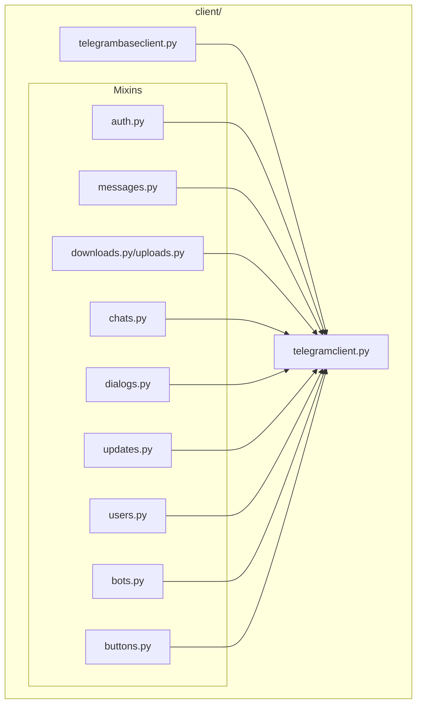
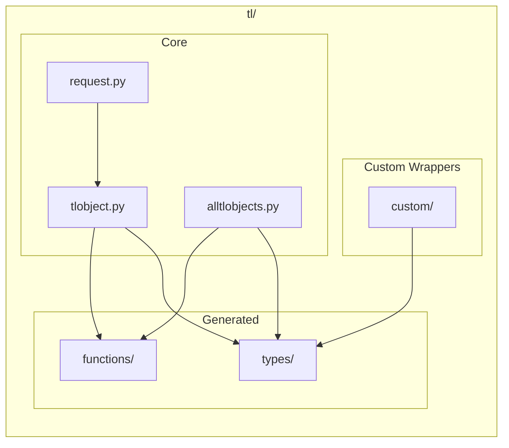
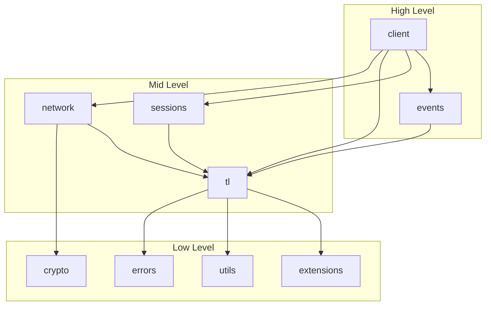

# Module Organization

---
**Navigation:** [← Class Hierarchy](class-hierarchy.md) | [Home](../index.md) | [Up](../index.md) | [Dependencies →](dependencies.md)

---

## Package Structure Overview

Telethon follows a well-organized package structure that separates concerns and makes the codebase easy to navigate. The organization reflects the architectural layers and functional boundaries.

## Directory Structure

```
telethon/
├── __init__.py              # Main exports and version
├── __main__.py              # CLI entry point
├── client/                  # Client implementation
│   ├── __init__.py
│   ├── telegrambaseclient.py
│   ├── telegramclient.py
│   ├── account.py           # Account-related methods
│   ├── auth.py              # Authentication methods
│   ├── bots.py              # Bot-specific methods
│   ├── buttons.py           # Button/keyboard methods
│   ├── chats.py             # Chat management methods
│   ├── dialogs.py           # Dialog/conversation methods
│   ├── downloads.py         # File download methods
│   ├── messages.py          # Message handling methods
│   ├── updates.py           # Update handling methods
│   ├── uploads.py           # File upload methods
│   └── users.py             # User-related methods
├── crypto/                  # Cryptographic implementations
│   ├── __init__.py
│   ├── aes.py               # AES encryption
│   ├── aesctr.py            # AES CTR mode
│   ├── authkey.py           # Authorization key handling
│   ├── cdn.py               # CDN decryption
│   ├── factorization.py     # Prime factorization
│   └── rsa.py               # RSA implementation
├── errors/                  # Error handling
│   ├── __init__.py
│   ├── common.py            # Common error types
│   └── rpcerrorlist.py      # RPC error definitions
├── events/                  # Event system
│   ├── __init__.py
│   ├── common.py            # Base event classes
│   ├── newmessage.py        # New message events
│   ├── messageedited.py     # Message edit events
│   ├── messagedeleted.py    # Message deletion events
│   ├── userupdate.py        # User update events
│   ├── chataction.py        # Chat action events
│   ├── callbackquery.py     # Callback query events
│   └── inlinequery.py       # Inline query events
├── extensions/              # Additional utilities
│   ├── __init__.py
│   ├── binaryreader.py      # Binary data reading
│   ├── html.py              # HTML parsing
│   ├── markdown.py          # Markdown parsing
│   └── messagepacker.py     # Message packing
├── network/                 # Network layer
│   ├── __init__.py
│   ├── connection/          # Connection types
│   │   ├── __init__.py
│   │   ├── common.py        # Base connection
│   │   ├── tcpabridged.py   # TCP abridged
│   │   ├── tcpfull.py       # TCP full
│   │   ├── tcpintermediate.py
│   │   ├── tcpobfuscated.py
│   │   └── http.py          # HTTP transport
│   ├── mtprotoplainsender.py # Plain MTProto
│   ├── mtprotosender.py      # Main MTProto sender
│   └── mtprotostate.py       # Protocol state
├── sessions/                # Session management
│   ├── __init__.py
│   ├── abstract.py          # Abstract session base
│   ├── memory.py            # In-memory session
│   ├── sqlite.py            # SQLite session
│   └── string.py            # String session
├── tl/                      # Type Language
│   ├── __init__.py
│   ├── custom/              # Custom type wrappers
│   │   ├── __init__.py
│   │   ├── button.py
│   │   ├── chatgetter.py
│   │   ├── dialog.py
│   │   ├── file.py
│   │   ├── forward.py
│   │   ├── message.py
│   │   └── sendergetter.py
│   ├── functions/           # Generated functions
│   │   ├── __init__.py
│   │   ├── account/
│   │   ├── auth/
│   │   ├── channels/
│   │   ├── contacts/
│   │   ├── help/
│   │   ├── messages/
│   │   ├── photos/
│   │   ├── updates/
│   │   └── users/
│   ├── types/               # Generated types
│   │   ├── __init__.py
│   │   └── ... (generated)
│   ├── alltlobjects.py      # TL object registry
│   ├── core/                # Core TL functionality
│   ├── gzip.py              # Gzip support
│   ├── request.py           # Request handling
│   └── tlobject.py          # Base TL object
├── _updates/                # Update handling
│   ├── __init__.py
│   ├── messagebox.py        # Message box implementation
│   └── session.py           # Update session state
├── helpers.py               # Helper utilities
├── hints.py                 # Type hints
├── requestiter.py           # Request iteration
├── sync.py                  # Synchronous wrapper
├── utils.py                 # General utilities
└── version.py               # Version information
```

## Module Responsibilities

### Core Modules

#### `client/`
The heart of the library, containing the client implementation split into logical mixins.



#### `network/`
Handles all network communication and protocol implementation.

```python
# network/mtprotosender.py
class MTProtoSender:
    """Core protocol implementation"""
    
    def __init__(self, auth_key, *, loggers, ...):
        self._auth_key = auth_key
        self._state = MTProtoState(auth_key, loggers)
        self._connection = None
        
    async def send(self, request):
        """Send encrypted request"""
        
    async def receive(self):
        """Receive and decrypt response"""
```

#### `tl/`
Contains all Type Language related code, both generated and custom.



### Support Modules

#### `crypto/`
Implements all cryptographic operations required by MTProto.

```python
# crypto/aes.py
def encrypt_ige(plaintext, key, iv):
    """AES encryption in IGE mode"""
    
# crypto/rsa.py
def encrypt(data, public_key):
    """RSA encryption for key exchange"""
    
# crypto/factorization.py
def factorize(n):
    """Prime factorization for DH"""
```

#### `sessions/`
Provides different session storage backends.

```python
# sessions/abstract.py
class Session(ABC):
    """Abstract session interface"""
    
    @abstractmethod
    def save(self):
        """Save session state"""
```

#### `events/`
Event system implementation with various event types.

```python
# events/newmessage.py
class NewMessage(EventBuilder):
    """Handles new message events"""
    
    def __init__(self, chats=None, *, incoming=None, ...):
        self.chats = chats
        self.incoming = incoming
```

## Import Organization

### Public API (`__init__.py`)

```python
# telethon/__init__.py
from .client import TelegramClient
from .tl.custom import Button, Forward, Message, Dialog
from .tl import types, functions, custom
from . import events, errors, utils, helpers
from .errors import *
from .events import *

__version__ = '1.x.x'
__all__ = [
    'TelegramClient',
    'Button',
    'types', 'functions', 'custom',
    'events', 'errors', 'utils',
    # ... other exports
]
```

### Internal Imports

```python
# Example of internal import structure
# client/messages.py
from .users import UserMethods
from ..tl import types, functions
from .. import utils, helpers
from ..errors import *

class MessageMethods(UserMethods):
    """Message-related functionality"""
```

## Code Organization Patterns

### 1. Mixin Organization
Each mixin file contains related methods:

```python
# client/messages.py
class MessageMethods:
    # Message sending
    async def send_message(self, ...): ...
    async def send_file(self, ...): ...
    
    # Message retrieval
    async def get_messages(self, ...): ...
    async def iter_messages(self, ...): ...
    
    # Message modification
    async def edit_message(self, ...): ...
    async def delete_messages(self, ...): ...
```

### 2. Namespace Organization
Related functions grouped in modules:

```python
# tl/functions/messages/__init__.py
from .sendmessage import SendMessage
from .gethistory import GetHistory
from .editessage import EditMessage
# ... more message-related functions
```

### 3. Type Organization
Custom types extend generated ones:

```python
# tl/custom/message.py
from ..types import Message as TLMessage

class Message(TLMessage):
    """Extended message with convenience methods"""
    
    @property
    def text(self):
        """Get message text"""
        return self.message
```

## Module Dependencies



## Best Practices

### Module Design
1. **Single Responsibility**: Each module has one clear purpose
2. **Minimal Dependencies**: Reduce coupling between modules
3. **Clear Interfaces**: Well-defined public APIs
4. **Consistent Naming**: Follow Python conventions

### Code Organization
1. **Group Related Code**: Keep related functionality together
2. **Avoid Circular Imports**: Use careful import ordering
3. **Private Implementation**: Use `_` prefix for internal functions
4. **Documentation**: Each module has clear docstrings

### Import Guidelines
1. **Absolute Imports**: Prefer absolute over relative imports
2. **Import Order**: Standard library, third-party, local
3. **Avoid Star Imports**: Except in `__init__.py`
4. **Lazy Imports**: For heavy dependencies

## Extension Points

### Adding New Event Types
```python
# events/customevent.py
from .common import EventBuilder

class CustomEvent(EventBuilder):
    """New event type"""
    
    @classmethod
    def build(cls, update):
        """Build event from update"""
```

### Adding New Client Methods
```python
# client/custom.py
class CustomMethods:
    """Custom client functionality"""
    
    async def custom_operation(self):
        """Perform custom operation"""

# Extend TelegramClient
class ExtendedClient(CustomMethods, TelegramClient):
    pass
```

## Next Steps

- Continue to [Dependencies](dependencies.md) for dependency management
- See [TelegramClient](../client/telegram-client.md) for client details
- Explore [Network Layer](../network/mtproto-sender.md) for protocol implementation

---
**Navigation:** [← Class Hierarchy](class-hierarchy.md) | [Home](../index.md) | [Up](../index.md) | [Dependencies →](dependencies.md)

---