# Client Structure

---
**Navigation:** [← System Overview](system-overview.md) | [Home](../index.md) | [Up](../index.md) | [Network Flow →](network-flow.md)

---

## Overview

This document provides detailed visual representations of the TelegramClient's internal structure, showing how mixins, managers, and components work together to provide comprehensive Telegram functionality.

## Client Class Hierarchy

```mermaid
classDiagram
    class TelegramBase {
        <<abstract>>
        +session: Session
        +api_id: int
        +api_hash: str
        +_connection: Connection
        +_init_request()
        +_disconnect()
    }
    
    class AuthMixin {
        +start()
        +sign_in()
        +sign_up()
        +log_out()
        +send_code_request()
        +is_user_authorized()
    }
    
    class MessageMixin {
        +send_message()
        +edit_message()
        +delete_messages()
        +forward_messages()
        +get_messages()
        +iter_messages()
    }
    
    class UploadMixin {
        +upload_file()
        +send_file()
        +_upload_document()
        +_upload_photo()
    }
    
    class DownloadMixin {
        +download_media()
        +download_profile_photo()
        +download_file()
        +iter_download()
    }
    
    class DialogMixin {
        +get_dialogs()
        +iter_dialogs()
        +get_drafts()
        +edit_folder()
    }
    
    class ChatMixin {
        +get_participants()
        +iter_participants()
        +get_permissions()
        +kick_participant()
        +edit_permissions()
    }
    
    class UpdateMixin {
        +add_event_handler()
        +remove_event_handler()
        +list_event_handlers()
        +catch_up()
        +_handle_update()
    }
    
    class TelegramClient {
        +connect()
        +disconnect()
        +is_connected()
        +get_me()
        +get_entity()
        +get_input_entity()
        +loop: asyncio.AbstractEventLoop
    }
    
    TelegramBase <|-- AuthMixin
    AuthMixin <|-- MessageMixin
    MessageMixin <|-- UploadMixin
    UploadMixin <|-- DownloadMixin
    DownloadMixin <|-- DialogMixin
    DialogMixin <|-- ChatMixin
    ChatMixin <|-- UpdateMixin
    UpdateMixin <|-- TelegramClient
```

## Component Architecture

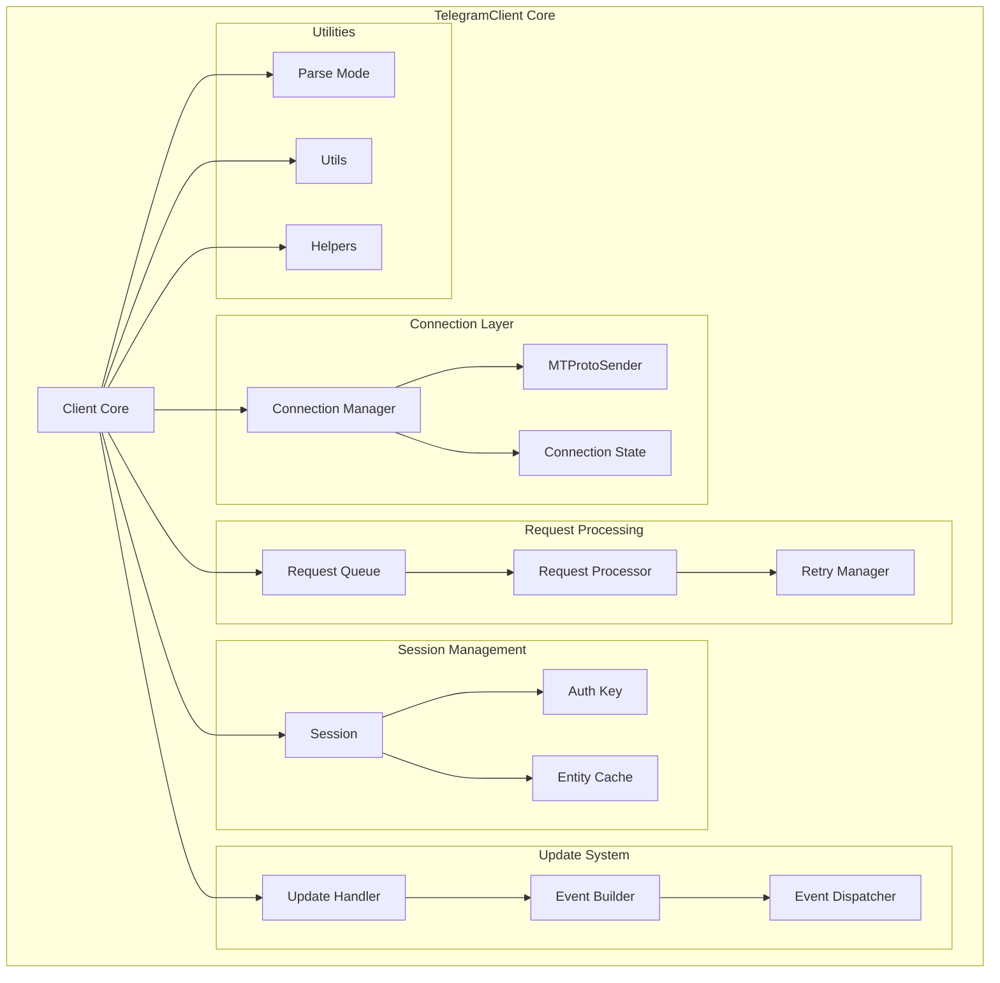

## Mixin Functionality Map

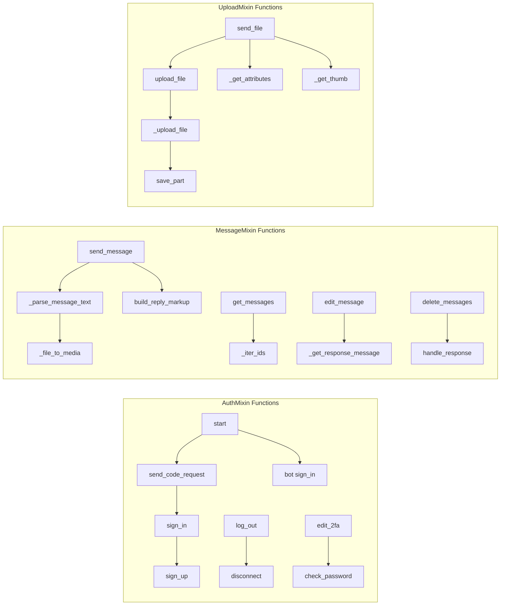

## State Management

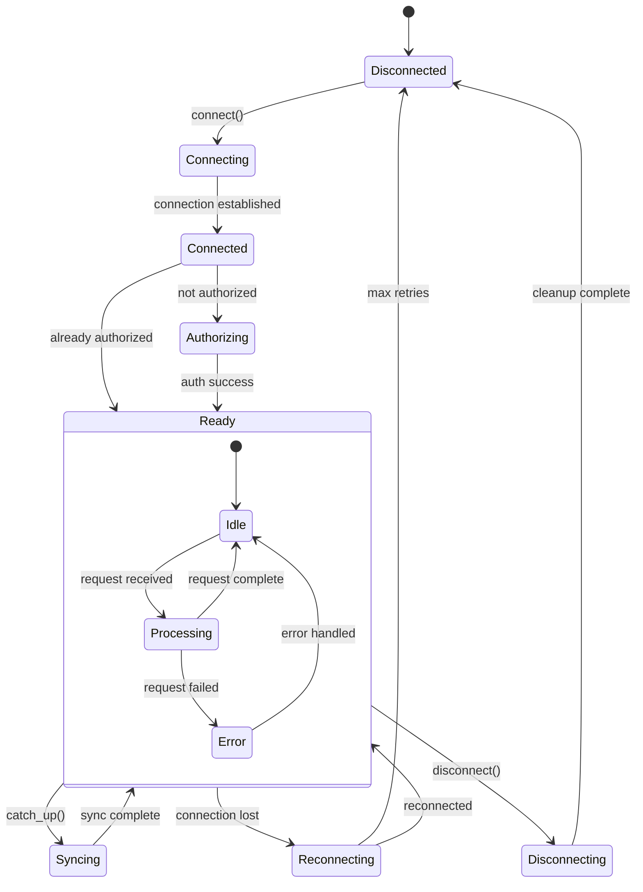

## Request Processing Pipeline

```mermaid
graph TB
    subgraph "Request Pipeline"
        REQ[User Request]
        
        subgraph "Validation"
            V1[Validate Parameters]
            V2[Check Permissions]
            V3[Rate Limit Check]
        end
        
        subgraph "Preparation"
            P1[Resolve Entities]
            P2[Parse Text/Media]
            P3[Build TL Request]
        end
        
        subgraph "Execution"
            E1[Queue Request]
            E2[Assign Message ID]
            E3[Encrypt]
            E4[Send to Network]
        end
        
        subgraph "Response"
            R1[Receive Response]
            R2[Decrypt]
            R3[Parse Result]
            R4[Handle Errors]
        end
        
        RESULT[Return Result]
    end
    
    REQ --> V1
    V1 --> V2
    V2 --> V3
    
    V3 --> P1
    P1 --> P2
    P2 --> P3
    
    P3 --> E1
    E1 --> E2
    E2 --> E3
    E3 --> E4
    
    E4 --> R1
    R1 --> R2
    R2 --> R3
    R3 --> R4
    
    R4 --> RESULT
```

## Entity Resolution System

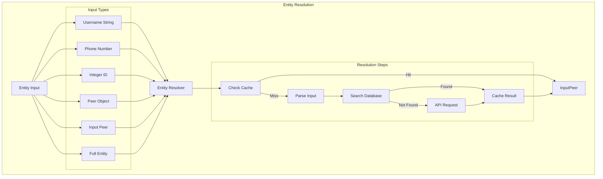

## File Operation Structure

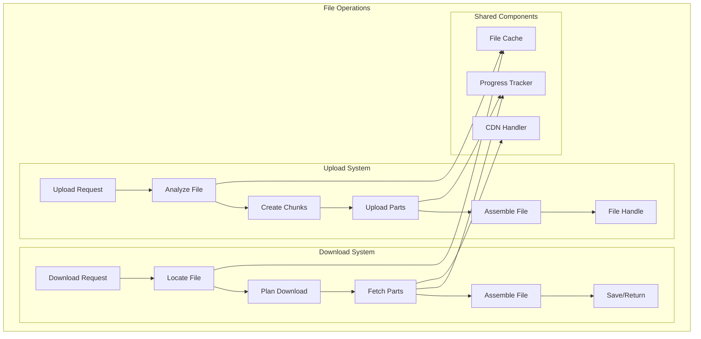

## Update Processing Architecture

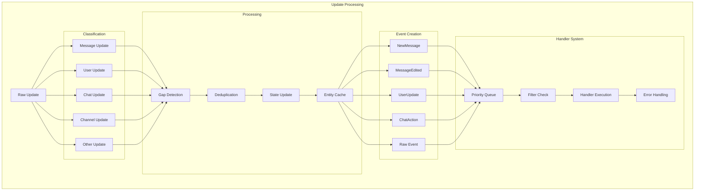

## Memory Management

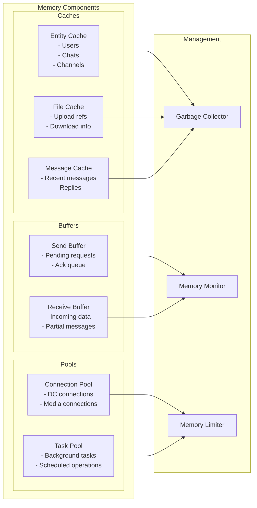

## Configuration Structure

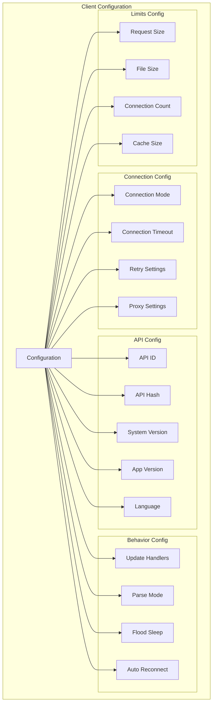

## Plugin System Architecture

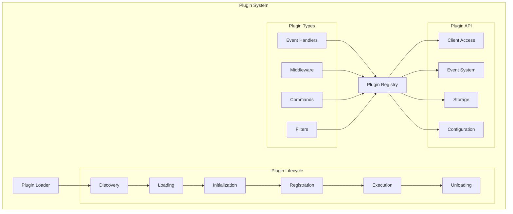

## Concurrency Model

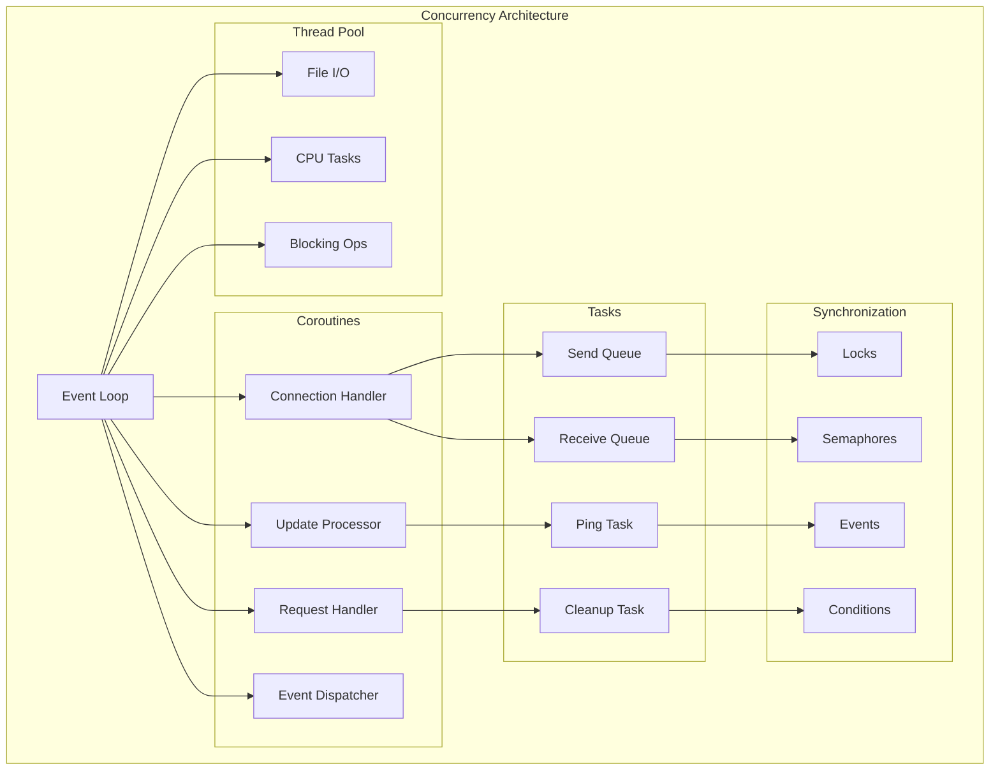

## Error Recovery Structure

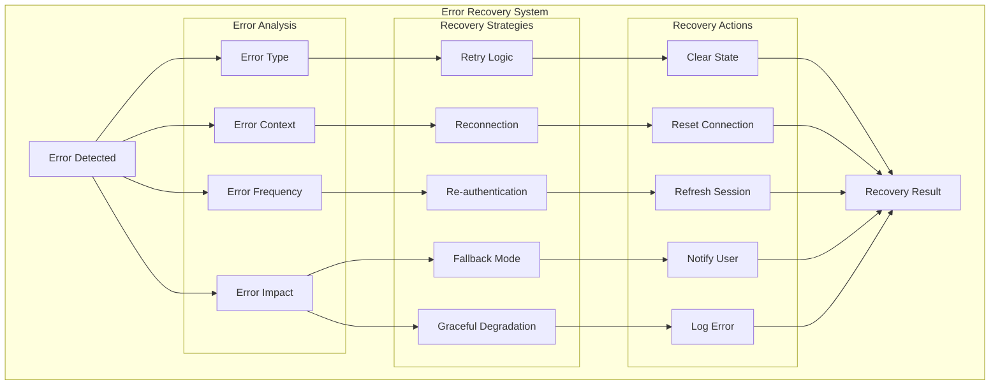

## Next Steps

- Continue to [Network Flow](network-flow.md) for network communication details
- See [Event Flow](event-flow.md) for event system visualization
- Review [Client Implementation](../client/base.md) for code details

---
**Navigation:** [← System Overview](system-overview.md) | [Home](../index.md) | [Up](../index.md) | [Network Flow →](network-flow.md)

---