# Event Flow

---
**Navigation:** [← Network Flow](network-flow.md) | [Home](../index.md) | [Up](../index.md) | [Client →](../client/README.md)

---

## Overview

This document visualizes how events flow through Telethon's event system, from receiving updates to dispatching events to user handlers. It shows the complete lifecycle of events, filtering mechanisms, and handler execution.

## Event Processing Pipeline

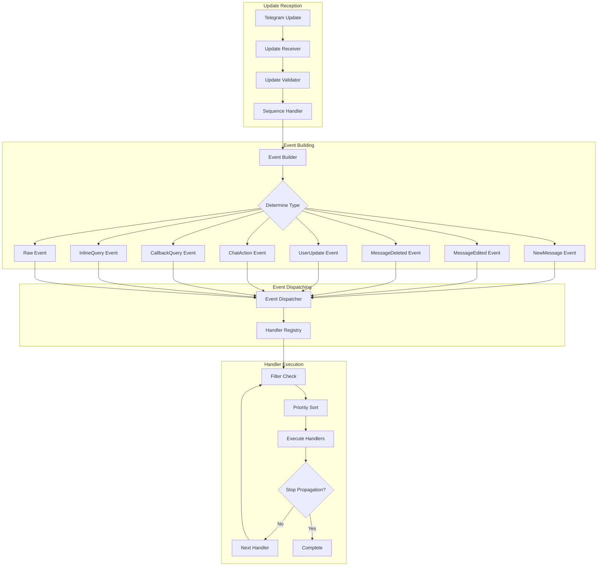

## Update to Event Conversion

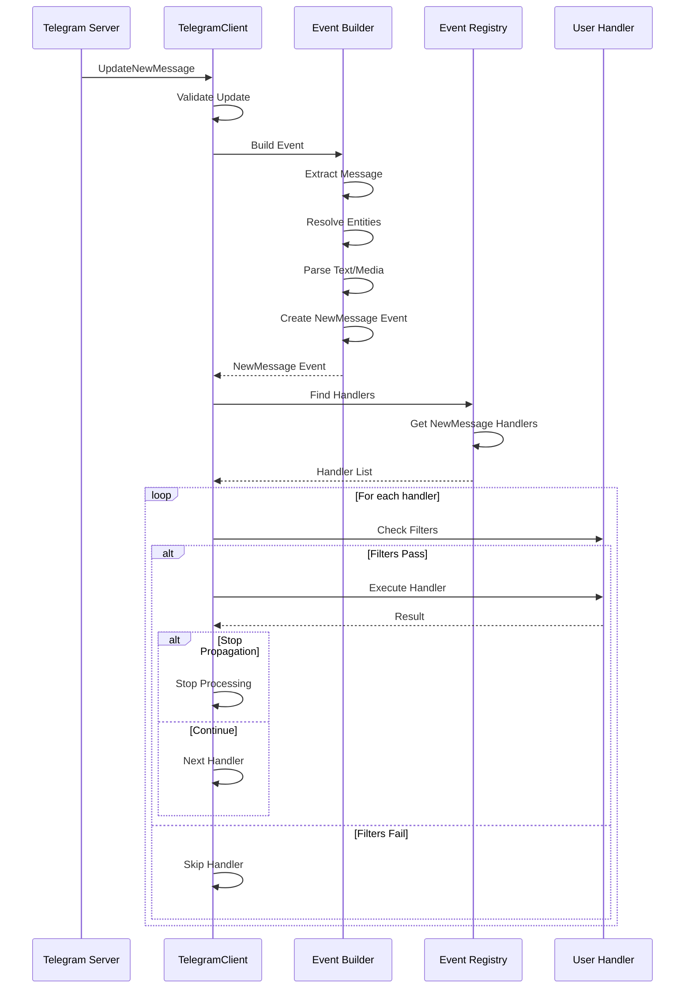

## Event Type Hierarchy

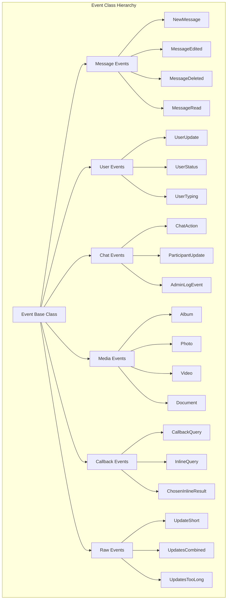

## Handler Registration Flow

```mermaid
graph LR
    subgraph "Handler Registration"
        DECORATOR[@events.register] --> FUNC[Handler Function]
        FUNC --> ANALYZE[Analyze Signature]
        ANALYZE --> EXTRACT[Extract Event Type]
        EXTRACT --> FILTERS[Extract Filters]
        
        FILTERS --> PATTERN[Pattern Filter]
        FILTERS --> CHATS[Chats Filter]
        FILTERS --> FUNC_FILTER[Function Filter]
        FILTERS --> INCOMING[Incoming Filter]
        FILTERS --> OUTGOING[Outgoing Filter]
        
        subgraph "Registry Storage"
            REGISTRY[Handler Registry]
            EVENT_MAP[Event Type Map]
            HANDLER_LIST[Handler List]
            PRIORITY_QUEUE[Priority Queue]
        end
        
        EXTRACT --> EVENT_MAP
        PATTERN --> HANDLER_LIST
        CHATS --> HANDLER_LIST
        FUNC_FILTER --> HANDLER_LIST
        INCOMING --> HANDLER_LIST
        OUTGOING --> HANDLER_LIST
        
        HANDLER_LIST --> PRIORITY_QUEUE
        EVENT_MAP --> REGISTRY
        PRIORITY_QUEUE --> REGISTRY
    end
```

## Event Filtering System

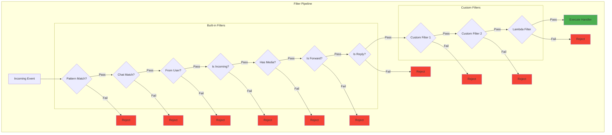

## Asynchronous Event Handling

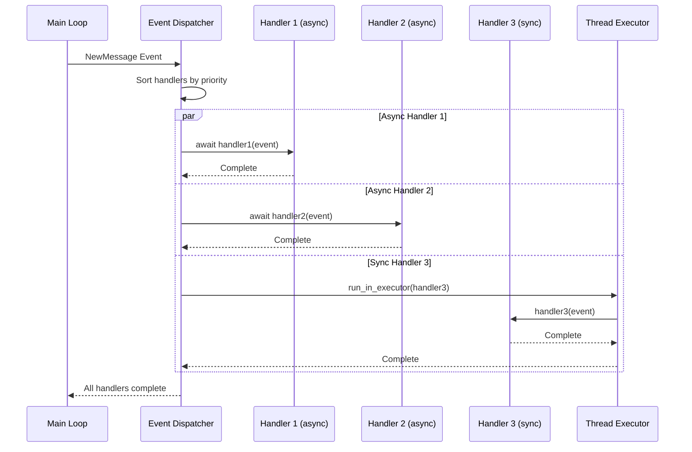

## Event State Management

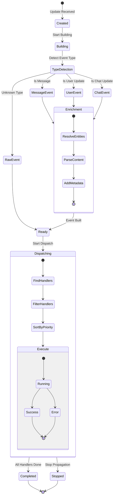

## Pattern Matching Flow

```mermaid
graph TB
    subgraph "Pattern Matching System"
        MSG[Message Text: "Hello World!"]
        
        subgraph "Pattern Types"
            P1[Regex Pattern<br/>/hello.*/i]
            P2[String Pattern<br/>"hello"]
            P3[Command Pattern<br/>"/start"]
            P4[Callable Pattern<br/>lambda x: ...]
        end
        
        subgraph "Matching Process"
            CHECK1{Regex Match?}
            CHECK2{String Match?}
            CHECK3{Command Match?}
            CHECK4{Callable Match?}
        end
        
        MSG --> CHECK1
        P1 --> CHECK1
        
        CHECK1 -->|Match| CAPTURE1[Capture Groups]
        CHECK1 -->|No Match| CHECK2
        
        P2 --> CHECK2
        CHECK2 -->|Match| CAPTURE2[Full Match]
        CHECK2 -->|No Match| CHECK3
        
        P3 --> CHECK3
        CHECK3 -->|Match| CAPTURE3[Command Args]
        CHECK3 -->|No Match| CHECK4
        
        P4 --> CHECK4
        CHECK4 -->|True| CAPTURE4[Callable Result]
        CHECK4 -->|False| NO_MATCH[No Pattern Match]
        
        CAPTURE1 --> ATTACH[Attach to Event]
        CAPTURE2 --> ATTACH
        CAPTURE3 --> ATTACH
        CAPTURE4 --> ATTACH
        
        ATTACH --> HANDLER[Execute Handler]
    end
```

## Event Priority System

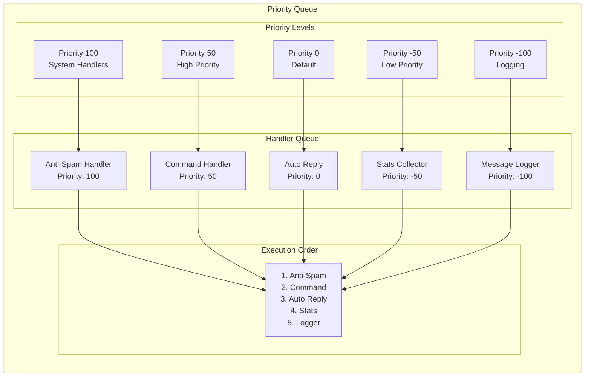

## Event Bubbling and Cancellation

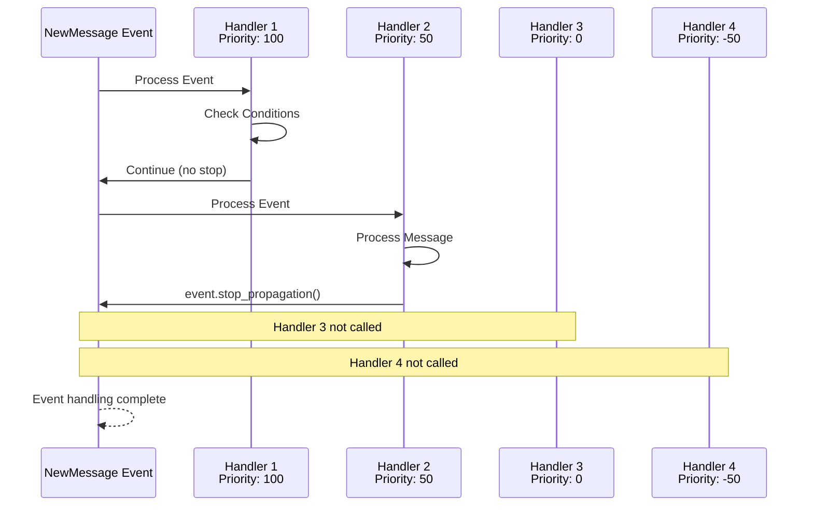

## Album Event Grouping

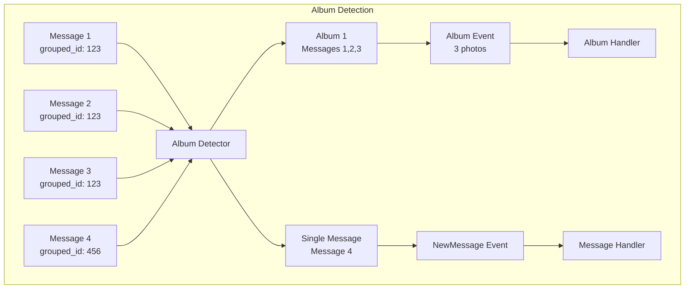

## Error Handling in Events

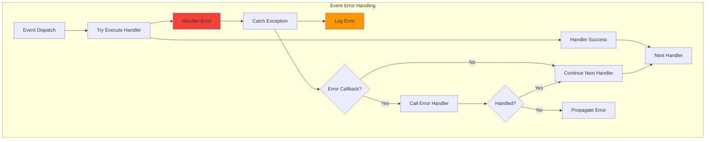

## Event Memory Management

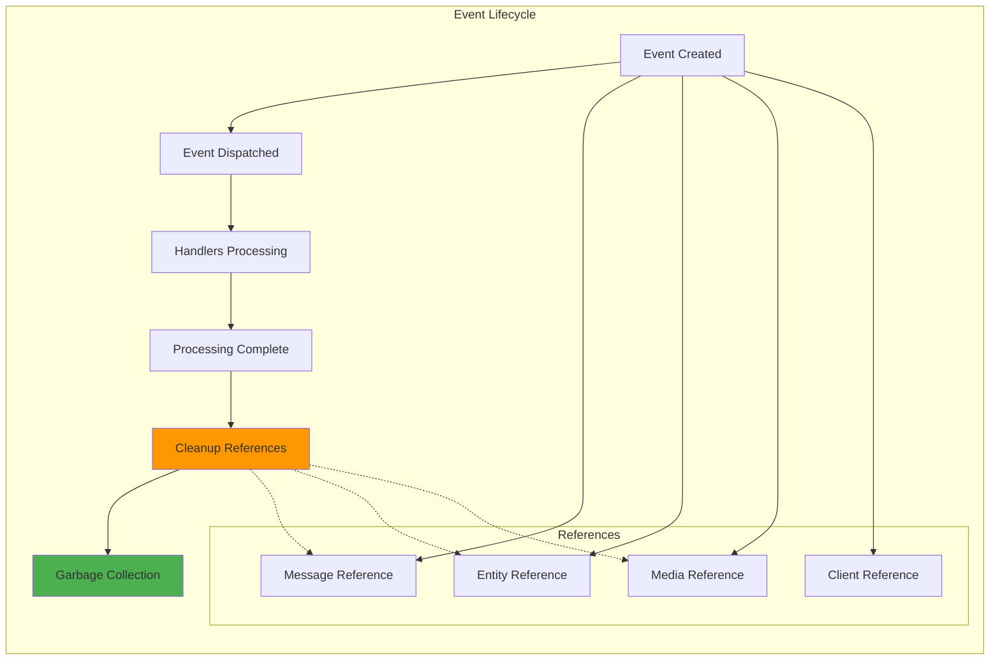

## Next Steps

- Continue to [Client Documentation](../client/mixins.md) for implementation details
- Review [Event System](../events/architecture.md) for technical details
- See [Event Types](../events/types.md) for all event types

---
**Navigation:** [← Network Flow](network-flow.md) | [Home](../index.md) | [Up](../index.md) | [Client →](../client/README.md)

---