# Network Flow

---
**Navigation:** [← Client Structure](client-structure.md) | [Home](../index.md) | [Up](../index.md) | [Event Flow →](event-flow.md)

---

## Overview

This document visualizes the network communication flow in Telethon, showing how data moves between the client and Telegram servers, including request/response cycles, connection management, and protocol handling.

## Request/Response Flow

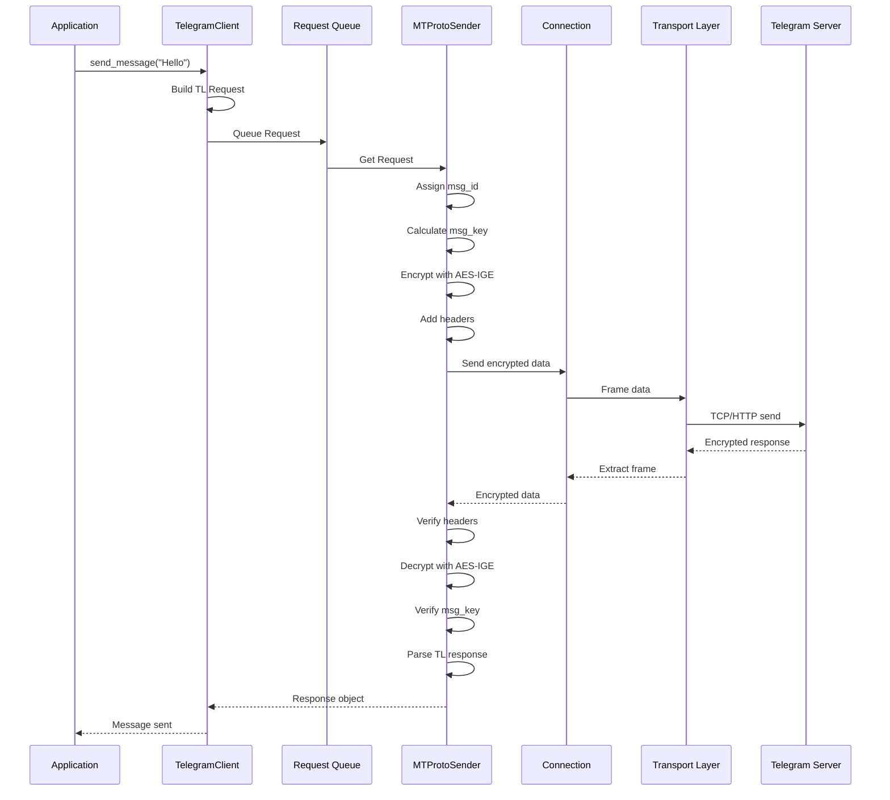

## Connection Establishment

```mermaid
graph TB
    subgraph "Connection Process"
        START[Start] --> CHECK_CONN[Check Existing Connection]
        
        CHECK_CONN -->|Exists| VALIDATE[Validate Connection]
        CHECK_CONN -->|None| CREATE[Create Connection]
        
        VALIDATE -->|Valid| READY[Connection Ready]
        VALIDATE -->|Invalid| CLOSE[Close Connection]
        
        CLOSE --> CREATE
        
        CREATE --> SELECT_DC[Select Data Center]
        SELECT_DC --> RESOLVE[Resolve DC Address]
        RESOLVE --> CHOOSE_TRANSPORT[Choose Transport]
        
        subgraph "Transport Selection"
            CHOOSE_TRANSPORT --> TCP_CHECK{TCP Available?}
            TCP_CHECK -->|Yes| TCP_MODE[Select TCP Mode]
            TCP_CHECK -->|No| HTTP_MODE[Use HTTP]
            
            TCP_MODE --> ABRIDGED[TCP Abridged]
            TCP_MODE --> INTERMEDIATE[TCP Intermediate]
            TCP_MODE --> FULL[TCP Full]
            TCP_MODE --> OBFUSCATED[TCP Obfuscated]
        end
        
        ABRIDGED --> CONNECT
        INTERMEDIATE --> CONNECT
        FULL --> CONNECT
        OBFUSCATED --> CONNECT
        HTTP_MODE --> CONNECT
        
        CONNECT[Establish Connection] --> AUTH_CHECK{Has Auth Key?}
        
        AUTH_CHECK -->|Yes| READY
        AUTH_CHECK -->|No| DH_EXCHANGE[DH Exchange]
        
        DH_EXCHANGE --> GEN_NONCE[Generate Nonces]
        GEN_NONCE --> REQ_PQ[Request PQ]
        REQ_PQ --> FACTOR[Factor PQ]
        FACTOR --> REQ_DH[Request DH Params]
        REQ_DH --> GEN_KEY[Generate Auth Key]
        GEN_KEY --> READY
    end
```

## MTProto Message Flow

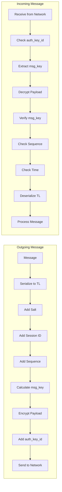

## Parallel Request Handling

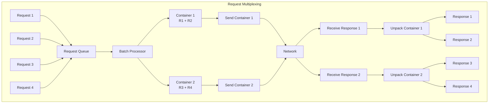

## Update Delivery

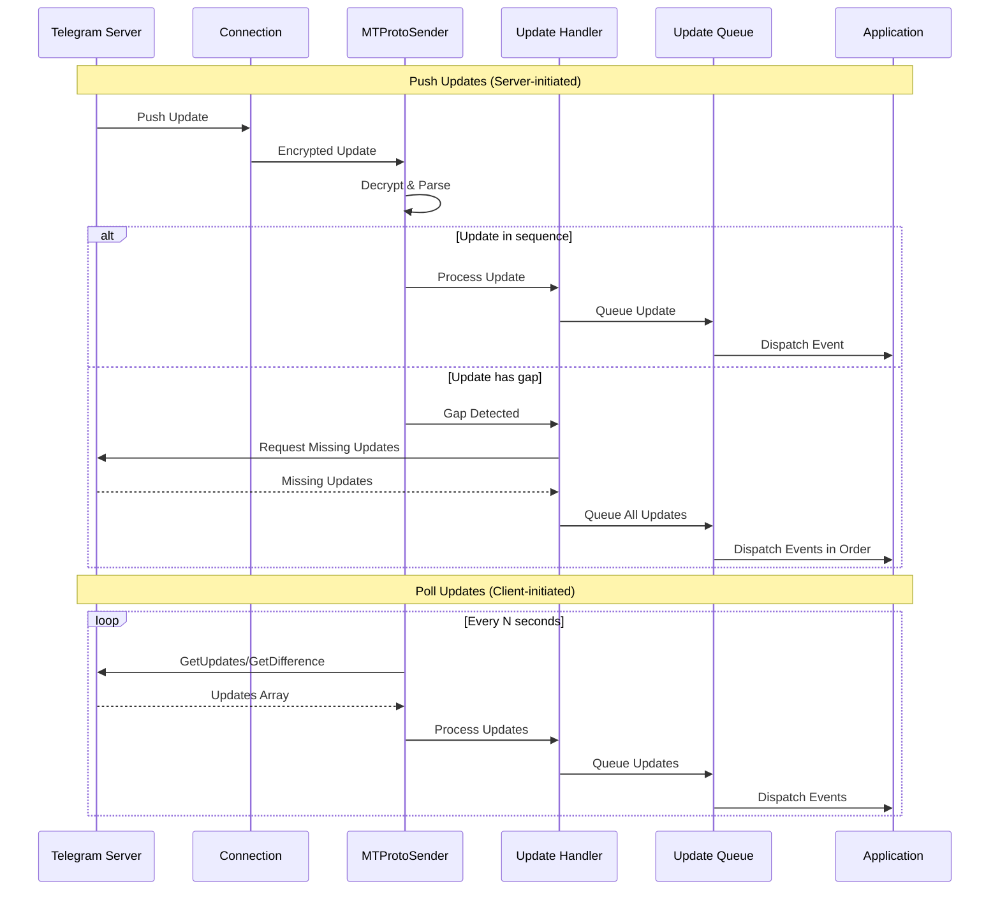

## Network Error Recovery

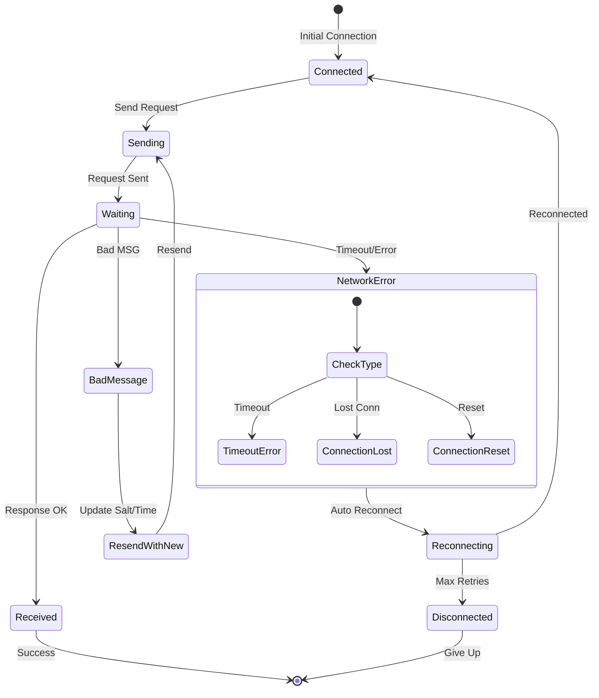

## Data Center Migration

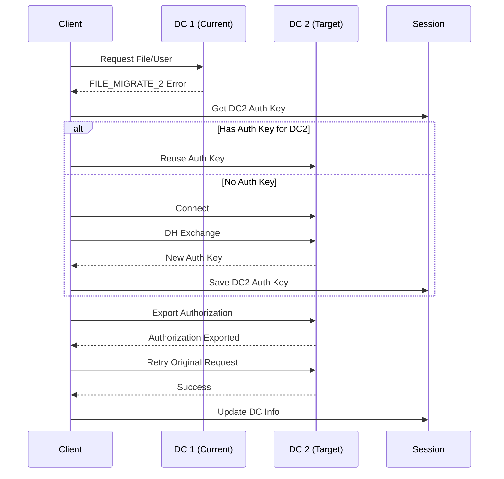

## Connection Pooling

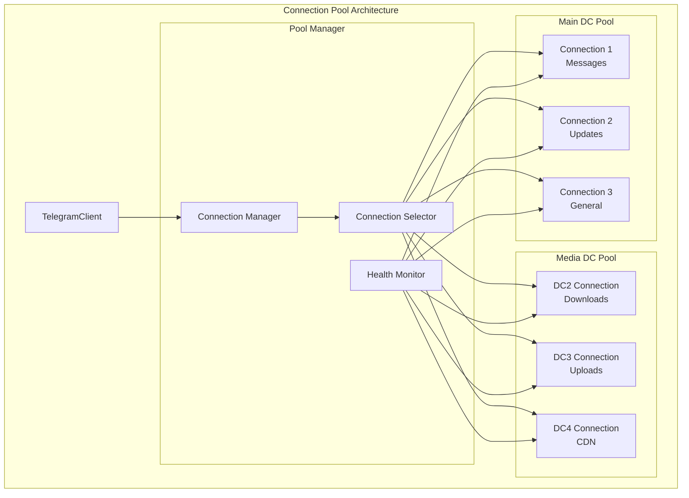

## Request Priority Queue

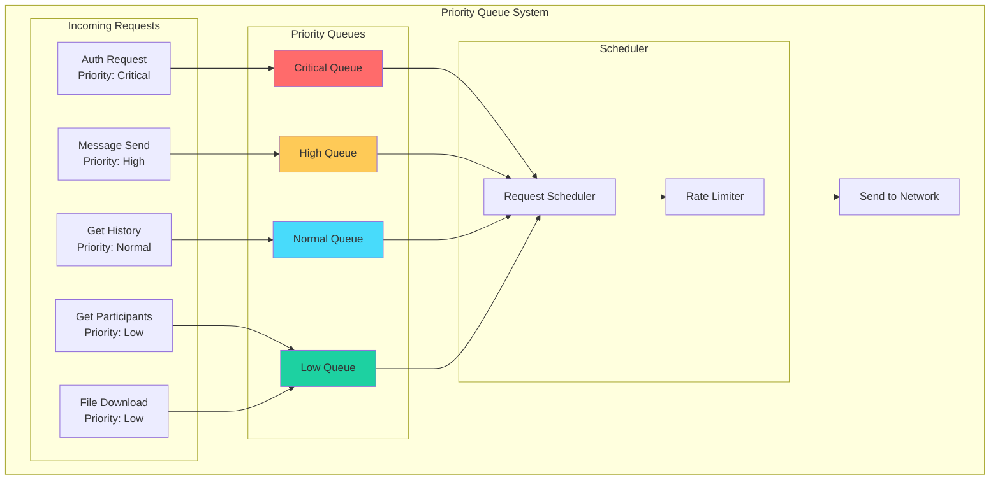

## Acknowledgment System

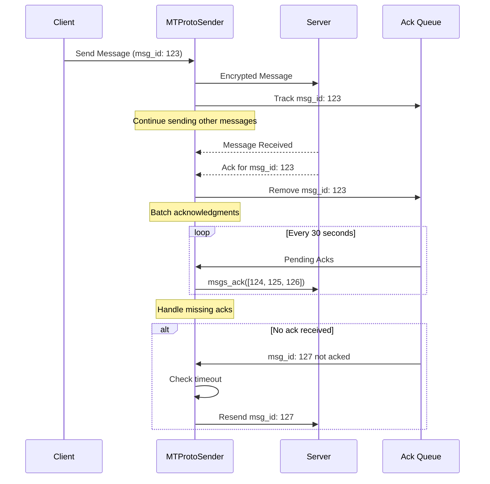

## Network Statistics

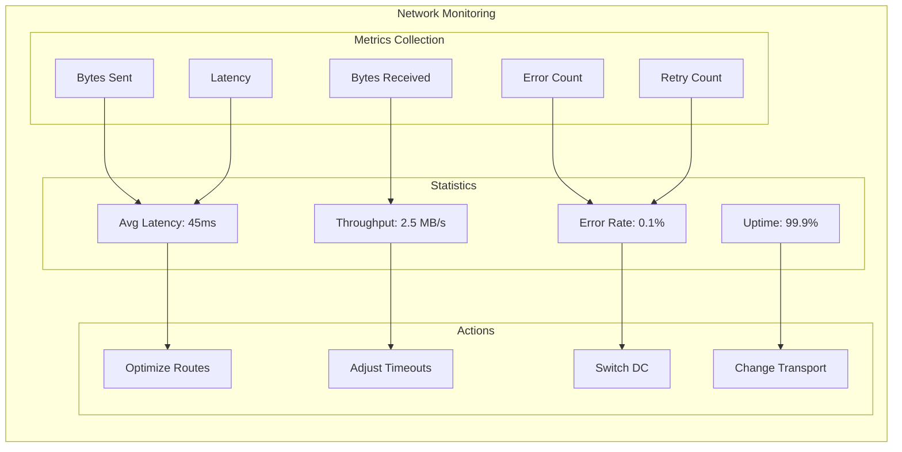

## Flood Control

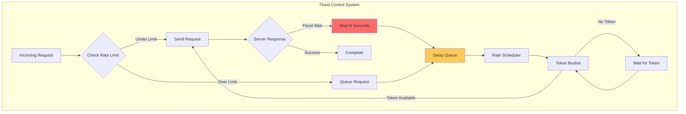

## Transport Layer Details

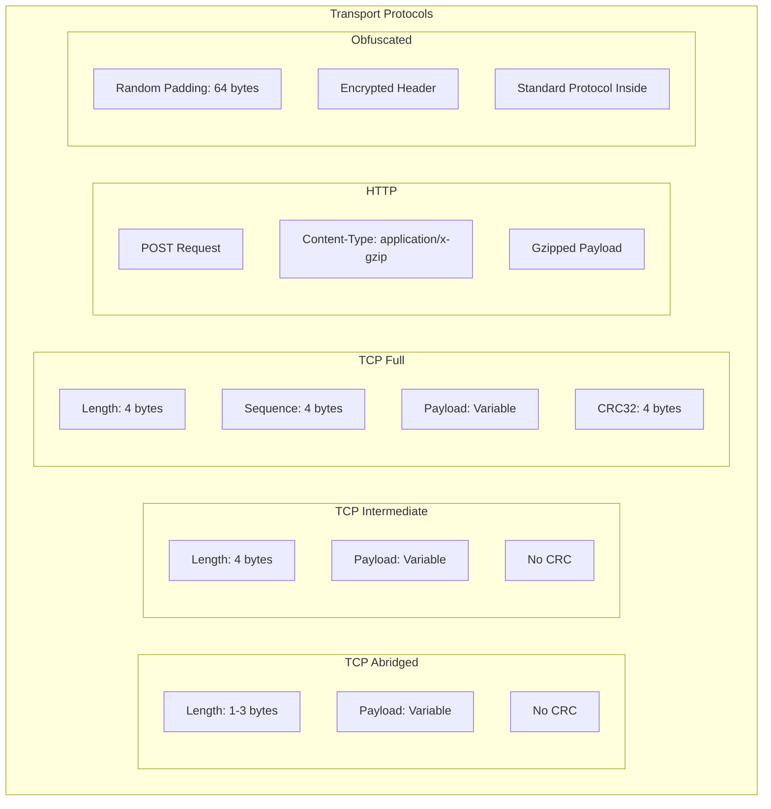

## Connection State Machine

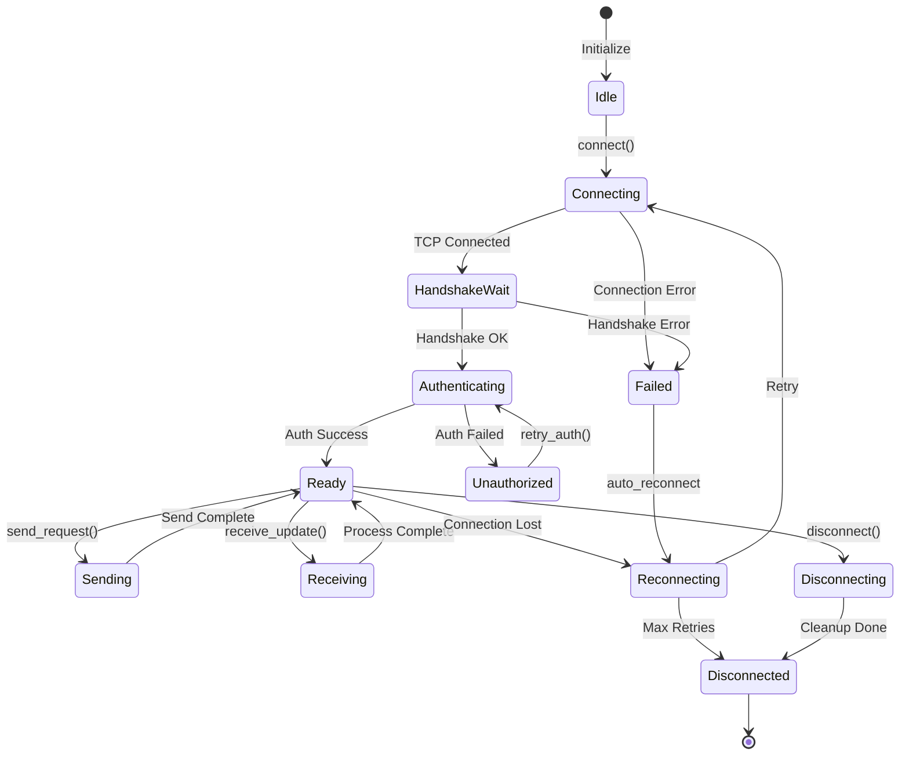

## Next Steps

- Continue to [Event Flow](event-flow.md) for event system visualization
- Review [Network Layer](../network/mtproto-sender.md) for implementation details
- See [Protocol Documentation](../protocol/mtproto.md) for protocol specifics

---
**Navigation:** [← Client Structure](client-structure.md) | [Home](../index.md) | [Up](../index.md) | [Event Flow →](event-flow.md)

---