# System Overview

---
**Navigation:** [← Diagrams](README.md) | [Home](../index.md) | [Up](../index.md) | [Client Structure →](client-structure.md)

---

## Overview

This document provides visual representations of Telethon's overall system architecture, showing how different components interact to provide a complete Telegram client implementation.

## High-Level Architecture

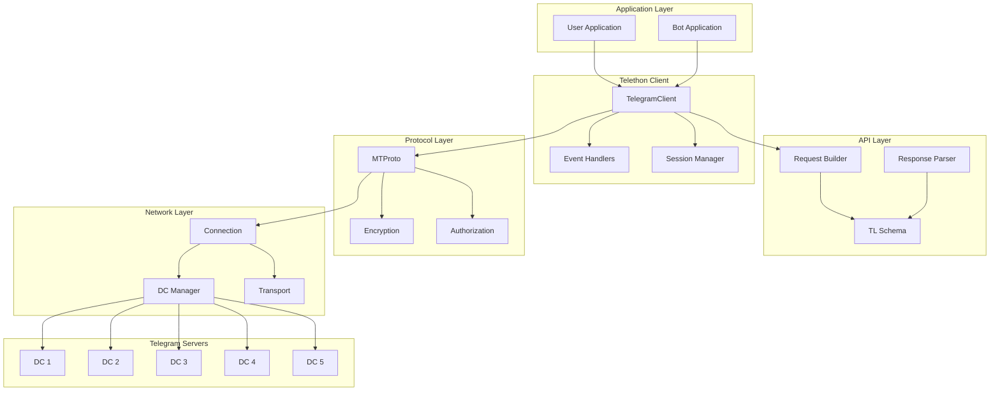

## Component Interactions

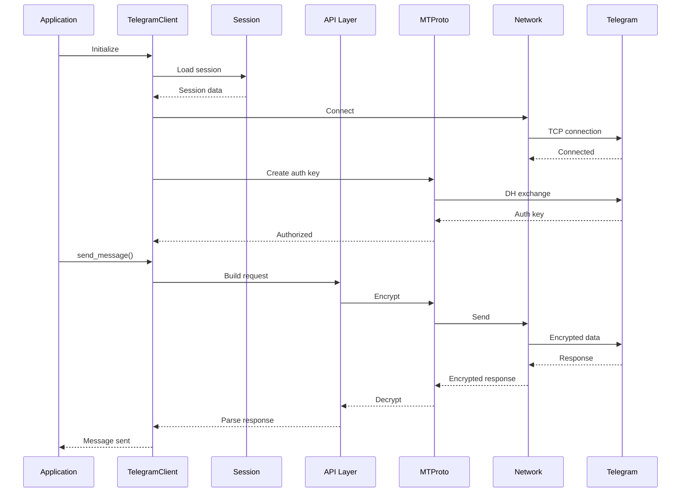

## Layer Architecture

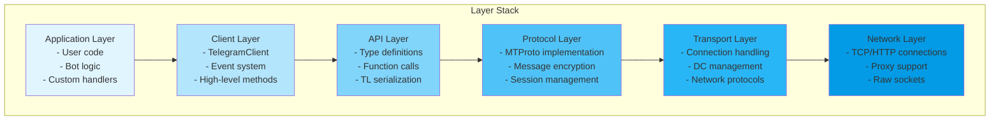

## Data Flow

```mermaid
graph LR
    subgraph "Outgoing Flow"
        A1[User Action] --> A2[Method Call]
        A2 --> A3[Build TL Request]
        A3 --> A4[Serialize]
        A4 --> A5[Encrypt]
        A5 --> A6[Add Headers]
        A6 --> A7[Send via Network]
    end
    
    subgraph "Incoming Flow"
        B7[Receive from Network] --> B6[Extract Headers]
        B6 --> B5[Decrypt]
        B5 --> B4[Deserialize]
        B4 --> B3[Parse TL Response]
        B3 --> B2[Process Updates]
        B2 --> B1[Trigger Events]
    end
    
    A7 -.-> B7
```

## Core Components

### Client Architecture

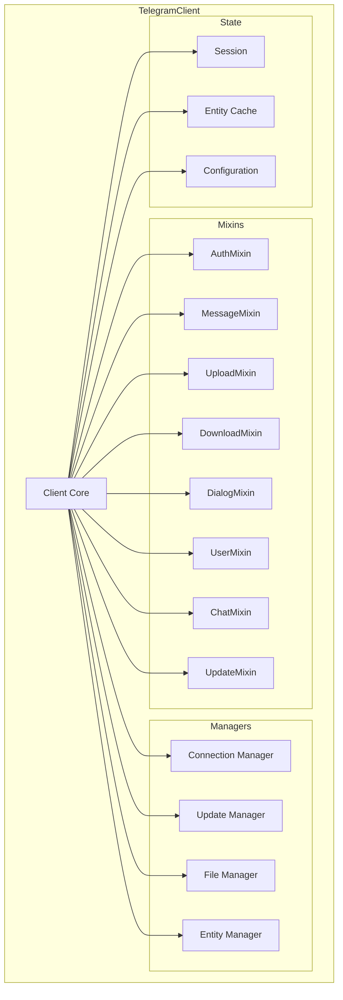

### Session Management

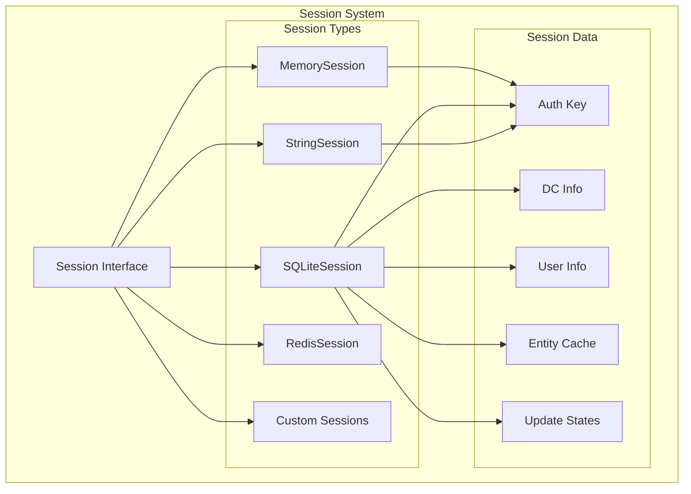

## Request Lifecycle

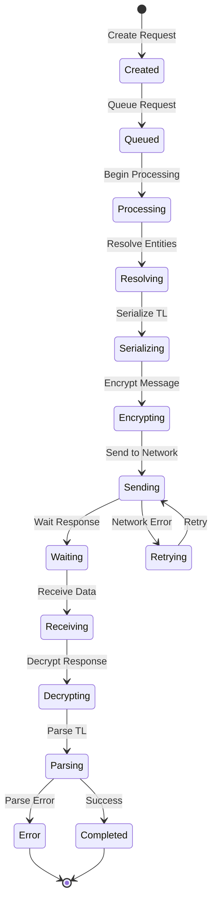

## Event System Flow

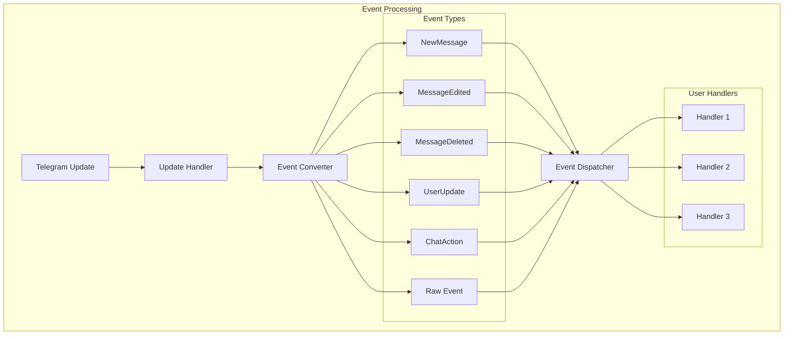

## Connection Management

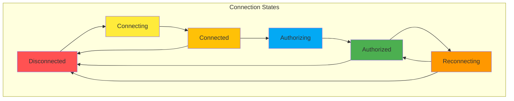

## Multi-DC Architecture

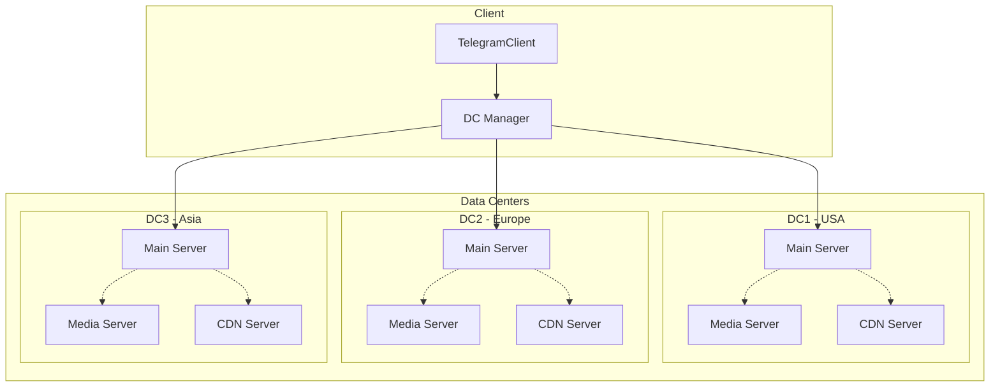

## Security Architecture

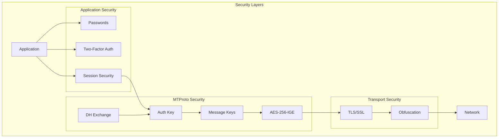

## Performance Architecture

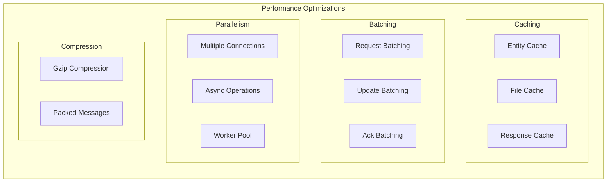

## Error Handling Flow

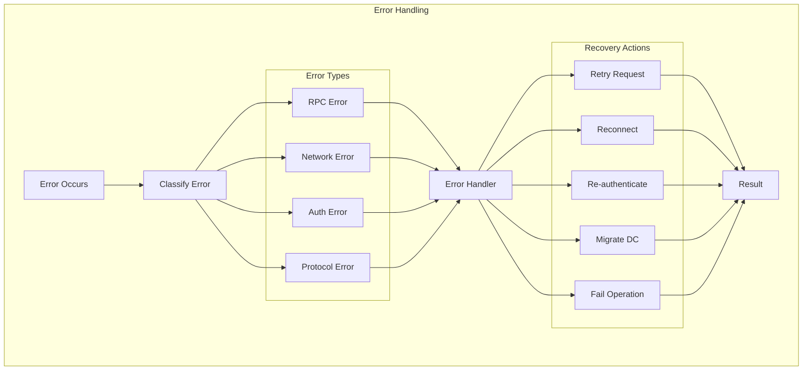

## Module Dependencies

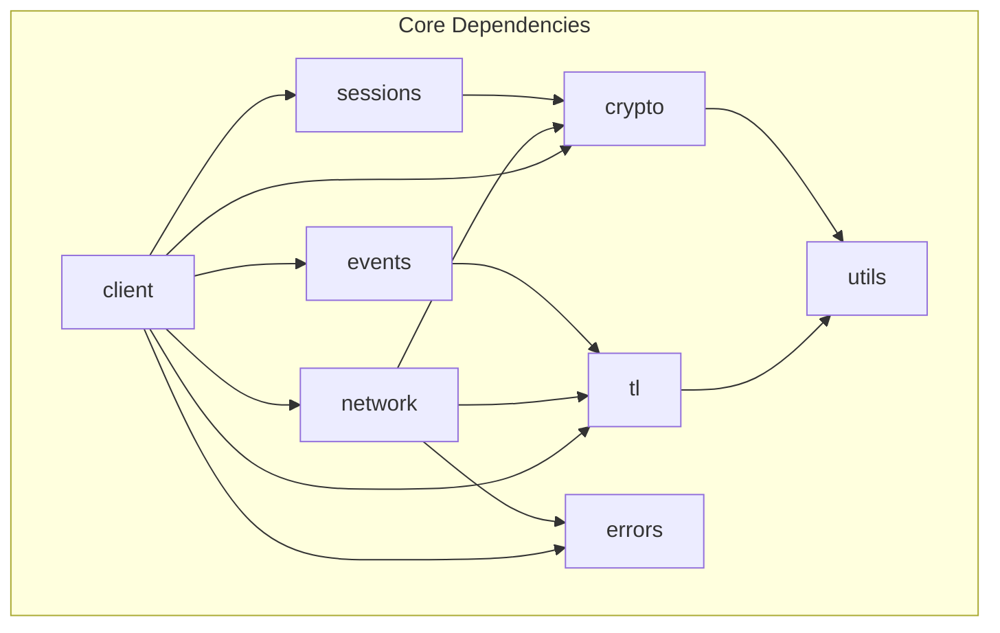

## Deployment Architecture

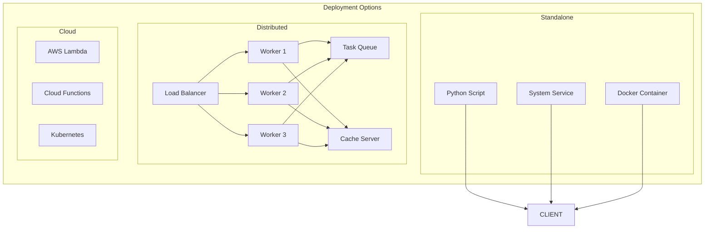

## Next Steps

- Continue to [Client Structure](client-structure.md) for detailed client architecture
- See [Network Flow](network-flow.md) for network communication details
- Review [Event Flow](event-flow.md) for event system visualization

---
**Navigation:** [← Diagrams](README.md) | [Home](../index.md) | [Up](../index.md) | [Client Structure →](client-structure.md)

---