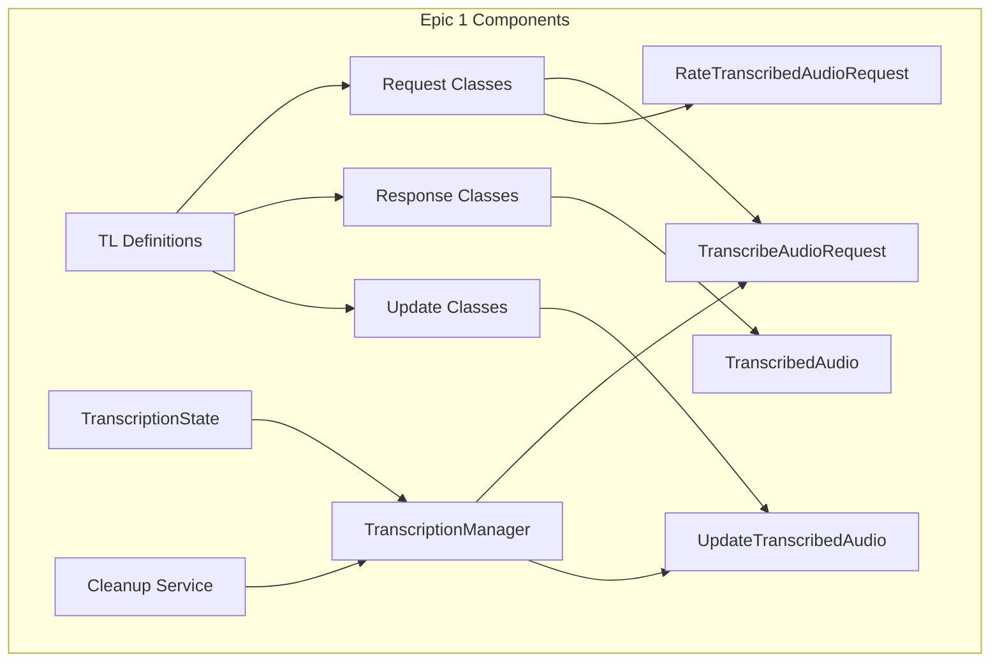

# Epic 1: Core Infrastructure & Raw API Support - Detailed Analysis

---
**Navigation:** [← Scrum Epics](scrum-epics.md) | [Home](../../index.md) | [Epic 2 Analysis →](epic2-analysis.md)

---

## Epic Overview

**Epic**: Core Infrastructure & Raw API Support  
**Priority**: Critical  
**Sprint**: 1  
**Story Points**: 13  
**Duration**: 2 weeks  

### Goal
Establish the foundational infrastructure for voice transcription functionality by implementing raw MTProto API support and basic state management.

## Detailed Analysis

### Current State Analysis

#### Existing Telethon Infrastructure
- ✅ MTProto protocol implementation exists
- ✅ TL schema system and code generation
- ✅ Request/response handling framework
- ✅ Update system for real-time events
- ✅ Session management for state persistence

#### Missing Components
- ❌ Transcription-specific TL definitions
- ❌ TranscribeAudioRequest implementation
- ❌ RateTranscribedAudioRequest implementation
- ❌ UpdateTranscribedAudio handler
- ❌ Transcription state management
- ❌ Concurrent transcription tracking

### Technical Requirements Analysis

#### 1. TL Schema Integration
```python
# Required TL definitions (from api.tl):
messages.transcribeAudio#269e9a49 peer:InputPeer msg_id:int = messages.TranscribedAudio;
messages.rateTranscribedAudio#7f1d072f peer:InputPeer msg_id:int transcription_id:long good:Bool = Bool;
updateTranscribedAudio#84cd5a flags:# pending:flags.0?true peer:Peer msg_id:int transcription_id:long text:string = Update;
messages.transcribedAudio#cfb9d957 flags:# pending:flags.0?true transcription_id:long text:string trial_remains_num:flags.1?int trial_remains_until_date:flags.1?int = messages.TranscribedAudio;
```

#### 2. Core Components Architecture


#### 3. State Management Requirements
- Track active transcriptions by unique key (peer_id:msg_id)
- Handle transcription lifecycle (pending → complete)
- Manage concurrent transcription requests
- Implement automatic cleanup of completed transcriptions
- Persist critical state across client restarts

## User Stories

### User Story 1.1: TL Schema Definitions
**As a** developer  
**I want** the MTProto transcription methods to be available as TL classes  
**So that** I can make raw API calls for voice transcription  

#### Acceptance Criteria
- [ ] `TranscribeAudioRequest` class exists and can be imported
- [ ] `RateTranscribedAudioRequest` class exists and can be imported
- [ ] `UpdateTranscribedAudio` class exists for handling updates
- [ ] `TranscribedAudio` response class exists
- [ ] All classes have correct field definitions matching TL schema
- [ ] Classes integrate with existing TL framework (serialization/deserialization)

#### Tasks
- [ ] Update TL schema files with transcription definitions
- [ ] Regenerate TL classes using existing code generation
- [ ] Verify class inheritance and structure
- [ ] Test serialization/deserialization

#### Definition of Done
- TL classes are generated and importable
- All field types match MTProto specification
- Serialization round-trip tests pass
- No breaking changes to existing TL system

---

### User Story 1.2: Basic Request Implementation
**As a** developer  
**I want** to send transcription requests using raw API  
**So that** I can initiate voice message transcription  

#### Acceptance Criteria
- [ ] Can create and send `TranscribeAudioRequest` successfully
- [ ] Request includes correct peer and message_id parameters
- [ ] Response returns `TranscribedAudio` object with correct fields
- [ ] Can handle both pending and completed transcription states
- [ ] Proper error handling for invalid requests

#### Tasks
- [ ] Implement request creation and validation
- [ ] Add parameter type checking (InputPeer, int)
- [ ] Implement response parsing
- [ ] Add error handling for common failure cases
- [ ] Create basic integration test

#### Example Usage
```python
from telethon.tl.functions.messages import TranscribeAudioRequest

# Create request
request = TranscribeAudioRequest(
    peer=await client.get_input_entity(chat),
    msg_id=message_id
)

# Send request
result = await client(request)

# Handle response
if result.pending:
    print(f"Transcription started: {result.transcription_id}")
else:
    print(f"Transcription complete: {result.text}")
```

#### Definition of Done
- Request can be created with valid parameters
- API call succeeds and returns expected response
- Error cases are handled gracefully
- Integration test demonstrates usage

---

### User Story 1.3: Update Handling System
**As a** developer  
**I want** to receive real-time transcription updates  
**So that** I can track transcription progress  

#### Acceptance Criteria
- [ ] `UpdateTranscribedAudio` updates are received correctly
- [ ] Update contains all required fields (peer, msg_id, transcription_id, text, pending)
- [ ] Can register handlers for transcription updates
- [ ] Updates are processed in correct order
- [ ] No updates are lost or duplicated

#### Tasks
- [ ] Implement update class definition
- [ ] Add update handler registration
- [ ] Integrate with existing update system
- [ ] Add update validation and parsing
- [ ] Create update processing tests

#### Example Usage
```python
from telethon.tl.types import UpdateTranscribedAudio

@client.on(events.Raw(UpdateTranscribedAudio))
async def transcription_handler(event):
    update = event.update
    print(f"Transcription update: {update.text}")
    if not update.pending:
        print("Transcription complete!")
```

#### Definition of Done
- Updates are received and parsed correctly
- Handler registration works with existing event system
- Update fields match MTProto specification
- No interference with other update types

---

### User Story 1.4: Transcription State Management
**As a** system  
**I need** to track active transcription states  
**So that** I can manage concurrent transcriptions efficiently  

#### Acceptance Criteria
- [ ] `TranscriptionState` class tracks all necessary information
- [ ] Unique identification using peer_id and msg_id combination
- [ ] State updates correctly from initial request and subsequent updates
- [ ] Thread-safe for concurrent access
- [ ] Memory efficient for many concurrent transcriptions

#### Tasks
- [ ] Design `TranscriptionState` data structure
- [ ] Implement state storage mechanism (in-memory)
- [ ] Add state lookup and update methods
- [ ] Implement thread-safety mechanisms
- [ ] Add state validation and consistency checks

#### Data Structure
```python
@dataclass
class TranscriptionState:
    peer_id: int
    msg_id: int
    transcription_id: int
    text: str
    pending: bool
    created_at: datetime
    last_update: datetime
    trial_remains: Optional[int] = None
    trial_expires: Optional[datetime] = None
```

#### Definition of Done
- State object contains all required fields
- State can be created, updated, and retrieved efficiently
- Thread-safe operations for concurrent access
- Memory usage is reasonable for 100+ concurrent transcriptions

---

### User Story 1.5: Basic Transcription Manager
**As a** developer  
**I want** a manager class to coordinate transcription operations  
**So that** I can handle multiple transcriptions without manual state tracking  

#### Acceptance Criteria
- [ ] `TranscriptionManager` class provides clean API
- [ ] Handles request creation and state tracking automatically
- [ ] Processes updates and maintains state consistency
- [ ] Supports concurrent transcription requests
- [ ] Provides methods to query transcription status

#### Tasks
- [ ] Design `TranscriptionManager` class interface
- [ ] Implement request handling with automatic state creation
- [ ] Add update processing and state updates
- [ ] Implement transcription status queries
- [ ] Add concurrent request handling

#### Example Usage
```python
manager = TranscriptionManager(client)

# Start transcription
state = await manager.request_transcription(peer, msg_id)

# Check status
current_state = manager.get_transcription_state(peer, msg_id)

# The manager handles updates automatically
```

#### Definition of Done
- Manager provides intuitive API for transcription operations
- Handles multiple concurrent transcriptions correctly
- State is updated automatically from server responses
- Status queries return accurate information

---

### User Story 1.6: Automatic Cleanup System
**As a** system  
**I need** to clean up completed transcriptions automatically  
**So that** memory usage doesn't grow indefinitely  

#### Acceptance Criteria
- [ ] Completed transcriptions are removed after configurable TTL
- [ ] Cleanup runs automatically without manual intervention
- [ ] Cleanup doesn't interfere with active transcriptions
- [ ] Memory usage remains stable under load
- [ ] Cleanup is configurable and can be disabled

#### Tasks
- [ ] Implement automatic cleanup mechanism
- [ ] Add configurable TTL for completed transcriptions
- [ ] Create background cleanup task
- [ ] Add cleanup configuration options
- [ ] Implement cleanup metrics and monitoring

#### Configuration
```python
cleanup_config = {
    'enabled': True,
    'completed_ttl_seconds': 3600,  # 1 hour
    'cleanup_interval_seconds': 300,  # 5 minutes
    'max_cleanup_batch_size': 100
}
```

#### Definition of Done
- Cleanup runs automatically in background
- Memory usage is stable during long-running sessions
- Cleanup is configurable with reasonable defaults
- No impact on active transcription performance

---

### User Story 1.7: Error Handling Framework
**As a** developer  
**I want** proper error handling for transcription operations  
**So that** I can handle failures gracefully  

#### Acceptance Criteria
- [ ] Custom exception types for transcription errors
- [ ] Clear error messages for different failure scenarios
- [ ] Proper error propagation from API calls
- [ ] Error recovery suggestions where applicable
- [ ] Logging of errors for debugging

#### Tasks
- [ ] Define custom exception hierarchy
- [ ] Implement error detection and classification
- [ ] Add error message formatting
- [ ] Create error recovery mechanisms
- [ ] Add comprehensive error logging

#### Exception Hierarchy
```python
class TranscriptionError(Exception):
    """Base exception for transcription errors."""

class TranscriptionRequestError(TranscriptionError):
    """Error in transcription request."""

class TranscriptionNotAvailable(TranscriptionError):
    """Transcription not available for this message."""

class TranscriptionTimeout(TranscriptionError):
    """Transcription request timed out."""
```

#### Definition of Done
- Custom exceptions are defined and used consistently
- Error messages are helpful and actionable
- Errors are logged with appropriate detail level
- Error handling doesn't break normal operation flow

---

### User Story 1.8: Basic Testing Infrastructure
**As a** developer  
**I want** comprehensive tests for core functionality  
**So that** I can ensure reliability and catch regressions  

#### Acceptance Criteria
- [ ] Unit tests for all core classes and methods
- [ ] Integration tests for API request/response flow
- [ ] Mock tests for update handling
- [ ] Performance tests for concurrent operations
- [ ] Test coverage > 90% for Epic 1 code

#### Tasks
- [ ] Create unit test suite for core classes
- [ ] Implement mock servers for integration testing
- [ ] Add performance benchmarks
- [ ] Set up test coverage monitoring
- [ ] Create test data fixtures

#### Test Structure
```
tests/
├── unit/
│   ├── test_transcription_state.py
│   ├── test_transcription_manager.py
│   └── test_error_handling.py
├── integration/
│   ├── test_api_requests.py
│   └── test_update_handling.py
└── performance/
    └── test_concurrent_operations.py
```

#### Definition of Done
- All tests pass consistently
- Test coverage meets 90% threshold
- Integration tests use realistic mock data
- Performance tests validate concurrency requirements

---

## Technical Dependencies

### Internal Dependencies
1. **TL System**: Existing type language framework
2. **Update System**: Current update handling infrastructure
3. **Request System**: MTProto request/response handling
4. **Session System**: For potential state persistence

### External Dependencies
1. **MTProto Protocol**: Telegram's protocol specification
2. **Python asyncio**: For async operation support
3. **Threading**: For thread-safe operations

## Risk Analysis

### High Risk
1. **TL Schema Changes**: Telegram might update transcription API
   - *Mitigation*: Version lock and monitor API changes

2. **Update Ordering**: Updates might arrive out of order
   - *Mitigation*: Implement sequence validation

### Medium Risk
1. **Memory Usage**: State tracking for many transcriptions
   - *Mitigation*: Implement aggressive cleanup and monitoring

2. **Thread Safety**: Concurrent access to shared state
   - *Mitigation*: Use proper locking mechanisms

### Low Risk
1. **API Rate Limits**: Transcription requests might be rate limited
   - *Mitigation*: Implement request queuing (future epic)

## Success Metrics

### Functional Metrics
- [ ] All TL classes generated successfully
- [ ] 100% success rate for valid transcription requests
- [ ] Zero update loss during normal operation
- [ ] State consistency maintained across all operations

### Performance Metrics
- [ ] Request processing time < 50ms (excluding network)
- [ ] Support for 100+ concurrent transcriptions
- [ ] Memory usage < 1MB for 1000 completed transcriptions
- [ ] Update processing time < 10ms per update

### Quality Metrics
- [ ] Test coverage > 90%
- [ ] Zero critical bugs in core functionality
- [ ] API matches MTProto specification exactly
- [ ] Documentation covers all public interfaces

## Implementation Order

1. **Week 1, Day 1-2**: TL Schema definitions and class generation
2. **Week 1, Day 3-4**: Basic request implementation and testing
3. **Week 1, Day 5**: Update handling system
4. **Week 2, Day 1-2**: State management and transcription manager
5. **Week 2, Day 3**: Cleanup system and error handling
6. **Week 2, Day 4-5**: Testing infrastructure and documentation

## Transition to Epic 2

Epic 1 provides the foundation that Epic 2 will build upon:
- **State management** will be extended with user quota tracking
- **Error handling** will be enhanced with user-specific errors
- **Manager class** will gain user type awareness

The interface designed in Epic 1 should be generic enough to support Epic 2's user type differentiation without breaking changes.

---
**Navigation:** [← Scrum Epics](scrum-epics.md) | [Home](../../index.md) | [Epic 2 Analysis →](epic2-analysis.md)

---