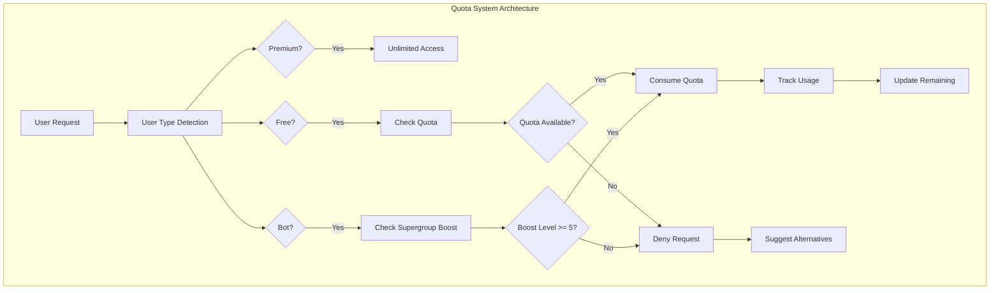

# Epic 2: User Type Management & Quota System - Detailed Analysis

---
**Navigation:** [← Epic 1 Analysis](epic1-analysis.md) | [Home](../../index.md) | [Epic 3 Analysis →](epic3-analysis.md)

---

## Epic Overview

**Epic**: User Type Management & Quota System  
**Priority**: Critical  
**Sprint**: 2  
**Story Points**: 21  
**Duration**: 2 weeks  

### Goal
Implement comprehensive user type detection and quota management system to handle different access levels for Free vs Premium users, including quota tracking, consumption, and policy enforcement.

## Detailed Analysis

### Current State Analysis

#### Available from Epic 1
- ✅ Core transcription infrastructure
- ✅ Basic state management
- ✅ Request/response handling
- ✅ Update processing system
- ✅ Error handling framework

#### New Requirements for Epic 2
- ❌ User type detection (Free/Premium/Bot)
- ❌ Quota tracking and management
- ❌ Policy engine for different user types
- ❌ Quota consumption and restoration
- ❌ Usage prediction and warnings
- ❌ Premium upgrade suggestions

### Business Logic Analysis

#### User Type Categories
1. **Premium Users**
   - Unlimited transcriptions
   - No duration limits
   - Higher priority processing
   - Enhanced features

2. **Free Users**
   - Limited weekly quota (5-10 transcriptions)
   - 60-second duration limit
   - Standard priority
   - Upgrade prompts

3. **Bot Accounts**
   - Special handling required
   - Supergroup boost integration
   - Different quota rules

#### Quota Management Complexity


## User Stories

### User Story 2.1: User Type Detection System
**As a** system  
**I need** to accurately detect user types (Free/Premium/Bot)  
**So that** I can apply appropriate transcription policies  

#### Acceptance Criteria
- [ ] Detects Premium status for the current user correctly
- [ ] Handles Free user detection with appropriate fallbacks
- [ ] Identifies Bot accounts accurately
- [ ] Caches user type information to reduce API calls
- [ ] Updates cache when user status changes
- [ ] Handles edge cases (suspended accounts, etc.)

#### Tasks
- [ ] Implement user type detection logic
- [ ] Create caching mechanism with TTL
- [ ] Add Premium status verification
- [ ] Implement Bot account detection
- [ ] Add cache invalidation triggers
- [ ] Create fallback mechanisms for API failures

#### Implementation Details
```python
class UserTypeDetector:
    def __init__(self, client: TelegramClient):
        self._client = client
        self._cache: Dict[int, UserTypeInfo] = {}
        self._cache_ttl = timedelta(hours=1)
    
    async def get_user_type(self, user_id: int) -> UserType:
        """Detect user type with caching."""
        # Check cache first
        if self._is_cached_and_valid(user_id):
            return self._cache[user_id].user_type
        
        # Fetch fresh data
        user_type = await self._detect_user_type(user_id)
        self._cache[user_id] = UserTypeInfo(
            user_type=user_type,
            cached_at=datetime.now()
        )
        return user_type
```

#### Definition of Done
- User type detection accuracy > 99%
- Cache hit rate > 80% for repeated requests
- Detection time < 100ms when cached
- Handles all edge cases gracefully

---

### User Story 2.2: Quota Tracking Infrastructure
**As a** system  
**I need** to track transcription quotas for each user  
**So that** I can enforce usage limits for Free users  

#### Acceptance Criteria
- [ ] Tracks remaining quota for each Free user
- [ ] Stores quota reset dates accurately
- [ ] Handles quota consumption atomically
- [ ] Supports quota restoration on failures
- [ ] Persists quota data across client restarts
- [ ] Syncs with server-provided quota information

#### Tasks
- [ ] Design quota data structure
- [ ] Implement quota storage mechanism
- [ ] Add atomic quota operations
- [ ] Create quota persistence layer
- [ ] Implement server sync mechanism
- [ ] Add quota validation and constraints

#### Data Structure
```python
@dataclass
class UserQuota:
    user_id: int
    user_type: UserType
    remaining: Optional[int]  # None for unlimited
    total_weekly: Optional[int]
    reset_date: Optional[datetime]
    used_this_week: int = 0
    last_sync: datetime = field(default_factory=datetime.now)
    
    def can_consume(self, amount: int = 1) -> bool:
        """Check if quota allows consumption."""
        if self.user_type == UserType.PREMIUM:
            return True
        return self.remaining is not None and self.remaining >= amount
    
    def consume(self, amount: int = 1) -> bool:
        """Atomically consume quota if available."""
        if not self.can_consume(amount):
            return False
        if self.remaining is not None:
            self.remaining -= amount
        self.used_this_week += amount
        return True
```

#### Definition of Done
- Quota operations are atomic and thread-safe
- Data persists across client restarts
- Server sync maintains data consistency
- Supports quota rollback on operation failures

---

### User Story 2.3: Policy Engine Implementation
**As a** system  
**I need** configurable policies for different user types  
**So that** I can enforce appropriate limits and behaviors  

#### Acceptance Criteria
- [ ] Defines clear policies for each user type
- [ ] Supports configurable policy parameters
- [ ] Enforces rate limits per user type
- [ ] Handles duration limits for Free users
- [ ] Manages priority levels for request processing
- [ ] Allows policy updates without code changes

#### Tasks
- [ ] Design policy configuration system
- [ ] Implement policy evaluation engine
- [ ] Add rate limiting enforcement
- [ ] Create duration limit validation
- [ ] Implement priority queue management
- [ ] Add policy configuration loading

#### Policy Configuration
```python
@dataclass
class TranscriptionPolicy:
    user_type: UserType
    max_duration_seconds: Optional[int]
    rate_limit_per_minute: int
    priority_level: int  # Higher = more priority
    requires_quota: bool
    cache_results: bool
    fallback_strategies: List[str]

# Default policies
POLICIES = {
    UserType.PREMIUM: TranscriptionPolicy(
        user_type=UserType.PREMIUM,
        max_duration_seconds=None,  # Unlimited
        rate_limit_per_minute=30,
        priority_level=100,
        requires_quota=False,
        cache_results=True,
        fallback_strategies=[]
    ),
    UserType.FREE: TranscriptionPolicy(
        user_type=UserType.FREE,
        max_duration_seconds=60,
        rate_limit_per_minute=2,
        priority_level=50,
        requires_quota=True,
        cache_results=True,
        fallback_strategies=["suggest_premium", "external_stt"]
    )
}
```

#### Definition of Done
- Policies are enforced consistently across all operations
- Configuration changes take effect without restart
- Rate limiting prevents abuse
- Duration limits are validated before transcription

---

### User Story 2.4: Quota Consumption Management
**As a** Free user  
**I want** my quota to be consumed only for successful transcriptions  
**So that** I don't lose quota on failed attempts  

#### Acceptance Criteria
- [ ] Quota is consumed only after successful request initiation
- [ ] Failed requests don't consume quota
- [ ] Quota is restored if transcription fails server-side
- [ ] Partial failures are handled appropriately
- [ ] Quota changes are logged for debugging
- [ ] User is notified of quota consumption

#### Tasks
- [ ] Implement transactional quota consumption
- [ ] Add quota restoration mechanisms
- [ ] Create quota change logging
- [ ] Implement failure detection and rollback
- [ ] Add quota consumption notifications
- [ ] Create quota audit trail

#### Consumption Flow
```python
class QuotaManager:
    async def consume_quota_for_transcription(
        self, user_id: int, request_context: RequestContext
    ) -> QuotaTransaction:
        """Consume quota with transaction support."""
        
        # Start transaction
        transaction = QuotaTransaction(user_id, amount=1)
        
        try:
            # Check and consume quota
            if not await self._consume_quota(user_id, 1):
                raise QuotaExhaustedError("No quota remaining")
            
            # Mark transaction as committed
            transaction.commit()
            
            # Log consumption
            self._log_quota_consumption(user_id, transaction)
            
            return transaction
            
        except Exception as e:
            # Rollback on any failure
            await transaction.rollback()
            raise
```

#### Definition of Done
- Quota consumption is transactional and reliable
- Failed operations don't consume quota
- All quota changes are audited
- Users receive appropriate notifications

---

### User Story 2.5: Usage Prediction and Warnings
**As a** Free user  
**I want** to be warned when my quota is running low  
**So that** I can manage my usage effectively  

#### Acceptance Criteria
- [ ] Warns users when quota drops below threshold (20%)
- [ ] Predicts when quota will be exhausted based on usage patterns
- [ ] Provides quota reset information
- [ ] Suggests usage optimization strategies
- [ ] Offers Premium upgrade prompts at appropriate times
- [ ] Tracks prediction accuracy for improvements

#### Tasks
- [ ] Implement quota threshold monitoring
- [ ] Create usage pattern analysis
- [ ] Add prediction algorithms
- [ ] Design warning notification system
- [ ] Create upgrade suggestion logic
- [ ] Implement prediction accuracy tracking

#### Prediction Algorithm
```python
class QuotaPrediction:
    def __init__(self):
        self._usage_history: Dict[int, List[UsageEvent]] = {}
    
    def predict_exhaustion(self, user_id: int, current_quota: int) -> Optional[datetime]:
        """Predict when user will exhaust quota."""
        history = self._get_recent_usage(user_id, days=7)
        
        if len(history) < 3:
            return None  # Insufficient data
        
        # Calculate average usage rate
        daily_avg = sum(day.count for day in history) / len(history)
        
        if daily_avg <= 0:
            return None  # No usage pattern
        
        # Predict exhaustion
        days_remaining = current_quota / daily_avg
        return datetime.now() + timedelta(days=days_remaining)
```

#### Definition of Done
- Warnings are timely and helpful
- Predictions are reasonably accurate (±20%)
- Users can make informed decisions about usage
- Upgrade suggestions are non-intrusive but effective

---

### User Story 2.6: Premium User Experience
**As a** Premium user  
**I want** unlimited transcriptions with enhanced features  
**So that** I get value from my Premium subscription  

#### Acceptance Criteria
- [ ] Premium users have unlimited transcription access
- [ ] No duration limits for Premium users
- [ ] Higher priority processing for Premium requests
- [ ] Enhanced features (batch processing, etc.)
- [ ] Clear indication of Premium status and benefits
- [ ] Faster response times compared to Free users

#### Tasks
- [ ] Implement unlimited access for Premium users
- [ ] Remove duration restrictions for Premium
- [ ] Add priority queue for Premium requests
- [ ] Implement Premium-only features
- [ ] Add Premium status indicators
- [ ] Optimize processing for Premium users

#### Premium Features
```python
class PremiumTranscriptionFeatures:
    def __init__(self, manager: TranscriptionManager):
        self._manager = manager
    
    async def batch_transcribe(
        self, user_id: int, messages: List[Message]
    ) -> List[TranscriptionResult]:
        """Premium-only batch transcription."""
        if not await self._is_premium_user(user_id):
            raise PremiumRequiredError("Batch transcription requires Premium")
        
        # Process all messages concurrently
        tasks = [
            self._manager.transcribe_message(msg, priority=100)
            for msg in messages
        ]
        
        return await asyncio.gather(*tasks)
```

#### Definition of Done
- Premium users experience significantly better service
- All Premium features work reliably
- Premium benefits are clearly communicated
- Performance metrics show improved experience

---

### User Story 2.7: Error Handling and User Feedback
**As a** user  
**I want** clear error messages and suggestions when transcription fails  
**So that** I understand what went wrong and what I can do about it  

#### Acceptance Criteria
- [ ] Error messages are user-friendly and actionable
- [ ] Quota-related errors include helpful suggestions
- [ ] Premium upgrade prompts are contextually appropriate
- [ ] Error messages are localized appropriately
- [ ] Fallback options are suggested when available
- [ ] Error recovery guidance is provided

#### Tasks
- [ ] Design user-friendly error message system
- [ ] Implement contextual error responses
- [ ] Add quota-specific error handling
- [ ] Create Premium upgrade suggestion logic
- [ ] Implement error message localization
- [ ] Add fallback option suggestions

#### Error Message Examples
```python
class TranscriptionErrorMessages:
    @staticmethod
    def quota_exhausted(quota_info: UserQuota) -> str:
        reset_date = quota_info.reset_date.strftime("%A, %B %d")
        return (
            f"❌ **Transcription Quota Exhausted**\n\n"
            f"You've used all {quota_info.total_weekly} transcriptions this week.\n"
            f"Quota resets on: {reset_date}\n\n"
            f"💎 **Upgrade to Premium** for unlimited transcriptions!\n"
            f"🔄 **Or try again** after the reset date."
        )
    
    @staticmethod
    def duration_exceeded(duration: int, max_duration: int) -> str:
        return (
            f"⏱️ **Voice Message Too Long**\n\n"
            f"Message duration: {duration}s\n"
            f"Free user limit: {max_duration}s\n\n"
            f"💎 **Premium users** have no duration limits!\n"
            f"✂️ **Try splitting** the message into shorter parts."
        )
```

#### Definition of Done
- Error messages help users understand and resolve issues
- Upgrade suggestions lead to measurable conversion
- Users can successfully recover from common errors
- Error handling doesn't frustrate users

---

### User Story 2.8: Integration with Epic 1 Infrastructure
**As a** developer  
**I want** Epic 2 to seamlessly integrate with Epic 1 components  
**So that** the system works as a cohesive whole  

#### Acceptance Criteria
- [ ] User type management integrates with TranscriptionManager
- [ ] Quota checks happen before request processing
- [ ] Policy enforcement works with existing error handling
- [ ] State management includes user-specific information
- [ ] No breaking changes to Epic 1 interfaces
- [ ] Performance impact is minimal

#### Tasks
- [ ] Extend TranscriptionManager with user awareness
- [ ] Integrate quota checks into request flow
- [ ] Add user-specific state tracking
- [ ] Update error handling for user-specific errors
- [ ] Ensure backward compatibility
- [ ] Optimize performance for user type operations

#### Integration Architecture
```python
class EnhancedTranscriptionManager(TranscriptionManager):
    def __init__(self, client: TelegramClient):
        super().__init__(client)
        self._user_manager = UserTypeManager(client)
        self._quota_manager = QuotaManager()
        self._policy_engine = PolicyEngine()
    
    async def request_transcription(
        self, peer: InputPeer, msg_id: int, user_id: int
    ) -> TranscriptionResult:
        """Enhanced transcription with user type awareness."""
        
        # Get user type and policy
        user_type = await self._user_manager.get_user_type(user_id)
        policy = self._policy_engine.get_policy(user_type)
        
        # Check quota if required
        if policy.requires_quota:
            if not await self._quota_manager.can_consume(user_id):
                raise QuotaExhaustedError()
        
        # Apply policy constraints
        await self._validate_against_policy(peer, msg_id, policy)
        
        # Consume quota and proceed
        transaction = await self._quota_manager.consume_quota(user_id)
        
        try:
            # Use parent class implementation
            result = await super().request_transcription(peer, msg_id)
            transaction.commit()
            return result
        except Exception as e:
            await transaction.rollback()
            raise
```

#### Definition of Done
- Epic 2 functionality is fully integrated with Epic 1
- No regression in Epic 1 functionality
- User type awareness is consistent throughout
- Performance impact is under 10% for common operations

---

## Technical Dependencies

### Internal Dependencies
1. **Epic 1 Infrastructure**: All components from Epic 1
2. **User Entity System**: For user information retrieval
3. **Session System**: For quota persistence
4. **Configuration System**: For policy management

### External Dependencies
1. **Telegram User API**: For Premium status detection
2. **Python Threading**: For thread-safe quota operations
3. **Database/Storage**: For quota persistence (SQLite/memory)

## Risk Analysis

### High Risk
1. **Premium Detection Accuracy**: False positives/negatives affect user experience
   - *Mitigation*: Multiple verification methods, fallback to Free

2. **Quota Synchronization**: Client/server quota inconsistencies
   - *Mitigation*: Server-authoritative with local caching

### Medium Risk
1. **Race Conditions**: Concurrent quota modifications
   - *Mitigation*: Atomic operations and proper locking

2. **Cache Staleness**: Outdated user type information
   - *Mitigation*: Aggressive cache invalidation triggers

### Low Risk
1. **Policy Changes**: Business rule modifications
   - *Mitigation*: Configuration-driven policies

## Success Metrics

### Functional Metrics
- [ ] User type detection accuracy > 99%
- [ ] Zero quota over-consumption incidents
- [ ] 100% Premium user satisfaction with unlimited access
- [ ] Policy enforcement accuracy > 99.9%

### Performance Metrics
- [ ] User type detection time < 100ms (cached)
- [ ] Quota operations time < 50ms
- [ ] Policy evaluation time < 10ms
- [ ] Memory overhead < 1MB per 1000 users

### User Experience Metrics
- [ ] Error message helpfulness rating > 4.5/5
- [ ] Premium conversion rate > 5% from quota warnings
- [ ] User satisfaction with quota transparency > 4.0/5

## Implementation Order

1. **Week 1, Day 1-2**: User type detection and caching
2. **Week 1, Day 3-4**: Quota tracking infrastructure
3. **Week 1, Day 5**: Policy engine implementation
4. **Week 2, Day 1-2**: Quota consumption and management
5. **Week 2, Day 3**: Usage prediction and warnings
6. **Week 2, Day 4**: Premium features and error handling
7. **Week 2, Day 5**: Integration testing and optimization

## Transition to Epic 3

Epic 2 provides the user-aware foundation that Epic 3 will enhance:
- **User type awareness** will be exposed in high-level APIs
- **Quota information** will be included in user-facing responses
- **Policy enforcement** will be integrated into friendly methods

The interfaces should be designed to support Epic 3's high-level API without requiring significant changes to Epic 2 components.

---
**Navigation:** [← Epic 1 Analysis](epic1-analysis.md) | [Home](../../index.md) | [Epic 3 Analysis →](epic3-analysis.md)

---