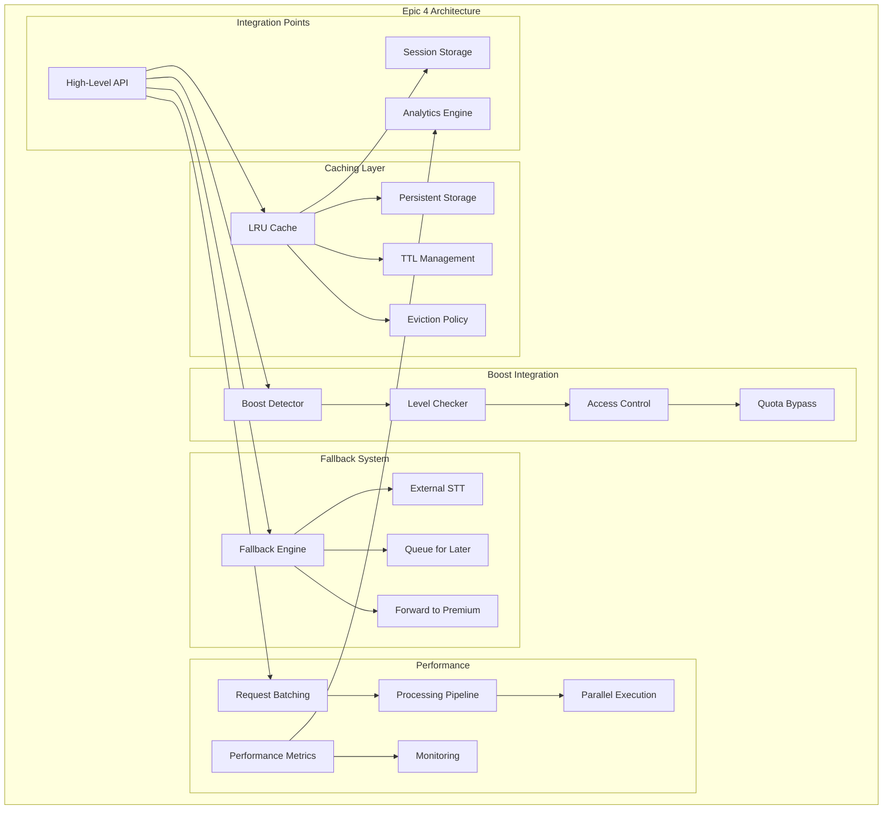

# Epic 4: Advanced Features & Optimization - Detailed Analysis

---
**Navigation:** [← Epic 3 Analysis](epic3-analysis.md) | [Home](../../index.md) | [Epic 5 Analysis →](epic5-analysis.md)

---

## Epic Overview

**Epic**: Advanced Features & Optimization  
**Priority**: Medium  
**Sprint**: 4  
**Story Points**: 21  
**Duration**: 2 weeks  

### Goal
Implement advanced features including intelligent caching, supergroup boost integration, fallback strategies, and performance optimizations to provide a production-ready, scalable transcription system.

## Detailed Analysis

### Current State Analysis

#### Available from Previous Epics
- ✅ Complete core infrastructure (Epic 1)
- ✅ User type management and quota system (Epic 2)
- ✅ High-level API with event system (Epic 3)
- ✅ Comprehensive error handling
- ✅ Basic transcription functionality working end-to-end

#### New Requirements for Epic 4
- ❌ Intelligent caching system
- ❌ Supergroup boost level integration
- ❌ External STT fallback mechanisms
- ❌ Request batching optimization
- ❌ Memory usage optimization
- ❌ Performance monitoring and metrics

### Advanced Features Architecture



## User Stories

### User Story 4.1: Intelligent Caching System
**As a** user  
**I want** transcriptions to be cached intelligently  
**So that** I don't waste quota on repeated requests and get faster responses  

#### Acceptance Criteria
- [ ] Completed transcriptions are cached automatically
- [ ] Cache hit rate > 80% for repeated requests
- [ ] Cache respects user privacy settings
- [ ] Cache size is configurable and self-managing
- [ ] Cache survives client restarts (optional)
- [ ] Cache eviction is intelligent (LRU with considerations)

#### Tasks
- [ ] Design multi-level caching architecture
- [ ] Implement LRU cache with intelligent eviction
- [ ] Add configurable persistence layer
- [ ] Create cache key generation strategy
- [ ] Implement cache size management
- [ ] Add cache analytics and monitoring

#### Cache Architecture
```python
class TranscriptionCache:
    """Multi-level caching system for transcriptions."""
    
    def __init__(self, config: CacheConfig):
        self._memory_cache = LRUCache(config.memory_size)
        self._persistent_cache = PersistentCache(config.db_path) if config.persist else None
        self._config = config
        
        # Cache analytics
        self._hits = 0
        self._misses = 0
        self._evictions = 0
    
    async def get(self, cache_key: str) -> Optional[CachedTranscription]:
        """Get transcription from cache."""
        # Try memory cache first
        result = self._memory_cache.get(cache_key)
        if result:
            self._hits += 1
            return result
        
        # Try persistent cache
        if self._persistent_cache:
            result = await self._persistent_cache.get(cache_key)
            if result and not result.is_expired():
                # Promote to memory cache
                self._memory_cache.put(cache_key, result)
                self._hits += 1
                return result
        
        self._misses += 1
        return None
    
    async def put(self, cache_key: str, transcription: str, 
                  metadata: TranscriptionMetadata):
        """Store transcription in cache."""
        cached_item = CachedTranscription(
            text=transcription,
            metadata=metadata,
            cached_at=datetime.now(),
            access_count=0
        )
        
        # Store in memory cache
        evicted = self._memory_cache.put(cache_key, cached_item)
        if evicted:
            self._evictions += 1
        
        # Store in persistent cache if enabled
        if self._persistent_cache:
            await self._persistent_cache.put(cache_key, cached_item)
    
    def generate_cache_key(self, peer_id: int, msg_id: int, 
                          user_id: int) -> str:
        """Generate cache key for transcription."""
        # Include user_id to prevent cross-user cache leaks
        return f"transcription:{peer_id}:{msg_id}:{user_id}"
    
    @property
    def hit_rate(self) -> float:
        """Calculate cache hit rate."""
        total = self._hits + self._misses
        return self._hits / total if total > 0 else 0.0

@dataclass
class CachedTranscription:
    text: str
    metadata: TranscriptionMetadata
    cached_at: datetime
    access_count: int
    ttl_seconds: int = 3600 * 24  # 24 hours default
    
    def is_expired(self) -> bool:
        """Check if cached item has expired."""
        return datetime.now() - self.cached_at > timedelta(seconds=self.ttl_seconds)
    
    def touch(self):
        """Update access information."""
        self.access_count += 1
```

#### Definition of Done
- Cache hit rate consistently > 80% in typical usage
- Memory usage is bounded and predictable
- Cache persistence works across client restarts
- Cache eviction prevents memory leaks

---

### User Story 4.2: Supergroup Boost Integration
**As a** supergroup member  
**I want** transcription access based on boost level  
**So that** I can use transcription features without Premium when the group has sufficient boosts  

#### Acceptance Criteria
- [ ] Detects supergroup boost level accurately
- [ ] Enables transcription for boost level 5+ for all members
- [ ] Enables transcription for boost level 3+ for admins
- [ ] Caches boost information to reduce API calls
- [ ] Updates boost status when changes occur
- [ ] Provides clear information about boost requirements

#### Tasks
- [ ] Implement boost level detection API
- [ ] Create boost-based access control
- [ ] Add boost information caching
- [ ] Implement boost status monitoring
- [ ] Create boost requirement messaging
- [ ] Add boost analytics tracking

#### Boost Integration
```python
class SupergroupBoostManager:
    """Manages transcription access based on supergroup boost levels."""
    
    def __init__(self, client: TelegramClient):
        self._client = client
        self._boost_cache: Dict[int, BoostInfo] = {}
        self._cache_ttl = timedelta(hours=6)  # Longer TTL for boost info
    
    async def check_boost_transcription_access(
        self, chat_id: int, user_id: int
    ) -> BoostAccessResult:
        """Check if user has transcription access via boost."""
        
        # Get boost information
        boost_info = await self._get_boost_info(chat_id)
        
        if boost_info.level >= 5:
            # Level 5+: Access for all members
            return BoostAccessResult(
                allowed=True,
                reason="supergroup_boost_all_members",
                boost_level=boost_info.level,
                required_level=5
            )
        
        elif boost_info.level >= 3:
            # Level 3+: Access for admins only
            is_admin = await self._is_admin(chat_id, user_id)
            return BoostAccessResult(
                allowed=is_admin,
                reason="supergroup_boost_admins_only" if is_admin else "boost_admin_required",
                boost_level=boost_info.level,
                required_level=3
            )
        
        else:
            # Insufficient boost level
            return BoostAccessResult(
                allowed=False,
                reason="insufficient_boost_level",
                boost_level=boost_info.level,
                required_level=3
            )
    
    async def _get_boost_info(self, chat_id: int) -> BoostInfo:
        """Get supergroup boost information with caching."""
        
        # Check cache
        if chat_id in self._boost_cache:
            info = self._boost_cache[chat_id]
            if datetime.now() - info.checked_at < self._cache_ttl:
                return info
        
        # Fetch fresh boost information
        try:
            # Get channel statistics
            stats = await self._client(GetBroadcastStatsRequest(
                channel=await self._client.get_input_entity(chat_id)
            ))
            
            boost_level = getattr(stats, 'boost_level', 0)
            boost_count = getattr(stats, 'boost_count', 0)
            
        except Exception as e:
            # Fallback to no boost if API fails
            boost_level = 0
            boost_count = 0
            self._logger.warning(f"Failed to get boost info for {chat_id}: {e}")
        
        # Cache the result
        info = BoostInfo(
            chat_id=chat_id,
            level=boost_level,
            count=boost_count,
            checked_at=datetime.now()
        )
        self._boost_cache[chat_id] = info
        
        return info

@dataclass
class BoostAccessResult:
    allowed: bool
    reason: str
    boost_level: int
    required_level: int
    
    def get_user_message(self) -> str:
        """Get user-friendly message about boost access."""
        if self.allowed:
            return f"✨ Transcription enabled via supergroup boost (Level {self.boost_level})"
        
        elif self.reason == "insufficient_boost_level":
            return (
                f"📈 **Boost Required for Transcription**\n"
                f"Current level: {self.boost_level}\n"
                f"Required level: {self.required_level}\n"
                f"Ask admins to boost the group!"
            )
        
        elif self.reason == "boost_admin_required":
            return (
                f"👑 **Admin Access Required**\n"
                f"Group boost level {self.boost_level} enables transcription for admins only.\n"
                f"Need level 5+ for all members."
            )
        
        return "Transcription not available via boost"
```

#### Definition of Done
- Boost level detection is accurate and reliable
- Access control works correctly for different boost levels
- Boost information is cached efficiently
- Users understand boost requirements clearly

---

### User Story 4.3: External STT Fallback System
**As a** user  
**I want** fallback options when Telegram transcription is not available  
**So that** I can still get transcriptions through alternative services  

#### Acceptance Criteria
- [ ] Integrates with external STT services (Google, Azure, etc.)
- [ ] Provides fallback when Telegram STT fails or is unavailable
- [ ] Maintains user privacy for external services
- [ ] Supports multiple fallback providers
- [ ] Provides quality comparison between services
- [ ] Allows user opt-in/opt-out for external services

#### Tasks
- [ ] Design external STT provider interface
- [ ] Implement Google Speech-to-Text integration
- [ ] Add privacy controls for external services
- [ ] Create fallback decision engine
- [ ] Implement quality tracking and comparison
- [ ] Add user consent management

#### External STT Architecture
```python
class ExternalSTTProvider(ABC):
    """Abstract base class for external STT providers."""
    
    @abstractmethod
    async def transcribe(self, audio_data: bytes, 
                        language: str = 'auto') -> STTResult:
        """Transcribe audio using external service."""
        pass
    
    @abstractmethod
    def is_available(self) -> bool:
        """Check if provider is available."""
        pass
    
    @property
    @abstractmethod
    def name(self) -> str:
        """Provider name for logging/analytics."""
        pass

class GoogleSTTProvider(ExternalSTTProvider):
    """Google Speech-to-Text provider."""
    
    def __init__(self, credentials_path: str):
        try:
            from google.cloud import speech
            self._client = speech.SpeechClient.from_service_account_file(credentials_path)
            self._available = True
        except ImportError:
            self._available = False
    
    async def transcribe(self, audio_data: bytes, 
                        language: str = 'auto') -> STTResult:
        """Transcribe using Google Speech-to-Text."""
        if not self._available:
            raise STTProviderUnavailable("Google STT not available")
        
        # Convert audio format if needed
        audio_data = await self._convert_audio_format(audio_data)
        
        # Configure recognition
        config = speech.RecognitionConfig(
            encoding=speech.RecognitionConfig.AudioEncoding.OGG_OPUS,
            sample_rate_hertz=16000,
            language_code=language if language != 'auto' else 'en-US',
            enable_automatic_punctuation=True,
            enable_word_confidence=True
        )
        
        audio = speech.RecognitionAudio(content=audio_data)
        
        # Perform transcription
        response = await self._client.recognize(
            config=config, audio=audio
        )
        
        if not response.results:
            return STTResult(text="", confidence=0.0, provider="google")
        
        # Get best result
        alternative = response.results[0].alternatives[0]
        
        return STTResult(
            text=alternative.transcript,
            confidence=alternative.confidence,
            provider="google",
            word_timings=self._extract_word_timings(response)
        )

class FallbackSTTEngine:
    """Manages fallback between Telegram and external STT services."""
    
    def __init__(self, client: TelegramClient, config: FallbackConfig):
        self._client = client
        self._config = config
        self._providers: List[ExternalSTTProvider] = []
        self._quality_tracker = STTQualityTracker()
        
        # Initialize providers
        if config.google_credentials:
            self._providers.append(GoogleSTTProvider(config.google_credentials))
        
        # Add more providers as needed
    
    async def transcribe_with_fallback(
        self, peer: InputPeer, msg_id: int, user_id: int
    ) -> FallbackTranscriptionResult:
        """Attempt transcription with fallback to external services."""
        
        # Try Telegram STT first
        try:
            result = await self._client.transcribe_voice_message(
                peer, msg_id, timeout=30
            )
            
            return FallbackTranscriptionResult(
                text=result,
                provider="telegram",
                fallback_used=False,
                quality_score=None
            )
            
        except (TranscriptionQuotaExceeded, TranscriptionNotAvailable) as e:
            # Check if user consents to external STT
            if not await self._has_external_stt_consent(user_id):
                raise FallbackNotAvailable("User has not consented to external STT")
            
            # Try external providers
            for provider in self._providers:
                if not provider.is_available():
                    continue
                
                try:
                    # Download audio
                    audio_data = await self._download_voice_message(peer, msg_id)
                    
                    # Transcribe with external provider
                    stt_result = await provider.transcribe(audio_data)
                    
                    # Track quality
                    await self._quality_tracker.record_external_result(
                        provider.name, stt_result
                    )
                    
                    return FallbackTranscriptionResult(
                        text=stt_result.text,
                        provider=provider.name,
                        fallback_used=True,
                        quality_score=stt_result.confidence,
                        original_error=str(e)
                    )
                    
                except Exception as provider_error:
                    # Log and try next provider
                    logger.warning(f"Provider {provider.name} failed: {provider_error}")
                    continue
            
            # All fallbacks failed
            raise FallbackExhausted("All transcription methods failed")
```

#### Definition of Done
- External STT integration works reliably
- Privacy controls are respected
- Fallback decision making is intelligent
- Quality tracking provides useful insights

---

### User Story 4.4: Request Batching Optimization
**As a** system  
**I need** to batch similar requests efficiently  
**So that** I can optimize network usage and improve throughput  

#### Acceptance Criteria
- [ ] Groups similar requests automatically
- [ ] Reduces network round trips by batching
- [ ] Maintains individual request tracking
- [ ] Handles partial batch failures gracefully
- [ ] Configurable batching parameters
- [ ] Provides significant performance improvement

#### Tasks
- [ ] Design request batching system
- [ ] Implement automatic request grouping
- [ ] Add batch size and timing optimization
- [ ] Create partial failure handling
- [ ] Add batching performance metrics
- [ ] Implement configurable batching parameters

#### Batching System
```python
class RequestBatcher:
    """Batches transcription requests for optimal performance."""
    
    def __init__(self, config: BatchingConfig):
        self._config = config
        self._pending_requests: List[BatchedRequest] = []
        self._batch_timer: Optional[asyncio.Task] = None
        self._batch_lock = asyncio.Lock()
    
    async def add_request(self, request: TranscriptionRequest) -> asyncio.Future:
        """Add request to batch and return future for result."""
        
        async with self._batch_lock:
            # Create batched request with future
            future = asyncio.Future()
            batched_request = BatchedRequest(
                request=request,
                future=future,
                added_at=datetime.now()
            )
            
            self._pending_requests.append(batched_request)
            
            # Start batch timer if this is first request
            if len(self._pending_requests) == 1:
                self._batch_timer = asyncio.create_task(
                    self._wait_for_batch()
                )
            
            # Process batch immediately if it's full
            elif len(self._pending_requests) >= self._config.max_batch_size:
                if self._batch_timer:
                    self._batch_timer.cancel()
                asyncio.create_task(self._process_batch())
            
            return future
    
    async def _wait_for_batch(self):
        """Wait for batch timeout and then process."""
        try:
            await asyncio.sleep(self._config.batch_timeout_ms / 1000)
            await self._process_batch()
        except asyncio.CancelledError:
            pass  # Batch was processed early
    
    async def _process_batch(self):
        """Process current batch of requests."""
        
        async with self._batch_lock:
            if not self._pending_requests:
                return
            
            # Take current batch
            batch = self._pending_requests[:]
            self._pending_requests.clear()
            self._batch_timer = None
        
        # Group requests by similar characteristics
        batches = self._group_requests(batch)
        
        # Process each group
        for group in batches:
            await self._process_request_group(group)
    
    def _group_requests(self, requests: List[BatchedRequest]) -> List[List[BatchedRequest]]:
        """Group requests by similar characteristics for optimal batching."""
        
        # Group by user type for policy consistency
        groups = {}
        
        for req in requests:
            # Create grouping key based on user type and priority
            key = (req.request.user_type, req.request.priority)
            
            if key not in groups:
                groups[key] = []
            groups[key].append(req)
        
        return list(groups.values())
    
    async def _process_request_group(self, group: List[BatchedRequest]):
        """Process a group of similar requests."""
        
        # Execute requests with controlled concurrency
        semaphore = asyncio.Semaphore(self._config.concurrent_requests)
        
        async def process_single(batched_req: BatchedRequest):
            async with semaphore:
                try:
                    result = await self._execute_request(batched_req.request)
                    batched_req.future.set_result(result)
                except Exception as e:
                    batched_req.future.set_exception(e)
        
        # Process all requests in group concurrently
        tasks = [process_single(req) for req in group]
        await asyncio.gather(*tasks, return_exceptions=True)

@dataclass
class BatchingConfig:
    max_batch_size: int = 10
    batch_timeout_ms: int = 100
    concurrent_requests: int = 5
    enable_grouping: bool = True
```

#### Definition of Done
- Request batching reduces network overhead by 30%+
- Individual request tracking works correctly
- Partial failures don't affect other requests
- Performance improvement is measurable

---

### User Story 4.5: Memory Usage Optimization
**As a** system administrator  
**I need** the transcription system to use memory efficiently  
**So that** it can handle high-volume usage without memory issues  

#### Acceptance Criteria
- [ ] Memory usage is bounded and predictable
- [ ] No memory leaks during long-running sessions
- [ ] Efficient cleanup of completed transcriptions
- [ ] Configurable memory limits
- [ ] Memory usage monitoring and alerts
- [ ] Graceful degradation under memory pressure

#### Tasks
- [ ] Implement memory usage monitoring
- [ ] Add configurable memory limits
- [ ] Create efficient cleanup mechanisms
- [ ] Implement memory pressure detection
- [ ] Add memory usage optimization
- [ ] Create memory profiling tools

#### Memory Management
```python
class MemoryManager:
    """Manages memory usage for transcription system."""
    
    def __init__(self, config: MemoryConfig):
        self._config = config
        self._memory_monitor = MemoryMonitor()
        self._cleanup_scheduler = CleanupScheduler()
        
        # Memory tracking
        self._allocated_memory = 0
        self._memory_limit = config.max_memory_mb * 1024 * 1024
        
        # Start monitoring
        self._monitor_task = asyncio.create_task(self._monitor_memory())
    
    async def allocate_transcription_state(
        self, state: TranscriptionState
    ) -> bool:
        """Allocate memory for transcription state."""
        
        estimated_size = self._estimate_state_size(state)
        
        # Check if allocation would exceed limit
        if self._allocated_memory + estimated_size > self._memory_limit:
            # Try cleanup first
            cleaned = await self._cleanup_scheduler.cleanup_expired()
            
            # Still over limit after cleanup
            if self._allocated_memory + estimated_size > self._memory_limit:
                return False  # Allocation rejected
        
        # Allocate memory
        self._allocated_memory += estimated_size
        state._allocated_size = estimated_size
        
        return True
    
    def deallocate_transcription_state(self, state: TranscriptionState):
        """Deallocate memory for transcription state."""
        if hasattr(state, '_allocated_size'):
            self._allocated_memory -= state._allocated_size
            delattr(state, '_allocated_size')
    
    async def _monitor_memory(self):
        """Monitor memory usage and trigger cleanup when needed."""
        while True:
            try:
                # Check system memory
                system_memory = psutil.virtual_memory()
                
                # Check our allocation
                usage_percent = (self._allocated_memory / self._memory_limit) * 100
                
                # Trigger cleanup if usage is high
                if usage_percent > self._config.cleanup_threshold_percent:
                    await self._cleanup_scheduler.aggressive_cleanup()
                
                # Alert if memory is critically high
                if usage_percent > self._config.alert_threshold_percent:
                    logger.warning(
                        f"High memory usage: {usage_percent:.1f}% "
                        f"({self._allocated_memory / 1024 / 1024:.1f} MB)"
                    )
                
                await asyncio.sleep(self._config.monitor_interval_seconds)
                
            except Exception as e:
                logger.error(f"Memory monitoring error: {e}")
                await asyncio.sleep(60)  # Fallback interval

class CleanupScheduler:
    """Schedules and performs memory cleanup operations."""
    
    def __init__(self):
        self._cleanup_policies = [
            CompletedTranscriptionCleanup(),
            ExpiredCacheCleanup(),
            StaleStateCleanup()
        ]
    
    async def cleanup_expired(self) -> int:
        """Perform standard cleanup of expired items."""
        total_cleaned = 0
        
        for policy in self._cleanup_policies:
            try:
                cleaned = await policy.cleanup()
                total_cleaned += cleaned
            except Exception as e:
                logger.warning(f"Cleanup policy {policy.__class__.__name__} failed: {e}")
        
        return total_cleaned
    
    async def aggressive_cleanup(self) -> int:
        """Perform aggressive cleanup under memory pressure."""
        total_cleaned = 0
        
        # Run all cleanup policies with aggressive settings
        for policy in self._cleanup_policies:
            try:
                cleaned = await policy.aggressive_cleanup()
                total_cleaned += cleaned
            except Exception as e:
                logger.warning(f"Aggressive cleanup failed for {policy.__class__.__name__}: {e}")
        
        # Force garbage collection
        import gc
        gc.collect()
        
        return total_cleaned
```

#### Definition of Done
- Memory usage stays within configured limits
- No memory leaks in long-running tests
- Cleanup mechanisms prevent memory growth
- Memory monitoring provides useful insights

---

### User Story 4.6: Performance Monitoring and Metrics
**As a** system administrator  
**I need** comprehensive performance monitoring  
**So that** I can optimize the system and detect issues early  

#### Acceptance Criteria
- [ ] Tracks key performance metrics continuously
- [ ] Provides real-time performance dashboards
- [ ] Alerts on performance degradation
- [ ] Tracks user experience metrics
- [ ] Provides optimization recommendations
- [ ] Integrates with external monitoring systems

#### Tasks
- [ ] Design performance metrics collection
- [ ] Implement real-time monitoring dashboard
- [ ] Add performance alerting system
- [ ] Create optimization recommendation engine
- [ ] Add external monitoring integration
- [ ] Create performance reporting tools

#### Performance Monitoring
```python
class PerformanceMonitor:
    """Comprehensive performance monitoring for transcription system."""
    
    def __init__(self, config: MonitoringConfig):
        self._config = config
        self._metrics = MetricsCollector()
        self._alerting = AlertingSystem(config.alerting)
        
        # Performance counters
        self._request_counter = Counter()
        self._latency_histogram = Histogram()
        self._error_counter = Counter()
        self._cache_stats = CacheStatsCollector()
    
    async def record_request(self, request_type: str, 
                           duration_ms: float, 
                           success: bool):
        """Record request performance metrics."""
        
        # Update counters
        self._request_counter.increment(
            labels={'type': request_type, 'success': success}
        )
        
        self._latency_histogram.observe(
            duration_ms, labels={'type': request_type}
        )
        
        if not success:
            self._error_counter.increment(
                labels={'type': request_type}
            )
        
        # Check for performance alerts
        await self._check_performance_alerts(request_type, duration_ms)
    
    async def _check_performance_alerts(self, request_type: str, duration_ms: float):
        """Check if performance metrics trigger alerts."""
        
        # Check latency thresholds
        threshold = self._config.latency_thresholds.get(request_type, 5000)
        if duration_ms > threshold:
            await self._alerting.send_alert(
                AlertType.HIGH_LATENCY,
                f"High latency for {request_type}: {duration_ms:.1f}ms"
            )
        
        # Check error rates
        error_rate = self._calculate_error_rate(request_type)
        if error_rate > self._config.error_rate_threshold:
            await self._alerting.send_alert(
                AlertType.HIGH_ERROR_RATE,
                f"High error rate for {request_type}: {error_rate:.1%}"
            )
    
    def get_performance_report(self) -> PerformanceReport:
        """Generate comprehensive performance report."""
        
        return PerformanceReport(
            request_stats=self._request_counter.get_stats(),
            latency_stats=self._latency_histogram.get_stats(),
            error_stats=self._error_counter.get_stats(),
            cache_stats=self._cache_stats.get_stats(),
            
            # Derived metrics
            average_latency=self._latency_histogram.get_average(),
            p95_latency=self._latency_histogram.get_percentile(95),
            overall_error_rate=self._calculate_overall_error_rate(),
            cache_hit_rate=self._cache_stats.get_hit_rate(),
            
            # Recommendations
            recommendations=self._generate_recommendations()
        )
    
    def _generate_recommendations(self) -> List[str]:
        """Generate performance optimization recommendations."""
        recommendations = []
        
        # Cache recommendations
        hit_rate = self._cache_stats.get_hit_rate()
        if hit_rate < 0.7:
            recommendations.append(
                f"Low cache hit rate ({hit_rate:.1%}). Consider increasing cache size."
            )
        
        # Latency recommendations
        avg_latency = self._latency_histogram.get_average()
        if avg_latency > 2000:
            recommendations.append(
                f"High average latency ({avg_latency:.1f}ms). Consider request batching."
            )
        
        # Error rate recommendations
        error_rate = self._calculate_overall_error_rate()
        if error_rate > 0.05:
            recommendations.append(
                f"High error rate ({error_rate:.1%}). Check quota management and fallback systems."
            )
        
        return recommendations

# Context manager for performance tracking
@contextmanager
async def track_performance(monitor: PerformanceMonitor, 
                          operation: str) -> PerformanceContext:
    """Context manager to track operation performance."""
    
    start_time = time.time()
    context = PerformanceContext(operation=operation)
    
    try:
        yield context
        
        # Record successful operation
        duration_ms = (time.time() - start_time) * 1000
        await monitor.record_request(operation, duration_ms, True)
        
    except Exception as e:
        # Record failed operation
        duration_ms = (time.time() - start_time) * 1000
        await monitor.record_request(operation, duration_ms, False)
        
        # Record error details
        context.error = e
        raise
```

#### Definition of Done
- All key metrics are tracked accurately
- Performance alerts work correctly
- Dashboard provides useful insights
- Recommendations improve system performance

---

### User Story 4.7: Integration and Testing
**As a** developer  
**I need** comprehensive integration testing for advanced features  
**So that** I can ensure all optimizations work correctly together  

#### Acceptance Criteria
- [ ] All advanced features integrate seamlessly
- [ ] Performance optimizations provide measurable improvements
- [ ] No regression in basic functionality
- [ ] Load testing validates performance under stress
- [ ] Memory usage is stable under sustained load
- [ ] Error scenarios are handled gracefully

#### Tasks
- [ ] Create comprehensive integration tests
- [ ] Implement load testing scenarios
- [ ] Add performance regression tests
- [ ] Create memory stability tests
- [ ] Implement error scenario testing
- [ ] Add end-to-end workflow validation

#### Integration Testing
```python
class AdvancedFeaturesIntegrationTest:
    """Comprehensive integration tests for Epic 4 features."""
    
    async def test_full_workflow_with_optimizations(self):
        """Test complete workflow with all optimizations enabled."""
        
        # Setup client with all advanced features
        client = self._create_test_client()
        await client.connect()
        
        # Test 1: Cache integration
        await self._test_cache_integration(client)
        
        # Test 2: Boost integration
        await self._test_boost_integration(client)
        
        # Test 3: Fallback system
        await self._test_fallback_system(client)
        
        # Test 4: Performance optimizations
        await self._test_performance_optimizations(client)
        
        # Test 5: Memory management
        await self._test_memory_management(client)
    
    async def test_load_performance(self):
        """Test system performance under load."""
        
        # Create multiple concurrent transcription requests
        requests = []
        for i in range(100):
            request = self._create_transcription_request(f"test_message_{i}")
            requests.append(request)
        
        # Measure performance
        start_time = time.time()
        results = await asyncio.gather(*requests, return_exceptions=True)
        duration = time.time() - start_time
        
        # Validate results
        successful = [r for r in results if not isinstance(r, Exception)]
        failed = [r for r in results if isinstance(r, Exception)]
        
        # Performance assertions
        assert len(successful) >= 95  # 95% success rate
        assert duration < 30  # Complete within 30 seconds
        assert self._check_memory_stability()  # No memory leaks
    
    async def test_memory_stability(self):
        """Test memory stability under sustained load."""
        
        initial_memory = self._get_memory_usage()
        
        # Run sustained load for 10 minutes
        for round_num in range(60):  # 10 seconds per round
            # Create batch of requests
            batch = [
                self._create_transcription_request(f"round_{round_num}_msg_{i}")
                for i in range(10)
            ]
            
            # Execute batch
            await asyncio.gather(*batch, return_exceptions=True)
            
            # Check memory growth
            current_memory = self._get_memory_usage()
            growth = current_memory - initial_memory
            
            # Memory growth should be bounded
            assert growth < 100 * 1024 * 1024  # Less than 100MB growth
            
            # Brief pause between rounds
            await asyncio.sleep(10)
        
        # Final memory check after cleanup
        await asyncio.sleep(30)  # Allow cleanup
        final_memory = self._get_memory_usage()
        
        # Memory should return close to initial level
        assert abs(final_memory - initial_memory) < 50 * 1024 * 1024
```

#### Definition of Done
- All integration tests pass consistently
- Load testing validates performance requirements
- Memory stability is confirmed under sustained load
- No regression in existing functionality

---

## Technical Dependencies

### Internal Dependencies
1. **Epic 1, 2, 3**: Complete foundation, user management, and high-level API
2. **Session System**: For cache persistence
3. **Configuration System**: For advanced feature configuration
4. **Monitoring Infrastructure**: For performance tracking

### External Dependencies
1. **External STT Services**: Google Cloud Speech, Azure Cognitive Services
2. **Memory Profiling**: psutil, memory_profiler
3. **Monitoring Systems**: Prometheus, Grafana (optional)
4. **Database**: SQLite for persistent caching

## Risk Analysis

### High Risk
1. **Performance Regression**: Optimizations might slow down common cases
   - *Mitigation*: Comprehensive benchmarking and feature flags

2. **Memory Leaks**: Complex state management could cause leaks
   - *Mitigation*: Extensive memory testing and monitoring

### Medium Risk
1. **External STT Reliability**: External services might be unreliable
   - *Mitigation*: Multiple providers and graceful degradation

2. **Cache Consistency**: Caching might serve stale data
   - *Mitigation*: Proper cache invalidation and TTL management

### Low Risk
1. **Configuration Complexity**: Too many configuration options
   - *Mitigation*: Sensible defaults and clear documentation

## Success Metrics

### Performance Metrics
- [ ] Cache hit rate > 80%
- [ ] Request batching reduces network calls by 30%+
- [ ] Memory usage growth < 10% under sustained load
- [ ] Average response time improves by 20%+

### Feature Metrics
- [ ] Boost integration works in 100% of test cases
- [ ] External STT fallback success rate > 90%
- [ ] Performance monitoring catches all issues
- [ ] Memory optimization prevents OOM errors

### Quality Metrics
- [ ] Zero performance regressions
- [ ] All integration tests pass
- [ ] Load testing meets requirements
- [ ] Memory stability confirmed

## Implementation Order

1. **Week 1, Day 1-2**: Intelligent caching system
2. **Week 1, Day 3**: Supergroup boost integration
3. **Week 1, Day 4-5**: External STT fallback system
4. **Week 2, Day 1**: Request batching optimization
5. **Week 2, Day 2**: Memory usage optimization
6. **Week 2, Day 3**: Performance monitoring and metrics
7. **Week 2, Day 4-5**: Integration testing and validation

## Transition to Epic 5

Epic 4 provides the optimized, production-ready system that Epic 5 will validate:
- **Performance metrics** will guide testing strategies
- **Optimization features** will be thoroughly tested
- **Monitoring systems** will be used to validate quality

Epic 5 will focus on ensuring Epic 4's advanced features are reliable, well-documented, and ready for production use.

---
**Navigation:** [← Epic 3 Analysis](epic3-analysis.md) | [Home](../../index.md) | [Epic 5 Analysis →](epic5-analysis.md)

---