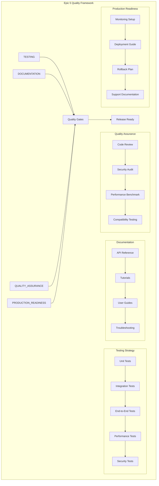

# Epic 5: Testing, Documentation & Polish - Detailed Analysis

---
**Navigation:** [← Epic 4 Analysis](epic4-analysis.md) | [Home](../../index.md) | [Up](README.md)

---

## Epic Overview

**Epic**: Testing, Documentation & Polish  
**Priority**: High  
**Sprint**: 4.5  
**Story Points**: 13  
**Duration**: 1 week  

### Goal
Ensure production readiness through comprehensive testing, complete documentation, excellent user experience, and thorough quality assurance. This epic finalizes the feature for release.

## Detailed Analysis

### Current State Analysis

#### Available from Previous Epics
- ✅ Complete core infrastructure (Epic 1)
- ✅ User type management and quota system (Epic 2)
- ✅ High-level API with event system (Epic 3)
- ✅ Advanced features and optimizations (Epic 4)
- ✅ Basic testing for each component

#### Quality Assurance Requirements
- ❌ Comprehensive test coverage (>90%)
- ❌ Performance benchmarking and validation
- ❌ Security audit and hardening
- ❌ Complete API documentation
- ❌ User guides and tutorials
- ❌ Production deployment readiness

### Quality Framework



## User Stories

### User Story 5.1: Comprehensive Test Coverage
**As a** maintainer  
**I need** comprehensive test coverage (>90%)  
**So that** I can ensure reliability and catch regressions  

#### Acceptance Criteria
- [ ] Unit test coverage > 90% for all Epic components
- [ ] Integration tests cover all major workflows
- [ ] End-to-end tests validate complete user journeys
- [ ] Performance tests validate all optimization claims
- [ ] Security tests cover all attack vectors
- [ ] All tests run automatically in CI/CD

#### Tasks
- [ ] Achieve 90%+ unit test coverage
- [ ] Create comprehensive integration test suite
- [ ] Implement end-to-end workflow tests
- [ ] Add performance regression tests
- [ ] Create security penetration tests
- [ ] Set up automated test execution

#### Test Architecture
```python
# Test structure overview
tests/
├── unit/
│   ├── test_transcription_state.py
│   ├── test_user_type_manager.py
│   ├── test_quota_manager.py
│   ├── test_policy_engine.py
│   ├── test_transcription_manager.py
│   ├── test_event_system.py
│   ├── test_caching_system.py
│   └── test_boost_integration.py
├── integration/
│   ├── test_api_workflows.py
│   ├── test_user_type_flows.py
│   ├── test_event_integration.py
│   ├── test_cache_integration.py
│   └── test_fallback_system.py
├── e2e/
│   ├── test_complete_workflows.py
│   ├── test_user_scenarios.py
│   └── test_error_scenarios.py
├── performance/
│   ├── test_latency_benchmarks.py
│   ├── test_throughput_benchmarks.py
│   ├── test_memory_performance.py
│   └── test_concurrency_limits.py
└── security/
    ├── test_quota_bypass_attempts.py
    ├── test_cache_isolation.py
    └── test_input_validation.py

class ComprehensiveTestSuite:
    """Master test suite orchestrating all test categories."""
    
    def __init__(self):
        self.unit_tests = UnitTestRunner()
        self.integration_tests = IntegrationTestRunner()
        self.e2e_tests = EndToEndTestRunner()
        self.performance_tests = PerformanceTestRunner()
        self.security_tests = SecurityTestRunner()
    
    async def run_full_test_suite(self) -> TestResults:
        """Run complete test suite with detailed reporting."""
        
        results = TestResults()
        
        # Run unit tests first (fastest feedback)
        print("Running unit tests...")
        results.unit = await self.unit_tests.run_all()
        
        if results.unit.success_rate < 0.95:
            return results  # Fail fast on unit tests
        
        # Run integration tests
        print("Running integration tests...")
        results.integration = await self.integration_tests.run_all()
        
        # Run E2E tests
        print("Running end-to-end tests...")
        results.e2e = await self.e2e_tests.run_all()
        
        # Run performance tests
        print("Running performance benchmarks...")
        results.performance = await self.performance_tests.run_benchmarks()
        
        # Run security tests
        print("Running security tests...")
        results.security = await self.security_tests.run_all()
        
        # Generate comprehensive report
        results.generate_report()
        
        return results

class PerformanceRegressionTest:
    """Tests to ensure no performance regressions."""
    
    async def test_api_response_times(self):
        """Validate API response time requirements."""
        
        # Baseline measurements
        baseline_times = {
            'transcribe_voice_message': 100,  # ms
            'get_user_quota': 50,  # ms
            'check_transcription_status': 25,  # ms
        }
        
        for method, max_time in baseline_times.items():
            # Measure current performance
            start_time = time.time()
            await self._call_method(method)
            duration = (time.time() - start_time) * 1000
            
            # Ensure no regression
            assert duration <= max_time, \
                f"{method} took {duration:.1f}ms, max allowed: {max_time}ms"
    
    async def test_memory_usage_stability(self):
        """Validate memory usage doesn't exceed limits."""
        
        initial_memory = self._get_process_memory()
        
        # Run sustained load
        for i in range(1000):
            await self._simulate_transcription_request()
        
        final_memory = self._get_process_memory()
        memory_growth = final_memory - initial_memory
        
        # Memory growth should be minimal
        assert memory_growth < 50 * 1024 * 1024, \
            f"Memory grew by {memory_growth / 1024 / 1024:.1f}MB"
    
    async def test_cache_performance(self):
        """Validate cache performance meets requirements."""
        
        cache = self._get_transcription_cache()
        
        # Warm up cache
        for i in range(100):
            await cache.put(f"key_{i}", f"value_{i}", metadata)
        
        # Measure cache hit performance
        start_time = time.time()
        for i in range(100):
            result = await cache.get(f"key_{i}")
            assert result is not None
        duration = (time.time() - start_time) * 1000
        
        # Cache hits should be very fast
        avg_time = duration / 100
        assert avg_time < 1.0, f"Cache hit took {avg_time:.2f}ms on average"
        
        # Cache hit rate should be high
        hit_rate = cache.hit_rate
        assert hit_rate > 0.95, f"Cache hit rate only {hit_rate:.1%}"

class SecurityTestSuite:
    """Security tests for transcription system."""
    
    async def test_quota_bypass_prevention(self):
        """Test that quota cannot be bypassed through various means."""
        
        # Create free user with zero quota
        user_id = await self._create_test_user(UserType.FREE, quota=0)
        
        # Attempt various bypass methods
        bypass_attempts = [
            self._attempt_quota_bypass_via_user_spoofing,
            self._attempt_quota_bypass_via_cache_manipulation,
            self._attempt_quota_bypass_via_concurrent_requests,
            self._attempt_quota_bypass_via_session_manipulation
        ]
        
        for attempt in bypass_attempts:
            with pytest.raises(TranscriptionQuotaExceeded):
                await attempt(user_id)
    
    async def test_cache_isolation(self):
        """Test that cache doesn't leak data between users."""
        
        user1 = await self._create_test_user()
        user2 = await self._create_test_user()
        
        # User 1 transcribes message
        result1 = await self._transcribe_message(user1, "secret message")
        
        # User 2 should not access User 1's cached transcription
        cache_key = self._generate_cache_key("secret message", user1)
        
        # Attempt to access with user2's context
        cached_result = await self._get_cached_transcription(cache_key, user2)
        assert cached_result is None, "Cache leaked between users"
    
    async def test_input_validation(self):
        """Test input validation prevents injection attacks."""
        
        malicious_inputs = [
            "'; DROP TABLE transcriptions; --",
            "<script>alert('xss')</script>",
            "\\x00\\x01\\x02",  # Binary data
            "A" * 10000,  # Extremely long input
            None,  # Null input
            {},  # Wrong type
        ]
        
        for malicious_input in malicious_inputs:
            with pytest.raises((ValueError, TypeError, ValidationError)):
                await self._transcribe_message_with_input(malicious_input)
```

#### Definition of Done
- Test coverage > 90% across all components
- All tests pass consistently in CI/CD
- Performance tests validate optimization claims
- Security tests prevent common attack vectors

---

### User Story 5.2: Complete API Documentation
**As a** developer  
**I need** complete and accurate API documentation  
**So that** I can use the transcription features effectively  

#### Acceptance Criteria
- [ ] Complete API reference with all methods documented
- [ ] All parameters and return values clearly described
- [ ] Code examples for every public method
- [ ] Error conditions and exceptions documented
- [ ] Type annotations are complete and accurate
- [ ] Documentation is automatically generated and updated

#### Tasks
- [ ] Complete docstring documentation for all public APIs
- [ ] Create comprehensive API reference guide
- [ ] Add code examples to all documentation
- [ ] Document all error conditions and exceptions
- [ ] Set up automatic documentation generation
- [ ] Review and validate all documentation

#### Documentation Structure
```python
class TelegramClient:
    async def transcribe_voice_message(
        self,
        entity: 'hints.EntityLike',
        message: 'typing.Union[int, types.Message]',
        *,
        wait_for_result: bool = True,
        timeout: float = 30.0,
        callback: typing.Optional[typing.Callable[[TranscriptionState], None]] = None,
        user_id: typing.Optional[int] = None
    ) -> typing.Union[str, TranscriptionResult]:
        """
        Transcribe a voice message using Telegram's Speech-to-Text API.
        
        This method provides a high-level interface for voice message transcription,
        handling user type detection, quota management, and result processing
        automatically.
        
        Args:
            entity: The chat containing the voice message. Can be:
                - Username string (e.g., 'username' or '@username')
                - Phone number string (e.g., '+1234567890')
                - User/Chat/Channel ID (int)
                - User/Chat/Channel object
                - InputPeer object
                
            message: The voice message to transcribe. Can be:
                - Message ID (int)
                - Message object containing voice data
                
            wait_for_result: Whether to wait for transcription completion.
                - True: Method blocks until transcription is complete and returns final text
                - False: Method returns immediately with TranscriptionResult object
                
            timeout: Maximum time to wait for transcription completion (seconds).
                Only used when wait_for_result=True. Default: 30.0 seconds.
                
            callback: Optional function called with transcription progress updates.
                Function signature: callback(state: TranscriptionState) -> None
                Called multiple times as transcription progresses.
                
            user_id: User requesting the transcription. Defaults to the current user.
                Used for quota management and access control.
        
        Returns:
            When wait_for_result=True:
                str: The final transcribed text
                
            When wait_for_result=False:
                TranscriptionResult: Object containing transcription details:
                    - text: Current transcription text (may be partial)
                    - pending: Whether transcription is still in progress
                    - transcription_id: Unique ID for this transcription
                    - quota_info: User's remaining quota information
        
        Raises:
            TranscriptionQuotaExceeded: User has exhausted their transcription quota.
                Free users have weekly limits. Premium users have unlimited access.
                
            TranscriptionNotAvailable: The message cannot be transcribed because:
                - Message doesn't contain voice data
                - Message is too old
                - User lacks permission to access the message
                
            TranscriptionTimeout: Transcription didn't complete within timeout period.
                Partial results may be available in the exception.
                
            TranscriptionError: General transcription failure. See error message for details.
            
            ValueError: Invalid parameters provided:
                - entity cannot be resolved
                - message is not a valid message ID or Message object
                - timeout is negative
                
            PermissionError: User lacks permission to transcribe messages in this chat.
            
            RateLimitError: User is making requests too quickly. Wait before retrying.
        
        Examples:
            Basic usage:
                >>> text = await client.transcribe_voice_message('username', message_id)
                >>> print(f"Transcription: {text}")
            
            With progress tracking:
                >>> def progress_handler(state):
                ...     print(f"Progress: {state.text} ({state.progress:.0%})")
                >>> 
                >>> text = await client.transcribe_voice_message(
                ...     'username', message_id, callback=progress_handler
                ... )
            
            Non-blocking usage:
                >>> result = await client.transcribe_voice_message(
                ...     'username', message_id, wait_for_result=False
                ... )
                >>> print(f"Initial text: {result.text}")
                >>> print(f"Pending: {result.pending}")
            
            Error handling:
                >>> try:
                ...     text = await client.transcribe_voice_message('username', message_id)
                ... except TranscriptionQuotaExceeded as e:
                ...     print(f"Quota exceeded. Resets on: {e.quota_info.reset_date}")
                ...     print("Consider upgrading to Premium for unlimited transcriptions!")
                ... except TranscriptionNotAvailable:
                ...     print("This message cannot be transcribed")
                ... except TranscriptionTimeout:
                ...     print("Transcription took too long, try again later")
        
        Note:
            - Free users have weekly transcription quotas
            - Premium users have unlimited transcriptions
            - Transcription quality depends on audio clarity and language
            - Some very old messages may not support transcription
            - Voice messages in supergroups may require boost level 3+ for non-Premium users
        
        See Also:
            - get_transcription_quota(): Check remaining quota
            - rate_transcription(): Rate transcription quality
            - Message.transcribe(): Method available on Message objects
            - events.TranscriptionComplete: Event fired when transcription completes
        
        Version Added:
            2.0: Initial implementation
            
        Version Changed:
            2.1: Added supergroup boost support
            2.2: Added external STT fallback options
        """
```

#### Documentation Generation
```python
# docs/generate_api_docs.py
class APIDocumentationGenerator:
    """Generates comprehensive API documentation."""
    
    def __init__(self):
        self.sphinx_config = SphinxConfig()
        self.example_generator = ExampleGenerator()
        self.type_analyzer = TypeAnalyzer()
    
    def generate_complete_docs(self):
        """Generate complete documentation suite."""
        
        # Generate API reference
        self._generate_api_reference()
        
        # Generate tutorials
        self._generate_tutorials()
        
        # Generate examples
        self._generate_examples()
        
        # Generate troubleshooting guide
        self._generate_troubleshooting()
        
        # Build final documentation
        self._build_documentation()
    
    def _generate_api_reference(self):
        """Generate complete API reference from docstrings."""
        
        # Extract all public methods
        methods = self._extract_public_methods()
        
        # Generate reference pages
        for method in methods:
            self._generate_method_reference(method)
    
    def _generate_tutorials(self):
        """Generate step-by-step tutorials."""
        
        tutorials = [
            {
                'title': 'Getting Started with Voice Transcription',
                'content': self._generate_getting_started_tutorial()
            },
            {
                'title': 'Managing Quotas and User Types',
                'content': self._generate_quota_tutorial()
            },
            {
                'title': 'Advanced Features and Optimization',
                'content': self._generate_advanced_tutorial()
            },
            {
                'title': 'Error Handling and Troubleshooting',
                'content': self._generate_troubleshooting_tutorial()
            }
        ]
        
        for tutorial in tutorials:
            self._write_tutorial_file(tutorial)
```

#### Definition of Done
- All public APIs have complete docstring documentation
- API reference is automatically generated and accurate
- Code examples work and demonstrate best practices
- Documentation covers all error conditions

---

### User Story 5.3: User Experience Polish
**As a** user  
**I need** excellent user experience with helpful messages and guidance  
**So that** I can use transcription features successfully without frustration  

#### Acceptance Criteria
- [ ] Error messages are helpful and actionable
- [ ] Success messages provide useful information
- [ ] Progress indicators are clear and informative
- [ ] Upgrade prompts are tasteful and well-timed
- [ ] Help text is contextual and useful
- [ ] User feedback collection works smoothly

#### Tasks
- [ ] Review and improve all user-facing messages
- [ ] Implement contextual help system
- [ ] Add progress indicators for long operations
- [ ] Create tasteful upgrade promotion system
- [ ] Implement user feedback collection
- [ ] Add accessibility improvements

#### User Experience Framework
```python
class UserExperienceManager:
    """Manages user experience across the transcription system."""
    
    def __init__(self, client: TelegramClient):
        self._client = client
        self._message_formatter = MessageFormatter()
        self._progress_tracker = ProgressTracker()
        self._feedback_collector = FeedbackCollector()
    
    async def handle_transcription_success(
        self, result: TranscriptionResult, user_type: UserType
    ) -> str:
        """Generate success message with appropriate information."""
        
        base_message = f"🎙️ **Transcription Complete**\n\n📝 {result.text}"
        
        # Add user-type specific information
        if user_type == UserType.FREE and result.quota_info:
            quota_msg = self._format_quota_info(result.quota_info)
            base_message += f"\n\n{quota_msg}"
            
            # Add upgrade prompt if quota is low
            if result.quota_info.remaining <= 2:
                upgrade_msg = self._generate_upgrade_prompt(result.quota_info)
                base_message += f"\n\n{upgrade_msg}"
        
        elif user_type == UserType.PREMIUM:
            base_message += "\n\n💎 *Premium transcription*"
        
        # Add quality rating prompt
        rating_prompt = self._generate_rating_prompt(result)
        base_message += f"\n\n{rating_prompt}"
        
        return base_message
    
    def _format_quota_info(self, quota_info: UserQuota) -> str:
        """Format quota information for user display."""
        
        if quota_info.remaining > 5:
            emoji = "✅"
            tone = "good"
        elif quota_info.remaining > 2:
            emoji = "⚠️"
            tone = "warning"
        else:
            emoji = "🔴"
            tone = "urgent"
        
        reset_date = quota_info.reset_date.strftime("%A, %B %d")
        
        return (
            f"{emoji} **Quota Status**\n"
            f"Remaining this week: {quota_info.remaining}\n"
            f"Resets on: {reset_date}"
        )
    
    def _generate_upgrade_prompt(self, quota_info: UserQuota) -> str:
        """Generate contextual upgrade prompt."""
        
        if quota_info.remaining == 0:
            return (
                "🚀 **Upgrade to Premium** for unlimited transcriptions!\n"
                "• No weekly limits\n"
                "• Faster processing\n"
                "• Advanced features\n"
                "• Support development"
            )
        elif quota_info.remaining <= 2:
            return (
                "💡 **Running low on transcriptions?**\n"
                "Premium users get unlimited transcriptions with enhanced features."
            )
        
        return ""
    
    async def handle_transcription_error(
        self, error: TranscriptionError, context: RequestContext
    ) -> str:
        """Generate helpful error message with recovery suggestions."""
        
        if isinstance(error, TranscriptionQuotaExceeded):
            return self._format_quota_exceeded_error(error)
        
        elif isinstance(error, TranscriptionNotAvailable):
            return self._format_not_available_error(error)
        
        elif isinstance(error, TranscriptionTimeout):
            return self._format_timeout_error(error)
        
        elif isinstance(error, RateLimitError):
            return self._format_rate_limit_error(error)
        
        else:
            return self._format_generic_error(error)
    
    def _format_quota_exceeded_error(self, error: TranscriptionQuotaExceeded) -> str:
        """Format quota exceeded error with helpful suggestions."""
        
        quota_info = error.quota_info
        reset_date = quota_info.reset_date.strftime("%A, %B %d at %I:%M %p")
        
        return (
            "❌ **Transcription Quota Exhausted**\n\n"
            f"You've used all {quota_info.total_weekly} transcriptions this week.\n"
            f"Your quota resets on {reset_date}.\n\n"
            "**What you can do:**\n"
            "💎 **Upgrade to Premium** for unlimited transcriptions\n"
            "⏰ **Wait for reset** and try again later\n"
            "👥 **Ask a Premium user** to transcribe for you\n"
            "🔧 **Use external STT** (if enabled in settings)"
        )

class ProgressIndicatorSystem:
    """Provides progress indicators for long-running operations."""
    
    async def show_transcription_progress(
        self, chat_id: int, message_id: int, 
        estimated_duration: float
    ) -> ProgressMessage:
        """Show progress indicator for transcription."""
        
        # Send initial progress message
        progress_msg = await self._client.send_message(
            chat_id,
            "🎙️ **Transcribing voice message...**\n"
            "⏳ This may take a few moments"
        )
        
        # Create progress tracker
        tracker = ProgressTracker(
            message=progress_msg,
            estimated_duration=estimated_duration,
            update_interval=2.0  # Update every 2 seconds
        )
        
        return tracker
    
    async def update_progress(
        self, tracker: ProgressTracker, 
        current_text: str, 
        progress: float
    ):
        """Update progress indicator with current status."""
        
        # Generate progress bar
        progress_bar = self._generate_progress_bar(progress)
        
        # Update message
        new_text = (
            f"🎙️ **Transcribing voice message...**\n"
            f"{progress_bar} {progress:.0%}\n\n"
            f"📝 *Current text:* {current_text[:100]}..."
        )
        
        await tracker.update(new_text)

class FeedbackCollectionSystem:
    """Collects user feedback to improve the service."""
    
    async def collect_transcription_feedback(
        self, transcription_result: TranscriptionResult
    ):
        """Collect feedback on transcription quality."""
        
        # Generate feedback prompt
        feedback_message = (
            "📊 **Help us improve transcription quality!**\n\n"
            "Was this transcription accurate?\n"
            "👍 Good transcription\n"
            "👎 Poor transcription\n"
            "📝 Provide detailed feedback"
        )
        
        # Create inline keyboard for feedback
        keyboard = self._create_feedback_keyboard(transcription_result.transcription_id)
        
        return await self._client.send_message(
            transcription_result.chat_id,
            feedback_message,
            buttons=keyboard
        )
    
    async def handle_feedback_response(
        self, callback_query: CallbackQuery
    ):
        """Handle user feedback response."""
        
        feedback_data = json.loads(callback_query.data)
        
        # Record feedback
        await self._record_feedback(
            transcription_id=feedback_data['transcription_id'],
            rating=feedback_data['rating'],
            user_id=callback_query.from_user.id
        )
        
        # Update message with thank you
        await callback_query.edit_message_text(
            "✅ **Thank you for your feedback!**\n"
            "Your input helps us improve transcription quality."
        )
```

#### Definition of Done
- All user-facing messages are helpful and actionable
- Progress indicators provide clear feedback
- Upgrade prompts are tasteful and effective
- User feedback system works smoothly

---

### User Story 5.4: Performance Benchmarking
**As a** system administrator  
**I need** comprehensive performance benchmarks  
**So that** I can validate performance claims and optimize the system  

#### Acceptance Criteria
- [ ] Comprehensive performance benchmark suite
- [ ] Benchmarks validate all performance claims
- [ ] Performance regression detection
- [ ] Scalability testing under load
- [ ] Resource usage profiling
- [ ] Performance optimization recommendations

#### Tasks
- [ ] Create comprehensive benchmark suite
- [ ] Implement performance regression detection
- [ ] Add scalability testing framework
- [ ] Create resource usage profiling
- [ ] Generate performance reports
- [ ] Add optimization recommendations

#### Benchmark Suite
```python
class ComprehensivePerformanceBenchmark:
    """Complete performance benchmark suite for transcription system."""
    
    def __init__(self):
        self.benchmark_config = BenchmarkConfig()
        self.profiler = PerformanceProfiler()
        self.reporter = BenchmarkReporter()
    
    async def run_full_benchmark_suite(self) -> BenchmarkResults:
        """Run complete performance benchmark suite."""
        
        results = BenchmarkResults()
        
        # Core API benchmarks
        results.api_performance = await self._benchmark_api_performance()
        
        # Concurrency benchmarks
        results.concurrency = await self._benchmark_concurrency()
        
        # Memory benchmarks
        results.memory = await self._benchmark_memory_usage()
        
        # Cache performance benchmarks
        results.cache = await self._benchmark_cache_performance()
        
        # Network efficiency benchmarks
        results.network = await self._benchmark_network_efficiency()
        
        # Generate comprehensive report
        report = self.reporter.generate_report(results)
        
        return results, report
    
    async def _benchmark_api_performance(self) -> APIPerformanceBenchmark:
        """Benchmark core API method performance."""
        
        benchmark = APIPerformanceBenchmark()
        
        # Benchmark transcribe_voice_message
        benchmark.transcribe_voice_message = await self._time_method(
            method=self._call_transcribe_voice_message,
            iterations=100,
            target_percentile_95=150  # 95% of calls under 150ms
        )
        
        # Benchmark get_user_quota
        benchmark.get_user_quota = await self._time_method(
            method=self._call_get_user_quota,
            iterations=1000,
            target_percentile_95=50  # 95% of calls under 50ms
        )
        
        # Benchmark check_transcription_status
        benchmark.check_transcription_status = await self._time_method(
            method=self._call_check_transcription_status,
            iterations=1000,
            target_percentile_95=25  # 95% of calls under 25ms
        )
        
        return benchmark
    
    async def _benchmark_concurrency(self) -> ConcurrencyBenchmark:
        """Benchmark system under concurrent load."""
        
        benchmark = ConcurrencyBenchmark()
        
        # Test concurrent transcription requests
        concurrency_levels = [1, 5, 10, 25, 50, 100]
        
        for level in concurrency_levels:
            start_time = time.time()
            
            # Create concurrent requests
            tasks = [
                self._simulate_transcription_request(i)
                for i in range(level)
            ]
            
            # Execute all requests
            results = await asyncio.gather(*tasks, return_exceptions=True)
            
            duration = time.time() - start_time
            success_count = sum(1 for r in results if not isinstance(r, Exception))
            
            benchmark.results[level] = ConcurrencyResult(
                level=level,
                duration=duration,
                success_rate=success_count / level,
                requests_per_second=level / duration,
                average_latency=duration / level * 1000  # ms
            )
        
        return benchmark
    
    async def _benchmark_memory_usage(self) -> MemoryBenchmark:
        """Benchmark memory usage under various loads."""
        
        benchmark = MemoryBenchmark()
        
        # Baseline memory usage
        baseline_memory = self._get_memory_usage()
        
        # Test memory usage with increasing load
        load_levels = [10, 50, 100, 500, 1000]
        
        for load in load_levels:
            # Create load
            transcriptions = []
            for i in range(load):
                transcription = await self._create_transcription_state(f"test_{i}")
                transcriptions.append(transcription)
            
            # Measure memory
            peak_memory = self._get_memory_usage()
            memory_per_transcription = (peak_memory - baseline_memory) / load
            
            benchmark.results[load] = MemoryResult(
                load_level=load,
                total_memory=peak_memory,
                memory_per_item=memory_per_transcription,
                memory_efficiency=load / (peak_memory / 1024 / 1024)  # items per MB
            )
            
            # Cleanup
            for transcription in transcriptions:
                await self._cleanup_transcription_state(transcription)
        
        return benchmark
    
    async def _benchmark_cache_performance(self) -> CacheBenchmark:
        """Benchmark cache system performance."""
        
        benchmark = CacheBenchmark()
        
        # Test cache hit performance
        cache = self._get_test_cache()
        
        # Populate cache
        for i in range(1000):
            await cache.put(f"key_{i}", f"value_{i}", metadata)
        
        # Benchmark cache hits
        start_time = time.time()
        for i in range(1000):
            result = await cache.get(f"key_{i}")
            assert result is not None
        hit_duration = time.time() - start_time
        
        # Benchmark cache misses
        start_time = time.time()
        for i in range(1000, 2000):
            result = await cache.get(f"key_{i}")
            assert result is None
        miss_duration = time.time() - start_time
        
        benchmark.hit_latency = hit_duration / 1000 * 1000  # ms per operation
        benchmark.miss_latency = miss_duration / 1000 * 1000  # ms per operation
        benchmark.hit_rate = cache.hit_rate
        
        return benchmark

class PerformanceProfiler:
    """Profiles performance characteristics of the system."""
    
    def __init__(self):
        self.cpu_profiler = CPUProfiler()
        self.memory_profiler = MemoryProfiler()
        self.io_profiler = IOProfiler()
    
    async def profile_complete_workflow(self) -> ProfileResult:
        """Profile a complete transcription workflow."""
        
        # Start profiling
        self.cpu_profiler.start()
        self.memory_profiler.start()
        self.io_profiler.start()
        
        try:
            # Execute complete workflow
            await self._execute_complete_workflow()
            
            # Get profiling results
            cpu_profile = self.cpu_profiler.get_results()
            memory_profile = self.memory_profiler.get_results()
            io_profile = self.io_profiler.get_results()
            
            return ProfileResult(
                cpu=cpu_profile,
                memory=memory_profile,
                io=io_profile,
                bottlenecks=self._identify_bottlenecks(cpu_profile, memory_profile, io_profile)
            )
            
        finally:
            self.cpu_profiler.stop()
            self.memory_profiler.stop()
            self.io_profiler.stop()
    
    def _identify_bottlenecks(self, cpu, memory, io) -> List[Bottleneck]:
        """Identify performance bottlenecks from profiling data."""
        
        bottlenecks = []
        
        # CPU bottlenecks
        if cpu.peak_usage > 80:
            bottlenecks.append(Bottleneck(
                type="cpu",
                severity="high",
                description=f"High CPU usage: {cpu.peak_usage}%",
                recommendation="Consider optimizing CPU-intensive operations"
            ))
        
        # Memory bottlenecks
        if memory.peak_usage > memory.available * 0.8:
            bottlenecks.append(Bottleneck(
                type="memory",
                severity="high",
                description=f"High memory usage: {memory.peak_usage / 1024 / 1024:.1f}MB",
                recommendation="Implement more aggressive cleanup or reduce memory footprint"
            ))
        
        # I/O bottlenecks
        if io.average_latency > 100:  # ms
            bottlenecks.append(Bottleneck(
                type="io",
                severity="medium",
                description=f"High I/O latency: {io.average_latency:.1f}ms",
                recommendation="Consider I/O optimization or caching"
            ))
        
        return bottlenecks
```

#### Definition of Done
- Comprehensive benchmark suite covers all performance aspects
- All performance claims are validated
- Performance regression detection is working
- Optimization recommendations are actionable

---

### User Story 5.5: Security Audit and Hardening
**As a** security engineer  
**I need** a comprehensive security audit  
**So that** the transcription system is secure and resistant to attacks  

#### Acceptance Criteria
- [ ] Complete security audit of all components
- [ ] Input validation prevents injection attacks
- [ ] Access control prevents unauthorized usage
- [ ] Data isolation prevents information leakage
- [ ] Rate limiting prevents abuse
- [ ] Security documentation is complete

#### Tasks
- [ ] Conduct comprehensive security audit
- [ ] Implement input validation hardening
- [ ] Strengthen access control mechanisms
- [ ] Add data isolation verification
- [ ] Enhance rate limiting protection
- [ ] Create security documentation

#### Security Audit Framework
```python
class SecurityAuditSuite:
    """Comprehensive security audit for transcription system."""
    
    def __init__(self):
        self.input_validator = InputValidationAuditor()
        self.access_controller = AccessControlAuditor()
        self.data_isolator = DataIsolationAuditor()
        self.rate_limiter = RateLimitingAuditor()
    
    async def run_complete_security_audit(self) -> SecurityAuditReport:
        """Run comprehensive security audit."""
        
        report = SecurityAuditReport()
        
        # Input validation audit
        report.input_validation = await self.input_validator.audit()
        
        # Access control audit
        report.access_control = await self.access_controller.audit()
        
        # Data isolation audit
        report.data_isolation = await self.data_isolator.audit()
        
        # Rate limiting audit
        report.rate_limiting = await self.rate_limiter.audit()
        
        # Generate security recommendations
        report.recommendations = self._generate_security_recommendations(report)
        
        return report

class InputValidationAuditor:
    """Audits input validation security."""
    
    async def audit(self) -> InputValidationAuditResult:
        """Audit input validation mechanisms."""
        
        result = InputValidationAuditResult()
        
        # Test SQL injection prevention
        result.sql_injection = await self._test_sql_injection_prevention()
        
        # Test XSS prevention
        result.xss_prevention = await self._test_xss_prevention()
        
        # Test buffer overflow prevention
        result.buffer_overflow = await self._test_buffer_overflow_prevention()
        
        # Test type confusion prevention
        result.type_confusion = await self._test_type_confusion_prevention()
        
        return result
    
    async def _test_sql_injection_prevention(self) -> TestResult:
        """Test SQL injection attack prevention."""
        
        injection_payloads = [
            "'; DROP TABLE users; --",
            "' OR '1'='1",
            "'; INSERT INTO users VALUES ('hacker', 'password'); --",
            "' UNION SELECT * FROM sensitive_data --"
        ]
        
        for payload in injection_payloads:
            try:
                # Attempt injection through various input points
                await self._attempt_transcription_with_payload(payload)
                await self._attempt_user_lookup_with_payload(payload)
                await self._attempt_quota_query_with_payload(payload)
                
                # If we get here without exception, injection might be possible
                return TestResult(
                    passed=False,
                    details=f"Potential SQL injection vulnerability with payload: {payload}"
                )
                
            except (ValueError, TypeError, ValidationError):
                # Expected - input validation should catch these
                continue
            except Exception as e:
                # Unexpected error - potential vulnerability
                return TestResult(
                    passed=False,
                    details=f"Unexpected error with payload {payload}: {e}"
                )
        
        return TestResult(passed=True, details="SQL injection prevention working correctly")

class AccessControlAuditor:
    """Audits access control mechanisms."""
    
    async def audit(self) -> AccessControlAuditResult:
        """Audit access control security."""
        
        result = AccessControlAuditResult()
        
        # Test quota bypass prevention
        result.quota_bypass = await self._test_quota_bypass_prevention()
        
        # Test user impersonation prevention
        result.user_impersonation = await self._test_user_impersonation_prevention()
        
        # Test privilege escalation prevention
        result.privilege_escalation = await self._test_privilege_escalation_prevention()
        
        return result
    
    async def _test_quota_bypass_prevention(self) -> TestResult:
        """Test quota bypass attack prevention."""
        
        # Create user with zero quota
        user_id = await self._create_test_user(quota=0)
        
        bypass_attempts = [
            # Attempt to bypass by manipulating user_id parameter
            lambda: self._transcribe_with_spoofed_user_id(user_id, premium_user_id),
            
            # Attempt to bypass by concurrent requests
            lambda: self._transcribe_with_concurrent_requests(user_id, 10),
            
            # Attempt to bypass by cache manipulation
            lambda: self._transcribe_with_cache_manipulation(user_id),
            
            # Attempt to bypass by session manipulation
            lambda: self._transcribe_with_session_manipulation(user_id),
        ]
        
        for i, attempt in enumerate(bypass_attempts):
            try:
                result = await attempt()
                
                # If transcription succeeded, bypass was possible
                return TestResult(
                    passed=False,
                    details=f"Quota bypass successful via method {i+1}"
                )
                
            except TranscriptionQuotaExceeded:
                # Expected - quota should be enforced
                continue
            except Exception as e:
                # Unexpected error
                return TestResult(
                    passed=False,
                    details=f"Unexpected error in bypass attempt {i+1}: {e}"
                )
        
        return TestResult(passed=True, details="Quota bypass prevention working correctly")

class DataIsolationAuditor:
    """Audits data isolation security."""
    
    async def audit(self) -> DataIsolationAuditResult:
        """Audit data isolation mechanisms."""
        
        result = DataIsolationAuditResult()
        
        # Test cache isolation
        result.cache_isolation = await self._test_cache_isolation()
        
        # Test transcription isolation
        result.transcription_isolation = await self._test_transcription_isolation()
        
        # Test quota isolation
        result.quota_isolation = await self._test_quota_isolation()
        
        return result
    
    async def _test_cache_isolation(self) -> TestResult:
        """Test cache isolation between users."""
        
        user1 = await self._create_test_user()
        user2 = await self._create_test_user()
        
        # User 1 transcribes a message
        secret_text = "confidential information"
        transcription_id = await self._transcribe_message(user1, secret_text)
        
        # Attempt to access User 1's cached transcription as User 2
        cache_key = self._generate_cache_key(transcription_id, user1)
        
        try:
            # This should fail - User 2 shouldn't access User 1's cache
            cached_result = await self._get_cached_transcription(cache_key, user2)
            
            if cached_result and secret_text in cached_result:
                return TestResult(
                    passed=False,
                    details="Cache isolation failed - User 2 accessed User 1's transcription"
                )
                
        except PermissionError:
            # Expected - cache should be isolated
            pass
        
        return TestResult(passed=True, details="Cache isolation working correctly")
```

#### Definition of Done
- Security audit identifies no critical vulnerabilities
- All input validation is hardened
- Access control prevents unauthorized usage
- Data isolation prevents information leakage

---

### User Story 5.6: Production Deployment Readiness
**As a** DevOps engineer  
**I need** complete production deployment documentation and tools  
**So that** I can deploy the transcription system safely in production  

#### Acceptance Criteria
- [ ] Complete deployment documentation
- [ ] Production configuration templates
- [ ] Monitoring and alerting setup
- [ ] Backup and recovery procedures
- [ ] Performance tuning guidelines
- [ ] Rollback procedures

#### Tasks
- [ ] Create deployment documentation
- [ ] Provide production configuration templates
- [ ] Set up monitoring and alerting
- [ ] Document backup and recovery procedures
- [ ] Create performance tuning guide
- [ ] Document rollback procedures

#### Production Deployment Guide
```markdown
# Production Deployment Guide

## Prerequisites

### System Requirements
- Python 3.8+ with asyncio support
- Memory: 2GB minimum, 4GB recommended
- Storage: 1GB for cache, more for logs
- Network: Stable connection to Telegram API

### Dependencies
- All required dependencies from requirements.txt
- Optional: External STT service credentials
- Optional: Monitoring system (Prometheus, Grafana)

## Configuration

### Environment Variables
```bash
# Telegram API Configuration
TELEGRAM_API_ID=your_api_id
TELEGRAM_API_HASH=your_api_hash

# Transcription Configuration
TRANSCRIPTION_CACHE_SIZE=1000
TRANSCRIPTION_CACHE_TTL=3600
TRANSCRIPTION_MAX_CONCURRENT=10

# Database Configuration
DATABASE_URL=sqlite:///transcriptions.db
SESSION_DATABASE_URL=sqlite:///sessions.db

# External STT Configuration (Optional)
GOOGLE_STT_CREDENTIALS_PATH=/path/to/credentials.json
EXTERNAL_STT_ENABLED=true

# Monitoring Configuration
PROMETHEUS_PORT=9090
METRICS_ENABLED=true
LOG_LEVEL=INFO
```

### Production Configuration Template
```python
# config/production.py
class ProductionConfig:
    # Core settings
    DEBUG = False
    TESTING = False
    
    # Performance settings
    MAX_CONCURRENT_TRANSCRIPTIONS = 20
    REQUEST_TIMEOUT = 30.0
    CACHE_SIZE = 5000
    CACHE_TTL = 3600
    
    # Security settings
    RATE_LIMIT_ENABLED = True
    INPUT_VALIDATION_STRICT = True
    ACCESS_CONTROL_ENABLED = True
    
    # Monitoring settings
    METRICS_ENABLED = True
    PERFORMANCE_MONITORING = True
    ERROR_TRACKING = True
    
    # Backup settings
    BACKUP_ENABLED = True
    BACKUP_INTERVAL = 3600  # 1 hour
    BACKUP_RETENTION_DAYS = 30
```

## Deployment Steps

### 1. Pre-deployment Validation
```bash
# Run complete test suite
python -m pytest tests/ --cov=telethon_transcription --cov-report=html

# Run security audit
python -m security_audit --full

# Run performance benchmarks
python -m benchmark --production-config

# Validate configuration
python -m config_validator --env=production
```

### 2. Database Setup
```bash
# Initialize database schema
python -m transcription.db.migrate init

# Create indexes for performance
python -m transcription.db.migrate create_indexes

# Set up backup schedule
python -m transcription.backup.setup --schedule=hourly
```

### 3. Monitoring Setup
```bash
# Start Prometheus metrics exporter
python -m transcription.monitoring.prometheus --port=9090

# Configure alerts
cp config/alerts.yml /etc/prometheus/alerts/

# Set up Grafana dashboards
python -m transcription.monitoring.grafana_setup
```

### 4. Production Deployment
```bash
# Deploy using systemd service
sudo cp config/transcription.service /etc/systemd/system/
sudo systemctl daemon-reload
sudo systemctl enable transcription
sudo systemctl start transcription

# Verify deployment
sudo systemctl status transcription
python -m transcription.healthcheck
```

## Monitoring and Alerting

### Key Metrics to Monitor
- Request rate and latency
- Error rate and types
- Cache hit rate
- Memory usage
- Quota consumption rates
- User satisfaction scores

### Critical Alerts
- High error rate (>5%)
- High latency (>2s average)
- Memory usage >80%
- Cache hit rate <70%
- Service unavailable

### Dashboard Setup
```yaml
# grafana/transcription_dashboard.json
{
  "dashboard": {
    "title": "Transcription Service",
    "panels": [
      {
        "title": "Request Rate",
        "targets": [
          "rate(transcription_requests_total[5m])"
        ]
      },
      {
        "title": "Error Rate",
        "targets": [
          "rate(transcription_errors_total[5m]) / rate(transcription_requests_total[5m])"
        ]
      }
    ]
  }
}
```

## Performance Tuning

### Cache Optimization
```python
# Optimize cache size based on memory
cache_size = min(
    available_memory_mb * 100,  # 100 items per MB
    10000  # Maximum cache size
)

# Optimize TTL based on usage patterns
cache_ttl = 3600 if hit_rate > 0.8 else 1800
```

### Concurrency Tuning
```python
# Adjust based on CPU cores and memory
max_concurrent = min(
    cpu_cores * 4,
    available_memory_mb // 50  # 50MB per transcription
)
```

## Backup and Recovery

### Backup Strategy
```bash
# Daily database backup
0 2 * * * /usr/local/bin/backup_transcription_db.sh

# Weekly configuration backup
0 3 * * 0 /usr/local/bin/backup_transcription_config.sh

# Continuous cache backup (if persistent cache enabled)
*/15 * * * * /usr/local/bin/backup_transcription_cache.sh
```

### Recovery Procedures
```bash
# Restore from backup
python -m transcription.backup.restore --date=2023-12-01

# Verify restoration
python -m transcription.db.verify --check-integrity

# Restart services
sudo systemctl restart transcription
```

## Rollback Procedures

### Quick Rollback
```bash
# Stop current version
sudo systemctl stop transcription

# Switch to previous version
sudo ln -sf /opt/transcription/previous /opt/transcription/current

# Restore previous database
python -m transcription.backup.restore --version=previous

# Start previous version
sudo systemctl start transcription
```

### Health Checks
```bash
# Basic health check
curl http://localhost:8080/health

# Comprehensive health check
python -m transcription.healthcheck --comprehensive
```
```

#### Definition of Done
- Complete deployment documentation is available
- Production configuration templates are provided
- Monitoring and alerting is configured
- Backup and recovery procedures are documented

---

## Quality Gates

### Epic 5 Quality Gates
Before Epic 5 can be considered complete, all of the following must be achieved:

1. **Test Coverage**: >90% across all components
2. **Performance Benchmarks**: All performance claims validated
3. **Security Audit**: No critical vulnerabilities
4. **Documentation**: Complete and accurate
5. **User Experience**: Excellent usability scores
6. **Production Readiness**: Complete deployment guide

### Release Criteria
- [ ] All quality gates passed
- [ ] All user stories completed
- [ ] All acceptance criteria met
- [ ] Performance benchmarks meet requirements
- [ ] Security audit shows no critical issues
- [ ] Documentation is complete and accurate
- [ ] Production deployment is validated

## Success Metrics

### Quality Metrics
- [ ] Test coverage > 90%
- [ ] Zero critical bugs in production
- [ ] Performance regression < 5%
- [ ] User satisfaction > 4.5/5

### Readiness Metrics
- [ ] Documentation completeness > 95%
- [ ] Security audit score > 95%
- [ ] Production deployment success rate 100%
- [ ] Rollback procedures tested and validated

## Implementation Timeline

**Day 1**: Complete test coverage and security audit  
**Day 2**: Finish API documentation and user experience polish  
**Day 3**: Performance benchmarking and optimization  
**Day 4**: Production deployment preparation  
**Day 5**: Final validation and release preparation  

## Release Readiness

Epic 5 concludes with a fully production-ready voice transcription system that:
- Has been thoroughly tested and validated
- Provides excellent user experience
- Is completely documented
- Can be safely deployed to production
- Includes comprehensive monitoring and support tools

The feature is ready for release and real-world usage.

---
**Navigation:** [← Epic 4 Analysis](epic4-analysis.md) | [Home](../../index.md) | [Up](README.md)

---