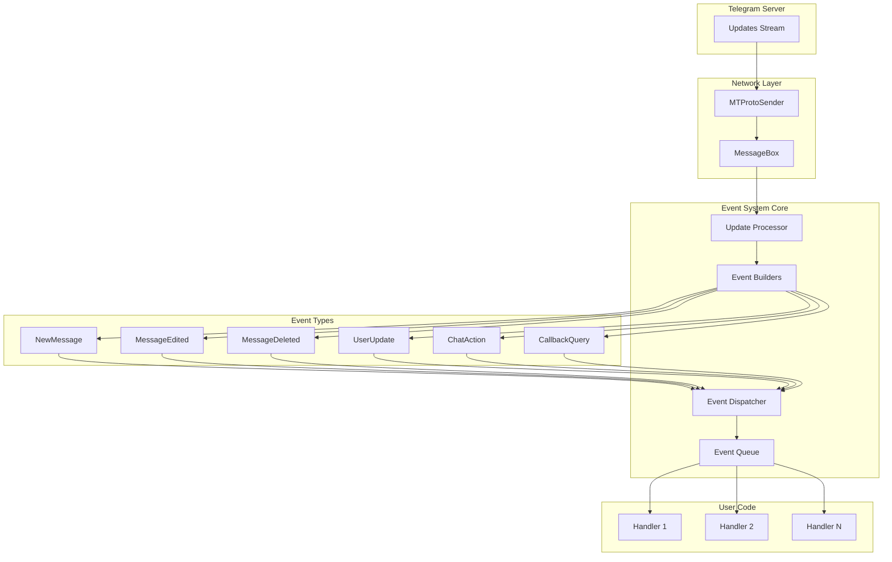
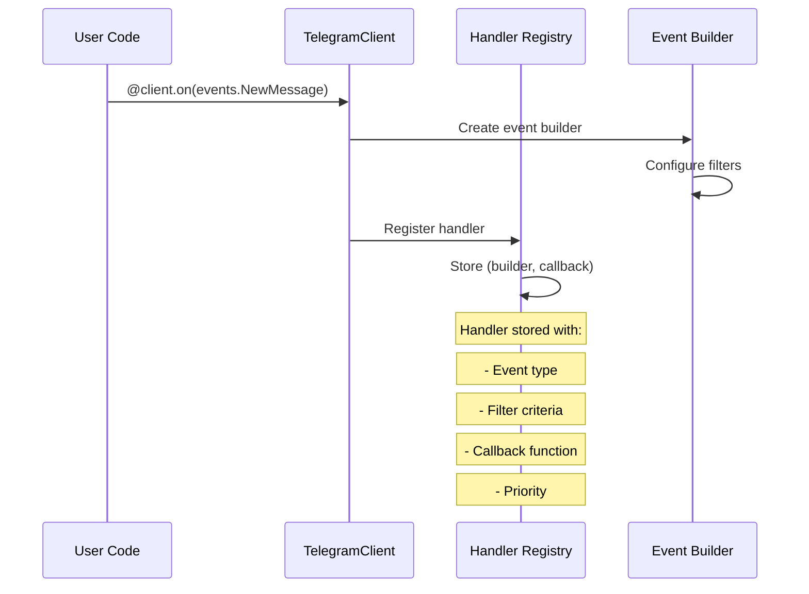
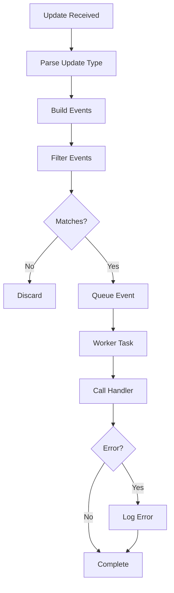
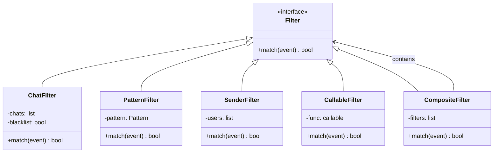

# Event System Architecture

---
**Navigation:** [← Events](README.md) | [Home](../index.md) | [Up](../index.md) | [Event Types →](types.md)

---

## Overview

Telethon's event system provides a powerful, extensible mechanism for handling Telegram updates. It follows an event-driven architecture pattern that allows developers to react to various types of updates (new messages, edits, user status changes, etc.) in a clean and efficient manner.

## Architecture Design



## Core Components

### Event Builder

The base class for all event types that handles event construction from updates.

```python
class EventBuilder(abc.ABC):
    """
    Base class for all event builders. Subclasses must implement
    the `build` method to create an event from an Update.
    """
    
    def __init__(self, chats=None, *, blacklist_chats=False, func=None):
        self.chats = chats
        self.blacklist_chats = blacklist_chats
        self.func = func
        self._self_id = None
        
    @abc.abstractmethod
    def build(self, update, others=None, self_id=None):
        """
        Builds an event from the given update.
        
        Args:
            update: The Telegram update
            others: Other updates in the same container
            self_id: Current user's ID
            
        Returns:
            Event instance or None if not applicable
        """
        raise NotImplementedError
        
    def filter(self, event):
        """
        Filters the event based on configured criteria.
        """
        # Check chat filter
        if self.chats is not None:
            if not event.chat_id:
                return False
                
            inside = event.chat_id in self.chats
            if self.blacklist_chats:
                inside = not inside
                
            if not inside:
                return False
                
        # Apply custom function filter
        if self.func:
            return self.func(event)
            
        return True
```

### Event Common Base

```python
class EventCommon(abc.ABC):
    """
    Base class for all events. Provides common functionality
    and properties that all events share.
    """
    
    def __init__(self, client, update):
        self._client = client
        self._update = update
        self._chat = None
        self._sender = None
        self._via_bot = None
        
    @property
    def client(self):
        """The TelegramClient that received this event."""
        return self._client
        
    @property
    def original_update(self):
        """The original Telegram update that caused this event."""
        return self._update
        
    async def get_chat(self):
        """Gets the full Chat entity for this event."""
        if not self._chat:
            self._chat = await self._client.get_entity(self.chat_id)
        return self._chat
        
    async def get_sender(self):
        """Gets the full User entity that sent this event."""
        if not self._sender:
            self._sender = await self._client.get_entity(self.sender_id)
        return self._sender
```

## Event Registration

### Handler Registration Flow



### Registration Methods

```python
class TelegramClient:
    def on(self, event):
        """
        Decorator to register an event handler.
        
        @client.on(events.NewMessage(pattern='hello'))
        async def handler(event):
            await event.reply('Hi!')
        """
        def decorator(func):
            self.add_event_handler(func, event)
            return func
        return decorator
        
    def add_event_handler(self, callback, event=None):
        """
        Registers a new event handler.
        
        Args:
            callback: Async function to call
            event: EventBuilder instance or None for raw updates
        """
        if not event:
            event = events.Raw()
            
        self._event_builders.append((event, callback))
        
    def remove_event_handler(self, callback, event=None):
        """
        Removes a previously registered handler.
        """
        # Remove matching handlers
        self._event_builders = [
            (e, c) for e, c in self._event_builders
            if c != callback or (event and e != event)
        ]
```

## Event Dispatching

### Dispatch Flow



### Dispatcher Implementation

```python
class EventDispatcher:
    """
    Handles dispatching updates to registered event handlers.
    """
    
    def __init__(self, client):
        self._client = client
        self._handlers = []
        self._queue = asyncio.Queue()
        self._workers = []
        
    async def dispatch(self, update):
        """
        Dispatches an update to all matching handlers.
        """
        # Build events from update
        built_events = []
        
        for builder, callback in self._handlers:
            event = builder.build(
                update,
                others=None,
                self_id=self._client._self_id
            )
            
            if event and builder.filter(event):
                built_events.append((event, callback))
                
        # Queue events for processing
        for event, callback in built_events:
            await self._queue.put((event, callback))
            
    async def _worker(self):
        """
        Worker task that processes events from the queue.
        """
        while True:
            try:
                event, callback = await self._queue.get()
                
                try:
                    await callback(event)
                except Exception as e:
                    # Log but don't crash on handler errors
                    self._client._log.exception(
                        'Unhandled exception in handler %s',
                        callback.__name__
                    )
                    
            except asyncio.CancelledError:
                break
```

## Event Filtering

### Filter Types



### Filter Implementation

```python
@dataclass
class EventFilter:
    """
    Configurable filter for events.
    """
    chats: Optional[List[int]] = None
    blacklist_chats: bool = False
    incoming: Optional[bool] = None
    outgoing: Optional[bool] = None
    from_users: Optional[List[int]] = None
    forwards: Optional[bool] = None
    pattern: Optional[Union[str, Pattern]] = None
    func: Optional[Callable] = None
    
    def match(self, event):
        """
        Check if event matches all filter criteria.
        """
        # Chat filter
        if self.chats is not None:
            chat_match = event.chat_id in self.chats
            if self.blacklist_chats:
                chat_match = not chat_match
            if not chat_match:
                return False
                
        # Direction filter
        if self.incoming is not None and event.out != (not self.incoming):
            return False
            
        if self.outgoing is not None and event.out != self.outgoing:
            return False
            
        # Sender filter
        if self.from_users and event.sender_id not in self.from_users:
            return False
            
        # Forward filter
        if self.forwards is not None:
            is_forward = bool(getattr(event, 'forward', None))
            if self.forwards != is_forward:
                return False
                
        # Pattern filter
        if self.pattern:
            text = getattr(event, 'text', '')
            if isinstance(self.pattern, str):
                if not re.search(self.pattern, text):
                    return False
            elif not self.pattern.search(text):
                return False
                
        # Custom function filter
        if self.func and not self.func(event):
            return False
            
        return True
```

## Asynchronous Event Processing

### Concurrent Handler Execution

```python
class AsyncEventProcessor:
    """
    Processes events asynchronously with concurrency control.
    """
    
    def __init__(self, max_concurrent=5):
        self._semaphore = asyncio.Semaphore(max_concurrent)
        self._tasks = set()
        
    async def process_event(self, event, handlers):
        """
        Process an event with multiple handlers concurrently.
        """
        tasks = []
        
        for handler in handlers:
            task = asyncio.create_task(
                self._run_handler(event, handler)
            )
            tasks.append(task)
            self._tasks.add(task)
            task.add_done_callback(self._tasks.discard)
            
        # Wait for all handlers to complete
        results = await asyncio.gather(*tasks, return_exceptions=True)
        
        # Handle any exceptions
        for result, handler in zip(results, handlers):
            if isinstance(result, Exception):
                await self._handle_error(result, handler, event)
                
    async def _run_handler(self, event, handler):
        """
        Run a single handler with concurrency limiting.
        """
        async with self._semaphore:
            return await handler(event)
```

### Event Priority System

```python
class PriorityEventQueue:
    """
    Priority queue for event processing.
    """
    
    def __init__(self):
        self._queue = []
        self._counter = 0
        
    def add_event(self, event, handler, priority=0):
        """
        Add event with priority (lower number = higher priority).
        """
        # Use counter to maintain order for same priority
        entry = (priority, self._counter, event, handler)
        heapq.heappush(self._queue, entry)
        self._counter += 1
        
    async def process_events(self):
        """
        Process events in priority order.
        """
        while self._queue:
            priority, _, event, handler = heapq.heappop(self._queue)
            
            try:
                await handler(event)
            except Exception as e:
                # Handle error without stopping processing
                logger.exception('Error in priority handler')
```

## Event State Management

### Stateful Event Handling

```python
class StatefulEventHandler:
    """
    Maintains state across event handling.
    """
    
    def __init__(self):
        self._conversations = {}
        self._timers = {}
        
    async def handle_conversation(self, event):
        """
        Handle multi-step conversations.
        """
        user_id = event.sender_id
        
        if user_id not in self._conversations:
            # Start new conversation
            self._conversations[user_id] = ConversationState()
            
        state = self._conversations[user_id]
        
        # Process based on current state
        if state.step == 'waiting_name':
            state.name = event.text
            state.step = 'waiting_age'
            await event.reply('What is your age?')
            
        elif state.step == 'waiting_age':
            state.age = event.text
            state.step = 'complete'
            await event.reply(f'Hello {state.name}, age {state.age}!')
            
            # Clean up completed conversation
            del self._conversations[user_id]
```

## Performance Optimization

### Event Batching

```python
class EventBatcher:
    """
    Batches events for efficient processing.
    """
    
    def __init__(self, batch_size=10, timeout=0.1):
        self.batch_size = batch_size
        self.timeout = timeout
        self._batch = []
        self._timer = None
        
    async def add_event(self, event):
        """
        Add event to batch.
        """
        self._batch.append(event)
        
        if len(self._batch) >= self.batch_size:
            await self._process_batch()
        elif not self._timer:
            self._timer = asyncio.create_task(self._timeout_flush())
            
    async def _timeout_flush(self):
        """
        Flush batch after timeout.
        """
        await asyncio.sleep(self.timeout)
        await self._process_batch()
        
    async def _process_batch(self):
        """
        Process all events in batch.
        """
        if self._timer:
            self._timer.cancel()
            self._timer = None
            
        batch = self._batch
        self._batch = []
        
        # Process batch efficiently
        await self._bulk_process(batch)
```

## Error Handling

### Error Recovery Strategies

```python
class EventErrorHandler:
    """
    Handles errors in event processing.
    """
    
    def __init__(self, max_retries=3, retry_delay=1.0):
        self.max_retries = max_retries
        self.retry_delay = retry_delay
        self._error_counts = Counter()
        
    async def handle_with_retry(self, event, handler):
        """
        Execute handler with retry logic.
        """
        handler_id = id(handler)
        
        for attempt in range(self.max_retries):
            try:
                return await handler(event)
                
            except FloodWaitError as e:
                # Handle rate limiting
                await asyncio.sleep(e.seconds)
                
            except ConnectionError:
                # Connection issues - exponential backoff
                delay = self.retry_delay * (2 ** attempt)
                await asyncio.sleep(delay)
                
            except Exception as e:
                # Track error frequency
                self._error_counts[handler_id] += 1
                
                if self._error_counts[handler_id] > 10:
                    # Disable handler if too many errors
                    logger.error(f'Disabling handler {handler} due to errors')
                    raise
                    
                if attempt == self.max_retries - 1:
                    raise
```

## Best Practices

### Event Handler Design

1. **Keep Handlers Focused**: One handler should do one thing
2. **Use Filters Efficiently**: Filter early to avoid unnecessary processing
3. **Handle Errors Gracefully**: Don't let one error break all handling
4. **Avoid Blocking Operations**: Use async I/O for all operations
5. **Clean Up Resources**: Use try/finally or context managers

### Performance Tips

1. **Batch Similar Operations**: Group database queries, API calls
2. **Use Event Priority**: Process important events first
3. **Limit Concurrency**: Prevent resource exhaustion
4. **Cache Frequently Used Data**: Reduce repeated fetches
5. **Monitor Performance**: Track handler execution times

## Next Steps

- Continue to [Event Types](types.md) for available events
- See [Event Handling](handling.md) for usage patterns
- Explore [Custom Events](custom.md) for creating new event types

---
**Navigation:** [← Events](README.md) | [Home](../index.md) | [Up](../index.md) | [Event Types →](types.md)

---