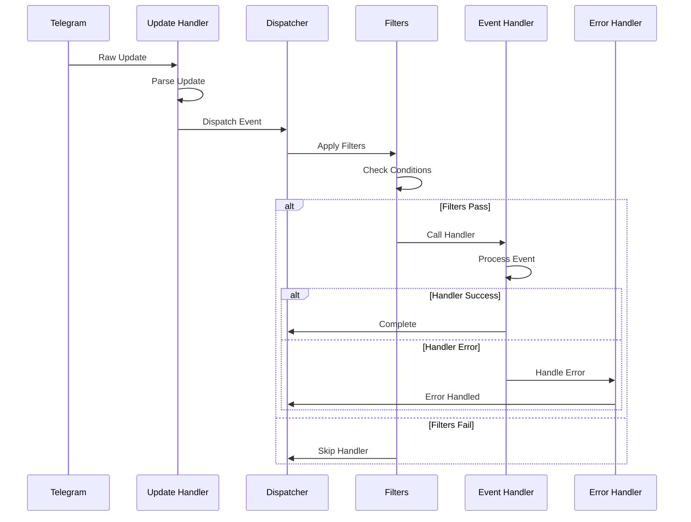

# Event Handling

---
**Navigation:** [← Event Types](types.md) | [Home](../index.md) | [Up](../index.md) | [Custom Events →](custom.md)

---

## Overview

Event handling in Telethon provides a robust system for processing Telegram updates. The framework supports multiple handlers, filtering, priorities, and error recovery to build responsive applications.

## Handler Registration

### Basic Registration

```python
# Method 1: Decorator
@client.on(events.NewMessage(pattern='/start'))
async def start_handler(event):
    await event.reply('Welcome!')

# Method 2: add_event_handler
async def message_handler(event):
    print(f'New message: {event.text}')

client.add_event_handler(
    message_handler,
    events.NewMessage()
)

# Method 3: remove_event_handler
client.remove_event_handler(
    message_handler,
    events.NewMessage()
)
```

### Multiple Event Types

```python
# Single handler for multiple events
@client.on(events.NewMessage)
@client.on(events.MessageEdited)
async def message_handler(event):
    if isinstance(event, events.MessageEdited):
        await event.reply('You edited your message!')
    else:
        await event.reply('Thanks for your message!')

# Alternative approach
def combined_handler(event_types):
    def decorator(func):
        for event_type in event_types:
            client.add_event_handler(func, event_type())
        return func
    return decorator

@combined_handler([events.NewMessage, events.MessageEdited])
async def handler(event):
    pass
```

## Event Processing Flow



## Handler System Architecture

### Event Dispatcher

```python
class EventDispatcher:
    """
    Manages event handler registration and dispatching.
    """
    
    def __init__(self):
        self._handlers = defaultdict(list)
        self._global_handlers = []
        self._catch_all = None
        
    def add_handler(self, callback, event_type=None, 
                   priority=0, filters=None):
        """Add an event handler."""
        handler = EventHandler(
            callback=callback,
            event_type=event_type,
            priority=priority,
            filters=filters or {}
        )
        
        if event_type is None:
            self._global_handlers.append(handler)
        else:
            self._handlers[event_type].append(handler)
            
        # Sort by priority
        self._sort_handlers()
        
    async def dispatch(self, event):
        """Dispatch event to appropriate handlers."""
        event_type = type(event)
        
        # Get specific handlers
        handlers = self._handlers.get(event_type, [])
        
        # Add global handlers
        handlers.extend(self._global_handlers)
        
        # Process handlers in priority order
        for handler in handlers:
            try:
                if await self._check_filters(event, handler.filters):
                    await handler.callback(event)
                    
                    # Check if event was stopped
                    if getattr(event, '_stop_propagation', False):
                        break
                        
            except StopPropagation:
                break
            except Exception as e:
                await self._handle_error(e, event, handler)
```

### Handler Wrapper

```python
class EventHandler:
    """
    Wraps an event handler with metadata.
    """
    
    def __init__(self, callback, event_type, priority, filters):
        self.callback = callback
        self.event_type = event_type
        self.priority = priority
        self.filters = filters
        self._last_called = None
        self._call_count = 0
        
    async def __call__(self, event):
        """Call the handler."""
        self._last_called = time.time()
        self._call_count += 1
        
        # Add handler reference to event
        event._handler = self
        
        # Call actual handler
        return await self.callback(event)
        
    def matches(self, event):
        """Check if handler matches event."""
        if self.event_type and not isinstance(event, self.event_type):
            return False
            
        return self._check_filters(event)
```

## Advanced Filtering

### Filter System

```python
class EventFilter:
    """
    Advanced event filtering system.
    """
    
    def __init__(self, **kwargs):
        self.filters = kwargs
        
    async def check(self, event):
        """Check if event passes all filters."""
        for name, value in self.filters.items():
            if not await self._check_filter(name, value, event):
                return False
        return True
        
    async def _check_filter(self, name, value, event):
        """Check individual filter."""
        if name == 'chats':
            return await self._check_chat_filter(value, event)
        elif name == 'from_users':
            return await self._check_user_filter(value, event)
        elif name == 'pattern':
            return await self._check_pattern_filter(value, event)
        elif name == 'func':
            return await value(event)
        elif name == 'incoming':
            return event.is_private if value else not event.is_private
        elif name == 'outgoing':
            return event.out if value else not event.out
        else:
            # Custom filter
            return await self._check_custom_filter(name, value, event)
```

### Custom Filters

```python
# Time-based filter
def between_hours(start_hour, end_hour):
    def filter_func(event):
        current_hour = datetime.now().hour
        if start_hour <= end_hour:
            return start_hour <= current_hour <= end_hour
        else:  # Crosses midnight
            return current_hour >= start_hour or current_hour <= end_hour
    return filter_func

@client.on(events.NewMessage(
    func=between_hours(9, 17)  # Business hours only
))
async def business_handler(event):
    await event.reply('Message received during business hours')

# Content filter
def has_media(media_types=None):
    def filter_func(event):
        if not hasattr(event, 'message') or not event.message.media:
            return False
        if media_types is None:
            return True
        return any(
            isinstance(event.message.media, media_type)
            for media_type in media_types
        )
    return filter_func

@client.on(events.NewMessage(
    func=has_media([types.MessageMediaPhoto, types.MessageMediaVideo])
))
async def media_handler(event):
    await event.reply('Media received!')

# Composite filter
class CompositeFilter:
    def __init__(self, *filters, mode='all'):
        self.filters = filters
        self.mode = mode  # 'all' or 'any'
        
    async def __call__(self, event):
        if self.mode == 'all':
            return all(await f(event) for f in self.filters)
        else:
            return any(await f(event) for f in self.filters)

# Usage
admin_media_filter = CompositeFilter(
    lambda e: e.sender_id in ADMIN_IDS,
    has_media(),
    mode='all'
)

@client.on(events.NewMessage(func=admin_media_filter))
async def admin_media_handler(event):
    pass
```

## Handler Priorities

### Priority System

```python
class Priority:
    """Handler priority constants."""
    HIGHEST = 100
    HIGH = 50
    NORMAL = 0
    LOW = -50
    LOWEST = -100

# Register with priority
client.add_event_handler(
    urgent_handler,
    events.NewMessage(pattern='/urgent'),
    priority=Priority.HIGHEST
)

client.add_event_handler(
    logging_handler,
    events.NewMessage(),
    priority=Priority.LOWEST
)
```

### Priority Example

```python
# Authentication middleware (high priority)
@client.on(events.NewMessage(), priority=Priority.HIGH)
async def auth_middleware(event):
    if not await is_authenticated(event.sender_id):
        await event.reply('Please authenticate first!')
        raise StopPropagation  # Stop further processing

# Rate limiting (medium-high priority)
@client.on(events.NewMessage(), priority=30)
async def rate_limit_middleware(event):
    if await is_rate_limited(event.sender_id):
        await event.reply('Too many requests. Please wait.')
        raise StopPropagation

# Logging (low priority)
@client.on(events.NewMessage(), priority=Priority.LOW)
async def logging_middleware(event):
    logger.info(f'Message from {event.sender_id}: {event.text}')

# Actual handlers (normal priority)
@client.on(events.NewMessage(pattern='/start'))
async def start_handler(event):
    await event.reply('Welcome!')
```

## Error Handling

### Handler Error Management

```python
class HandlerErrorManager:
    """
    Manages errors in event handlers.
    """
    
    def __init__(self):
        self.error_handlers = []
        self.default_handler = self._default_error_handler
        
    def add_error_handler(self, handler, error_types=None):
        """Add custom error handler."""
        self.error_handlers.append({
            'handler': handler,
            'types': error_types or (Exception,)
        })
        
    async def handle_error(self, error, event, handler):
        """Handle an error from event handler."""
        # Try custom error handlers
        for error_handler in self.error_handlers:
            if isinstance(error, error_handler['types']):
                try:
                    return await error_handler['handler'](
                        error, event, handler
                    )
                except Exception as e:
                    logger.error(f'Error in error handler: {e}')
                    
        # Fall back to default
        return await self.default_handler(error, event, handler)
        
    async def _default_error_handler(self, error, event, handler):
        """Default error handling."""
        logger.error(
            f'Error in handler {handler.callback.__name__}: {error}',
            exc_info=True
        )
```

### Custom Error Handlers

```python
# Global error handler
async def global_error_handler(error, event, handler):
    if isinstance(error, FloodWaitError):
        logger.warning(f'Rate limited for {error.seconds}s')
        await asyncio.sleep(error.seconds)
        # Retry
        return await handler(event)
        
    elif isinstance(error, MessageNotModifiedError):
        # Ignore - message was already in desired state
        return
        
    elif isinstance(error, UserIsBlockedError):
        logger.info(f'User {event.sender_id} has blocked the bot')
        # Remove user from active list
        await remove_blocked_user(event.sender_id)
        
    else:
        # Log unexpected errors
        logger.error(f'Unexpected error: {error}', exc_info=True)
        
# Register error handler
client.add_error_handler(global_error_handler)

# Per-handler error handling
async def safe_handler(event):
    try:
        # Handler logic
        result = await process_message(event)
        await event.reply(f'Result: {result}')
        
    except ValueError as e:
        await event.reply(f'Invalid input: {e}')
        
    except DatabaseError as e:
        await event.reply('Sorry, database error. Try again later.')
        logger.error(f'Database error: {e}')
        
    except Exception as e:
        await event.reply('An unexpected error occurred.')
        logger.exception('Unexpected error in handler')
```

## State Management

### Handler State

```python
class StatefulHandler:
    """
    Handler with persistent state.
    """
    
    def __init__(self):
        self.conversations = {}
        self.user_data = {}
        
    async def __call__(self, event):
        user_id = event.sender_id
        
        # Get or create user state
        if user_id not in self.user_data:
            self.user_data[user_id] = {
                'state': 'initial',
                'data': {}
            }
            
        state = self.user_data[user_id]['state']
        
        # Route based on state
        if state == 'initial':
            await self.handle_initial(event)
        elif state == 'waiting_name':
            await self.handle_name(event)
        elif state == 'waiting_age':
            await self.handle_age(event)
            
    async def handle_initial(self, event):
        if event.text == '/register':
            await event.reply('What is your name?')
            self.user_data[event.sender_id]['state'] = 'waiting_name'
            
    async def handle_name(self, event):
        self.user_data[event.sender_id]['data']['name'] = event.text
        self.user_data[event.sender_id]['state'] = 'waiting_age'
        await event.reply('How old are you?')
        
    async def handle_age(self, event):
        try:
            age = int(event.text)
            user_data = self.user_data[event.sender_id]
            user_data['data']['age'] = age
            
            await event.reply(
                f"Registration complete!\n"
                f"Name: {user_data['data']['name']}\n"
                f"Age: {age}"
            )
            
            # Reset state
            self.user_data[event.sender_id]['state'] = 'initial'
            
        except ValueError:
            await event.reply('Please enter a valid number.')

# Register stateful handler
stateful = StatefulHandler()
client.add_event_handler(stateful, events.NewMessage())
```

## Performance Optimization

### Handler Caching

```python
class CachedHandler:
    """
    Handler with response caching.
    """
    
    def __init__(self, handler, ttl=300):
        self.handler = handler
        self.cache = TTLCache(maxsize=100, ttl=ttl)
        
    async def __call__(self, event):
        # Generate cache key
        key = self._get_cache_key(event)
        
        # Check cache
        if key in self.cache:
            cached_response = self.cache[key]
            if isinstance(cached_response, str):
                await event.reply(cached_response)
            return cached_response
            
        # Call actual handler
        result = await self.handler(event)
        
        # Cache result
        self.cache[key] = result
        return result
        
    def _get_cache_key(self, event):
        # Create key from event properties
        if hasattr(event, 'text'):
            return f"{event.chat_id}:{event.text}"
        return f"{event.chat_id}:{type(event).__name__}"

# Usage
@CachedHandler
async def expensive_handler(event):
    # Expensive computation
    result = await complex_calculation(event.text)
    await event.reply(f'Result: {result}')
    return result
```

### Batch Processing

```python
class BatchHandler:
    """
    Processes events in batches for efficiency.
    """
    
    def __init__(self, handler, batch_size=10, timeout=1.0):
        self.handler = handler
        self.batch_size = batch_size
        self.timeout = timeout
        self.pending = []
        self._timer = None
        
    async def __call__(self, event):
        self.pending.append(event)
        
        if len(self.pending) >= self.batch_size:
            await self._process_batch()
        elif not self._timer:
            self._timer = asyncio.create_task(self._timeout_flush())
            
    async def _timeout_flush(self):
        await asyncio.sleep(self.timeout)
        await self._process_batch()
        
    async def _process_batch(self):
        if not self.pending:
            return
            
        batch = self.pending[:]
        self.pending.clear()
        
        if self._timer:
            self._timer.cancel()
            self._timer = None
            
        # Process batch
        await self.handler(batch)

# Usage
@BatchHandler
async def analytics_handler(events):
    # Process multiple events at once
    data = [
        {
            'user_id': e.sender_id,
            'chat_id': e.chat_id,
            'text': getattr(e, 'text', ''),
            'timestamp': e.date
        }
        for e in events
    ]
    
    await save_analytics_batch(data)
```

## Handler Patterns

### Middleware Pattern

```python
class MiddlewareChain:
    """
    Chain of responsibility for handlers.
    """
    
    def __init__(self):
        self.middlewares = []
        
    def use(self, middleware):
        """Add middleware to chain."""
        self.middlewares.append(middleware)
        return self
        
    async def execute(self, event, handler):
        """Execute middleware chain."""
        async def run_next(index):
            if index >= len(self.middlewares):
                return await handler(event)
                
            middleware = self.middlewares[index]
            return await middleware(
                event,
                lambda: run_next(index + 1)
            )
            
        return await run_next(0)

# Middleware examples
async def logging_middleware(event, next_handler):
    start_time = time.time()
    
    try:
        result = await next_handler()
        duration = time.time() - start_time
        logger.info(f'Handler completed in {duration:.3f}s')
        return result
        
    except Exception as e:
        logger.error(f'Handler error: {e}')
        raise

async def auth_middleware(event, next_handler):
    if not await is_authenticated(event.sender_id):
        await event.reply('Authentication required!')
        return
        
    return await next_handler()

# Usage
chain = MiddlewareChain()
chain.use(logging_middleware)
chain.use(auth_middleware)

async def protected_handler(event):
    await event.reply('This is protected content!')

# Register with middleware
async def wrapped_handler(event):
    await chain.execute(event, protected_handler)

client.add_event_handler(wrapped_handler, events.NewMessage())
```

### Command Router

```python
class CommandRouter:
    """
    Routes commands to appropriate handlers.
    """
    
    def __init__(self, prefix='/'):
        self.prefix = prefix
        self.commands = {}
        self.middleware = []
        
    def command(self, name, **filters):
        """Decorator to register command."""
        def decorator(func):
            self.commands[name] = {
                'handler': func,
                'filters': filters
            }
            return func
        return decorator
        
    async def route(self, event):
        """Route event to command handler."""
        if not hasattr(event, 'text') or not event.text:
            return
            
        if not event.text.startswith(self.prefix):
            return
            
        # Parse command
        parts = event.text[len(self.prefix):].split(maxsplit=1)
        if not parts:
            return
            
        command = parts[0].lower()
        args = parts[1] if len(parts) > 1 else ''
        
        # Find handler
        if command not in self.commands:
            return
            
        cmd_info = self.commands[command]
        
        # Check filters
        for key, value in cmd_info['filters'].items():
            if not await self._check_filter(event, key, value):
                return
                
        # Add command info to event
        event.command = command
        event.args = args
        
        # Execute handler
        await cmd_info['handler'](event)

# Usage
router = CommandRouter()

@router.command('start')
async def start_cmd(event):
    await event.reply('Welcome! Use /help for commands.')

@router.command('help')
async def help_cmd(event):
    commands = '\n'.join(f'/{cmd}' for cmd in router.commands)
    await event.reply(f'Available commands:\n{commands}')

@router.command('echo')
async def echo_cmd(event):
    if event.args:
        await event.reply(event.args)
    else:
        await event.reply('Usage: /echo <text>')

# Register router
client.add_event_handler(router.route, events.NewMessage())
```

## Best Practices

### Handler Design

1. **Keep Handlers Focused**: Each handler should do one thing well
2. **Use Filters Effectively**: Filter early to reduce processing
3. **Handle Errors Gracefully**: Always consider what could go wrong
4. **Avoid Blocking Operations**: Use async operations
5. **Test Handler Logic**: Write unit tests for handlers

### Performance Tips

1. **Cache When Possible**: Cache expensive computations
2. **Batch Similar Operations**: Process multiple events together
3. **Use Priorities Wisely**: Order handlers by importance
4. **Limit Handler Complexity**: Keep handlers simple and fast
5. **Monitor Handler Performance**: Track execution times

## Next Steps

- Continue to [Custom Events](custom.md) for creating event types
- Review [Event Types](types.md) for available events
- See [Event Architecture](architecture.md) for system design

---
**Navigation:** [← Event Types](types.md) | [Home](../index.md) | [Up](../index.md) | [Custom Events →](custom.md)

---