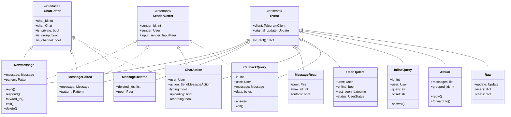

# Event Types

---
**Navigation:** [← Event Architecture](architecture.md) | [Home](../index.md) | [Up](../index.md) | [Event Handling →](handling.md)

---

## Overview

Telethon provides a comprehensive set of event types that cover all possible Telegram updates. Each event type is designed to handle specific kinds of updates with appropriate filtering and convenience methods.

## Event Type Hierarchy



## Message Events

### NewMessage

The most commonly used event for receiving new messages.

```python
@dataclass
class NewMessage(Event):
    """
    Occurs when a new message is received.
    """
    
    def __init__(self, message):
        self.message = message
        self.pattern_match = None
        self.grouped_id = message.grouped_id
        
    # Convenience properties
    @property
    def text(self):
        """Get message text."""
        return self.message.text or ''
        
    @property
    def raw_text(self):
        """Get message text without formatting."""
        return self.message.raw_text or ''
        
    @property
    def is_reply(self):
        """Check if message is a reply."""
        return bool(self.message.reply_to)
        
    @property
    def forward(self):
        """Get forward information."""
        return self.message.forward
        
    # Action methods
    async def reply(self, *args, **kwargs):
        """Reply to this message."""
        kwargs['reply_to'] = self.message.id
        return await self.client.send_message(
            await self.get_input_chat(),
            *args,
            **kwargs
        )
        
    async def respond(self, *args, **kwargs):
        """Respond in the same chat."""
        return await self.client.send_message(
            await self.get_input_chat(),
            *args,
            **kwargs
        )
        
    async def forward_to(self, entity):
        """Forward this message."""
        return await self.client.forward_messages(
            entity,
            self.message
        )
        
    async def edit(self, *args, **kwargs):
        """Edit this message."""
        return await self.client.edit_message(
            await self.get_input_chat(),
            self.message,
            *args,
            **kwargs
        )
        
    async def delete(self, *args, **kwargs):
        """Delete this message."""
        return await self.client.delete_messages(
            await self.get_input_chat(),
            self.message,
            *args,
            **kwargs
        )
        
    async def mark_read(self):
        """Mark message as read."""
        return await self.client.mark_read(
            await self.get_input_chat(),
            max_id=self.message.id
        )
        
    async def pin(self, notify=False):
        """Pin this message."""
        return await self.client.pin_message(
            await self.get_input_chat(),
            self.message.id,
            notify=notify
        )
```

#### Usage Examples

```python
# Simple message handler
@client.on(events.NewMessage)
async def handler(event):
    await event.reply('Hello!')

# Pattern matching
@client.on(events.NewMessage(pattern=r'\.ping'))
async def ping_handler(event):
    await event.reply('Pong!')

# Filter by chat
@client.on(events.NewMessage(chats=['username']))
async def chat_handler(event):
    print(f'Message in specific chat: {event.text}')

# Filter by sender
@client.on(events.NewMessage(from_users=[123456]))
async def user_handler(event):
    print(f'Message from specific user: {event.text}')

# Multiple filters
@client.on(events.NewMessage(
    pattern=r'\.help',
    outgoing=True,
    forwards=False
))
async def help_handler(event):
    await event.edit('Command list...')
```

### MessageEdited

Triggered when a message is edited.

```python
class MessageEdited(NewMessage):
    """
    Occurs when a message is edited.
    
    Inherits all properties and methods from NewMessage.
    """
    
    @property
    def edit_date(self):
        """Get edit timestamp."""
        return self.message.edit_date
        
    @property
    def edit_hide(self):
        """Check if edit is hidden."""
        return self.message.edit_hide
```

### MessageDeleted

Triggered when messages are deleted.

```python
class MessageDeleted(Event):
    """
    Occurs when messages are deleted.
    """
    
    def __init__(self, deleted_ids, peer):
        self.deleted_ids = deleted_ids
        self.peer = peer
        
    @property
    def count(self):
        """Number of deleted messages."""
        return len(self.deleted_ids)
        
    async def get_messages(self):
        """Try to get deleted messages from cache."""
        # Only works if messages were cached
        messages = []
        for msg_id in self.deleted_ids:
            msg = self.client._message_cache.get(
                (self.chat_id, msg_id)
            )
            if msg:
                messages.append(msg)
        return messages
```

### MessageRead

Triggered when messages are marked as read.

```python
class MessageRead(Event):
    """
    Occurs when messages are read.
    """
    
    def __init__(self, peer, max_id, outbox=False):
        self.peer = peer
        self.max_id = max_id
        self.outbox = outbox  # True if you read theirs
        
    @property
    def inbox(self):
        """True if they read yours."""
        return not self.outbox
```

## User Events

### UserUpdate

Triggered when user status changes.

```python
class UserUpdate(Event):
    """
    Occurs when a user's status changes.
    """
    
    def __init__(self, user, status=None):
        self.user = user
        self.status = status or user.status
        
    @property
    def online(self):
        """Check if user is online."""
        return isinstance(self.status, UserStatusOnline)
        
    @property
    def last_seen(self):
        """Get last seen time."""
        if isinstance(self.status, UserStatusOffline):
            return self.status.was_online
        return None
        
    @property
    def typing(self):
        """Check if user is typing."""
        return self.action == SendMessageTypingAction
        
    @property
    def recording(self):
        """Check if recording voice/video."""
        return isinstance(self.action, (
            SendMessageRecordAudioAction,
            SendMessageRecordVideoAction
        ))
        
    @property
    def uploading(self):
        """Check if uploading file."""
        return isinstance(self.action, (
            SendMessageUploadAudioAction,
            SendMessageUploadDocumentAction,
            SendMessageUploadPhotoAction,
            SendMessageUploadVideoAction
        ))
```

### ChatAction

Triggered when users perform actions in chats.

```python
class ChatAction(Event):
    """
    Occurs when a user performs an action in a chat.
    """
    
    ACTION_TYPES = {
        'typing': SendMessageTypingAction,
        'contact': SendMessageChooseContactAction,
        'game': SendMessageGamePlayAction,
        'location': SendMessageGeoLocationAction,
        'recording_audio': SendMessageRecordAudioAction,
        'recording_round': SendMessageRecordRoundAction,
        'recording_video': SendMessageRecordVideoAction,
        'uploading_audio': SendMessageUploadAudioAction,
        'uploading_document': SendMessageUploadDocumentAction,
        'uploading_photo': SendMessageUploadPhotoAction,
        'uploading_round': SendMessageUploadRoundAction,
        'uploading_video': SendMessageUploadVideoAction,
        'cancel': SendMessageCancelAction
    }
    
    def __init__(self, action, users, chat):
        self.action = action
        self.users = users  # List of users performing action
        self._chat = chat
        
    @property
    def user(self):
        """Primary user performing action."""
        return self.users[0] if self.users else None
```

## Interactive Events

### CallbackQuery

Triggered when inline buttons are clicked.

```python
class CallbackQuery(Event):
    """
    Occurs when an inline button is clicked.
    """
    
    def __init__(self, query, peer, msg_id):
        self.query = query
        self.id = query.query_id
        self.data = query.data
        self.chat_instance = query.chat_instance
        self.peer = peer
        self.msg_id = msg_id
        self._answered = False
        
    @property
    def message(self):
        """Get the message containing the button."""
        return self._message
        
    async def answer(self, message=None, *,
                    cache_time=0, url=None, alert=False):
        """Answer the callback query."""
        if self._answered:
            return
            
        self._answered = True
        return await self.client(
            SetBotCallbackAnswerRequest(
                query_id=self.id,
                message=message,
                cache_time=cache_time,
                url=url,
                alert=alert
            )
        )
        
    async def edit(self, *args, **kwargs):
        """Edit the message containing the button."""
        return await self.client.edit_message(
            self.peer,
            self.msg_id,
            *args,
            **kwargs
        )
        
    async def delete(self):
        """Delete the message containing the button."""
        return await self.client.delete_messages(
            self.peer,
            self.msg_id
        )
```

### InlineQuery

Triggered for inline bot queries.

```python
class InlineQuery(Event):
    """
    Occurs when a user types an inline query.
    """
    
    def __init__(self, query):
        self.query = query
        self.id = query.query_id
        self.text = query.query
        self.offset = query.offset
        self.geo = query.geo
        self.peer_type = query.peer_type
        self._answered = False
        
    @property
    def user(self):
        """User who sent the query."""
        return self._user
        
    async def answer(self, results, *,
                    cache_time=300, gallery=False,
                    next_offset=None, private=False,
                    switch_pm=None, switch_pm_param=''):
        """Answer the inline query."""
        if self._answered:
            return
            
        self._answered = True
        return await self.client(
            SetInlineBotResultsRequest(
                query_id=self.id,
                results=results,
                cache_time=cache_time,
                gallery=gallery,
                next_offset=next_offset,
                private=private,
                switch_pm=switch_pm,
                switch_pm_param=switch_pm_param
            )
        )
        
    def builder(self):
        """Get result builder for this query."""
        return InlineBuilder(self.client)
```

## Special Events

### Album

Groups media messages sent as an album.

```python
class Album(Event):
    """
    Occurs when multiple media are sent together.
    """
    
    def __init__(self, messages):
        self.messages = messages
        self.grouped_id = messages[0].grouped_id if messages else None
        
    @property
    def text(self):
        """Get album caption."""
        for msg in self.messages:
            if msg.text:
                return msg.text
        return ''
        
    @property
    def photos(self):
        """Get all photos in album."""
        return [
            msg.photo for msg in self.messages
            if msg.photo
        ]
        
    @property
    def videos(self):
        """Get all videos in album."""
        return [
            msg.video for msg in self.messages
            if msg.video
        ]
        
    async def reply(self, *args, **kwargs):
        """Reply to album."""
        kwargs['reply_to'] = self.messages[0].id
        return await self.client.send_message(
            await self.get_input_chat(),
            *args,
            **kwargs
        )
        
    async def forward_to(self, entity):
        """Forward entire album."""
        return await self.client.forward_messages(
            entity,
            self.messages
        )
```

### Raw

Provides access to raw Telegram updates.

```python
class Raw(Event):
    """
    Occurs for any raw update.
    
    Useful for handling updates not covered by other events.
    """
    
    def __init__(self, update, users, chats):
        self.update = update
        self.users = users
        self.chats = chats
        
    @property
    def update_type(self):
        """Get the update type name."""
        return type(self.update).__name__
```

## Event Filtering

### Filter Options

```python
class EventFilter:
    """
    Common filter options for events.
    """
    
    # Chat filters
    chats: List[Union[int, str]]  # Specific chats
    blacklist_chats: bool = False  # Blacklist instead
    
    # User filters  
    from_users: List[Union[int, str]]  # Specific senders
    
    # Message filters
    incoming: bool = None  # From others
    outgoing: bool = None  # From you
    forwards: bool = None  # Forwarded messages
    
    # Pattern matching
    pattern: Union[str, Pattern]  # Regex pattern
    
    # Custom filter
    func: Callable[[Event], bool]  # Custom function
```

### Advanced Filtering

```python
# Complex pattern matching
@client.on(events.NewMessage(
    pattern=re.compile(r'^\.(\w+)(?:\s+(.+))?$', re.IGNORECASE)
))
async def command_handler(event):
    command = event.pattern_match.group(1)
    args = event.pattern_match.group(2)
    
# Combined filters
@client.on(events.NewMessage(
    func=lambda e: e.is_private and len(e.text) > 100
))
async def long_private_handler(event):
    pass

# Multiple event types
@client.on(events.NewMessage, events.MessageEdited)
async def message_handler(event):
    if isinstance(event, events.MessageEdited):
        print('Message was edited')
```

## Event Priorities

```python
# Priority constants
class EventPriority:
    LOWEST = -100
    LOW = -50
    NORMAL = 0
    HIGH = 50
    HIGHEST = 100

# Register with priority
client.add_event_handler(
    handler_func,
    events.NewMessage(),
    priority=EventPriority.HIGH
)
```

## Best Practices

### Event Handler Design

1. **Use Specific Events**: Choose the most specific event type
2. **Filter Early**: Use built-in filters to reduce processing
3. **Keep Handlers Fast**: Avoid blocking operations
4. **Handle Errors**: Wrap handlers in try/except
5. **Use Priorities**: Order handlers by importance

### Performance Tips

1. **Avoid Heavy Filters**: Complex regex can be slow
2. **Cache Results**: Store frequently accessed data
3. **Batch Operations**: Group similar actions
4. **Limit API Calls**: Minimize calls in handlers
5. **Use Async**: Leverage async operations

## Next Steps

- Continue to [Event Handling](handling.md) for usage patterns
- See [Custom Events](custom.md) for creating new events
- Review [Event Architecture](architecture.md) for system design

---
**Navigation:** [← Event Architecture](architecture.md) | [Home](../index.md) | [Up](../index.md) | [Event Handling →](handling.md)

---