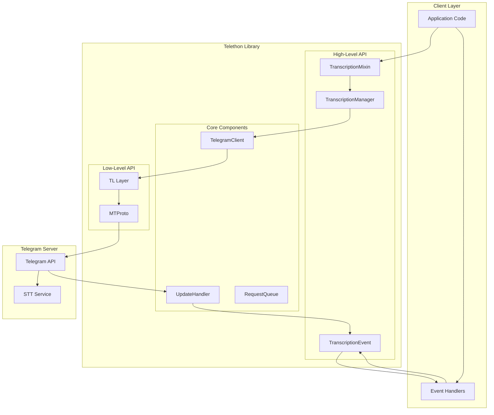
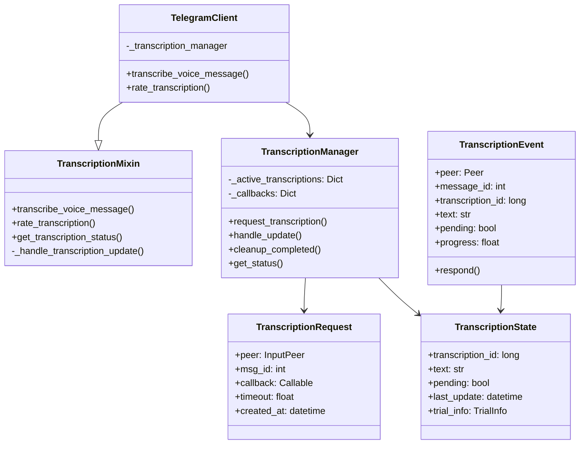
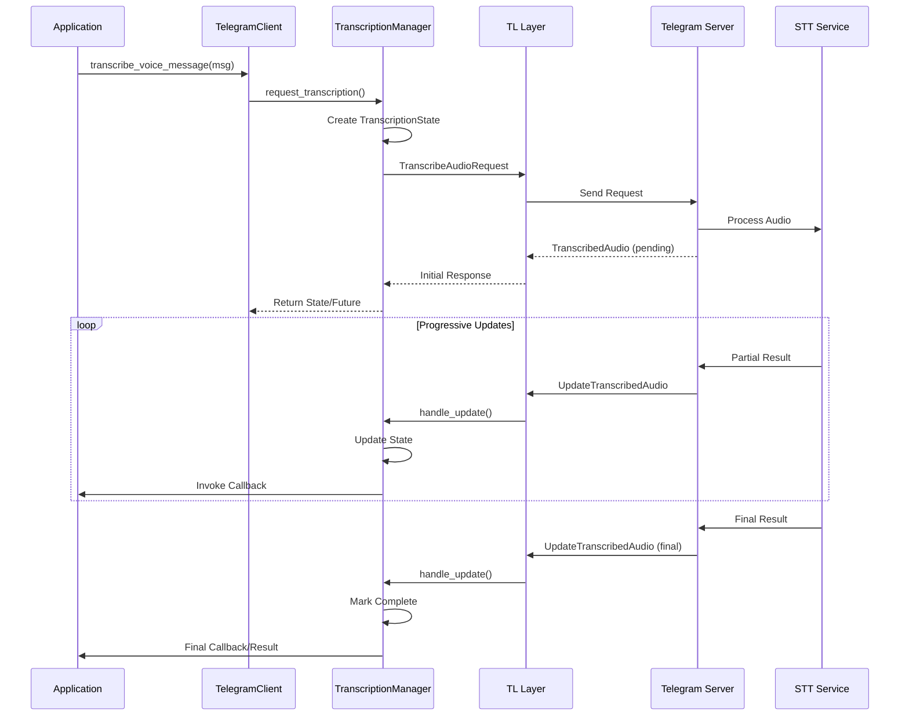
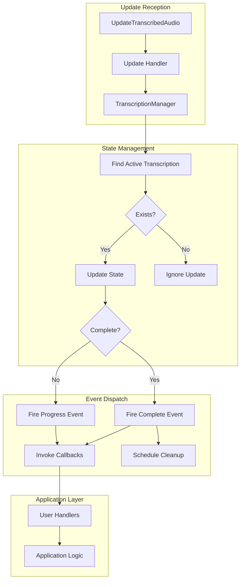
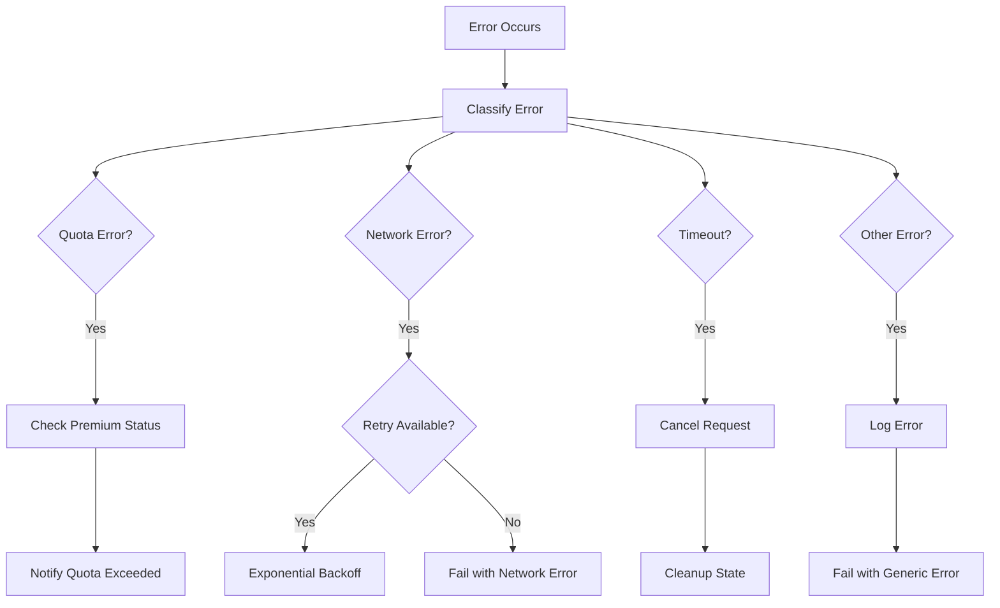

# Technical Architecture: Voice Message Transcription Feature

## Table of Contents

1. [Overview](#overview)
2. [System Architecture](#system-architecture)
3. [Component Design](#component-design)
4. [Data Flow](#data-flow)
5. [Implementation Details](#implementation-details)
6. [Integration Points](#integration-points)
7. [Error Handling](#error-handling)
8. [Performance Considerations](#performance-considerations)
9. [Security Considerations](#security-considerations)
10. [Testing Strategy](#testing-strategy)

## Overview

This document outlines the technical architecture for implementing voice message transcription support in Telethon, leveraging Telegram's Speech-to-Text API.

### Feature Requirements

- Request transcription of voice messages
- Handle progressive transcription updates
- Rate transcription quality
- Manage Premium user limitations
- Support both synchronous and asynchronous usage patterns

## System Architecture

### High-Level Architecture



### Component Relationships



## Component Design

### 1. TranscriptionMixin

```python
class TranscriptionMixin:
    """Mixin to add voice transcription functionality to TelegramClient."""
    
    def __init__(self):
        self._transcription_manager = TranscriptionManager(self)
        
    async def transcribe_voice_message(
        self,
        entity: 'hints.EntityLike',
        message: 'typing.Union[int, types.Message]',
        *,
        wait_for_result: bool = True,
        timeout: float = 30.0,
        callback: typing.Optional[typing.Callable] = None
    ) -> typing.Union[str, TranscriptionState]:
        """
        Request transcription of a voice message.
        
        Args:
            entity: The chat containing the message
            message: Message ID or Message object with voice
            wait_for_result: Wait for complete transcription
            timeout: Maximum wait time
            callback: Progress callback function
            
        Returns:
            Transcribed text or TranscriptionState object
        """
        
    async def rate_transcription(
        self,
        entity: 'hints.EntityLike',
        message: 'typing.Union[int, types.Message]',
        transcription_id: int,
        good: bool
    ) -> bool:
        """Rate the quality of a transcription."""
        
    async def get_transcription_status(
        self,
        entity: 'hints.EntityLike',
        message: 'typing.Union[int, types.Message]'
    ) -> typing.Optional[TranscriptionState]:
        """Get current transcription status for a message."""
```

### 2. TranscriptionManager

```python
class TranscriptionManager:
    """Manages active transcriptions and their states."""
    
    def __init__(self, client: TelegramClient):
        self._client = client
        self._active_transcriptions: Dict[str, TranscriptionState] = {}
        self._callbacks: Dict[str, List[Callable]] = {}
        self._cleanup_task: Optional[asyncio.Task] = None
        
    async def request_transcription(
        self,
        peer: types.InputPeer,
        msg_id: int,
        callback: Optional[Callable] = None
    ) -> TranscriptionState:
        """Request a new transcription."""
        
    async def handle_update(
        self,
        update: types.UpdateTranscribedAudio
    ) -> None:
        """Process transcription update from server."""
        
    def _get_key(self, peer_id: int, msg_id: int) -> str:
        """Generate unique key for transcription tracking."""
        return f"{peer_id}:{msg_id}"
        
    async def _cleanup_completed(self) -> None:
        """Periodic cleanup of completed transcriptions."""
```

### 3. Event System Integration

```python
@dataclass
class TranscriptionEvent(EventCommon):
    """Event fired when transcription updates are received."""
    
    transcription_id: int
    text: str
    pending: bool
    progress: float  # Estimated progress (0.0 to 1.0)
    trial_remains: Optional[int]
    trial_expires: Optional[datetime]
    
    @classmethod
    def build(cls, update: types.UpdateTranscribedAudio, 
              others: List[types.Update], 
              self_id: int) -> 'TranscriptionEvent':
        """Build event from update."""
        
class TranscriptionProgressEvent(TranscriptionEvent):
    """Fired for intermediate transcription updates."""
    
class TranscriptionCompleteEvent(TranscriptionEvent):
    """Fired when transcription is complete."""
```

## Data Flow

### Transcription Request Flow



### Update Processing Flow



## Implementation Details

### State Management

```python
class TranscriptionState:
    """Represents the state of an active transcription."""
    
    def __init__(self, peer_id: int, msg_id: int, transcription_id: int):
        self.peer_id = peer_id
        self.msg_id = msg_id
        self.transcription_id = transcription_id
        self.text = ""
        self.pending = True
        self.created_at = datetime.now()
        self.last_update = datetime.now()
        self.update_count = 0
        self.trial_info: Optional[TrialInfo] = None
        self._future: Optional[asyncio.Future] = None
        
    def update(self, text: str, pending: bool, 
               trial_remains: Optional[int] = None,
               trial_expires: Optional[int] = None) -> None:
        """Update transcription state with new data."""
        self.text = text
        self.pending = pending
        self.last_update = datetime.now()
        self.update_count += 1
        
        if trial_remains is not None:
            self.trial_info = TrialInfo(trial_remains, trial_expires)
            
        if not pending and self._future:
            self._future.set_result(self.text)
```

### Concurrent Request Handling

```python
class TranscriptionManager:
    """Enhanced with concurrent request handling."""
    
    async def request_transcription(
        self,
        peer: types.InputPeer,
        msg_id: int,
        callback: Optional[Callable] = None
    ) -> TranscriptionState:
        key = self._get_key(peer.to_id(), msg_id)
        
        # Check if already transcribing
        if key in self._active_transcriptions:
            state = self._active_transcriptions[key]
            if callback:
                self._callbacks[key].append(callback)
            return state
            
        # Send request
        result = await self._client(
            functions.messages.TranscribeAudioRequest(
                peer=peer,
                msg_id=msg_id
            )
        )
        
        # Create state
        state = TranscriptionState(
            peer.to_id(),
            msg_id,
            result.transcription_id
        )
        state.update(
            result.text,
            result.pending,
            result.trial_remains_num,
            result.trial_remains_until_date
        )
        
        # Store state and callbacks
        self._active_transcriptions[key] = state
        if callback:
            self._callbacks[key] = [callback]
            
        return state
```

### Rate Limiting and Quotas

```python
class TranscriptionQuotaManager:
    """Manages transcription quotas and rate limits."""
    
    def __init__(self):
        self._user_quotas: Dict[int, QuotaInfo] = {}
        self._rate_limiter = RateLimiter(
            max_requests=10,
            window_seconds=60
        )
        
    async def check_quota(self, user_id: int) -> QuotaStatus:
        """Check if user has available transcription quota."""
        
    async def consume_quota(self, user_id: int) -> None:
        """Consume one transcription from user's quota."""
        
    def update_quota(self, user_id: int, 
                    remains: int, expires: int) -> None:
        """Update user's quota information from server response."""
```

## Integration Points

### 1. Client Integration

```python
# In telethon/client/telegramclient.py
class TelegramClient(
    TranscriptionMixin,  # Add new mixin
    UpdateMethods,
    MessageMethods,
    # ... other mixins
):
    pass
```

### 2. Update Handler Integration

```python
# In telethon/client/updates.py
async def _handle_update(self: 'TelegramClient', update):
    # ... existing code ...
    
    if isinstance(update, types.UpdateTranscribedAudio):
        await self._transcription_manager.handle_update(update)
        
        # Build and dispatch events
        event = TranscriptionEvent.build(update, [], self._self_id)
        await self._dispatch_event(event)
```

### 3. Event Registration

```python
# Usage example
@client.on(events.TranscriptionComplete)
async def on_transcription_complete(event):
    print(f"Transcription complete: {event.text}")
    
@client.on(events.TranscriptionProgress)
async def on_transcription_progress(event):
    print(f"Progress: {event.text} ({event.progress:.0%})")
```

## Error Handling

### Error Types and Handling

```python
class TranscriptionError(Exception):
    """Base exception for transcription errors."""
    
class TranscriptionQuotaExceeded(TranscriptionError):
    """User has exceeded transcription quota."""
    
class TranscriptionNotAvailable(TranscriptionError):
    """Transcription not available for this message."""
    
class TranscriptionTimeout(TranscriptionError):
    """Transcription timed out waiting for result."""
```

### Error Recovery Strategy



## Performance Considerations

### 1. Memory Management

```python
class TranscriptionManager:
    """Enhanced with memory management."""
    
    def __init__(self, client: TelegramClient, 
                 max_cache_size: int = 1000,
                 ttl_seconds: int = 3600):
        self._max_cache_size = max_cache_size
        self._ttl_seconds = ttl_seconds
        
    async def _cleanup_expired(self):
        """Remove expired transcriptions from cache."""
        now = datetime.now()
        expired_keys = [
            key for key, state in self._active_transcriptions.items()
            if (now - state.last_update).seconds > self._ttl_seconds
        ]
        
        for key in expired_keys:
            del self._active_transcriptions[key]
            self._callbacks.pop(key, None)
```

### 2. Request Batching

```python
class BatchedTranscriptionManager(TranscriptionManager):
    """Supports batched transcription requests."""
    
    async def transcribe_multiple(
        self,
        messages: List[Tuple[types.InputPeer, int]],
        callback: Optional[Callable] = None
    ) -> List[TranscriptionState]:
        """Request transcription for multiple messages."""
        tasks = [
            self.request_transcription(peer, msg_id, callback)
            for peer, msg_id in messages
        ]
        return await asyncio.gather(*tasks, return_exceptions=True)
```

### 3. Caching Strategy

```python
class TranscriptionCache:
    """LRU cache for completed transcriptions."""
    
    def __init__(self, max_size: int = 1000):
        self._cache: OrderedDict[str, CachedTranscription] = OrderedDict()
        self._max_size = max_size
        
    def get(self, peer_id: int, msg_id: int) -> Optional[str]:
        """Get cached transcription if available."""
        key = f"{peer_id}:{msg_id}"
        if key in self._cache:
            # Move to end (most recently used)
            self._cache.move_to_end(key)
            return self._cache[key].text
        return None
        
    def put(self, peer_id: int, msg_id: int, text: str) -> None:
        """Cache a completed transcription."""
        key = f"{peer_id}:{msg_id}"
        self._cache[key] = CachedTranscription(text, datetime.now())
        
        # Evict oldest if over capacity
        if len(self._cache) > self._max_size:
            self._cache.popitem(last=False)
```

## Security Considerations

### 1. Input Validation

```python
async def transcribe_voice_message(self, entity, message, **kwargs):
    """Enhanced with input validation."""
    
    # Validate entity
    entity = await self.get_input_entity(entity)
    
    # Validate message
    if isinstance(message, int):
        msg_id = message
    elif hasattr(message, 'id'):
        msg_id = message.id
        # Verify it's a voice message
        if not (hasattr(message, 'media') and 
                isinstance(message.media, types.MessageMediaDocument) and
                message.media.document.mime_type.startswith('audio/')):
            raise ValueError("Message does not contain voice audio")
    else:
        raise TypeError("message must be an ID or Message object")
```

### 2. Rate Limiting Protection

```python
class RateLimiter:
    """Token bucket rate limiter."""
    
    def __init__(self, max_requests: int, window_seconds: int):
        self._max_requests = max_requests
        self._window_seconds = window_seconds
        self._requests: Deque[datetime] = deque()
        
    async def acquire(self) -> None:
        """Acquire permission to make a request."""
        now = datetime.now()
        
        # Remove old requests outside window
        cutoff = now - timedelta(seconds=self._window_seconds)
        while self._requests and self._requests[0] < cutoff:
            self._requests.popleft()
            
        # Check if under limit
        if len(self._requests) >= self._max_requests:
            wait_time = (self._requests[0] + 
                        timedelta(seconds=self._window_seconds) - now)
            await asyncio.sleep(wait_time.total_seconds())
            
        self._requests.append(now)
```

### 3. Privacy Considerations

- Transcriptions should not be logged by default
- Cache should be optional and configurable
- User consent should be considered for automated transcription

## Testing Strategy

### 1. Unit Tests

```python
class TestTranscriptionManager:
    """Unit tests for TranscriptionManager."""
    
    async def test_request_transcription(self):
        """Test basic transcription request."""
        
    async def test_handle_update(self):
        """Test update handling."""
        
    async def test_concurrent_requests(self):
        """Test handling of concurrent requests."""
        
    async def test_cleanup(self):
        """Test cleanup of completed transcriptions."""
```

### 2. Integration Tests

```python
class TestTranscriptionIntegration:
    """Integration tests with mock server."""
    
    async def test_full_transcription_flow(self):
        """Test complete transcription flow."""
        
    async def test_progressive_updates(self):
        """Test handling of progressive updates."""
        
    async def test_error_scenarios(self):
        """Test various error scenarios."""
```

### 3. Performance Tests

```python
class TestTranscriptionPerformance:
    """Performance and load tests."""
    
    async def test_concurrent_transcriptions(self):
        """Test handling many concurrent transcriptions."""
        
    async def test_memory_usage(self):
        """Test memory usage under load."""
        
    async def test_cleanup_performance(self):
        """Test cleanup performance with many transcriptions."""
```

## Migration Strategy

### Phase 1: Core Implementation
1. Implement TranscriptionManager
2. Add TranscriptionMixin
3. Integrate with update handler

### Phase 2: Event System
1. Create event types
2. Add event builders
3. Test event dispatching

### Phase 3: Enhanced Features
1. Add caching layer
2. Implement rate limiting
3. Add batch operations

### Phase 4: Documentation
1. API documentation
2. Usage examples
3. Migration guide

## Conclusion

This architecture provides a robust, scalable implementation of voice message transcription in Telethon. It follows existing patterns in the library while adding new capabilities for handling asynchronous, progressive transcription updates. The design prioritizes:

- **Compatibility**: Follows Telethon's existing patterns
- **Performance**: Efficient handling of concurrent requests
- **Reliability**: Comprehensive error handling
- **Usability**: Both simple and advanced usage patterns
- **Maintainability**: Clear separation of concerns

The implementation can be rolled out incrementally, starting with core functionality and adding enhanced features based on user feedback and requirements.