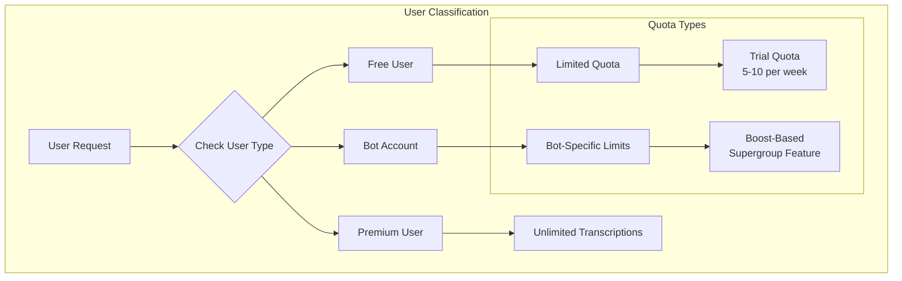
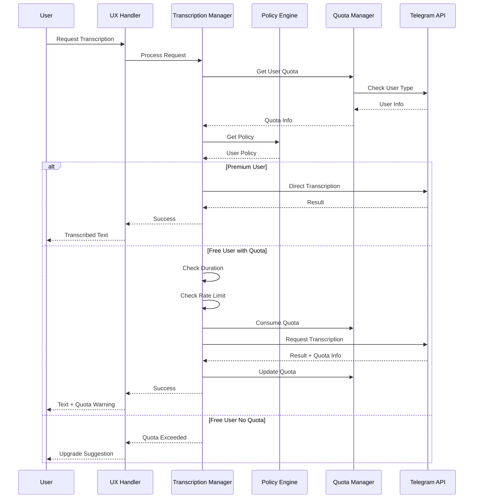
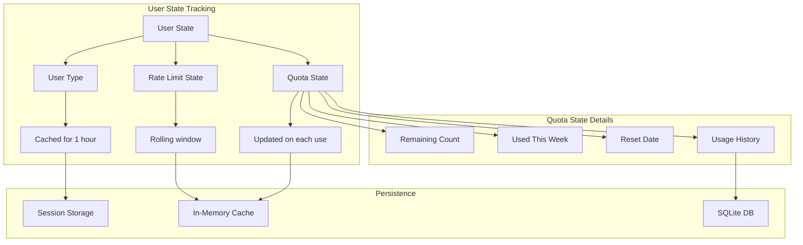

# User Type-Based Voice Transcription Architecture

---
**Navigation:** [← Examples](examples.md) | [Home](../../index.md) | [Up](README.md)

---

## Overview

This document details the architecture for handling voice transcription differently based on user type (Free vs Premium), including quota management, rate limiting, and graceful degradation strategies.

## User Type Classification



## Core Architecture Components

### 1. User Type Manager

```python
from enum import Enum
from dataclasses import dataclass
from datetime import datetime, timedelta
from typing import Optional, Dict, List

class UserType(Enum):
    FREE = "free"
    PREMIUM = "premium"
    BOT = "bot"
    UNKNOWN = "unknown"

@dataclass
class UserQuota:
    """Represents a user's transcription quota."""
    user_id: int
    user_type: UserType
    remaining: Optional[int]  # None for unlimited
    reset_date: Optional[datetime]
    total_weekly: Optional[int]
    used_this_week: int = 0
    last_checked: datetime = datetime.now()

class UserTypeManager:
    """Manages user types and their transcription quotas."""
    
    def __init__(self, client: 'TelegramClient'):
        self._client = client
        self._user_cache: Dict[int, UserQuota] = {}
        self._premium_cache: Dict[int, bool] = {}
        self._cache_ttl = timedelta(hours=1)
        
    async def get_user_quota(self, user_id: int) -> UserQuota:
        """Get user's transcription quota information."""
        # Check cache
        if user_id in self._user_cache:
            quota = self._user_cache[user_id]
            if datetime.now() - quota.last_checked < self._cache_ttl:
                return quota
        
        # Determine user type
        user_type = await self._determine_user_type(user_id)
        
        # Create quota based on type
        if user_type == UserType.PREMIUM:
            quota = UserQuota(
                user_id=user_id,
                user_type=UserType.PREMIUM,
                remaining=None,  # Unlimited
                reset_date=None,
                total_weekly=None
            )
        else:
            # Free user - check server for actual quota
            quota = await self._fetch_free_user_quota(user_id)
            
        self._user_cache[user_id] = quota
        return quota
    
    async def _determine_user_type(self, user_id: int) -> UserType:
        """Determine if user is free or premium."""
        # Check if it's the current user
        me = await self._client.get_me()
        if user_id == me.id:
            return UserType.PREMIUM if me.premium else UserType.FREE
        
        # For other users, check cached premium status
        if user_id in self._premium_cache:
            return UserType.PREMIUM if self._premium_cache[user_id] else UserType.FREE
        
        # Fetch user info
        try:
            users = await self._client.get_entity(user_id)
            if hasattr(users, 'premium') and users.premium:
                self._premium_cache[user_id] = True
                return UserType.PREMIUM
        except:
            pass
            
        self._premium_cache[user_id] = False
        return UserType.FREE
    
    async def consume_quota(self, user_id: int) -> bool:
        """
        Consume one transcription from user's quota.
        Returns True if successful, False if quota exceeded.
        """
        quota = await self.get_user_quota(user_id)
        
        if quota.user_type == UserType.PREMIUM:
            return True  # Always allowed
            
        if quota.remaining is not None and quota.remaining > 0:
            quota.remaining -= 1
            quota.used_this_week += 1
            return True
            
        return False
    
    def update_quota_from_response(self, user_id: int, 
                                  remains: Optional[int], 
                                  reset_timestamp: Optional[int]):
        """Update quota information from server response."""
        if user_id in self._user_cache:
            quota = self._user_cache[user_id]
            quota.remaining = remains
            if reset_timestamp:
                quota.reset_date = datetime.fromtimestamp(reset_timestamp)
```

### 2. Transcription Policy Engine

```python
@dataclass
class TranscriptionPolicy:
    """Policy for handling transcription requests based on user type."""
    allow_transcription: bool
    use_cache: bool
    max_duration_seconds: Optional[int]
    rate_limit_per_minute: int
    priority: int  # Higher = higher priority
    fallback_strategy: Optional[str]

class TranscriptionPolicyEngine:
    """Determines transcription policies based on user type and context."""
    
    # Default policies by user type
    POLICIES = {
        UserType.PREMIUM: TranscriptionPolicy(
            allow_transcription=True,
            use_cache=True,
            max_duration_seconds=None,  # No limit
            rate_limit_per_minute=30,
            priority=100,
            fallback_strategy=None
        ),
        UserType.FREE: TranscriptionPolicy(
            allow_transcription=True,
            use_cache=True,
            max_duration_seconds=60,  # 1 minute max
            rate_limit_per_minute=2,
            priority=50,
            fallback_strategy="suggest_premium"
        ),
        UserType.BOT: TranscriptionPolicy(
            allow_transcription=False,
            use_cache=True,
            max_duration_seconds=30,
            rate_limit_per_minute=10,
            priority=75,
            fallback_strategy="check_supergroup_boost"
        )
    }
    
    def __init__(self, user_type_manager: UserTypeManager):
        self._user_manager = user_type_manager
        self._rate_limiters: Dict[int, RateLimiter] = {}
        
    async def get_policy(self, user_id: int, 
                        context: Optional[Dict] = None) -> TranscriptionPolicy:
        """Get transcription policy for a user."""
        quota = await self._user_manager.get_user_quota(user_id)
        base_policy = self.POLICIES.get(quota.user_type, self.POLICIES[UserType.FREE])
        
        # Adjust policy based on context
        if context:
            return self._adjust_policy(base_policy, quota, context)
            
        return base_policy
    
    def _adjust_policy(self, base_policy: TranscriptionPolicy, 
                      quota: UserQuota, 
                      context: Dict) -> TranscriptionPolicy:
        """Adjust policy based on context (e.g., supergroup boost level)."""
        policy = dataclasses.replace(base_policy)
        
        # Check supergroup boost
        if context.get('supergroup_boost_level', 0) >= 5:
            policy.allow_transcription = True
            policy.max_duration_seconds = 120
            
        # Low quota warning
        if quota.remaining is not None and quota.remaining <= 2:
            policy.fallback_strategy = "low_quota_warning"
            
        return policy
    
    async def check_rate_limit(self, user_id: int, policy: TranscriptionPolicy) -> bool:
        """Check if user is within rate limits."""
        if user_id not in self._rate_limiters:
            self._rate_limiters[user_id] = RateLimiter(
                max_requests=policy.rate_limit_per_minute,
                window_seconds=60
            )
            
        return await self._rate_limiters[user_id].check()
```

### 3. Enhanced Transcription Manager

```python
class EnhancedTranscriptionManager(TranscriptionManager):
    """Transcription manager with user type awareness."""
    
    def __init__(self, client: TelegramClient):
        super().__init__(client)
        self._user_manager = UserTypeManager(client)
        self._policy_engine = TranscriptionPolicyEngine(self._user_manager)
        self._transcription_cache = TranscriptionCache()
        
    async def transcribe_voice_message(
        self,
        entity: 'hints.EntityLike',
        message: 'typing.Union[int, types.Message]',
        *,
        user_id: Optional[int] = None,
        force: bool = False,
        **kwargs
    ) -> TranscriptionResult:
        """
        Enhanced transcription with user type handling.
        
        Args:
            entity: Chat containing the message
            message: Voice message to transcribe
            user_id: User requesting transcription (defaults to self)
            force: Force transcription even if quota exceeded
        """
        # Determine requesting user
        if user_id is None:
            me = await self._client.get_me()
            user_id = me.id
            
        # Get message details
        msg = await self._resolve_message(entity, message)
        if not self._is_voice_message(msg):
            raise ValueError("Not a voice message")
            
        # Check cache first
        cached = self._transcription_cache.get(msg.chat_id, msg.id)
        if cached and not force:
            return TranscriptionResult(
                text=cached,
                cached=True,
                quota_used=False
            )
        
        # Get user policy
        context = await self._get_context(entity, msg)
        policy = await self._policy_engine.get_policy(user_id, context)
        
        # Check if transcription is allowed
        if not policy.allow_transcription and not force:
            return await self._handle_transcription_denied(user_id, policy)
            
        # Check rate limit
        if not await self._policy_engine.check_rate_limit(user_id, policy):
            raise TranscriptionRateLimitError("Rate limit exceeded")
            
        # Check voice duration
        if policy.max_duration_seconds:
            duration = self._get_voice_duration(msg)
            if duration > policy.max_duration_seconds:
                return await self._handle_duration_exceeded(
                    user_id, duration, policy
                )
        
        # Check and consume quota
        if not await self._user_manager.consume_quota(user_id) and not force:
            return await self._handle_quota_exceeded(user_id)
            
        # Perform transcription
        try:
            result = await self._perform_transcription(msg, policy)
            
            # Update quota from response
            if hasattr(result, 'trial_remains_num'):
                self._user_manager.update_quota_from_response(
                    user_id,
                    result.trial_remains_num,
                    result.trial_remains_until_date
                )
                
            # Cache result
            if policy.use_cache and result.text:
                self._transcription_cache.put(msg.chat_id, msg.id, result.text)
                
            return TranscriptionResult(
                text=result.text,
                cached=False,
                quota_used=True,
                remaining_quota=result.trial_remains_num
            )
            
        except Exception as e:
            # Restore quota on failure
            await self._user_manager.restore_quota(user_id)
            raise
```

### 4. User Experience Handlers

```python
class TranscriptionUXHandler:
    """Handles user experience for different user types."""
    
    def __init__(self, client: TelegramClient):
        self._client = client
        
    async def handle_free_user_experience(
        self,
        event: events.NewMessage.Event,
        quota: UserQuota
    ):
        """Handle transcription request from free user."""
        if quota.remaining == 0:
            await event.reply(
                "❌ **Transcription Quota Exceeded**\n\n"
                f"Your free weekly quota has been used up.\n"
                f"Resets on: {quota.reset_date.strftime('%A, %B %d')}\n\n"
                "💎 Upgrade to Telegram Premium for unlimited transcriptions!"
            )
            return False
            
        elif quota.remaining <= 2:
            await event.reply(
                f"⚠️ **Low Quota Warning**\n\n"
                f"You have {quota.remaining} transcription(s) remaining this week.\n"
                "Use them wisely or consider upgrading to Premium!"
            )
            
        return True
    
    async def handle_premium_user_experience(
        self,
        event: events.NewMessage.Event
    ):
        """Handle transcription for premium users."""
        # Premium users get immediate processing
        status_msg = await event.reply("🎙️ Transcribing voice message...")
        return status_msg
    
    async def suggest_alternatives(
        self,
        event: events.NewMessage.Event,
        reason: str
    ):
        """Suggest alternatives when transcription is not available."""
        alternatives = {
            "quota_exceeded": (
                "💡 **Alternatives:**\n"
                "• Wait for quota reset\n"
                "• Upgrade to Premium\n"
                "• Ask a Premium user to transcribe\n"
                "• Use external STT service"
            ),
            "duration_exceeded": (
                "💡 **Voice message too long**\n"
                "• Free users: Max 1 minute\n"
                "• Premium users: Unlimited\n"
                "• Consider splitting long messages"
            ),
            "not_available": (
                "💡 **Transcription not available**\n"
                "• Message might be too old\n"
                "• Try with a newer message\n"
                "• Check if it's actually a voice message"
            )
        }
        
        message = alternatives.get(reason, "Transcription not available")
        await event.reply(message)
```

## Implementation Flow

### Request Processing Pipeline



### State Management



## Advanced Features

### 1. Quota Prediction

```python
class QuotaPredictor:
    """Predicts when user might run out of quota."""
    
    def __init__(self):
        self._usage_history: Dict[int, List[datetime]] = {}
        
    def record_usage(self, user_id: int):
        """Record a transcription usage."""
        if user_id not in self._usage_history:
            self._usage_history[user_id] = []
        self._usage_history[user_id].append(datetime.now())
        
    def predict_exhaustion(self, user_id: int, 
                          remaining: int) -> Optional[datetime]:
        """Predict when quota will be exhausted."""
        if user_id not in self._usage_history:
            return None
            
        # Calculate average usage rate
        history = self._usage_history[user_id][-20:]  # Last 20 uses
        if len(history) < 2:
            return None
            
        # Calculate average time between uses
        deltas = [history[i+1] - history[i] for i in range(len(history)-1)]
        avg_delta = sum(deltas, timedelta()) / len(deltas)
        
        # Predict exhaustion
        if avg_delta.total_seconds() > 0:
            return datetime.now() + (avg_delta * remaining)
            
        return None
```

### 2. Supergroup Boost Integration

```python
class SupergroupBoostManager:
    """Manages transcription availability based on supergroup boost level."""
    
    def __init__(self, client: TelegramClient):
        self._client = client
        self._boost_cache: Dict[int, BoostInfo] = {}
        
    async def check_boost_transcription(
        self,
        chat_id: int,
        user_id: int
    ) -> bool:
        """Check if transcription is available via supergroup boost."""
        boost_info = await self._get_boost_info(chat_id)
        
        # Level 5+ enables transcription for all members
        if boost_info.level >= 5:
            return True
            
        # Level 3+ enables for admins only
        if boost_info.level >= 3:
            return await self._is_admin(chat_id, user_id)
            
        return False
    
    async def _get_boost_info(self, chat_id: int) -> BoostInfo:
        """Get boost information for a supergroup."""
        if chat_id in self._boost_cache:
            info = self._boost_cache[chat_id]
            if datetime.now() - info.checked_at < timedelta(hours=6):
                return info
                
        # Fetch fresh boost info
        try:
            stats = await self._client(GetBroadcastStatsRequest(
                channel=chat_id
            ))
            boost_level = stats.boost_level if hasattr(stats, 'boost_level') else 0
        except:
            boost_level = 0
            
        info = BoostInfo(
            chat_id=chat_id,
            level=boost_level,
            checked_at=datetime.now()
        )
        self._boost_cache[chat_id] = info
        return info
```

### 3. Fallback Strategies

```python
class TranscriptionFallbackHandler:
    """Handles fallback strategies when transcription is not available."""
    
    def __init__(self, client: TelegramClient):
        self._client = client
        self._external_stt = ExternalSTTService()  # Optional external service
        
    async def handle_fallback(
        self,
        message: types.Message,
        reason: str,
        policy: TranscriptionPolicy
    ) -> Optional[str]:
        """Execute fallback strategy based on policy."""
        strategy = policy.fallback_strategy
        
        if strategy == "suggest_premium":
            return await self._suggest_premium_upgrade(message)
            
        elif strategy == "external_stt":
            return await self._try_external_stt(message)
            
        elif strategy == "ask_premium_user":
            return await self._forward_to_premium_user(message)
            
        elif strategy == "queue_for_later":
            return await self._queue_transcription(message)
            
        return None
    
    async def _try_external_stt(self, message: types.Message) -> Optional[str]:
        """Try external Speech-to-Text service as fallback."""
        if not self._external_stt.is_available():
            return None
            
        try:
            # Download voice file
            path = await self._client.download_media(message)
            
            # Use external service
            text = await self._external_stt.transcribe(path)
            
            # Clean up
            os.remove(path)
            
            return text
        except:
            return None
```

## Configuration

### Policy Configuration

```yaml
# transcription_policies.yaml
policies:
  premium:
    allow_transcription: true
    max_duration_seconds: null
    rate_limit_per_minute: 30
    cache_ttl_hours: 24
    priority: 100
    
  free:
    allow_transcription: true
    max_duration_seconds: 60
    rate_limit_per_minute: 2
    cache_ttl_hours: 1
    priority: 50
    weekly_quota: 10
    
  bot:
    allow_transcription: false
    max_duration_seconds: 30
    rate_limit_per_minute: 10
    requires_boost_level: 5
    
fallback_strategies:
  - suggest_premium
  - check_supergroup_boost
  - external_stt
  - queue_for_later
```

### Usage Example

```python
# Initialize with user type awareness
client = TelegramClient('session', api_id, api_hash)
transcription_mgr = EnhancedTranscriptionManager(client)
ux_handler = TranscriptionUXHandler(client)

@client.on(events.NewMessage(pattern='/transcribe'))
async def handle_transcribe(event):
    """Handle transcription command with user type awareness."""
    if not event.is_reply:
        await event.reply("Reply to a voice message!")
        return
        
    # Get replied message
    reply_msg = await event.get_reply_message()
    if not reply_msg.voice:
        await event.reply("That's not a voice message!")
        return
    
    # Get user quota
    user_manager = transcription_mgr._user_manager
    quota = await user_manager.get_user_quota(event.sender_id)
    
    # Handle based on user type
    if quota.user_type == UserType.PREMIUM:
        status = await ux_handler.handle_premium_user_experience(event)
    else:
        if not await ux_handler.handle_free_user_experience(event, quota):
            return
    
    try:
        # Perform transcription
        result = await transcription_mgr.transcribe_voice_message(
            event.chat_id,
            reply_msg,
            user_id=event.sender_id
        )
        
        # Send result
        if result.cached:
            emoji = "💾"  # Cached result
        elif quota.user_type == UserType.PREMIUM:
            emoji = "💎"  # Premium transcription
        else:
            emoji = "🎙️"  # Free transcription
            
        response = f"{emoji} **Transcription:**\n{result.text}"
        
        if result.remaining_quota is not None:
            response += f"\n\n_Remaining this week: {result.remaining_quota}_"
            
        await event.reply(response)
        
    except TranscriptionQuotaExceeded:
        await ux_handler.suggest_alternatives(event, "quota_exceeded")
    except TranscriptionRateLimitError:
        await event.reply("⏱️ Please wait a moment before trying again.")
    except Exception as e:
        await event.reply(f"❌ Transcription failed: {str(e)}")
```

## Testing Strategy

### Unit Tests for User Type Handling

```python
@pytest.mark.asyncio
async def test_user_type_detection():
    """Test correct user type detection."""
    manager = UserTypeManager(mock_client)
    
    # Test premium user
    mock_client.get_me.return_value = Mock(id=123, premium=True)
    quota = await manager.get_user_quota(123)
    assert quota.user_type == UserType.PREMIUM
    assert quota.remaining is None  # Unlimited
    
    # Test free user
    mock_client.get_me.return_value = Mock(id=456, premium=False)
    quota = await manager.get_user_quota(456)
    assert quota.user_type == UserType.FREE
    assert quota.remaining is not None

@pytest.mark.asyncio
async def test_quota_consumption():
    """Test quota consumption logic."""
    manager = UserTypeManager(mock_client)
    
    # Setup free user with quota
    manager._user_cache[789] = UserQuota(
        user_id=789,
        user_type=UserType.FREE,
        remaining=5,
        reset_date=datetime.now() + timedelta(days=3),
        total_weekly=10
    )
    
    # Consume quota
    assert await manager.consume_quota(789) == True
    assert manager._user_cache[789].remaining == 4
    
    # Exhaust quota
    for _ in range(4):
        await manager.consume_quota(789)
        
    assert await manager.consume_quota(789) == False
```

## Best Practices

1. **Cache User Types**: Minimize API calls by caching user type information
2. **Graceful Degradation**: Always provide helpful fallback options
3. **Clear Communication**: Inform users about their quota status
4. **Respect Rate Limits**: Implement proper rate limiting for all user types
5. **Monitor Usage**: Track usage patterns to optimize quota allocation
6. **Premium Promotion**: Tactfully suggest Premium when appropriate
7. **Boost Awareness**: Inform supergroup admins about boost benefits

## Conclusion

This architecture provides a comprehensive solution for handling voice transcription based on user types, ensuring:

- **Fair Usage**: Free users get limited access while Premium users enjoy unlimited transcription
- **Clear Communication**: Users always know their quota status and options
- **Scalability**: Efficient caching and rate limiting prevent abuse
- **Flexibility**: Easy to adjust policies and quotas based on usage patterns
- **User Experience**: Smooth experience for all user types with appropriate fallbacks

The system can be extended to support additional user tiers, special promotions, or integration with external services while maintaining a clean separation of concerns.

---
**Navigation:** [← Examples](examples.md) | [Home](../../index.md) | [Up](README.md)

---