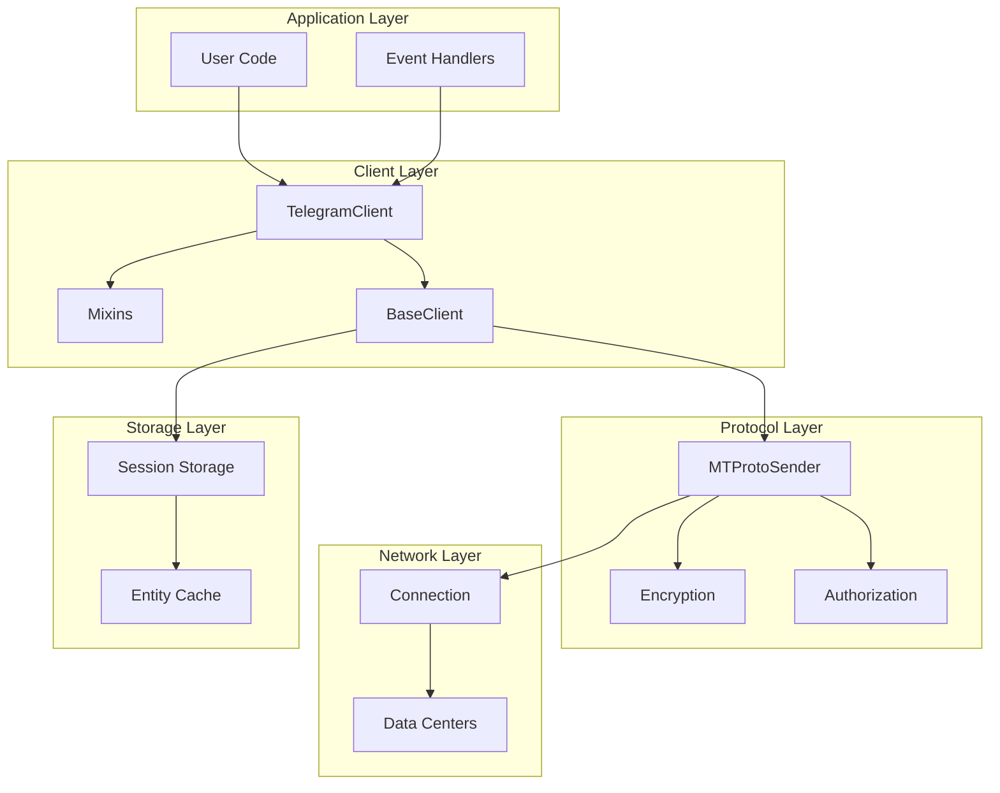

# Telethon Technical Architecture Documentation

---
**Navigation:** [Home](index.md) | [Overview →](overview/introduction.md)

---

## Table of Contents

### 1. Overview
- [1.1 Introduction](overview/introduction.md) - What is Telethon and its purpose
- [1.2 Architecture Overview](overview/architecture-overview.md) - High-level system architecture
- [1.3 Design Principles](overview/design-principles.md) - Core design decisions and patterns

### 2. Core Architecture
- [2.1 Core Components](core/components.md) - Main architectural components
- [2.2 Class Hierarchy](core/class-hierarchy.md) - Object-oriented structure
- [2.3 Module Organization](core/module-organization.md) - Package and module layout
- [2.4 Dependency Management](core/dependencies.md) - Internal and external dependencies

### 3. Client Architecture
- [3.1 TelegramClient](client/telegram-client.md) - Main client implementation
- [3.2 Client Mixins](client/mixins.md) - Modular functionality through mixins
- [3.3 Base Client](client/base-client.md) - Abstract base implementation
- [3.4 Client Lifecycle](client/lifecycle.md) - Initialization, connection, and cleanup

### 4. Network Layer
- [4.1 MTProto Sender](network/mtproto-sender.md) - Core protocol handler
- [4.2 Connection Types](network/connections.md) - TCP, HTTP, and other transports
- [4.3 Data Centers](network/data-centers.md) - DC management and switching
- [4.4 Request Handling](network/request-handling.md) - Request/response flow

### 5. MTProto Protocol
- [5.1 Protocol Overview](protocol/overview.md) - MTProto 2.0 implementation
- [5.2 Encryption](protocol/encryption.md) - Message encryption and security
- [5.3 Authorization](protocol/authorization.md) - Key exchange and auth flow
- [5.4 Message Format](protocol/message-format.md) - Protocol message structure

### 6. Event System
- [6.1 Event Architecture](events/architecture.md) - Event-driven design
- [6.2 Event Types](events/types.md) - Available event handlers
- [6.3 Event Handling](events/handling.md) - Registration and dispatching
- [6.4 Custom Events](events/custom.md) - Creating custom event types

### 7. Session Management
- [7.1 Session Overview](sessions/overview.md) - Session persistence design
- [7.2 Session Types](sessions/types.md) - SQLite, Memory, and String sessions
- [7.3 Session Data](sessions/data.md) - What's stored in sessions
- [7.4 Entity Cache](sessions/entity-cache.md) - User and chat caching

### 8. API Layer
- [8.1 TL Schema](api/tl-schema.md) - Type Language and code generation
- [8.2 Types and Functions](api/types-functions.md) - Generated API objects
- [8.3 Custom Types](api/custom-types.md) - High-level wrapper objects
- [8.4 API Versioning](api/versioning.md) - Layer compatibility

### 9. Internals
- [9.1 Update Handling](internals/updates.md) - Message box and gap detection
- [9.2 File Operations](internals/files.md) - Upload and download internals
- [9.3 Cryptography](internals/crypto.md) - Crypto implementations
- [9.4 Error Handling](internals/errors.md) - Error types and recovery

### 10. Diagrams
- [10.1 System Overview](diagrams/system-overview.md) - High-level architecture diagram
- [10.2 Client Structure](diagrams/client-structure.md) - Client class relationships
- [10.3 Network Flow](diagrams/network-flow.md) - Request/response flow
- [10.4 Event Flow](diagrams/event-flow.md) - Event handling pipeline

### 11. Feature Proposals
- [11.1 Voice Transcription](features/voice-transcription/README.md) - Speech-to-text implementation

## Quick Start

This documentation provides a comprehensive technical overview of Telethon's architecture. Start with the [Introduction](overview/introduction.md) for an overview, or jump to specific sections based on your interests:

- **For Library Users:** Focus on sections 1, 3, 6, and 8
- **For Contributors:** All sections, especially 2, 4, 5, and 9
- **For System Architects:** Sections 1, 2, 4, and 10

## Architecture Highlights

## Key Features

- **Asynchronous Design**: Built on Python's asyncio for efficient concurrent operations
- **MTProto 2.0**: Direct implementation of Telegram's secure protocol
- **Code Generation**: Automatic generation from Telegram's TL schema
- **Modular Architecture**: Clean separation of concerns through mixins
- **Event-Driven**: Decorator-based event handling system
- **Session Persistence**: Maintains state across restarts
- **Type Safety**: Generated classes with full type information

---
**Navigation:** [Home](index.md) | [Overview →](overview/introduction.md)

---