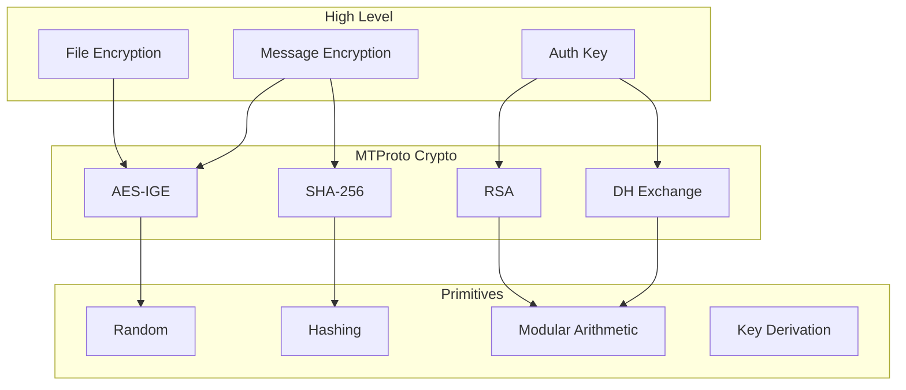

# Cryptography

---
**Navigation:** [← File Operations](files.md) | [Home](../index.md) | [Up](../index.md) | [Error Handling →](errors.md)

---

## Overview

Telethon's cryptography module implements all the cryptographic operations required by the MTProto protocol. This includes key generation, encryption/decryption, hashing, and various security-related utilities.

## Cryptographic Architecture



## Core Cryptographic Components

### Random Number Generation

```python
import os
import secrets
from typing import Union

class SecureRandom:
    """
    Cryptographically secure random number generation.
    """
    
    @staticmethod
    def get_random_bytes(n: int) -> bytes:
        """Get n random bytes."""
        return os.urandom(n)
        
    @staticmethod
    def get_random_int(bits: int) -> int:
        """Get random integer with specified bit length."""
        return secrets.randbits(bits)
        
    @staticmethod
    def get_random_id() -> int:
        """Get random ID for messages."""
        return secrets.randbits(64)
        
    @staticmethod
    def get_random_long() -> int:
        """Get random 64-bit long."""
        return struct.unpack('q', os.urandom(8))[0]
```

### Hashing Functions

```python
import hashlib
from typing import List

class HashFunctions:
    """
    Cryptographic hash functions used in MTProto.
    """
    
    @staticmethod
    def sha1(data: bytes) -> bytes:
        """SHA-1 hash (legacy, for compatibility)."""
        return hashlib.sha1(data).digest()
        
    @staticmethod
    def sha256(data: bytes) -> bytes:
        """SHA-256 hash."""
        return hashlib.sha256(data).digest()
        
    @staticmethod
    def sha512(data: bytes) -> bytes:
        """SHA-512 hash."""
        return hashlib.sha512(data).digest()
        
    @staticmethod
    def pbkdf2(password: str, salt: bytes, iterations: int = 100000) -> bytes:
        """PBKDF2 key derivation."""
        return hashlib.pbkdf2_hmac(
            'sha512',
            password.encode('utf-8'),
            salt,
            iterations,
            dklen=64
        )
        
    @staticmethod
    def compute_hash(data: bytes, *salts: bytes) -> bytes:
        """Compute hash with multiple salts."""
        hasher = hashlib.sha256()
        hasher.update(data)
        for salt in salts:
            hasher.update(salt)
        return hasher.digest()
```

## AES Encryption

### AES-IGE Implementation

```python
from cryptography.hazmat.primitives.ciphers import Cipher, algorithms, modes
from cryptography.hazmat.backends import default_backend

class AES_IGE:
    """
    AES encryption in Infinite Garble Extension (IGE) mode.
    """
    
    @staticmethod
    def encrypt(plaintext: bytes, key: bytes, iv: bytes) -> bytes:
        """
        Encrypt data using AES-256-IGE.
        
        Args:
            plaintext: Data to encrypt (must be multiple of 16 bytes)
            key: 256-bit AES key
            iv: 32-byte initialization vector
            
        Returns:
            Encrypted data
        """
        if len(plaintext) % 16 != 0:
            raise ValueError("Plaintext must be multiple of 16 bytes")
            
        if len(key) != 32:
            raise ValueError("Key must be 256 bits (32 bytes)")
            
        if len(iv) != 32:
            raise ValueError("IV must be 32 bytes")
            
        # Split IV into two parts
        iv1 = iv[:16]
        iv2 = iv[16:]
        
        # Create AES cipher in ECB mode
        cipher = Cipher(
            algorithms.AES(key),
            modes.ECB(),
            backend=default_backend()
        )
        encryptor = cipher.encryptor()
        
        ciphertext = b''
        
        # Process blocks
        for i in range(0, len(plaintext), 16):
            plaintext_block = plaintext[i:i + 16]
            
            # XOR with previous ciphertext (iv1 for first block)
            xor_block = bytes(a ^ b for a, b in zip(plaintext_block, iv1))
            
            # Encrypt
            encrypted_block = encryptor.update(xor_block)
            
            # XOR with previous plaintext (iv2 for first block)
            ciphertext_block = bytes(a ^ b for a, b in zip(encrypted_block, iv2))
            
            ciphertext += ciphertext_block
            
            # Update IVs for next iteration
            iv1 = ciphertext_block
            iv2 = plaintext_block
            
        return ciphertext
        
    @staticmethod
    def decrypt(ciphertext: bytes, key: bytes, iv: bytes) -> bytes:
        """
        Decrypt data using AES-256-IGE.
        
        Args:
            ciphertext: Data to decrypt
            key: 256-bit AES key
            iv: 32-byte initialization vector
            
        Returns:
            Decrypted data
        """
        if len(ciphertext) % 16 != 0:
            raise ValueError("Ciphertext must be multiple of 16 bytes")
            
        # Split IV into two parts
        iv1 = iv[:16]
        iv2 = iv[16:]
        
        # Create AES cipher in ECB mode
        cipher = Cipher(
            algorithms.AES(key),
            modes.ECB(),
            backend=default_backend()
        )
        decryptor = cipher.decryptor()
        
        plaintext = b''
        
        # Process blocks
        for i in range(0, len(ciphertext), 16):
            ciphertext_block = ciphertext[i:i + 16]
            
            # XOR with previous plaintext (iv2 for first block)
            xor_block = bytes(a ^ b for a, b in zip(ciphertext_block, iv2))
            
            # Decrypt
            decrypted_block = decryptor.update(xor_block)
            
            # XOR with previous ciphertext (iv1 for first block)
            plaintext_block = bytes(a ^ b for a, b in zip(decrypted_block, iv1))
            
            plaintext += plaintext_block
            
            # Update IVs for next iteration
            iv1 = ciphertext_block
            iv2 = plaintext_block
            
        return plaintext
```

### AES-CTR for CDN

```python
class AES_CTR:
    """
    AES in Counter (CTR) mode for CDN content.
    """
    
    @staticmethod
    def create_cipher(key: bytes, iv: bytes, offset: int = 0):
        """Create AES-CTR cipher with offset."""
        # Calculate counter value with offset
        counter_bytes = iv + offset.to_bytes(4, 'big')
        counter = int.from_bytes(counter_bytes, 'big')
        
        # Create cipher
        cipher = Cipher(
            algorithms.AES(key),
            modes.CTR(counter.to_bytes(16, 'big')),
            backend=default_backend()
        )
        
        return cipher
        
    @staticmethod
    def decrypt_cdn(data: bytes, cdn_key: bytes, cdn_iv: bytes, offset: int) -> bytes:
        """Decrypt CDN content."""
        cipher = AES_CTR.create_cipher(cdn_key, cdn_iv, offset)
        decryptor = cipher.decryptor()
        return decryptor.update(data) + decryptor.finalize()
```

## RSA Encryption

### RSA Operations

```python
from typing import List, Tuple

class RSA:
    """
    RSA encryption for DH parameter exchange.
    """
    
    # Telegram's public keys
    PUBLIC_KEYS = {
        # Fingerprint -> (n, e)
        0xd09d1d85de64fd85: (
            int("B779F53394A545D794CE327238C53C212677A7A2777DED6FCBF7F7C41354BB8E"
                "E3FB5DB66266BB9886C78D387CD31A3E09BC1992F2F00531545DA88F3C6D5EB7"
                "E373EE9C57F8B76E1790AFE36E384704DC1F321F48A17C8433F7AC1475CEBEE3"
                "DD4C5E9AD2F956C1706F9EBD2E35FC4816260C8E21027C2361D73C1992F7946B"
                "051E2E07A040EC92F87F24E52C128649341177EC92DE12BBA4847BE0BC5A3BC5"
                "8F3646DA37E383EA68E0D2C27BDE602592AD473C69D0D32040E47923E6BF3DD0"
                "9BD7AF4B891CD73B01271506FE3210FE5027A8E84933684B014C1E42606C4181"
                "8ADCC7A00929C1E1E33531FC60FB905C8C310EBE84C635474A67C4B86F1F9223", 16),
            65537
        ),
        # More public keys...
    }
    
    @staticmethod
    def encrypt(data: bytes, fingerprint: int) -> bytes:
        """
        Encrypt data with RSA public key.
        
        Args:
            data: Data to encrypt (must be < 256 bytes)
            fingerprint: RSA key fingerprint
            
        Returns:
            Encrypted data (256 bytes)
        """
        if fingerprint not in RSA.PUBLIC_KEYS:
            raise ValueError(f"Unknown RSA key fingerprint: {fingerprint:x}")
            
        n, e = RSA.PUBLIC_KEYS[fingerprint]
        
        # Pad data to 255 bytes with random
        if len(data) > 255:
            raise ValueError("Data too long for RSA encryption")
            
        # PKCS#1 v1.5 padding
        padded = RSA._pkcs1_pad(data, 255)
        
        # Convert to integer
        m = int.from_bytes(padded, 'big')
        
        # Encrypt: c = m^e mod n
        c = pow(m, e, n)
        
        # Convert back to bytes (256 bytes)
        return c.to_bytes(256, 'big')
        
    @staticmethod
    def _pkcs1_pad(data: bytes, size: int) -> bytes:
        """PKCS#1 v1.5 padding."""
        padding_length = size - len(data) - 2
        
        if padding_length < 8:
            raise ValueError("Data too long for padding")
            
        # Generate random non-zero padding
        padding = b''
        while len(padding) < padding_length:
            byte = os.urandom(1)
            if byte != b'\x00':
                padding += byte
                
        return b'\x00\x02' + padding + b'\x00' + data
        
    @staticmethod
    def compute_fingerprint(n: int, e: int) -> int:
        """Compute RSA key fingerprint."""
        # Serialize key
        key_data = TLSerializer.serialize_rsa_key(n, e)
        
        # SHA1 hash
        digest = hashlib.sha1(key_data).digest()
        
        # Lower 64 bits
        return struct.unpack('<Q', digest[-8:])[0]
```

## Diffie-Hellman

### DH Key Exchange

```python
class DiffieHellman:
    """
    Diffie-Hellman key exchange implementation.
    """
    
    # Safe prime p (2048-bit)
    DH_PRIME = int(
        "C71CAEB9C6B1C9048E6C522F70F13F73980D40238E3E21C14934D037563D930F"
        "48198A0AA7C14058229493D22530F4DBFA336F6E0AC925139543AED44CCE7C37"
        "20FD51F69458705AC68CD4FE6B6B13ABDC9746512969328454F18FAF8C595F64"
        "2477FE96BB2A941D5BCD1D4AC8CC49880708FA9B378E3C4F3A9060BEE67CF9A4"
        "A4A695811051907E162753B56B0F6B410DBA74D8A84B2A14B3144E0EF1284754"
        "FD17ED950D5965B4B9DD46582DB1178D169C6BC465B0D6FF9CA3928FEF5B9AE4"
        "E418FC15E83EBEA0F87FA9FF5EED70050DED2849F47BF959D956850CE929851F"
        "0D8115F635B105EE2E4E15D04B2454BF6F4FADF034B10403119CD8E3B92FCC5B", 16
    )
    
    # Generator g
    DH_GENERATOR = 3
    
    def __init__(self):
        self.p = self.DH_PRIME
        self.g = self.DH_GENERATOR
        self.private_key = None
        self.public_key = None
        
    def generate_private_key(self) -> int:
        """Generate private key (a)."""
        # Generate 2048-bit random number
        self.private_key = SecureRandom.get_random_int(2048)
        return self.private_key
        
    def generate_public_key(self) -> int:
        """Generate public key (g^a mod p)."""
        if self.private_key is None:
            self.generate_private_key()
            
        self.public_key = pow(self.g, self.private_key, self.p)
        return self.public_key
        
    def compute_shared_secret(self, other_public_key: int) -> bytes:
        """Compute shared secret (g^ab mod p)."""
        if self.private_key is None:
            raise ValueError("Private key not generated")
            
        # Validate other's public key
        self._validate_public_key(other_public_key)
        
        # Compute shared secret
        shared_secret = pow(other_public_key, self.private_key, self.p)
        
        # Convert to bytes (big-endian)
        return shared_secret.to_bytes(256, 'big')
        
    def _validate_public_key(self, public_key: int):
        """Validate DH public key for security."""
        # Check bounds
        if public_key <= 1 or public_key >= self.p - 1:
            raise ValueError("Invalid public key: out of bounds")
            
        # Check if key is safe (not in small subgroup)
        if pow(public_key, (self.p - 1) // 2, self.p) != 1:
            raise ValueError("Invalid public key: not in correct subgroup")
            
        # Additional safety checks
        if public_key == self.p - 1:
            raise ValueError("Invalid public key: p-1")
```

### DH Parameter Validation

```python
class DHValidator:
    """
    Validates Diffie-Hellman parameters.
    """
    
    @staticmethod
    def validate_prime(p: int, g: int) -> bool:
        """Validate DH prime and generator."""
        # Check if p is prime
        if not DHValidator._is_prime(p):
            return False
            
        # Check if p is safe prime (p = 2q + 1, where q is prime)
        q = (p - 1) // 2
        if not DHValidator._is_prime(q):
            return False
            
        # Check generator
        if g < 2 or g > p - 2:
            return False
            
        # Check if g generates large subgroup
        if pow(g, 2, p) == 1 or pow(g, q, p) == 1:
            return False
            
        return True
        
    @staticmethod
    def _is_prime(n: int, k: int = 10) -> bool:
        """Miller-Rabin primality test."""
        if n < 2:
            return False
            
        # Handle small primes
        small_primes = [2, 3, 5, 7, 11, 13, 17, 19, 23, 29]
        if n in small_primes:
            return True
        if any(n % p == 0 for p in small_primes):
            return False
            
        # Write n-1 as d * 2^r
        r, d = 0, n - 1
        while d % 2 == 0:
            r += 1
            d //= 2
            
        # Witness loop
        for _ in range(k):
            a = secrets.randbelow(n - 3) + 2
            x = pow(a, d, n)
            
            if x == 1 or x == n - 1:
                continue
                
            for _ in range(r - 1):
                x = pow(x, 2, n)
                if x == n - 1:
                    break
            else:
                return False
                
        return True
```

## Key Derivation

### KDF Implementation

```python
class KeyDerivation:
    """
    Key derivation functions for MTProto.
    """
    
    @staticmethod
    def generate_auth_key(shared_secret: bytes, server_nonce: bytes, 
                         new_nonce: bytes) -> Tuple[bytes, bytes]:
        """
        Generate auth key from DH shared secret.
        
        Returns:
            Tuple of (auth_key, auth_key_id)
        """
        # Combine with nonces
        auth_key_raw = shared_secret + server_nonce + new_nonce
        
        # Hash to derive key
        auth_key = HashFunctions.sha256(auth_key_raw)
        
        # Calculate auth_key_id (lower 64 bits of SHA1)
        auth_key_hash = HashFunctions.sha1(auth_key)
        auth_key_id = auth_key_hash[-8:]
        
        return auth_key, auth_key_id
        
    @staticmethod
    def derive_keys(auth_key: bytes, msg_key: bytes, 
                   is_outgoing: bool) -> Tuple[bytes, bytes]:
        """
        Derive AES key and IV from auth key and message key.
        
        Returns:
            Tuple of (aes_key, aes_iv)
        """
        # x = 0 for client->server, 8 for server->client
        x = 0 if is_outgoing else 8
        
        # Derive using SHA256
        sha256_a = HashFunctions.sha256(msg_key + auth_key[x:x+36])
        sha256_b = HashFunctions.sha256(auth_key[x+40:x+76] + msg_key)
        
        # Combine to form key and IV
        aes_key = sha256_a[:8] + sha256_b[8:24] + sha256_a[24:32]
        aes_iv = sha256_b[:8] + sha256_a[8:24] + sha256_b[24:32]
        
        return aes_key, aes_iv
        
    @staticmethod
    def calculate_msg_key(auth_key: bytes, plaintext: bytes, 
                         is_outgoing: bool) -> bytes:
        """Calculate message key."""
        x = 0 if is_outgoing else 8
        
        # msg_key = substr(SHA256(auth_key_part + plaintext), 8, 16)
        auth_key_part = auth_key[88+x:88+x+32]
        msg_key_large = HashFunctions.sha256(auth_key_part + plaintext)
        
        return msg_key_large[8:24]
```

## Password Hashing

### SRP Implementation

```python
class SRP:
    """
    Secure Remote Password (SRP) implementation for 2FA.
    """
    
    def __init__(self, password: str, algo_params):
        self.password = password
        self.algo = algo_params
        
    async def compute_password_hash(self, account_password) -> bytes:
        """Compute SRP password hash."""
        # Extract algorithm parameters
        salt1 = self.algo.salt1
        salt2 = self.algo.salt2
        g = self.algo.g
        p = int.from_bytes(self.algo.p, 'big')
        
        # Hash password with PBKDF2
        pw_hash = HashFunctions.pbkdf2(
            self.password,
            salt1,
            self.algo.iter
        )
        
        # Calculate x = H(salt2 + pw_hash + salt2)
        x_bytes = salt2 + pw_hash + salt2
        x = int.from_bytes(HashFunctions.sha256(x_bytes), 'big')
        
        # Generate random a
        a = SecureRandom.get_random_int(2048)
        
        # Calculate A = g^a mod p
        A = pow(g, a, p)
        
        # Get B from server (in account_password)
        B = int.from_bytes(account_password.srp_B, 'big')
        
        # Calculate u = H(A + B)
        u_bytes = A.to_bytes(256, 'big') + B.to_bytes(256, 'big')
        u = int.from_bytes(HashFunctions.sha256(u_bytes), 'big')
        
        # Calculate v = g^x mod p
        v = pow(g, x, p)
        
        # Calculate S = (B - v)^(a + u*x) mod p
        S = pow((B - v) % p, (a + u * x) % (p - 1), p)
        
        # Calculate K = H(S)
        K = HashFunctions.sha256(S.to_bytes(256, 'big'))
        
        # Calculate M1
        M1 = self._calculate_m1(p, g, salt1, salt2, A, B, K)
        
        return InputCheckPasswordSRP(
            srp_id=account_password.srp_id,
            A=A.to_bytes(256, 'big'),
            M1=M1
        )
        
    def _calculate_m1(self, p, g, salt1, salt2, A, B, K):
        """Calculate M1 for SRP."""
        h1 = HashFunctions.sha256(p.to_bytes(256, 'big'))
        h2 = HashFunctions.sha256(g.to_bytes(4, 'big'))
        h3 = HashFunctions.sha256(salt1)
        h4 = HashFunctions.sha256(salt2)
        
        # H(H(p) xor H(g) + H(salt1) + H(salt2) + A + B + K)
        xor_hash = bytes(a ^ b for a, b in zip(h1, h2))
        
        return HashFunctions.sha256(
            xor_hash + h3 + h4 + 
            A.to_bytes(256, 'big') + 
            B.to_bytes(256, 'big') + 
            K
        )
```

## Security Utilities

### Padding

```python
class Padding:
    """
    Padding utilities for cryptographic operations.
    """
    
    @staticmethod
    def pad_to_16(data: bytes) -> bytes:
        """Pad data to multiple of 16 bytes."""
        padding_length = (16 - len(data) % 16) % 16
        padding = os.urandom(padding_length)
        return data + padding
        
    @staticmethod
    def pkcs7_pad(data: bytes, block_size: int = 16) -> bytes:
        """PKCS#7 padding."""
        padding_length = block_size - (len(data) % block_size)
        padding = bytes([padding_length] * padding_length)
        return data + padding
        
    @staticmethod
    def pkcs7_unpad(data: bytes) -> bytes:
        """Remove PKCS#7 padding."""
        padding_length = data[-1]
        
        # Validate padding
        if padding_length > len(data):
            raise ValueError("Invalid padding")
            
        for i in range(padding_length):
            if data[-(i + 1)] != padding_length:
                raise ValueError("Invalid padding")
                
        return data[:-padding_length]
```

### Secure Comparison

```python
import hmac

class SecureCompare:
    """
    Timing-safe comparison functions.
    """
    
    @staticmethod
    def compare_digest(a: bytes, b: bytes) -> bool:
        """Constant-time comparison of byte strings."""
        return hmac.compare_digest(a, b)
        
    @staticmethod
    def compare_auth_key_id(a: bytes, b: bytes) -> bool:
        """Compare auth key IDs securely."""
        if len(a) != 8 or len(b) != 8:
            return False
        return SecureCompare.compare_digest(a, b)
```

## Best Practices

### Security Guidelines

1. **Use OS Random**: Always use OS-provided randomness
2. **Validate Parameters**: Check all DH parameters
3. **Constant Time**: Use timing-safe comparisons
4. **Clear Memory**: Zero sensitive data after use
5. **Key Rotation**: Implement key rotation policies

### Implementation Tips

1. **Test Vectors**: Verify against known test vectors
2. **Side Channels**: Protect against timing attacks
3. **Error Handling**: Don't leak information in errors
4. **Audit Trail**: Log cryptographic operations
5. **Updates**: Keep cryptographic libraries updated

## Next Steps

- Continue to [Error Handling](errors.md) for security errors
- Review [Protocol Encryption](../protocol/encryption.md) for usage
- See [Authorization](../protocol/authorization.md) for auth crypto

---
**Navigation:** [← File Operations](files.md) | [Home](../index.md) | [Up](../index.md) | [Error Handling →](errors.md)

---