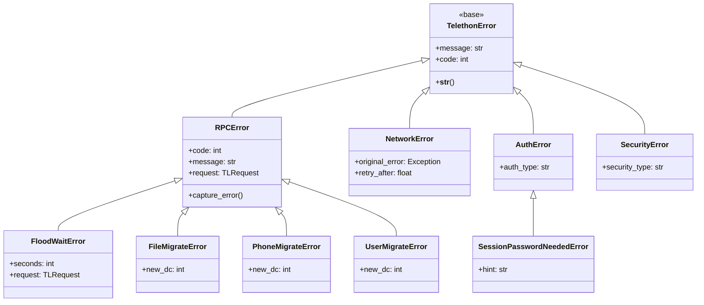

# Error Handling

---
**Navigation:** [← Cryptography](crypto.md) | [Home](../index.md) | [Up](../index.md) | [Diagrams →](../diagrams/README.md)

---

## Overview

Telethon implements a comprehensive error handling system that manages MTProto errors, network issues, and application-level exceptions. The error handling framework provides meaningful error messages, automatic retry logic, and graceful degradation strategies.

## Error Hierarchy



## RPC Errors

### RPC Error Base

```python
class RPCError(TelethonError):
    """
    Base class for RPC errors from Telegram servers.
    """
    
    # Common error codes
    ERROR_CODES = {
        303: "ERROR_SEE_OTHER",
        400: "BAD_REQUEST",
        401: "UNAUTHORIZED",
        403: "FORBIDDEN",
        404: "NOT_FOUND",
        406: "NOT_ACCEPTABLE",
        420: "FLOOD",
        500: "INTERNAL",
        503: "TIMEOUT"
    }
    
    def __init__(self, code: int, message: str, request=None):
        self.code = code
        self.message = message
        self.request = request
        
        # Parse error details
        self._parse_error()
        
        super().__init__(self._format_message())
        
    def _parse_error(self):
        """Parse error message for details."""
        # Extract error type and argument
        match = re.match(r'([A-Z_]+)(?:_(\d+))?', self.message)
        if match:
            self.error_type = match.group(1)
            self.argument = int(match.group(2)) if match.group(2) else None
        else:
            self.error_type = self.message
            self.argument = None
            
    def _format_message(self):
        """Format user-friendly error message."""
        base_msg = f"{self.ERROR_CODES.get(self.code, 'Unknown')} ({self.code}): {self.message}"
        
        if self.request:
            base_msg += f" (caused by {self.request.__class__.__name__})"
            
        return base_msg
        
    @property
    def should_retry(self) -> bool:
        """Check if request should be retried."""
        return self.code in [500, 503] or self.error_type in [
            'TIMEOUT',
            'NETWORK_ERROR',
            'CONNECTION_LOST'
        ]
```

### Specific RPC Errors

```python
class FloodWaitError(RPCError):
    """
    Rate limiting error requiring wait.
    """
    
    def __init__(self, seconds: int, request=None):
        self.seconds = seconds
        super().__init__(420, f'FLOOD_WAIT_{seconds}', request)
        
    def __str__(self):
        return f"A wait of {self.seconds} seconds is required (caused by {self.request.__class__.__name__})"
        
    async def wait(self):
        """Wait for the required duration."""
        logger.info(f"Flood wait: sleeping for {self.seconds}s")
        await asyncio.sleep(self.seconds)

class FileMigrateError(RPCError):
    """
    File is stored in a different DC.
    """
    
    def __init__(self, new_dc: int, request=None):
        self.new_dc = new_dc
        super().__init__(303, f'FILE_MIGRATE_{new_dc}', request)
        
    def __str__(self):
        return f"File is stored in DC {self.new_dc}"

class PhoneNumberInvalidError(RPCError):
    """
    Invalid phone number format.
    """
    
    def __init__(self, request=None):
        super().__init__(400, 'PHONE_NUMBER_INVALID', request)
        
    def __str__(self):
        return "The phone number is invalid. Please check the number format."

class SessionPasswordNeededError(RPCError):
    """
    Two-factor authentication is enabled.
    """
    
    def __init__(self, request=None):
        super().__init__(401, 'SESSION_PASSWORD_NEEDED', request)
        
    def __str__(self):
        return "Two-factor authentication is enabled. Please provide your password."
```

## Network Errors

### Network Error Types

```python
class NetworkError(TelethonError):
    """
    Base class for network-related errors.
    """
    
    def __init__(self, message: str, original_error=None):
        self.original_error = original_error
        super().__init__(message)
        
    @property
    def should_retry(self) -> bool:
        """Network errors should generally be retried."""
        return True

class ConnectionError(NetworkError):
    """
    Failed to establish connection.
    """
    
    def __init__(self, host: str, port: int, original_error=None):
        self.host = host
        self.port = port
        message = f"Failed to connect to {host}:{port}"
        if original_error:
            message += f": {original_error}"
        super().__init__(message, original_error)

class TimeoutError(NetworkError):
    """
    Operation timed out.
    """
    
    def __init__(self, operation: str, timeout: float):
        self.operation = operation
        self.timeout = timeout
        message = f"{operation} timed out after {timeout}s"
        super().__init__(message)

class BadMessageError(NetworkError):
    """
    Invalid message received.
    """
    
    ERROR_MESSAGES = {
        16: "Message ID too low",
        17: "Message ID too high",
        18: "Incorrect two lower order message ID bits",
        19: "Container ID is the same as message ID",
        20: "Message too old",
        32: "Message sequence number too low",
        33: "Message sequence number too high",
        34: "Even sequence number expected",
        35: "Odd sequence number expected",
        48: "Incorrect server salt",
        64: "Invalid container"
    }
    
    def __init__(self, code: int):
        self.code = code
        message = self.ERROR_MESSAGES.get(code, f"Bad message notification {code}")
        super().__init__(message)
```

## Authentication Errors

### Auth Error Types

```python
class AuthError(TelethonError):
    """
    Authentication-related errors.
    """
    pass

class AuthKeyError(AuthError):
    """
    Issues with authorization key.
    """
    
    def __init__(self, message: str = "Auth key not found or invalid"):
        super().__init__(message)

class AuthKeyUnregisteredError(AuthError):
    """
    Auth key is not registered with server.
    """
    
    def __init__(self):
        super().__init__("The authorization key is not registered in the system")

class AuthRestartError(AuthError):
    """
    Authorization needs to be restarted.
    """
    
    def __init__(self):
        super().__init__("Authorization process needs to be restarted")

class PhoneCodeInvalidError(AuthError):
    """
    Invalid verification code.
    """
    
    def __init__(self):
        super().__init__("The phone code entered is invalid")

class PasswordHashInvalidError(AuthError):
    """
    Invalid password for 2FA.
    """
    
    def __init__(self):
        super().__init__("The password hash is invalid")
```

## Security Errors

### Security Error Types

```python
class SecurityError(TelethonError):
    """
    Security-related errors.
    """
    pass

class InvalidChecksumError(SecurityError):
    """
    Message checksum validation failed.
    """
    
    def __init__(self, expected: bytes, received: bytes):
        self.expected = expected
        self.received = received
        super().__init__(
            f"Invalid checksum. Expected {expected.hex()}, got {received.hex()}"
        )

class DecryptionError(SecurityError):
    """
    Failed to decrypt message.
    """
    
    def __init__(self, reason: str = "Unknown"):
        super().__init__(f"Failed to decrypt message: {reason}")

class InvalidBufferError(SecurityError):
    """
    Invalid buffer during deserialization.
    """
    
    def __init__(self, message: str = "Invalid buffer"):
        super().__init__(message)
```

## Error Handlers

### Global Error Handler

```python
class ErrorHandler:
    """
    Global error handling and recovery.
    """
    
    def __init__(self, client):
        self.client = client
        self.error_callbacks = {}
        self.retry_config = RetryConfig()
        
    def register_handler(self, error_type, callback):
        """Register error handler for specific error type."""
        if error_type not in self.error_callbacks:
            self.error_callbacks[error_type] = []
        self.error_callbacks[error_type].append(callback)
        
    async def handle_error(self, error, context=None):
        """Handle error with appropriate strategy."""
        error_type = type(error)
        
        # Try specific handlers first
        if error_type in self.error_callbacks:
            for callback in self.error_callbacks[error_type]:
                try:
                    result = await callback(error, context)
                    if result is not None:
                        return result
                except Exception as e:
                    logger.error(f"Error in error handler: {e}")
                    
        # Default handling
        return await self._default_handler(error, context)
        
    async def _default_handler(self, error, context):
        """Default error handling logic."""
        if isinstance(error, FloodWaitError):
            # Automatic wait for flood errors
            await error.wait()
            return RetryAction.RETRY
            
        elif isinstance(error, (FileMigrateError, PhoneMigrateError, UserMigrateError)):
            # Handle DC migration
            await self.client._switch_dc(error.new_dc)
            return RetryAction.RETRY
            
        elif isinstance(error, SessionPasswordNeededError):
            # Notify about 2FA requirement
            return RetryAction.FAIL_WITH_MESSAGE
            
        elif isinstance(error, NetworkError):
            # Retry network errors with backoff
            return RetryAction.RETRY_WITH_BACKOFF
            
        elif isinstance(error, AuthKeyError):
            # Re-authenticate
            await self.client._reconnect()
            return RetryAction.RETRY
            
        else:
            # Unknown error
            logger.error(f"Unhandled error: {error}")
            return RetryAction.FAIL
```

### Retry Manager

```python
class RetryManager:
    """
    Manages retry logic for failed operations.
    """
    
    def __init__(self, config: RetryConfig):
        self.config = config
        
    async def execute_with_retry(self, func, *args, **kwargs):
        """Execute function with retry logic."""
        last_error = None
        
        for attempt in range(self.config.max_attempts):
            try:
                return await func(*args, **kwargs)
                
            except Exception as e:
                last_error = e
                
                # Check if error is retryable
                action = await self._get_retry_action(e)
                
                if action == RetryAction.FAIL:
                    raise
                    
                elif action == RetryAction.RETRY:
                    if attempt < self.config.max_attempts - 1:
                        continue
                        
                elif action == RetryAction.RETRY_WITH_BACKOFF:
                    if attempt < self.config.max_attempts - 1:
                        delay = self._calculate_backoff(attempt)
                        await asyncio.sleep(delay)
                        continue
                        
                elif action == RetryAction.RETRY_AFTER_ACTION:
                    # Perform required action (e.g., migration)
                    await self._perform_retry_action(e)
                    if attempt < self.config.max_attempts - 1:
                        continue
                        
        # Max attempts exceeded
        raise MaxRetriesError(
            f"Failed after {self.config.max_attempts} attempts",
            last_error
        )
        
    def _calculate_backoff(self, attempt: int) -> float:
        """Calculate exponential backoff delay."""
        base_delay = self.config.base_delay
        max_delay = self.config.max_delay
        
        # Exponential backoff with jitter
        delay = min(base_delay * (2 ** attempt), max_delay)
        jitter = random.uniform(0, delay * 0.1)
        
        return delay + jitter
```

## Error Recovery

### Recovery Strategies

```python
class RecoveryStrategy:
    """
    Error recovery strategies.
    """
    
    @staticmethod
    async def recover_connection(client, error):
        """Recover from connection errors."""
        logger.info("Attempting connection recovery")
        
        # Try different connection modes
        for mode in [ConnectionMode.TCP_ABRIDGED, 
                    ConnectionMode.TCP_INTERMEDIATE,
                    ConnectionMode.TCP_FULL]:
            try:
                await client._reconnect(connection_mode=mode)
                logger.info(f"Recovered using {mode}")
                return True
            except Exception:
                continue
                
        return False
        
    @staticmethod
    async def recover_auth(client, error):
        """Recover from auth errors."""
        logger.info("Attempting auth recovery")
        
        # Clear auth key and reconnect
        client.session.auth_key = None
        await client.session.save()
        
        # Reconnect and re-authenticate
        await client.connect()
        
        if client.session.auth_key:
            return True
            
        return False
        
    @staticmethod
    async def recover_session(client, error):
        """Recover from session errors."""
        logger.info("Attempting session recovery")
        
        # Create new session
        old_session = client.session
        client.session = type(old_session)()
        
        # Copy essential data
        if hasattr(old_session, 'server_address'):
            client.session.server_address = old_session.server_address
            client.session.port = old_session.port
            client.session.dc_id = old_session.dc_id
            
        # Reconnect
        await client.connect()
        
        return True
```

## Error Logging

### Error Logger

```python
class ErrorLogger:
    """
    Specialized error logging with context.
    """
    
    def __init__(self, log_file=None):
        self.log_file = log_file
        self.error_stats = Counter()
        
    def log_error(self, error, context=None):
        """Log error with full context."""
        error_type = type(error).__name__
        self.error_stats[error_type] += 1
        
        # Build log entry
        log_entry = {
            'timestamp': datetime.now().isoformat(),
            'error_type': error_type,
            'error_message': str(error),
            'traceback': traceback.format_exc(),
            'context': context or {}
        }
        
        # Add error-specific details
        if isinstance(error, RPCError):
            log_entry['rpc_code'] = error.code
            log_entry['rpc_message'] = error.message
            if error.request:
                log_entry['request_type'] = type(error.request).__name__
                
        elif isinstance(error, NetworkError):
            if error.original_error:
                log_entry['original_error'] = str(error.original_error)
                
        # Log to file if configured
        if self.log_file:
            with open(self.log_file, 'a') as f:
                json.dump(log_entry, f)
                f.write('\n')
                
        # Log to standard logger
        logger.error(json.dumps(log_entry, indent=2))
        
    def get_statistics(self):
        """Get error statistics."""
        return {
            'total_errors': sum(self.error_stats.values()),
            'error_types': dict(self.error_stats.most_common()),
            'top_errors': self.error_stats.most_common(10)
        }
```

## Error Monitoring

### Error Monitor

```python
class ErrorMonitor:
    """
    Monitors error patterns and triggers alerts.
    """
    
    def __init__(self, threshold_config):
        self.thresholds = threshold_config
        self.error_counts = defaultdict(lambda: deque(maxlen=100))
        self.alerts = []
        
    def record_error(self, error):
        """Record error occurrence."""
        error_type = type(error).__name__
        timestamp = time.time()
        
        self.error_counts[error_type].append(timestamp)
        
        # Check thresholds
        self._check_thresholds(error_type)
        
    def _check_thresholds(self, error_type):
        """Check if error rate exceeds thresholds."""
        timestamps = self.error_counts[error_type]
        
        if len(timestamps) < 2:
            return
            
        # Calculate error rate (errors per minute)
        time_span = timestamps[-1] - timestamps[0]
        if time_span > 0:
            error_rate = len(timestamps) / (time_span / 60)
            
            threshold = self.thresholds.get(
                error_type,
                self.thresholds.get('default', 10)
            )
            
            if error_rate > threshold:
                self._trigger_alert(error_type, error_rate)
                
    def _trigger_alert(self, error_type, error_rate):
        """Trigger alert for high error rate."""
        alert = {
            'error_type': error_type,
            'error_rate': error_rate,
            'timestamp': datetime.now(),
            'message': f"High error rate for {error_type}: {error_rate:.2f} errors/min"
        }
        
        self.alerts.append(alert)
        logger.warning(alert['message'])
```

## Best Practices

### Error Handling Guidelines

1. **Specific Exceptions**: Use specific exception types
2. **Meaningful Messages**: Provide clear error messages
3. **Context Preservation**: Include relevant context
4. **Graceful Degradation**: Fail gracefully when possible
5. **User Communication**: Inform users appropriately

### Recovery Strategies

1. **Automatic Retry**: Retry transient errors automatically
2. **Exponential Backoff**: Use backoff for rate limiting
3. **Circuit Breaker**: Prevent cascading failures
4. **Fallback Options**: Provide alternative paths
5. **State Preservation**: Save state before risky operations

## Next Steps

- Explore [System Diagrams](../diagrams/system-overview.md) for visual representation
- Review [Client Lifecycle](../client/lifecycle.md) for error handling in practice
- See [Network Layer](../network/mtproto-sender.md) for network error details

---
**Navigation:** [← Cryptography](crypto.md) | [Home](../index.md) | [Up](../index.md) | [Diagrams →](../diagrams/README.md)

---