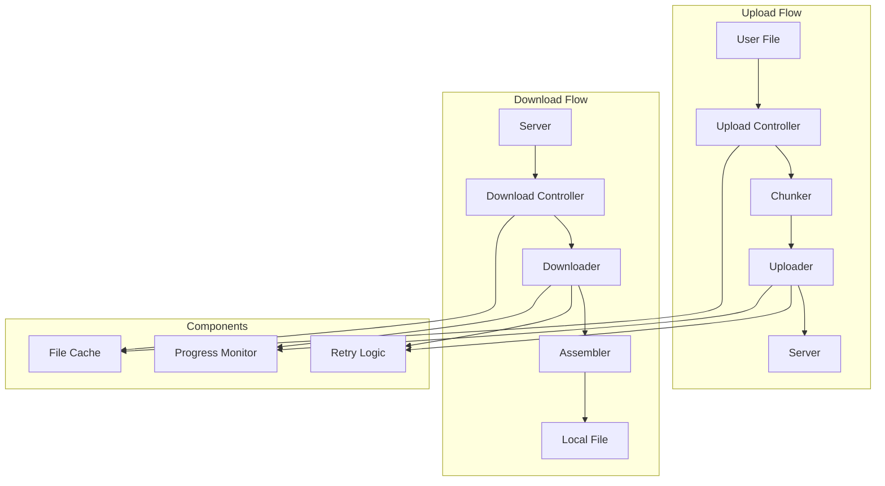

# File Operations

---
**Navigation:** [← Update Handling](updates.md) | [Home](../index.md) | [Up](../index.md) | [Cryptography →](crypto.md)

---

## Overview

File operations in Telethon handle uploading and downloading of media files, documents, and other binary data. The system supports large files, resumable transfers, parallel operations, and various optimization strategies.

## File Transfer Architecture



## File Upload

### Upload Manager

```python
class UploadManager:
    """
    Manages file upload operations.
    """
    
    def __init__(self, client):
        self.client = client
        self.part_size = 512 * 1024  # 512 KB default
        self.max_file_size = 2000 * 1024 * 1024  # 2000 MB
        self.connection_count = 2  # Parallel connections
        self._uploads = {}  # Active uploads
        
    async def upload_file(
        self,
        file,
        *,
        part_size_kb=None,
        file_name=None,
        use_cache=True,
        key=None,
        iv=None,
        progress_callback=None
    ):
        """Upload file to Telegram."""
        # Determine file info
        file_info = await self._get_file_info(file, file_name)
        
        # Check cache
        if use_cache:
            cached = await self._check_cache(file_info)
            if cached:
                return cached
                
        # Validate file
        if file_info.size > self.max_file_size:
            raise ValueError(f"File too large: {file_info.size} bytes")
            
        # Determine part size
        part_size = self._calculate_part_size(
            file_info.size,
            part_size_kb
        )
        
        # Create upload session
        upload_id = self._generate_upload_id()
        session = UploadSession(
            upload_id=upload_id,
            file_info=file_info,
            part_size=part_size,
            key=key,
            iv=iv
        )
        
        self._uploads[upload_id] = session
        
        try:
            # Upload file
            if file_info.size > 10 * 1024 * 1024:  # 10 MB
                result = await self._upload_big_file(session, progress_callback)
            else:
                result = await self._upload_small_file(session, progress_callback)
                
            # Cache result
            if use_cache:
                await self._cache_result(file_info, result)
                
            return result
            
        finally:
            del self._uploads[upload_id]
            
    async def _upload_big_file(self, session, progress_callback):
        """Upload large file using parallel uploads."""
        file_id = random.randint(0, 0x7FFFFFFF)
        
        # Initialize upload
        await self.client(
            InitFileUploadBigRequest(
                file_id=file_id,
                parts=session.total_parts,
                name=session.file_info.name
            )
        )
        
        # Upload parts in parallel
        tasks = []
        semaphore = asyncio.Semaphore(self.connection_count)
        
        for part_num in range(session.total_parts):
            task = self._upload_part_async(
                session,
                file_id,
                part_num,
                semaphore,
                progress_callback
            )
            tasks.append(task)
            
        # Wait for all parts
        await asyncio.gather(*tasks)
        
        # Return file handle
        return InputFileBig(
            id=file_id,
            parts=session.total_parts,
            name=session.file_info.name
        )
        
    async def _upload_part_async(self, session, file_id, part_num,
                                semaphore, progress_callback):
        """Upload single part asynchronously."""
        async with semaphore:
            # Read part data
            offset = part_num * session.part_size
            data = await session.read_part(part_num)
            
            # Encrypt if needed
            if session.key and session.iv:
                data = self._encrypt_part(data, session.key, session.iv)
                
            # Upload with retry
            for attempt in range(3):
                try:
                    await self.client(
                        SaveBigFilePartRequest(
                            file_id=file_id,
                            file_part=part_num,
                            file_total_parts=session.total_parts,
                            bytes=data
                        )
                    )
                    
                    # Update progress
                    session.uploaded_parts.add(part_num)
                    if progress_callback:
                        await progress_callback(
                            session.uploaded_bytes,
                            session.total_bytes
                        )
                        
                    break
                    
                except Exception as e:
                    if attempt == 2:
                        raise
                    await asyncio.sleep(2 ** attempt)
```

### Upload Session

```python
class UploadSession:
    """
    Represents an active upload session.
    """
    
    def __init__(self, upload_id, file_info, part_size, key=None, iv=None):
        self.upload_id = upload_id
        self.file_info = file_info
        self.part_size = part_size
        self.key = key
        self.iv = iv
        
        # Calculate parts
        self.total_parts = (file_info.size + part_size - 1) // part_size
        self.total_bytes = file_info.size
        
        # Progress tracking
        self.uploaded_parts = set()
        self.start_time = time.time()
        
        # File handle
        self._file = None
        self._lock = asyncio.Lock()
        
    async def read_part(self, part_num):
        """Read specific part from file."""
        async with self._lock:
            if self._file is None:
                self._file = await aiofiles.open(
                    self.file_info.path,
                    'rb'
                )
                
            offset = part_num * self.part_size
            await self._file.seek(offset)
            
            # Read part (may be smaller for last part)
            remaining = self.total_bytes - offset
            read_size = min(self.part_size, remaining)
            
            return await self._file.read(read_size)
            
    @property
    def uploaded_bytes(self):
        """Calculate uploaded bytes."""
        full_parts = len(self.uploaded_parts)
        if self.total_parts - 1 in self.uploaded_parts:
            # Last part may be smaller
            last_part_size = self.total_bytes % self.part_size
            if last_part_size == 0:
                last_part_size = self.part_size
            return (full_parts - 1) * self.part_size + last_part_size
        else:
            return full_parts * self.part_size
            
    @property
    def progress(self):
        """Get upload progress percentage."""
        return (self.uploaded_bytes / self.total_bytes) * 100
        
    @property
    def speed(self):
        """Get upload speed in bytes/second."""
        elapsed = time.time() - self.start_time
        if elapsed > 0:
            return self.uploaded_bytes / elapsed
        return 0
        
    async def close(self):
        """Close file handle."""
        if self._file:
            await self._file.close()
```

## File Download

### Download Manager

```python
class DownloadManager:
    """
    Manages file download operations.
    """
    
    def __init__(self, client):
        self.client = client
        self.chunk_size = 256 * 1024  # 256 KB
        self.connection_count = 3
        self._downloads = {}
        self._cdn_redirects = {}
        
    async def download_file(
        self,
        input_location,
        file=None,
        *,
        part_size_kb=None,
        file_size=None,
        progress_callback=None,
        dc_id=None,
        key=None,
        iv=None
    ):
        """Download file from Telegram."""
        # Prepare download session
        session = DownloadSession(
            location=input_location,
            file_size=file_size,
            part_size=part_size_kb * 1024 if part_size_kb else self.chunk_size,
            dc_id=dc_id,
            key=key,
            iv=iv
        )
        
        # Get file handle
        if file is None:
            file = BytesIO()
            return_bytes = True
        else:
            return_bytes = False
            
        try:
            # Check for CDN redirect
            if await self._check_cdn_redirect(session):
                await self._download_from_cdn(session, file, progress_callback)
            else:
                await self._download_direct(session, file, progress_callback)
                
            if return_bytes:
                return file.getvalue()
            else:
                return file
                
        except Exception as e:
            logger.error(f"Download failed: {e}")
            raise
            
    async def _download_direct(self, session, file, progress_callback):
        """Direct download from Telegram DC."""
        # Use appropriate DC
        dc_id = session.dc_id or self.client.session.dc_id
        
        # Download parts in parallel
        tasks = []
        semaphore = asyncio.Semaphore(self.connection_count)
        
        offset = 0
        while offset < session.file_size:
            task = self._download_part_async(
                session,
                offset,
                semaphore,
                dc_id,
                progress_callback
            )
            tasks.append((offset, task))
            offset += session.part_size
            
        # Wait for parts and assemble
        parts = await asyncio.gather(*[t[1] for t in tasks])
        
        # Write parts in order
        for (offset, _), part_data in zip(tasks, parts):
            if session.key and session.iv:
                part_data = self._decrypt_part(
                    part_data,
                    session.key,
                    session.iv,
                    offset
                )
            await self._write_part(file, offset, part_data)
            
    async def _download_part_async(self, session, offset, semaphore, 
                                  dc_id, progress_callback):
        """Download single part asynchronously."""
        async with semaphore:
            limit = min(session.part_size, session.file_size - offset)
            
            for attempt in range(3):
                try:
                    result = await self.client(
                        GetFileRequest(
                            location=session.location,
                            offset=offset,
                            limit=limit
                        ),
                        dc_id=dc_id
                    )
                    
                    # Update progress
                    session.downloaded_bytes += len(result.bytes)
                    if progress_callback:
                        await progress_callback(
                            session.downloaded_bytes,
                            session.file_size
                        )
                        
                    return result.bytes
                    
                except FileMigrateError as e:
                    # File is in different DC
                    dc_id = e.new_dc
                    session.dc_id = dc_id
                    
                except Exception as e:
                    if attempt == 2:
                        raise
                    await asyncio.sleep(2 ** attempt)
```

### CDN Support

```python
class CDNDownloader:
    """
    Handles CDN downloads.
    """
    
    def __init__(self, client):
        self.client = client
        self._cdn_keys = {}
        
    async def check_redirect(self, location, offset, dc_id):
        """Check if file is on CDN."""
        try:
            result = await self.client(
                GetFileRequest(
                    location=location,
                    offset=offset,
                    limit=1
                ),
                dc_id=dc_id
            )
            
            if isinstance(result, upload.FileCdnRedirect):
                return {
                    'dc_id': result.dc_id,
                    'file_token': result.file_token,
                    'encryption_key': result.encryption_key,
                    'encryption_iv': result.encryption_iv,
                    'file_hashes': result.file_hashes
                }
                
        except Exception:
            pass
            
        return None
        
    async def download_from_cdn(self, redirect_info, offset, limit):
        """Download from CDN."""
        result = await self.client(
            GetCdnFileRequest(
                file_token=redirect_info['file_token'],
                offset=offset,
                limit=limit
            ),
            dc_id=redirect_info['dc_id']
        )
        
        if isinstance(result, upload.CdnFileReuploadNeeded):
            # Request re-upload to main DC
            await self._request_reupload(result.request_token)
            # Retry from main DC
            raise CdnRedirectError("Re-upload needed")
            
        # Decrypt CDN content
        decrypted = self._decrypt_cdn(
            result.bytes,
            redirect_info['encryption_key'],
            redirect_info['encryption_iv'],
            offset
        )
        
        # Verify hash
        self._verify_cdn_hash(
            decrypted,
            offset,
            redirect_info['file_hashes']
        )
        
        return decrypted
        
    def _decrypt_cdn(self, data, key, iv, offset):
        """Decrypt CDN content using CTR mode."""
        cipher = Cipher(
            algorithms.AES(key),
            modes.CTR(iv + offset.to_bytes(4, 'big')),
            backend=default_backend()
        )
        decryptor = cipher.decryptor()
        return decryptor.update(data) + decryptor.finalize()
```

## File Cache

### Cache Management

```python
class FileCache:
    """
    Caches uploaded files to avoid re-uploading.
    """
    
    def __init__(self, cache_dir=None):
        self.cache_dir = cache_dir or os.path.expanduser('~/.telethon/cache')
        os.makedirs(self.cache_dir, exist_ok=True)
        self._index = self._load_index()
        self._lock = threading.Lock()
        
    def _load_index(self):
        """Load cache index."""
        index_file = os.path.join(self.cache_dir, 'index.json')
        if os.path.exists(index_file):
            with open(index_file, 'r') as f:
                return json.load(f)
        return {}
        
    def _save_index(self):
        """Save cache index."""
        index_file = os.path.join(self.cache_dir, 'index.json')
        with open(index_file, 'w') as f:
            json.dump(self._index, f)
            
    def get_cached_file(self, file_hash, file_size):
        """Get cached file reference."""
        cache_key = f"{file_hash}_{file_size}"
        
        with self._lock:
            if cache_key in self._index:
                entry = self._index[cache_key]
                
                # Check if not expired
                if time.time() < entry['expires']:
                    return InputDocument(
                        id=entry['file_id'],
                        access_hash=entry['access_hash'],
                        file_reference=bytes.fromhex(entry['file_reference'])
                    )
                else:
                    # Remove expired entry
                    del self._index[cache_key]
                    self._save_index()
                    
        return None
        
    def cache_file(self, file_hash, file_size, file_handle):
        """Cache uploaded file reference."""
        cache_key = f"{file_hash}_{file_size}"
        
        with self._lock:
            self._index[cache_key] = {
                'file_id': file_handle.id,
                'access_hash': file_handle.access_hash,
                'file_reference': file_handle.file_reference.hex(),
                'expires': time.time() + 86400,  # 24 hours
                'cached_at': time.time()
            }
            self._save_index()
            
    def clear_expired(self):
        """Clear expired cache entries."""
        current_time = time.time()
        
        with self._lock:
            expired = [
                key for key, entry in self._index.items()
                if current_time >= entry['expires']
            ]
            
            for key in expired:
                del self._index[key]
                
            if expired:
                self._save_index()
```

## Streaming Support

### Stream Upload

```python
class StreamUploader:
    """
    Supports streaming upload for large files.
    """
    
    def __init__(self, client):
        self.client = client
        self.buffer_size = 1024 * 1024  # 1 MB buffer
        
    async def upload_stream(self, stream, file_name, file_size,
                           progress_callback=None):
        """Upload from stream without loading entire file."""
        file_id = random.randint(0, 0x7FFFFFFF)
        part_size = 512 * 1024
        total_parts = (file_size + part_size - 1) // part_size
        
        # Initialize big file upload
        await self.client(
            InitFileUploadBigRequest(
                file_id=file_id,
                parts=total_parts,
                name=file_name
            )
        )
        
        # Upload parts as they're read
        part_num = 0
        uploaded = 0
        
        while True:
            # Read part from stream
            data = await stream.read(part_size)
            if not data:
                break
                
            # Upload part
            await self.client(
                SaveBigFilePartRequest(
                    file_id=file_id,
                    file_part=part_num,
                    file_total_parts=total_parts,
                    bytes=data
                )
            )
            
            # Update progress
            uploaded += len(data)
            if progress_callback:
                await progress_callback(uploaded, file_size)
                
            part_num += 1
            
        return InputFileBig(
            id=file_id,
            parts=part_num,
            name=file_name
        )
```

### Stream Download

```python
class StreamDownloader:
    """
    Supports streaming download for large files.
    """
    
    def __init__(self, client):
        self.client = client
        self.chunk_size = 256 * 1024
        
    async def download_stream(self, location, file_size, output_stream,
                             progress_callback=None):
        """Download directly to stream."""
        offset = 0
        downloaded = 0
        
        while offset < file_size:
            # Calculate chunk size
            limit = min(self.chunk_size, file_size - offset)
            
            # Download chunk
            result = await self.client(
                GetFileRequest(
                    location=location,
                    offset=offset,
                    limit=limit
                )
            )
            
            # Write to stream
            await output_stream.write(result.bytes)
            
            # Update progress
            downloaded += len(result.bytes)
            if progress_callback:
                await progress_callback(downloaded, file_size)
                
            offset += limit
            
            # Check if done
            if len(result.bytes) < limit:
                break
```

## Media Processing

### Thumbnail Generation

```python
class ThumbnailGenerator:
    """
    Generates thumbnails for media files.
    """
    
    @staticmethod
    async def generate_photo_thumbnail(photo_path, size=(320, 320)):
        """Generate thumbnail for photo."""
        from PIL import Image
        
        # Open and resize image
        img = Image.open(photo_path)
        img.thumbnail(size, Image.Resampling.LANCZOS)
        
        # Save to bytes
        thumb_bytes = BytesIO()
        img.save(thumb_bytes, format='JPEG', quality=85)
        thumb_bytes.seek(0)
        
        return thumb_bytes.getvalue()
        
    @staticmethod
    async def generate_video_thumbnail(video_path, time_offset=0):
        """Generate thumbnail for video."""
        import subprocess
        
        # Use ffmpeg to extract frame
        cmd = [
            'ffmpeg',
            '-ss', str(time_offset),
            '-i', video_path,
            '-vframes', '1',
            '-f', 'image2pipe',
            '-vcodec', 'mjpeg',
            '-'
        ]
        
        proc = await asyncio.create_subprocess_exec(
            *cmd,
            stdout=subprocess.PIPE,
            stderr=subprocess.DEVNULL
        )
        
        thumb_data, _ = await proc.communicate()
        
        # Resize if needed
        return await ThumbnailGenerator.generate_photo_thumbnail(
            BytesIO(thumb_data)
        )
```

### Media Attributes

```python
class MediaAttributeExtractor:
    """
    Extracts attributes from media files.
    """
    
    @staticmethod
    async def extract_video_attributes(video_path):
        """Extract video attributes."""
        import subprocess
        import json
        
        # Use ffprobe to get media info
        cmd = [
            'ffprobe',
            '-v', 'quiet',
            '-print_format', 'json',
            '-show_format',
            '-show_streams',
            video_path
        ]
        
        proc = await asyncio.create_subprocess_exec(
            *cmd,
            stdout=subprocess.PIPE,
            stderr=subprocess.DEVNULL
        )
        
        output, _ = await proc.communicate()
        data = json.loads(output)
        
        # Extract video stream info
        video_stream = next(
            s for s in data['streams']
            if s['codec_type'] == 'video'
        )
        
        # Extract audio stream info
        audio_stream = next(
            (s for s in data['streams']
             if s['codec_type'] == 'audio'),
            None
        )
        
        return [
            DocumentAttributeVideo(
                duration=int(float(data['format']['duration'])),
                w=video_stream['width'],
                h=video_stream['height'],
                round_message=False,
                supports_streaming=True
            ),
            DocumentAttributeFilename(
                file_name=os.path.basename(video_path)
            )
        ]
```

## Best Practices

### Upload Optimization

1. **Use File Cache**: Cache uploaded files to avoid re-uploading
2. **Parallel Uploads**: Use multiple connections for large files
3. **Appropriate Part Size**: Choose part size based on file size
4. **Generate Thumbnails**: Create thumbnails for media files
5. **Extract Attributes**: Set proper media attributes

### Download Optimization

1. **Parallel Downloads**: Use multiple connections for speed
2. **Resume Support**: Implement resumable downloads
3. **CDN Support**: Handle CDN redirects properly
4. **Stream Large Files**: Don't load entire file in memory
5. **Verify Integrity**: Check file hashes when available

## Next Steps

- Continue to [Cryptography](crypto.md) for encryption details
- Review [Error Handling](errors.md) for file operation errors
- See [Client Methods](../client/base.md) for high-level file methods

---
**Navigation:** [← Update Handling](updates.md) | [Home](../index.md) | [Up](../index.md) | [Cryptography →](crypto.md)

---