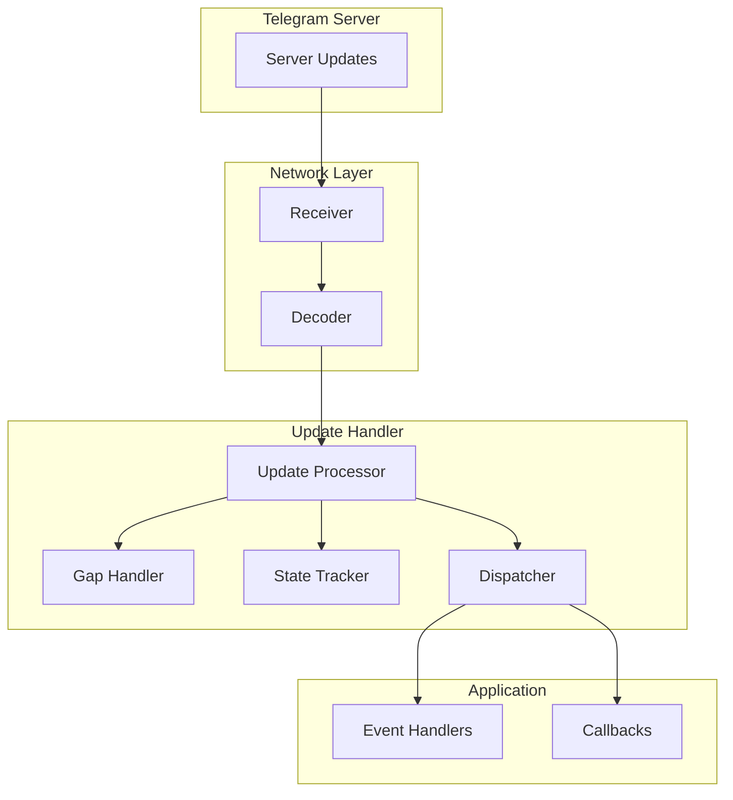

# Update Handling

---
**Navigation:** [← Internals](README.md) | [Home](../index.md) | [Up](../index.md) | [File Operations →](files.md)

---

## Overview

Update handling is a core component of Telethon that processes real-time events from Telegram servers. The update system manages incoming updates, maintains synchronization state, handles gaps in the update sequence, and dispatches events to appropriate handlers.

## Update System Architecture



## Update Types

### Update Categories

```python
class UpdateType(Enum):
    """Categories of updates."""
    
    # Message updates
    NEW_MESSAGE = "new_message"
    MESSAGE_EDITED = "message_edited"
    MESSAGE_DELETED = "message_deleted"
    MESSAGE_READ = "message_read"
    
    # User updates
    USER_STATUS = "user_status"
    USER_TYPING = "user_typing"
    USER_PHOTO = "user_photo"
    USER_NAME = "user_name"
    
    # Chat updates
    CHAT_PARTICIPANT = "chat_participant"
    CHAT_ADMINS = "chat_admins"
    CHAT_TITLE = "chat_title"
    CHAT_PHOTO = "chat_photo"
    
    # Channel updates
    CHANNEL_MESSAGE = "channel_message"
    CHANNEL_PINNED = "channel_pinned"
    CHANNEL_PARTICIPANT = "channel_participant"
    
    # Other updates
    DRAFT_MESSAGE = "draft_message"
    NOTIFICATION = "notification"
    PRIVACY = "privacy"
    CONFIG = "config"

# Update type mapping
UPDATE_TYPE_MAP = {
    UpdateNewMessage: UpdateType.NEW_MESSAGE,
    UpdateEditMessage: UpdateType.MESSAGE_EDITED,
    UpdateDeleteMessages: UpdateType.MESSAGE_DELETED,
    UpdateReadHistoryInbox: UpdateType.MESSAGE_READ,
    UpdateReadHistoryOutbox: UpdateType.MESSAGE_READ,
    UpdateUserStatus: UpdateType.USER_STATUS,
    UpdateUserTyping: UpdateType.USER_TYPING,
    UpdateUserPhoto: UpdateType.USER_PHOTO,
    UpdateUserName: UpdateType.USER_NAME,
    UpdateChatParticipants: UpdateType.CHAT_PARTICIPANT,
    UpdateChatAdmins: UpdateType.CHAT_ADMINS,
    UpdateNewChannelMessage: UpdateType.CHANNEL_MESSAGE,
    UpdateChannelPinnedMessage: UpdateType.CHANNEL_PINNED,
}
```

## Update Handler

### Core Update Handler

```python
class UpdateHandler:
    """
    Main update handling system.
    """
    
    def __init__(self, client):
        self.client = client
        self.state = UpdateState()
        self.dispatcher = EventDispatcher(client)
        self.gap_handler = GapHandler(client)
        self.pending_updates = PriorityQueue()
        self._processing = False
        self._lock = asyncio.Lock()
        
    async def process_updates(self, updates):
        """Process incoming updates."""
        async with self._lock:
            # Handle different update containers
            if isinstance(updates, UpdatesContainer):
                await self._process_container(updates)
            elif isinstance(updates, UpdateShort):
                await self._process_short(updates)
            elif isinstance(updates, Updates):
                await self._process_updates(updates)
            elif isinstance(updates, UpdatesCombined):
                await self._process_combined(updates)
            else:
                logger.warning(f"Unknown update type: {type(updates)}")
                
    async def _process_container(self, container):
        """Process update container."""
        # Sort updates by pts/date
        sorted_updates = self._sort_updates(container.updates)
        
        # Check for gaps
        if self._has_gap(sorted_updates):
            await self.gap_handler.handle_gap(
                self.state.pts,
                container.pts
            )
            return
            
        # Process each update
        for update in sorted_updates:
            await self._process_single_update(update)
            
        # Update state
        self.state.update_from(container)
        
    async def _process_single_update(self, update):
        """Process single update."""
        try:
            # Check if update is outdated
            if self._is_outdated(update):
                logger.debug(f"Skipping outdated update: {update}")
                return
                
            # Check if already processed
            if self._is_duplicate(update):
                logger.debug(f"Skipping duplicate update: {update}")
                return
                
            # Convert to event
            event = await self._update_to_event(update)
            if event:
                # Dispatch event
                await self.dispatcher.dispatch(event)
                
            # Mark as processed
            self._mark_processed(update)
            
        except Exception as e:
            logger.error(f"Error processing update: {e}", exc_info=True)
```

### Update State Management

```python
class UpdateState:
    """
    Manages update synchronization state.
    """
    
    def __init__(self):
        self.pts = 0
        self.qts = 0
        self.seq = 0
        self.date = 0
        self._channels = {}  # channel_id -> pts
        self._processed_updates = LRUCache(maxsize=1000)
        
    def update_from(self, updates):
        """Update state from updates container."""
        if hasattr(updates, 'pts'):
            self.pts = updates.pts
        if hasattr(updates, 'qts'):
            self.qts = updates.qts
        if hasattr(updates, 'seq'):
            self.seq = updates.seq
        if hasattr(updates, 'date'):
            self.date = updates.date
            
    def get_channel_pts(self, channel_id: int) -> int:
        """Get PTS for channel."""
        return self._channels.get(channel_id, 0)
        
    def set_channel_pts(self, channel_id: int, pts: int):
        """Set PTS for channel."""
        self._channels[channel_id] = pts
        
    def mark_processed(self, update_id: int):
        """Mark update as processed."""
        self._processed_updates[update_id] = time.time()
        
    def is_processed(self, update_id: int) -> bool:
        """Check if update was processed."""
        return update_id in self._processed_updates
        
    def save_to_session(self, session):
        """Save state to session."""
        session.set_update_state(0, {
            'pts': self.pts,
            'qts': self.qts,
            'seq': self.seq,
            'date': self.date
        })
        
        # Save channel states
        for channel_id, pts in self._channels.items():
            session.set_update_state(channel_id, {'pts': pts})
```

### Gap Handling

```python
class GapHandler:
    """
    Handles gaps in update sequence.
    """
    
    def __init__(self, client):
        self.client = client
        self._filling_gaps = set()
        self._gap_timeout = 3.0
        
    async def handle_gap(self, local_pts: int, remote_pts: int):
        """Handle gap in updates."""
        gap_key = (local_pts, remote_pts)
        
        # Avoid duplicate gap filling
        if gap_key in self._filling_gaps:
            return
            
        self._filling_gaps.add(gap_key)
        
        try:
            logger.info(f"Filling gap: pts {local_pts} -> {remote_pts}")
            
            # Get difference
            diff = await self._get_difference(local_pts)
            
            if isinstance(diff, updates.Difference):
                await self._apply_difference(diff)
            elif isinstance(diff, updates.DifferenceSlice):
                await self._apply_difference_slice(diff)
            elif isinstance(diff, updates.DifferenceEmpty):
                logger.debug("No gap to fill")
            elif isinstance(diff, updates.DifferenceTooLong):
                await self._handle_too_long()
                
        finally:
            self._filling_gaps.remove(gap_key)
            
    async def _get_difference(self, pts: int):
        """Get updates difference."""
        return await self.client(
            GetDifferenceRequest(
                pts=pts,
                pts_total_limit=None,
                date=self.client.state.date,
                qts=self.client.state.qts
            )
        )
        
    async def _apply_difference(self, diff):
        """Apply difference updates."""
        # Process new messages
        for message in diff.new_messages:
            update = UpdateNewMessage(
                message=message,
                pts=0,
                pts_count=0
            )
            await self.client._process_update(update)
            
        # Process other updates
        for update in diff.other_updates:
            await self.client._process_update(update)
            
        # Update state
        self.client.state.update_from(diff.state)
```

### Channel Updates

```python
class ChannelUpdateHandler:
    """
    Handles channel-specific updates.
    """
    
    def __init__(self, client):
        self.client = client
        self._channel_states = {}
        self._channel_gaps = {}
        
    async def handle_channel_update(self, update):
        """Handle channel update."""
        channel_id = self._get_channel_id(update)
        if not channel_id:
            return
            
        # Check channel state
        current_pts = self._get_channel_pts(channel_id)
        update_pts = getattr(update, 'pts', 0)
        
        if update_pts and current_pts:
            expected_pts = current_pts + getattr(update, 'pts_count', 1)
            
            if update_pts > expected_pts:
                # Gap detected
                await self._handle_channel_gap(channel_id, current_pts, update_pts)
                return
            elif update_pts < expected_pts:
                # Outdated update
                logger.debug(f"Outdated channel update: {update_pts} < {expected_pts}")
                return
                
        # Process update
        await self._process_channel_update(update)
        
        # Update channel state
        if update_pts:
            self._set_channel_pts(channel_id, update_pts)
            
    async def _handle_channel_gap(self, channel_id: int, local_pts: int, remote_pts: int):
        """Handle gap in channel updates."""
        logger.info(f"Channel {channel_id} gap: pts {local_pts} -> {remote_pts}")
        
        # Get channel difference
        channel = await self.client.get_input_entity(channel_id)
        
        diff = await self.client(
            GetChannelDifferenceRequest(
                channel=channel,
                filter=ChannelMessagesFilterEmpty(),
                pts=local_pts,
                limit=100
            )
        )
        
        if isinstance(diff, updates.ChannelDifference):
            await self._apply_channel_difference(channel_id, diff)
        elif isinstance(diff, updates.ChannelDifferenceTooLong):
            await self._handle_channel_too_long(channel_id, diff)
        elif isinstance(diff, updates.ChannelDifferenceEmpty):
            logger.debug(f"No gap to fill for channel {channel_id}")
```

## Update Dispatching

### Event Dispatcher

```python
class EventDispatcher:
    """
    Dispatches updates as events.
    """
    
    def __init__(self, client):
        self.client = client
        self.handlers = defaultdict(list)
        self.update_handlers = []
        
    async def dispatch(self, event):
        """Dispatch event to handlers."""
        event_type = type(event)
        
        # Dispatch to specific handlers
        if event_type in self.handlers:
            for handler in self.handlers[event_type]:
                try:
                    await self._call_handler(handler, event)
                except StopPropagation:
                    break
                except Exception as e:
                    await self._handle_error(e, handler, event)
                    
        # Dispatch to catch-all handlers
        for handler in self.update_handlers:
            try:
                await self._call_handler(handler, event)
            except StopPropagation:
                break
            except Exception as e:
                await self._handle_error(e, handler, event)
                
    async def _call_handler(self, handler, event):
        """Call event handler."""
        # Check filters
        if hasattr(handler, 'filters'):
            if not await self._check_filters(event, handler.filters):
                return
                
        # Set client reference
        event._client = self.client
        
        # Call handler
        if asyncio.iscoroutinefunction(handler):
            await handler(event)
        else:
            handler(event)
```

### Update to Event Conversion

```python
class UpdateConverter:
    """
    Converts updates to events.
    """
    
    def __init__(self, client):
        self.client = client
        
    async def convert(self, update) -> Optional[Event]:
        """Convert update to event."""
        converters = {
            UpdateNewMessage: self._convert_new_message,
            UpdateEditMessage: self._convert_edit_message,
            UpdateDeleteMessages: self._convert_delete_messages,
            UpdateReadHistoryInbox: self._convert_read_inbox,
            UpdateReadHistoryOutbox: self._convert_read_outbox,
            UpdateUserStatus: self._convert_user_status,
            UpdateUserTyping: self._convert_user_typing,
            UpdateChatParticipants: self._convert_chat_participants,
            UpdateNewChannelMessage: self._convert_channel_message,
        }
        
        update_type = type(update)
        if update_type in converters:
            return await converters[update_type](update)
            
        # Try raw event
        return RawUpdate(update)
        
    async def _convert_new_message(self, update):
        """Convert new message update."""
        message = update.message
        
        # Resolve entities
        await self._ensure_entities(message)
        
        # Create event
        return NewMessage.Event(
            message=message,
            original_update=update
        )
        
    async def _ensure_entities(self, message):
        """Ensure message entities are cached."""
        # Cache sender
        if message.from_id:
            await self._cache_entity(message.from_id)
            
        # Cache chat
        await self._cache_entity(message.peer_id)
        
        # Cache mentioned users
        if message.entities:
            for entity in message.entities:
                if isinstance(entity, MessageEntityMentionName):
                    await self._cache_entity(entity.user_id)
```

## Performance Optimization

### Update Batching

```python
class UpdateBatcher:
    """
    Batches updates for efficient processing.
    """
    
    def __init__(self, batch_size=50, timeout=0.1):
        self.batch_size = batch_size
        self.timeout = timeout
        self._batch = []
        self._timer = None
        self._lock = asyncio.Lock()
        
    async def add_update(self, update):
        """Add update to batch."""
        async with self._lock:
            self._batch.append(update)
            
            if len(self._batch) >= self.batch_size:
                await self._process_batch()
            elif not self._timer:
                self._timer = asyncio.create_task(self._timeout_flush())
                
    async def _timeout_flush(self):
        """Flush batch after timeout."""
        await asyncio.sleep(self.timeout)
        async with self._lock:
            if self._batch:
                await self._process_batch()
                
    async def _process_batch(self):
        """Process batched updates."""
        if not self._batch:
            return
            
        # Sort by pts for correct order
        self._batch.sort(key=lambda u: getattr(u, 'pts', 0))
        
        # Process batch
        for update in self._batch:
            await self.client._process_update(update)
            
        # Clear batch
        self._batch.clear()
        
        if self._timer:
            self._timer.cancel()
            self._timer = None
```

### Update Deduplication

```python
class UpdateDeduplicator:
    """
    Prevents duplicate update processing.
    """
    
    def __init__(self, cache_size=10000, ttl=3600):
        self._seen = TTLCache(maxsize=cache_size, ttl=ttl)
        self._lock = threading.Lock()
        
    def is_duplicate(self, update) -> bool:
        """Check if update is duplicate."""
        update_id = self._get_update_id(update)
        
        with self._lock:
            if update_id in self._seen:
                return True
                
            self._seen[update_id] = time.time()
            return False
            
    def _get_update_id(self, update):
        """Generate unique update ID."""
        if hasattr(update, 'message') and update.message:
            # Use message ID for message updates
            return f"msg_{update.message.id}"
            
        # Generate ID from update content
        update_data = update.to_bytes()
        return hashlib.sha256(update_data).hexdigest()[:16]
```

## Update Monitoring

### Update Statistics

```python
class UpdateStatistics:
    """
    Tracks update processing statistics.
    """
    
    def __init__(self):
        self.total_updates = 0
        self.processed_updates = 0
        self.failed_updates = 0
        self.gaps_detected = 0
        self.gaps_filled = 0
        self._update_types = Counter()
        self._processing_times = []
        self._start_time = time.time()
        
    def record_update(self, update, processing_time: float):
        """Record update processing."""
        self.total_updates += 1
        self.processed_updates += 1
        self._update_types[type(update).__name__] += 1
        self._processing_times.append(processing_time)
        
        # Keep only recent times
        if len(self._processing_times) > 1000:
            self._processing_times = self._processing_times[-1000:]
            
    def record_failure(self, update, error):
        """Record update failure."""
        self.total_updates += 1
        self.failed_updates += 1
        logger.error(f"Update processing failed: {error}")
        
    def get_stats(self) -> dict:
        """Get statistics summary."""
        uptime = time.time() - self._start_time
        
        return {
            'total_updates': self.total_updates,
            'processed': self.processed_updates,
            'failed': self.failed_updates,
            'success_rate': self.processed_updates / max(1, self.total_updates),
            'updates_per_second': self.total_updates / max(1, uptime),
            'gaps_detected': self.gaps_detected,
            'gaps_filled': self.gaps_filled,
            'avg_processing_time': statistics.mean(self._processing_times) if self._processing_times else 0,
            'update_types': dict(self._update_types.most_common(10))
        }
```

## Best Practices

### Update Handling

1. **Handle Gaps Properly**: Always check for and fill gaps in update sequences
2. **Deduplicate Updates**: Prevent processing the same update multiple times
3. **Batch Processing**: Process updates in batches for efficiency
4. **Error Recovery**: Handle errors gracefully without losing updates
5. **Monitor Performance**: Track update processing metrics

### State Management

1. **Persist State**: Save update state to handle restarts
2. **Channel States**: Track per-channel update states separately
3. **Atomic Updates**: Ensure state updates are atomic
4. **Regular Cleanup**: Clean old processed update records
5. **Validate State**: Verify state consistency regularly

## Next Steps

- Continue to [File Operations](files.md) for file handling
- Review [Event System](../events/architecture.md) for event details
- See [Error Handling](errors.md) for update error handling

---
**Navigation:** [← Internals](README.md) | [Home](../index.md) | [Up](../index.md) | [File Operations →](files.md)

---