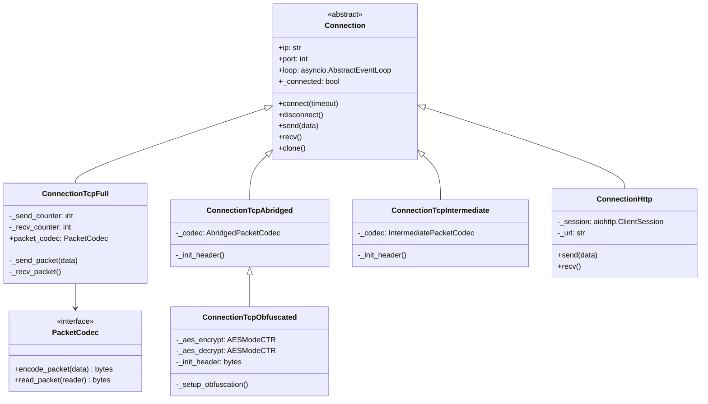
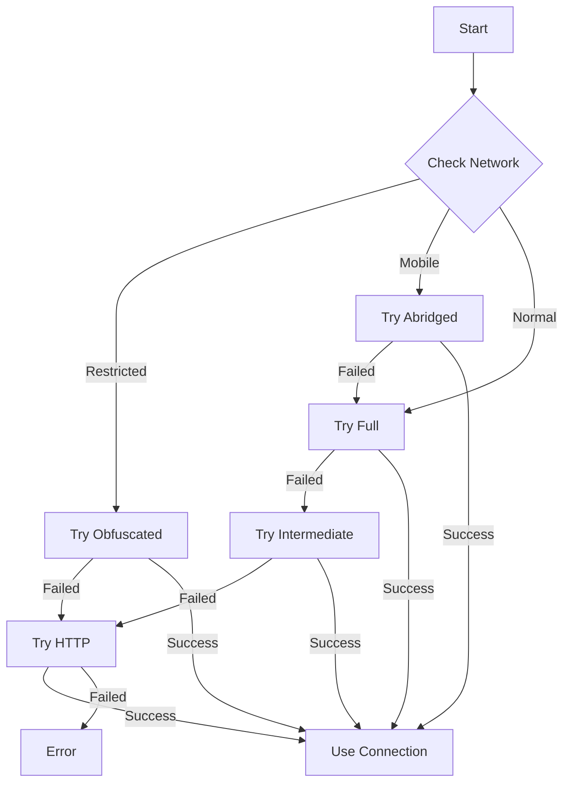

# Connection Types

---
**Navigation:** [← MTProto Sender](mtproto-sender.md) | [Home](../index.md) | [Up](../index.md) | [Data Centers →](data-centers.md)

---

## Overview

Telethon supports multiple connection types to communicate with Telegram servers. Each connection type has different characteristics in terms of overhead, obfuscation, and compatibility. The connection layer abstracts the transport details from the MTProto protocol implementation.

## Connection Architecture



## Connection Types

### TCP Full

The original MTProto transport with full packet framing.

```python
class ConnectionTcpFull(Connection):
    """
    Full TCP connection with length, sequence number, and CRC32.
    
    Packet format:
    +----+----+----+----+----+----+----+----+
    |len |seq |    payload  + padding   |CRC |
    +----+----+----+----+----+----+----+----+
    |  4 |  4 |     len - 12 bytes      | 4  |
    +----+----+----+----+----+----+----+----+
    """
    
    def __init__(self, ip, port, *, loop):
        super().__init__(ip, port, loop=loop)
        self._send_counter = 0
        self._recv_counter = 0
        
    async def _send_packet(self, data):
        length = len(data) + 12  # packet overhead
        
        # Build packet with sequence number
        packet = struct.pack('<ii', length, self._send_counter) + data
        
        # Calculate and append CRC32
        crc = struct.pack('<I', crc32(packet))
        packet += crc
        
        self._send_counter += 1
        await self._writer.write(packet)
```

**Characteristics:**
- **Overhead**: 12 bytes (length + seq + CRC)
- **Error Detection**: CRC32 checksum
- **Sequence Tracking**: Built-in counter
- **Use Case**: Default choice, most reliable

### TCP Abridged

Optimized transport with minimal overhead.

```python
class ConnectionTcpAbridged(Connection):
    """
    Abridged TCP connection with variable-length encoding.
    
    Packet format for len < 127:
    +----+----+----+----+
    |len |  payload     |
    +----+----+----+----+
    | 1  | len bytes    |
    +----+----+----+----+
    
    For len >= 127:
    +----+----+----+----+----+----+----+
    |0x7f|  len  |      payload       |
    +----+----+----+----+----+----+----+
    | 1  |   3   |     len bytes      |
    +----+----+----+----+----+----+----+
    """
    
    async def connect(self, timeout=None):
        await super().connect(timeout)
        
        # Send init header
        await self._writer.write(b'\xef')
        
    def _encode_packet(self, data):
        length = len(data) // 4
        
        if length < 127:
            return bytes([length]) + data
        else:
            return b'\x7f' + length.to_bytes(3, 'little') + data
```

**Characteristics:**
- **Overhead**: 1-4 bytes (variable length encoding)
- **No Error Detection**: Relies on TCP
- **Compact**: Minimal overhead for small packets
- **Use Case**: Mobile networks, bandwidth-constrained

### TCP Intermediate

Balance between Full and Abridged.

```python
class ConnectionTcpIntermediate(Connection):
    """
    Intermediate TCP connection with fixed 4-byte length.
    
    Packet format:
    +----+----+----+----+----+----+
    |   length  |    payload      |
    +----+----+----+----+----+----+
    |     4     |   len bytes     |
    +----+----+----+----+----+----+
    """
    
    async def connect(self, timeout=None):
        await super().connect(timeout)
        
        # Send init header
        await self._writer.write(b'\xee\xee\xee\xee')
        
    def _encode_packet(self, data):
        return struct.pack('<i', len(data)) + data
```

**Characteristics:**
- **Overhead**: 4 bytes (fixed length)
- **Simple**: Easy to implement
- **Predictable**: Fixed header size
- **Use Case**: General purpose alternative

### TCP Obfuscated

Adds traffic obfuscation to avoid detection.

```python
class ConnectionTcpObfuscated(ConnectionTcpAbridged):
    """
    Obfuscated connection that masks MTProto traffic.
    Makes traffic look like random data.
    """
    
    async def connect(self, timeout=None):
        await super().connect(timeout)
        
        # Generate random obfuscation keys
        while True:
            random_bytes = os.urandom(64)
            
            # Ensure it doesn't look like known protocols
            if (random_bytes[0] not in (0xef, 0x7f, 0x00) and
                random_bytes[:4] not in KNOWN_PROTOCOLS):
                break
                
        # Setup encryption
        encrypt_key = random_bytes[8:40]
        encrypt_iv = random_bytes[40:56]
        decrypt_key = random_bytes[56:88]
        decrypt_iv = random_bytes[88:104]
        
        self._aes_encrypt = AESModeCTR(encrypt_key, encrypt_iv)
        self._aes_decrypt = AESModeCTR(decrypt_key, decrypt_iv)
        
        # Send obfuscated header
        header = random_bytes[0:56] + b'\xef\xef\xef\xef'
        encrypted = self._aes_encrypt.encrypt(header)
        await self._writer.write(random_bytes[0:56] + encrypted[56:])
```

**Characteristics:**
- **Traffic Masking**: Looks like random data
- **ISP Bypass**: Harder to detect/block
- **Additional Encryption**: AES-CTR on transport
- **Use Case**: Restrictive networks

### HTTP Transport

Uses HTTP for environments that block other protocols.

```python
class ConnectionHttp(Connection):
    """
    HTTP-based connection using long polling.
    """
    
    def __init__(self, ip, port, *, loop):
        super().__init__(ip, port, loop=loop)
        self._session = None
        self._url = f'http://{ip}:{port}/api'
        
    async def connect(self, timeout=None):
        self._session = aiohttp.ClientSession(
            timeout=aiohttp.ClientTimeout(total=timeout)
        )
        self._connected = True
        
    async def send(self, data):
        async with self._session.post(
            self._url,
            data=data,
            headers={'Connection': 'keep-alive'}
        ) as response:
            return await response.read()
```

**Characteristics:**
- **Firewall Friendly**: Uses standard HTTP
- **Higher Overhead**: HTTP headers
- **Compatibility**: Works almost everywhere
- **Use Case**: Corporate networks, strict firewalls

## Connection Selection

### Automatic Selection



### Selection Logic

```python
class ConnectionSelector:
    """
    Automatically selects the best connection type.
    """
    
    @staticmethod
    async def connect(ip, port, *, loop, mode='auto'):
        if mode == 'auto':
            # Try connections in order of preference
            connection_types = [
                ConnectionTcpFull,
                ConnectionTcpAbridged,
                ConnectionTcpIntermediate,
                ConnectionTcpObfuscated,
                ConnectionHttp
            ]
            
            for conn_type in connection_types:
                try:
                    conn = conn_type(ip, port, loop=loop)
                    await conn.connect(timeout=10)
                    return conn
                except Exception:
                    continue
                    
            raise ConnectionError('All connection types failed')
            
        # Manual selection
        connection_map = {
            'full': ConnectionTcpFull,
            'abridged': ConnectionTcpAbridged,
            'intermediate': ConnectionTcpIntermediate,
            'obfuscated': ConnectionTcpObfuscated,
            'http': ConnectionHttp
        }
        
        conn_type = connection_map.get(mode)
        if not conn_type:
            raise ValueError(f'Unknown connection mode: {mode}')
            
        return conn_type(ip, port, loop=loop)
```

## Packet Codec Implementation

### Codec Interface

```python
class PacketCodec(abc.ABC):
    """
    Abstract base class for packet encoding/decoding.
    """
    
    @abc.abstractmethod
    def encode_packet(self, data: bytes) -> bytes:
        """Encode data into a packet."""
        
    @abc.abstractmethod
    async def read_packet(self, reader: asyncio.StreamReader) -> bytes:
        """Read and decode a packet."""
```

### Full Packet Codec

```python
class FullPacketCodec(PacketCodec):
    def __init__(self):
        self._send_counter = 0
        self._recv_counter = 0
        
    def encode_packet(self, data: bytes) -> bytes:
        # Ensure data is padded to 4 bytes
        padding = (4 - len(data) % 4) % 4
        data += os.urandom(padding)
        
        length = len(data) + 12
        packet = struct.pack('<ii', length, self._send_counter) + data
        
        crc = crc32(packet)
        packet += struct.pack('<I', crc)
        
        self._send_counter += 1
        return packet
        
    async def read_packet(self, reader: asyncio.StreamReader) -> bytes:
        # Read length (4 bytes)
        length_data = await reader.readexactly(4)
        length = struct.unpack('<i', length_data)[0]
        
        # Read sequence + data + crc
        packet_data = await reader.readexactly(length - 4)
        
        # Verify sequence number
        seq = struct.unpack('<i', packet_data[:4])[0]
        if seq != self._recv_counter:
            raise ValueError(f'Invalid sequence: {seq} != {self._recv_counter}')
            
        self._recv_counter += 1
        
        # Verify CRC
        packet = length_data + packet_data[:-4]
        crc_expected = struct.unpack('<I', packet_data[-4:])[0]
        crc_actual = crc32(packet)
        
        if crc_expected != crc_actual:
            raise ValueError('CRC mismatch')
            
        return packet_data[4:-4]  # Return payload only
```

## Connection Pooling

### Pool Implementation

```python
class ConnectionPool:
    """
    Manages a pool of connections for better performance.
    """
    
    def __init__(self, max_connections=5):
        self._pool = collections.deque(maxlen=max_connections)
        self._in_use = set()
        self._lock = asyncio.Lock()
        
    async def acquire(self, dc_id, ip, port):
        async with self._lock:
            # Try to find existing connection
            for conn in self._pool:
                if conn.dc_id == dc_id and conn not in self._in_use:
                    self._pool.remove(conn)
                    self._in_use.add(conn)
                    return conn
                    
            # Create new connection
            conn = await self._create_connection(ip, port)
            conn.dc_id = dc_id
            self._in_use.add(conn)
            return conn
            
    async def release(self, conn):
        async with self._lock:
            self._in_use.discard(conn)
            if conn._connected:
                self._pool.append(conn)
            else:
                await conn.disconnect()
```

## Performance Characteristics

### Comparison Table

| Connection Type | Overhead | Error Detection | Obfuscation | Use Case |
|----------------|----------|-----------------|-------------|----------|
| TCP Full | 12 bytes | CRC32 | No | Default, reliable |
| TCP Abridged | 1-4 bytes | TCP only | No | Mobile, low bandwidth |
| TCP Intermediate | 4 bytes | TCP only | No | Alternative |
| TCP Obfuscated | 1-4 bytes | TCP only | Yes | Restrictive networks |
| HTTP | ~200 bytes | HTTP | No | Firewalls |

### Benchmark Results

```python
# Throughput comparison (MB/s)
benchmarks = {
    'tcp_full': {
        'small_messages': 45.2,
        'large_files': 89.7,
        'latency_ms': 12.3
    },
    'tcp_abridged': {
        'small_messages': 52.1,
        'large_files': 91.2,
        'latency_ms': 10.8
    },
    'tcp_intermediate': {
        'small_messages': 48.9,
        'large_files': 90.5,
        'latency_ms': 11.2
    },
    'tcp_obfuscated': {
        'small_messages': 43.7,
        'large_files': 85.3,
        'latency_ms': 14.1
    },
    'http': {
        'small_messages': 12.4,
        'large_files': 34.2,
        'latency_ms': 45.6
    }
}
```

## Error Handling

### Connection Errors

```python
class ConnectionErrorHandler:
    """
    Handles various connection-level errors.
    """
    
    async def handle_error(self, error, connection):
        if isinstance(error, asyncio.TimeoutError):
            # Connection timeout
            await self._handle_timeout(connection)
            
        elif isinstance(error, ConnectionResetError):
            # Connection reset by peer
            await self._handle_reset(connection)
            
        elif isinstance(error, ssl.SSLError):
            # SSL/TLS error
            await self._handle_ssl_error(error, connection)
            
        elif isinstance(error, OSError) and error.errno == errno.ENETUNREACH:
            # Network unreachable
            await self._handle_network_error(connection)
            
        else:
            # Unknown error
            raise error
            
    async def _handle_timeout(self, connection):
        # Try different connection type
        if isinstance(connection, ConnectionTcpFull):
            return ConnectionTcpAbridged
        elif isinstance(connection, ConnectionTcpAbridged):
            return ConnectionTcpObfuscated
        else:
            return ConnectionHttp
```

## Best Practices

### Connection Selection

1. **Start with TCP Full**: Most reliable for general use
2. **Use Abridged for Mobile**: Lower overhead on metered connections
3. **Try Obfuscated for Restrictions**: When MTProto is blocked
4. **Fall back to HTTP**: Last resort for strict environments
5. **Monitor Performance**: Switch based on metrics

### Implementation Tips

1. **Connection Reuse**: Pool connections for efficiency
2. **Graceful Degradation**: Try multiple types on failure
3. **Timeout Handling**: Set appropriate timeouts
4. **Error Recovery**: Implement exponential backoff
5. **Monitoring**: Log connection metrics

## Next Steps

- Continue to [Data Centers](data-centers.md) for DC management
- See [Request Handling](request-handling.md) for request flow
- Review [MTProto Sender](mtproto-sender.md) for protocol details

---
**Navigation:** [← MTProto Sender](mtproto-sender.md) | [Home](../index.md) | [Up](../index.md) | [Data Centers →](data-centers.md)

---