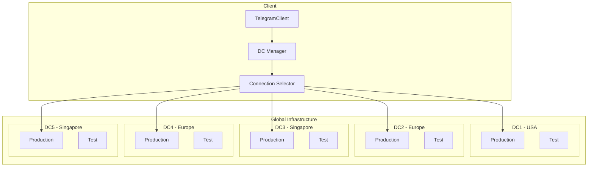
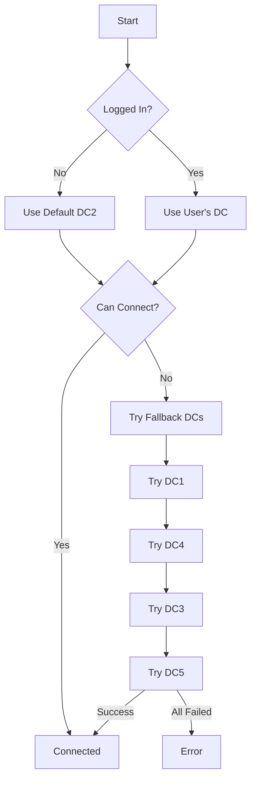
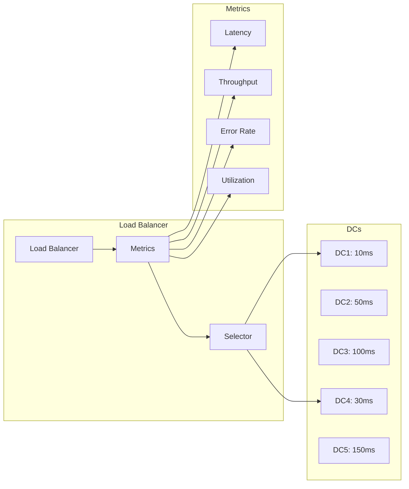

# Data Centers

---
**Navigation:** [← Connection Types](connections.md) | [Home](../index.md) | [Up](../index.md) | [Request Handling →](request-handling.md)

---

## Overview

Telegram operates multiple data centers (DCs) distributed globally to provide low latency and high availability. Telethon handles DC management transparently, including automatic migration when required by the server.

## Data Center Architecture



## DC Configuration

### Production Data Centers

```python
class DataCenter:
    """Represents a Telegram data center."""
    
    PRODUCTION_DCS = {
        1: {
            'ipv4': '149.154.175.53',
            'ipv6': '2001:b28:f23d:f001::a',
            'port': 443,
            'location': 'Miami, USA'
        },
        2: {
            'ipv4': '149.154.167.51',
            'ipv6': '2001:67c:4e8:f002::a',
            'port': 443,
            'location': 'Amsterdam, Netherlands'
        },
        3: {
            'ipv4': '149.154.175.100',
            'ipv6': '2001:b28:f23d:f003::a',
            'port': 443,
            'location': 'Miami, USA'
        },
        4: {
            'ipv4': '149.154.167.91',
            'ipv6': '2001:67c:4e8:f004::a',
            'port': 443,
            'location': 'Amsterdam, Netherlands'
        },
        5: {
            'ipv4': '91.108.56.130',
            'ipv6': '2001:b28:f23f:f005::a',
            'port': 443,
            'location': 'Singapore'
        }
    }
    
    TEST_DCS = {
        1: {
            'ipv4': '149.154.175.10',
            'ipv6': '2001:b28:f23d:f001::e',
            'port': 443,
            'location': 'Miami, USA (Test)'
        },
        2: {
            'ipv4': '149.154.167.40',
            'ipv6': '2001:67c:4e8:f002::e',
            'port': 443,
            'location': 'Amsterdam, Netherlands (Test)'
        },
        3: {
            'ipv4': '149.154.175.117',
            'ipv6': '2001:b28:f23d:f003::e',
            'port': 443,
            'location': 'Miami, USA (Test)'
        }
    }
```

### DC Selection Strategy



## DC Manager Implementation

### Core DC Manager

```python
class DCManager:
    """
    Manages data center connections and migrations.
    """
    
    def __init__(self, session, test_mode=False):
        self.session = session
        self.test_mode = test_mode
        self._connections = {}
        self._main_dc = None
        self._auth_keys = {}
        
    def get_dc_config(self, dc_id):
        """Get configuration for a specific DC."""
        dcs = DataCenter.TEST_DCS if self.test_mode else DataCenter.PRODUCTION_DCS
        return dcs.get(dc_id)
        
    async def connect(self, dc_id=None):
        """Connect to a specific DC or the best available."""
        if dc_id is None:
            dc_id = self._select_best_dc()
            
        if dc_id in self._connections:
            return self._connections[dc_id]
            
        config = self.get_dc_config(dc_id)
        if not config:
            raise ValueError(f'Unknown DC: {dc_id}')
            
        connection = await self._create_connection(config)
        self._connections[dc_id] = connection
        
        if self._main_dc is None:
            self._main_dc = dc_id
            
        return connection
        
    async def _create_connection(self, config):
        """Create a new connection to a DC."""
        # Try IPv6 first if available
        if config.get('ipv6') and self._supports_ipv6():
            try:
                return await self._connect_to(
                    config['ipv6'],
                    config['port'],
                    ipv6=True
                )
            except Exception:
                pass
                
        # Fall back to IPv4
        return await self._connect_to(
            config['ipv4'],
            config['port'],
            ipv6=False
        )
```

### DC Migration

```python
class DCMigrator:
    """
    Handles migration between data centers.
    """
    
    def __init__(self, client):
        self.client = client
        self._migrating = False
        
    async def migrate_to_dc(self, new_dc):
        """
        Migrate the client to a new data center.
        
        This involves:
        1. Exporting current authorization
        2. Connecting to new DC
        3. Importing authorization
        4. Switching primary connection
        """
        if self._migrating:
            raise RuntimeError('Already migrating')
            
        self._migrating = True
        
        try:
            # Export auth from current DC
            auth = await self._export_authorization(new_dc)
            
            # Connect to new DC
            new_connection = await self.client._dc_manager.connect(new_dc)
            
            # Import auth to new DC
            await self._import_authorization(new_connection, auth)
            
            # Switch primary DC
            await self._switch_primary_dc(new_dc)
            
            # Update session
            self.client.session.set_dc(
                new_dc,
                new_connection.ip,
                new_connection.port
            )
            
            return True
            
        finally:
            self._migrating = False
            
    async def _export_authorization(self, dc_id):
        """Export authorization for migration."""
        from ..tl.functions.auth import ExportAuthorizationRequest
        
        result = await self.client(
            ExportAuthorizationRequest(dc_id=dc_id)
        )
        
        return result.id, result.bytes
        
    async def _import_authorization(self, connection, auth):
        """Import authorization to new DC."""
        from ..tl.functions.auth import ImportAuthorizationRequest
        
        auth_id, auth_bytes = auth
        
        # Send through new connection
        await connection.send(
            ImportAuthorizationRequest(
                id=auth_id,
                bytes=auth_bytes
            )
        )
```

## Multi-DC Operations

### Parallel Requests

```python
class MultiDCClient:
    """
    Handles operations across multiple DCs.
    """
    
    def __init__(self, base_client):
        self.base_client = base_client
        self._dc_clients = {}
        
    async def get_dc_client(self, dc_id):
        """Get or create a client for a specific DC."""
        if dc_id in self._dc_clients:
            return self._dc_clients[dc_id]
            
        # Create new client for DC
        client = await self._create_dc_client(dc_id)
        self._dc_clients[dc_id] = client
        return client
        
    async def download_from_dc(self, dc_id, location):
        """Download file from specific DC."""
        client = await self.get_dc_client(dc_id)
        return await client.download_file(location)
        
    async def parallel_download(self, file_parts):
        """
        Download file parts from multiple DCs in parallel.
        
        Args:
            file_parts: List of (dc_id, location, offset, limit)
        """
        tasks = []
        
        for dc_id, location, offset, limit in file_parts:
            client = await self.get_dc_client(dc_id)
            task = client.download_file_part(
                location, offset, limit
            )
            tasks.append(task)
            
        # Download all parts in parallel
        parts = await asyncio.gather(*tasks)
        
        # Combine parts
        return b''.join(parts)
```

### DC Load Balancing



### Implementation

```python
class DCLoadBalancer:
    """
    Selects best DC based on various metrics.
    """
    
    def __init__(self):
        self.metrics = defaultdict(DCMetrics)
        self._update_interval = 60  # seconds
        self._last_update = 0
        
    async def select_best_dc(self, operation_type='general'):
        """Select the best DC for an operation."""
        await self._update_metrics_if_needed()
        
        # Score each DC
        scores = {}
        for dc_id, metrics in self.metrics.items():
            score = self._calculate_score(metrics, operation_type)
            scores[dc_id] = score
            
        # Select DC with best score
        best_dc = max(scores.items(), key=lambda x: x[1])[0]
        return best_dc
        
    def _calculate_score(self, metrics, operation_type):
        """Calculate DC score based on metrics."""
        if operation_type == 'download':
            # Prioritize throughput for downloads
            return (
                metrics.throughput * 0.5 +
                (1000 / metrics.latency) * 0.3 +
                (1 - metrics.error_rate) * 0.2
            )
        elif operation_type == 'interactive':
            # Prioritize latency for interactive operations
            return (
                (1000 / metrics.latency) * 0.6 +
                (1 - metrics.error_rate) * 0.3 +
                metrics.throughput * 0.1
            )
        else:
            # Balanced scoring
            return (
                (1000 / metrics.latency) * 0.4 +
                metrics.throughput * 0.3 +
                (1 - metrics.error_rate) * 0.3
            )
```

## Geographic Distribution

### DC Location Strategy

```python
class GeographicDCSelector:
    """
    Selects DC based on geographic proximity.
    """
    
    DC_COORDINATES = {
        1: (25.7617, -80.1918),   # Miami
        2: (52.3702, 4.8952),     # Amsterdam
        3: (25.7617, -80.1918),   # Miami
        4: (52.3702, 4.8952),     # Amsterdam
        5: (1.3521, 103.8198),    # Singapore
    }
    
    async def select_nearest_dc(self, user_location=None):
        """Select geographically nearest DC."""
        if user_location is None:
            user_location = await self._detect_location()
            
        distances = {}
        for dc_id, dc_coords in self.DC_COORDINATES.items():
            distance = self._calculate_distance(
                user_location,
                dc_coords
            )
            distances[dc_id] = distance
            
        # Return nearest DC
        return min(distances.items(), key=lambda x: x[1])[0]
        
    def _calculate_distance(self, coord1, coord2):
        """Calculate distance between coordinates."""
        # Haversine formula
        lat1, lon1 = coord1
        lat2, lon2 = coord2
        
        R = 6371  # Earth radius in km
        
        dlat = math.radians(lat2 - lat1)
        dlon = math.radians(lon2 - lon1)
        
        a = (
            math.sin(dlat / 2) ** 2 +
            math.cos(math.radians(lat1)) *
            math.cos(math.radians(lat2)) *
            math.sin(dlon / 2) ** 2
        )
        
        c = 2 * math.asin(math.sqrt(a))
        return R * c
```

## DC Health Monitoring

### Health Check System

```python
class DCHealthMonitor:
    """
    Monitors DC health and availability.
    """
    
    def __init__(self, dc_manager):
        self.dc_manager = dc_manager
        self._health_status = {}
        self._check_interval = 30
        self._monitor_task = None
        
    async def start_monitoring(self):
        """Start health monitoring."""
        self._monitor_task = asyncio.create_task(
            self._monitor_loop()
        )
        
    async def _monitor_loop(self):
        """Continuous health monitoring."""
        while True:
            try:
                await self._check_all_dcs()
                await asyncio.sleep(self._check_interval)
            except asyncio.CancelledError:
                break
                
    async def _check_all_dcs(self):
        """Check health of all DCs."""
        tasks = []
        
        for dc_id in DataCenter.PRODUCTION_DCS:
            task = asyncio.create_task(
                self._check_dc_health(dc_id)
            )
            tasks.append((dc_id, task))
            
        for dc_id, task in tasks:
            try:
                health = await task
                self._health_status[dc_id] = health
            except Exception as e:
                self._health_status[dc_id] = DCHealth(
                    available=False,
                    error=str(e)
                )
                
    async def _check_dc_health(self, dc_id):
        """Check health of a single DC."""
        start_time = time.time()
        
        try:
            # Try to connect
            connection = await self.dc_manager.connect(dc_id)
            
            # Send ping
            await connection.ping()
            
            latency = (time.time() - start_time) * 1000
            
            return DCHealth(
                available=True,
                latency=latency,
                last_check=time.time()
            )
            
        except Exception as e:
            return DCHealth(
                available=False,
                error=str(e),
                last_check=time.time()
            )
```

## Error Handling

### DC-Specific Errors

```python
class DCError(Exception):
    """Base class for DC-related errors."""
    pass

class DCMigrationRequired(DCError):
    """Raised when migration to another DC is required."""
    
    def __init__(self, new_dc):
        self.new_dc = new_dc
        super().__init__(f'Migration required to DC{new_dc}')

class DCNotAvailable(DCError):
    """Raised when a DC is not available."""
    
    def __init__(self, dc_id):
        self.dc_id = dc_id
        super().__init__(f'DC{dc_id} is not available')

class DCAuthorizationError(DCError):
    """Raised when authorization fails on a DC."""
    pass
```

### Error Recovery

```python
async def handle_dc_error(error, client):
    """Handle DC-related errors."""
    
    if isinstance(error, FileMigrateError):
        # File is on different DC
        new_dc = error.new_dc
        await client.migrate_to_dc(new_dc)
        return True  # Retry
        
    elif isinstance(error, PhoneMigrateError):
        # User's phone number belongs to different DC
        new_dc = error.new_dc
        await client.migrate_to_dc(new_dc)
        return True  # Retry
        
    elif isinstance(error, NetworkMigrateError):
        # Network suggests different DC
        new_dc = error.new_dc
        await client.migrate_to_dc(new_dc)
        return True  # Retry
        
    elif isinstance(error, UserMigrateError):
        # User data is on different DC
        new_dc = error.new_dc
        await client.migrate_to_dc(new_dc)
        return True  # Retry
        
    return False  # Don't retry
```

## Best Practices

### DC Management

1. **Cache DC Connections**: Reuse connections to avoid overhead
2. **Handle Migration Gracefully**: Expect and handle DC migrations
3. **Monitor DC Health**: Track availability and performance
4. **Use Geographic Proximity**: Select nearest DC for better latency
5. **Implement Fallbacks**: Have backup DCs for reliability

### Performance Optimization

1. **Parallel Operations**: Use multiple DCs for large downloads
2. **Load Balance**: Distribute requests across available DCs
3. **Connection Pooling**: Maintain pool of DC connections
4. **Metric-Based Selection**: Choose DC based on operation type
5. **Async Operations**: Use asyncio for concurrent DC operations

## Next Steps

- Continue to [Request Handling](request-handling.md) for request flow
- See [MTProto Sender](mtproto-sender.md) for protocol details
- Review [Connection Types](connections.md) for transport options

---
**Navigation:** [← Connection Types](connections.md) | [Home](../index.md) | [Up](../index.md) | [Request Handling →](request-handling.md)

---