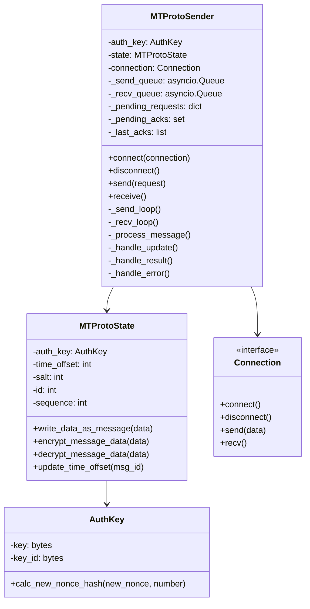
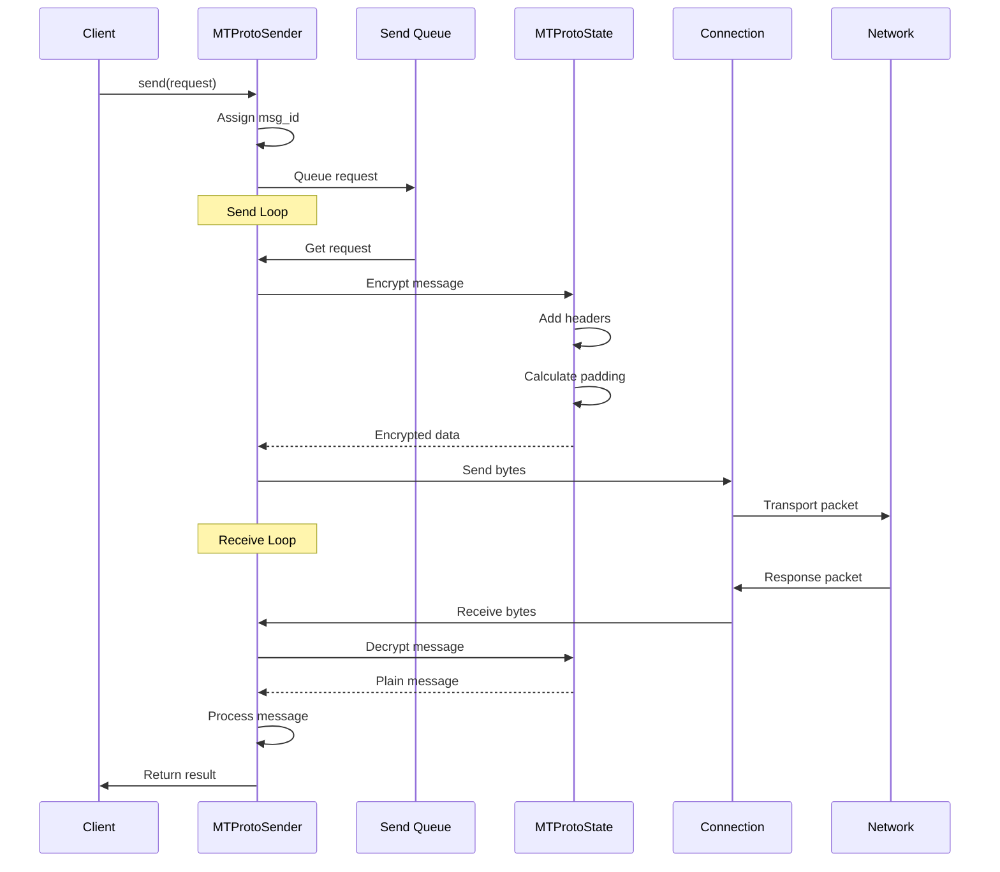
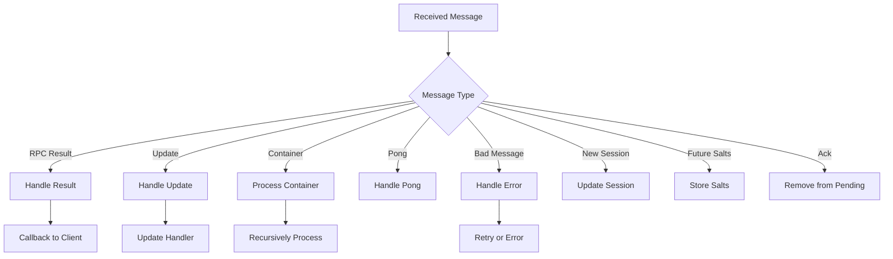
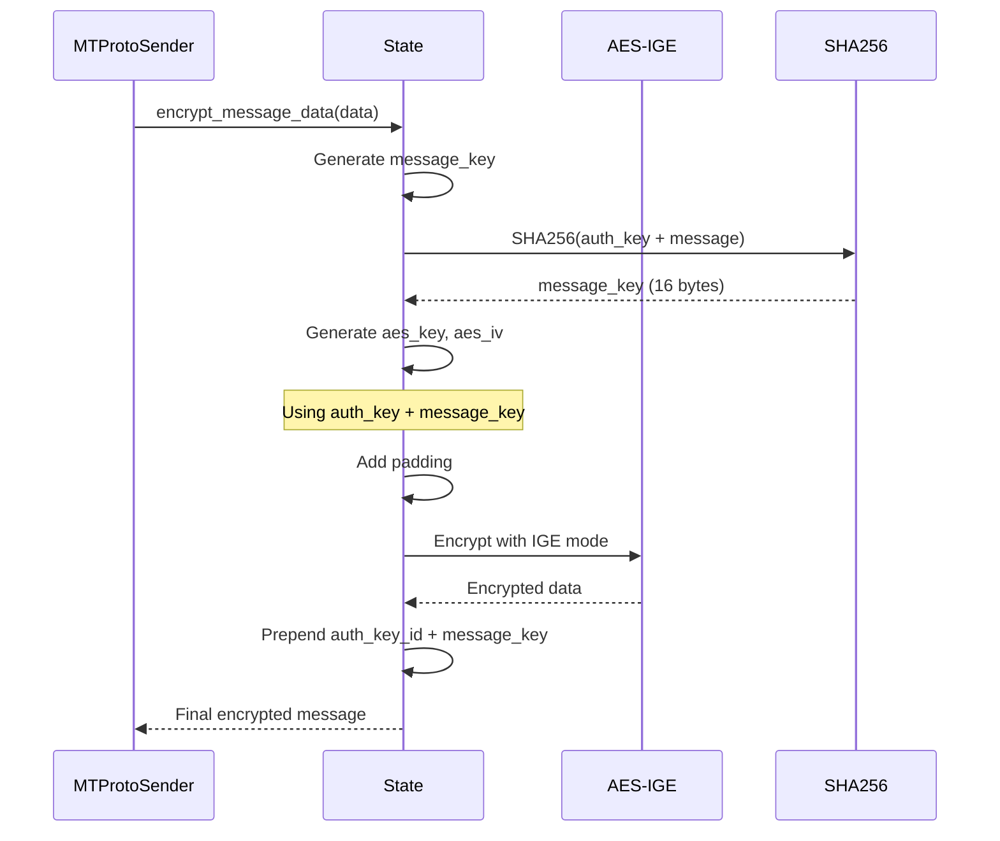
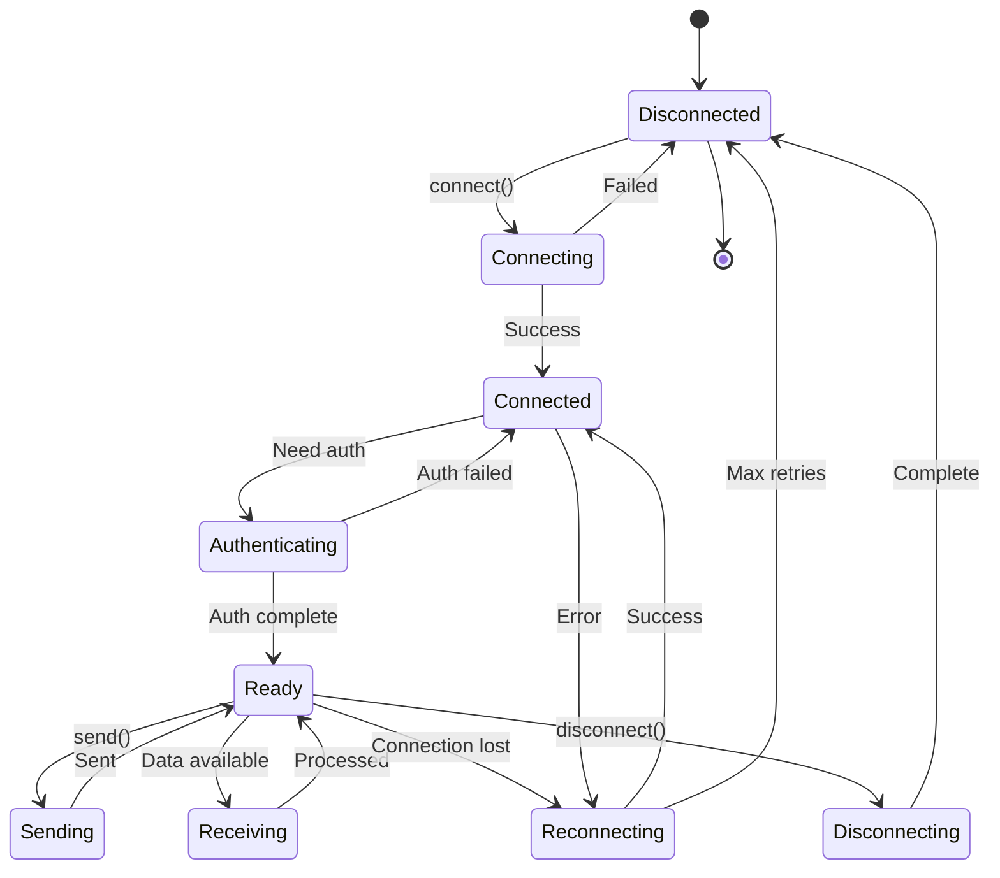

# MTProto Sender

---
**Navigation:** [← Network Layer](README.md) | [Home](../index.md) | [Up](../index.md) | [Connection Types →](connections.md)

---

## Overview

`MTProtoSender` is the core component responsible for implementing the MTProto protocol. It handles message encryption, request queuing, response processing, and connection management. This class serves as the bridge between the high-level client API and the low-level network transport.

## Architecture



## Core Components

### MTProtoSender Class

The main class responsible for protocol implementation.

```python
class MTProtoSender:
    def __init__(self, auth_key, *, loggers, retries=5, delay=1, 
                 auto_reconnect=True, connect_timeout=None, 
                 auth_key_callback=None, update_callback=None, 
                 auto_reconnect_callback=None):
        self.auth_key = auth_key
        self._state = MTProtoState(auth_key, loggers=loggers)
        self._connection = None
        self._loggers = loggers
        
        # Queues for sending and receiving
        self._send_queue = asyncio.Queue()
        self._recv_queue = asyncio.Queue()
        
        # Pending requests waiting for response
        self._pending_requests = {}
        
        # Acknowledgments waiting to be sent
        self._pending_acks = set()
        
        # Recent acknowledgments to avoid duplicates
        self._last_acks = collections.deque(maxlen=10)
```

### Message Flow



## Request Handling

### Send Process

```python
async def send(self, request, ordered=False):
    """
    Sends a request to the server.
    
    Args:
        request: The TLRequest to send
        ordered: Whether this request must be sent in order
        
    Returns:
        The response from the server
    """
    # Generate unique message ID
    msg_id = self._state.get_new_msg_id()
    
    # Create message container
    message = _Message(
        msg_id=msg_id,
        seq_no=self._state.get_seq_no(content_related=True),
        obj=request,
        after=None
    )
    
    # Add to pending requests
    self._pending_requests[msg_id] = message
    
    # Queue for sending
    await self._send_queue.put(message)
    
    # Wait for response
    return await message.future
```

### Receive Process

```python
async def _recv_loop(self):
    """
    Continuously receives messages from the server.
    """
    while self._connected:
        try:
            # Receive data from connection
            body = await self._connection.recv()
            
            # Decrypt message
            message = self._state.decrypt_message_data(body)
            
            # Process based on message type
            await self._process_message(message)
            
        except asyncio.CancelledError:
            break
        except Exception as e:
            await self._handle_error(e)
```

## Message Processing

### Message Types



### Processing Implementation

```python
async def _process_message(self, msg):
    """
    Processes a decrypted message based on its type.
    """
    handler = self._handlers.get(type(msg.obj), None)
    
    if handler:
        await handler(msg)
    else:
        self._log.warning(f'Unhandled message type: {type(msg.obj)}')
        
    # Always acknowledge message if needed
    if msg.obj.CONSTRUCTOR_ID in _CONTENT_RELATED:
        self._pending_acks.add(msg.msg_id)
```

## State Management

### MTProtoState

Manages protocol state including encryption and sequence numbers.

```python
class MTProtoState:
    def __init__(self, auth_key, loggers):
        self.auth_key = auth_key
        self.time_offset = 0
        self.salt = 0
        self.id = self._get_new_id()
        self._sequence = 0
        self._last_msg_id = 0
        
    def get_new_msg_id(self):
        """
        Generates a new unique message ID based on time.
        """
        now = time.time() + self.time_offset
        msg_id = int(now * 2**32)
        
        # Ensure message ID is increasing
        if msg_id <= self._last_msg_id:
            msg_id = self._last_msg_id + 4
            
        self._last_msg_id = msg_id
        return msg_id
        
    def get_seq_no(self, content_related):
        """
        Gets the next sequence number.
        Content-related messages increment the counter.
        """
        if content_related:
            result = self._sequence * 2 + 1
            self._sequence += 1
        else:
            result = self._sequence * 2
            
        return result
```

## Encryption and Decryption

### Message Encryption



### Encryption Implementation

```python
def encrypt_message_data(self, data):
    """
    Encrypts message data using MTProto encryption.
    """
    # Add headers: salt (8) + session_id (8)
    data = struct.pack('<qq', self.salt, self.id) + data
    
    # Add padding for security
    padding = os.urandom((16 - len(data) % 16) % 16 + 16)
    data = data + padding
    
    # Calculate message key
    msg_key = hashlib.sha256(
        self.auth_key.key[88:120] + data
    ).digest()[8:24]
    
    # Derive AES key and IV
    aes_key, aes_iv = self._calc_key(msg_key, True)
    
    # Encrypt using AES-IGE
    cipher_text = aes_ige(data, aes_key, aes_iv, encrypt=True)
    
    # Return auth_key_id + msg_key + cipher_text
    return self.auth_key.key_id + msg_key + cipher_text
```

## Connection Management

### Connection States



### Reconnection Logic

```python
async def _reconnect(self, new_dc=None):
    """
    Reconnects to the server, optionally to a new DC.
    """
    self._log.info('Reconnecting to %s...', new_dc or 'server')
    
    # Disconnect current connection
    await self._disconnect()
    
    # Update DC if needed
    if new_dc:
        self._connection = self._connection.clone(new_dc)
        
    # Exponential backoff
    for attempt in range(self._retries):
        try:
            await self._connect()
            
            # Resend pending requests
            for msg in self._pending_requests.values():
                await self._send_queue.put(msg)
                
            return
            
        except Exception as e:
            delay = self._delay * (2 ** attempt)
            await asyncio.sleep(delay)
            
    raise ConnectionError('Failed to reconnect')
```

## Error Handling

### Error Types and Recovery

```python
# Handler mapping for different error types
self._error_handlers = {
    InvalidDCError: self._handle_migrate,
    AuthKeyError: self._handle_auth_key_error,
    SecurityError: self._handle_security_error,
    RPCError: self._handle_rpc_error,
    BadMessageError: self._handle_bad_message,
}

async def _handle_migrate(self, error):
    """
    Handles DC migration errors.
    """
    new_dc = error.new_dc
    self._log.info('Migrating to DC %d', new_dc)
    
    # Export auth to new DC
    if self._auth_key:
        await self._export_auth(new_dc)
        
    # Reconnect to new DC
    await self._reconnect(new_dc)
    
    # Retry the request
    return True  # Retry
```

## Performance Optimizations

### Message Batching

```python
async def _send_loop(self):
    """
    Continuously sends queued messages, with batching.
    """
    while self._connected:
        # Collect messages for batching
        messages = []
        
        # Wait for first message
        msg = await self._send_queue.get()
        messages.append(msg)
        
        # Collect more messages without blocking
        try:
            while len(messages) < 100:  # Max batch size
                msg = self._send_queue.get_nowait()
                messages.append(msg)
        except asyncio.QueueEmpty:
            pass
            
        # Send as container if multiple messages
        if len(messages) == 1:
            await self._send_message(messages[0])
        else:
            await self._send_container(messages)
```

### Acknowledgment Optimization

```python
async def _send_acks(self):
    """
    Sends pending acknowledgments efficiently.
    """
    if not self._pending_acks:
        return
        
    # Remove recently sent acks
    acks = list(self._pending_acks - set(self._last_acks))
    
    if acks:
        # Send acknowledgment
        ack_msg = MsgsAck(msg_ids=acks)
        await self._send_message(ack_msg, content_related=False)
        
        # Track sent acks
        self._last_acks.extend(acks)
        self._pending_acks.clear()
```

## Monitoring and Debugging

### Logging Strategy

```python
# Different log levels for different aspects
self._log = loggers[__name__]
self._log_sending = loggers[__name__ + '.sending']
self._log_receiving = loggers[__name__ + '.receiving']

# Detailed logging for debugging
if self._log_sending.isEnabledFor(logging.DEBUG):
    self._log_sending.debug(
        'Sending %s with msg_id %d',
        obj.__class__.__name__,
        msg_id
    )
```

### Performance Metrics

```python
class PerformanceMetrics:
    def __init__(self):
        self.messages_sent = 0
        self.messages_received = 0
        self.bytes_sent = 0
        self.bytes_received = 0
        self.reconnections = 0
        self.errors = collections.Counter()
        
    def record_send(self, size):
        self.messages_sent += 1
        self.bytes_sent += size
        
    def record_error(self, error_type):
        self.errors[error_type.__name__] += 1
```

## Best Practices

### For Library Developers

1. **Message ID Generation**: Always use monotonically increasing IDs
2. **Sequence Numbers**: Properly track content-related messages
3. **Error Recovery**: Implement proper retry logic with backoff
4. **Connection Pooling**: Reuse connections when possible
5. **Memory Management**: Clear pending requests on disconnect

### For Library Users

1. **Connection Management**: Use context managers for automatic cleanup
2. **Error Handling**: Handle specific MTProto errors appropriately
3. **Request Ordering**: Use ordered=True for dependent requests
4. **Monitoring**: Enable debug logging for troubleshooting
5. **Performance**: Batch requests when possible

## Next Steps

- Continue to [Connection Types](connections.md) for transport details
- See [Data Centers](data-centers.md) for DC management
- Explore [Request Handling](request-handling.md) for request flow

---
**Navigation:** [← Network Layer](README.md) | [Home](../index.md) | [Up](../index.md) | [Connection Types →](connections.md)

---