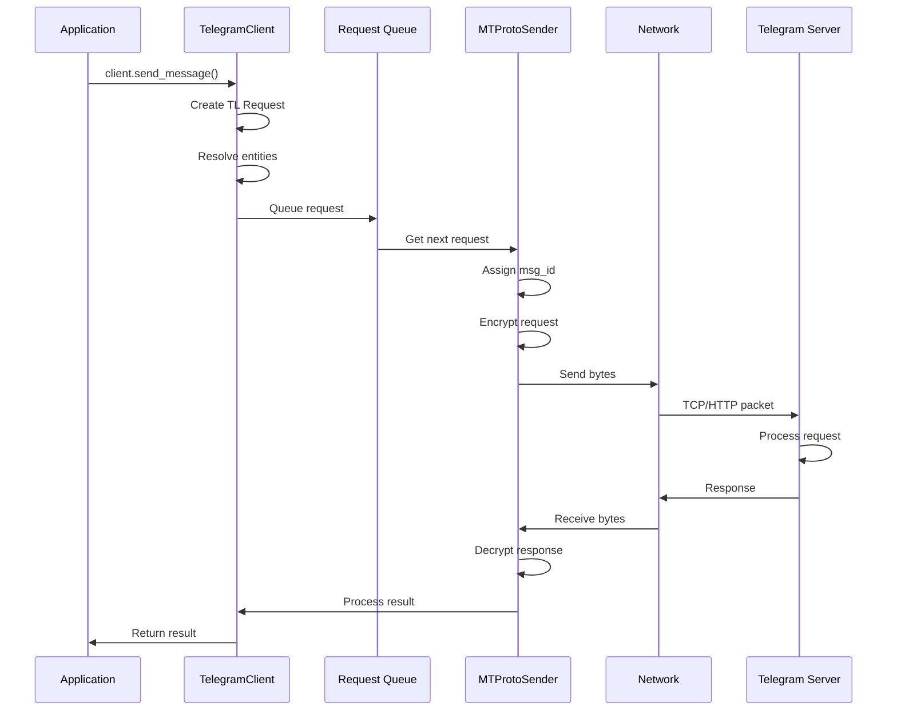
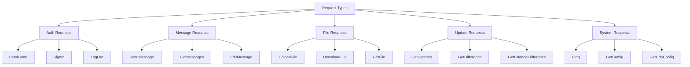
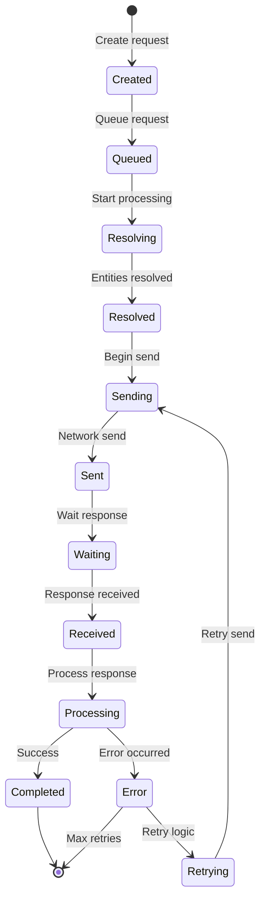
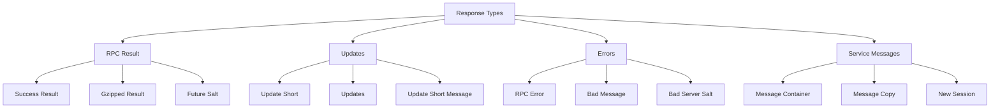

# Request Handling

---
**Navigation:** [← Data Centers](data-centers.md) | [Home](../index.md) | [Up](../index.md) | [MTProto Sender →](mtproto-sender.md)

---

## Overview

Request handling in Telethon manages the complete lifecycle of API calls, from high-level method invocations to low-level protocol messages. This system handles request queuing, retries, error recovery, and response processing.

## Request Flow Architecture



## Request Types

### TL Request Structure

```python
class TLRequest(TLObject):
    """
    Base class for all Telegram API requests.
    """
    
    def __init__(self):
        self.msg_id = None
        self.seq_no = None
        self.future = asyncio.Future()
        self.container_msg_id = None
        self.after = None  # Request dependencies
        
    async def resolve(self, client):
        """
        Resolve any parameters that need client context.
        Called before sending the request.
        """
        pass
        
    def on_response(self, response):
        """
        Called when response is received.
        """
        if not self.future.done():
            self.future.set_result(response)
            
    def on_error(self, error):
        """
        Called when an error occurs.
        """
        if not self.future.done():
            self.future.set_exception(error)
```

### Request Categories



## Request Queue Management

### Priority Queue Implementation

```python
class RequestQueue:
    """
    Manages request queuing with priority support.
    """
    
    def __init__(self):
        self._queues = {
            Priority.SYSTEM: asyncio.Queue(),
            Priority.HIGH: asyncio.Queue(),
            Priority.NORMAL: asyncio.Queue(),
            Priority.LOW: asyncio.Queue()
        }
        self._pending_count = 0
        
    async def put(self, request, priority=Priority.NORMAL):
        """Add request to appropriate queue."""
        await self._queues[priority].put(request)
        self._pending_count += 1
        
    async def get(self):
        """Get next request by priority."""
        # Check queues in priority order
        for priority in [Priority.SYSTEM, Priority.HIGH, 
                        Priority.NORMAL, Priority.LOW]:
            queue = self._queues[priority]
            
            try:
                request = queue.get_nowait()
                self._pending_count -= 1
                return request
            except asyncio.QueueEmpty:
                continue
                
        # Wait for any request
        tasks = [
            asyncio.create_task(q.get()) 
            for q in self._queues.values()
        ]
        
        done, pending = await asyncio.wait(
            tasks, return_when=asyncio.FIRST_COMPLETED
        )
        
        # Cancel pending tasks
        for task in pending:
            task.cancel()
            
        # Return the completed request
        request = done.pop().result()
        self._pending_count -= 1
        return request
```

### Request Batching

```python
class RequestBatcher:
    """
    Batches multiple requests for efficiency.
    """
    
    def __init__(self, max_size=100, timeout=0.1):
        self.max_size = max_size
        self.timeout = timeout
        self._batch = []
        self._timer = None
        self._lock = asyncio.Lock()
        
    async def add_request(self, request):
        """Add request to batch."""
        async with self._lock:
            self._batch.append(request)
            
            if len(self._batch) >= self.max_size:
                return await self._send_batch()
                
            if not self._timer:
                self._timer = asyncio.create_task(
                    self._timeout_flush()
                )
                
    async def _timeout_flush(self):
        """Send batch after timeout."""
        await asyncio.sleep(self.timeout)
        async with self._lock:
            await self._send_batch()
            
    async def _send_batch(self):
        """Send all batched requests."""
        if not self._batch:
            return
            
        # Create container for multiple requests
        container = MessageContainer(self._batch)
        
        # Reset batch
        self._batch = []
        if self._timer:
            self._timer.cancel()
            self._timer = None
            
        return container
```

## Request Processing

### Request Lifecycle



### Request Processor

```python
class RequestProcessor:
    """
    Processes requests through their lifecycle.
    """
    
    def __init__(self, client):
        self.client = client
        self._active_requests = {}
        
    async def process_request(self, request):
        """Process a single request."""
        try:
            # Resolve entities and parameters
            await self._resolve_request(request)
            
            # Send through MTProto
            response = await self._send_request(request)
            
            # Process response
            result = await self._process_response(response)
            
            return result
            
        except Exception as e:
            # Handle errors
            return await self._handle_error(e, request)
            
    async def _resolve_request(self, request):
        """Resolve request parameters."""
        if hasattr(request, 'resolve'):
            await request.resolve(self.client)
            
        # Resolve InputPeer types
        for attr, value in request.__dict__.items():
            if isinstance(value, str) and attr.endswith('_peer'):
                # Resolve username to InputPeer
                resolved = await self.client.get_input_entity(value)
                setattr(request, attr, resolved)
                
    async def _send_request(self, request):
        """Send request through MTProto."""
        # Assign message ID
        request.msg_id = self.client._sender.get_new_msg_id()
        
        # Track active request
        self._active_requests[request.msg_id] = request
        
        try:
            # Send and wait for response
            return await self.client._sender.send(request)
            
        finally:
            # Clean up
            self._active_requests.pop(request.msg_id, None)
```

## Error Handling

### Error Classification

```python
class RequestErrorHandler:
    """
    Handles various request errors.
    """
    
    ERROR_HANDLERS = {
        # Network errors
        ConnectionError: 'handle_connection_error',
        TimeoutError: 'handle_timeout_error',
        
        # Protocol errors
        BadMessageError: 'handle_bad_message',
        SecurityError: 'handle_security_error',
        
        # API errors
        RPCError: 'handle_rpc_error',
        FloodWaitError: 'handle_flood_wait',
        MigrateError: 'handle_migrate',
        
        # Auth errors
        AuthKeyError: 'handle_auth_error',
        SessionExpiredError: 'handle_session_expired',
    }
    
    async def handle_error(self, error, request):
        """Handle request error."""
        error_type = type(error)
        
        # Find specific handler
        for error_class, handler_name in self.ERROR_HANDLERS.items():
            if isinstance(error, error_class):
                handler = getattr(self, handler_name)
                return await handler(error, request)
                
        # Default handling
        return await self.handle_unknown_error(error, request)
        
    async def handle_flood_wait(self, error, request):
        """Handle rate limiting."""
        wait_time = error.seconds
        
        if wait_time < 60:  # Wait if reasonable
            await asyncio.sleep(wait_time)
            return RetryAction.RETRY
        else:
            # Too long, let user handle
            return RetryAction.FAIL
            
    async def handle_migrate(self, error, request):
        """Handle DC migration."""
        new_dc = error.new_dc
        
        # Migrate to new DC
        await self.client.migrate_to_dc(new_dc)
        
        # Retry on new DC
        return RetryAction.RETRY
```

### Retry Logic

```python
class RequestRetryManager:
    """
    Manages request retry logic.
    """
    
    def __init__(self, max_retries=5, base_delay=1.0):
        self.max_retries = max_retries
        self.base_delay = base_delay
        
    async def execute_with_retry(self, request_func):
        """Execute request with retry logic."""
        last_error = None
        
        for attempt in range(self.max_retries):
            try:
                # Try to execute request
                return await request_func()
                
            except Exception as e:
                last_error = e
                
                # Check if error is retryable
                action = await self._get_retry_action(e)
                
                if action == RetryAction.FAIL:
                    raise
                elif action == RetryAction.RETRY_NOW:
                    continue
                elif action == RetryAction.RETRY_DELAY:
                    delay = self._calculate_delay(attempt)
                    await asyncio.sleep(delay)
                    
        # Max retries exceeded
        raise MaxRetriesError(
            f'Failed after {self.max_retries} attempts',
            last_error
        )
        
    def _calculate_delay(self, attempt):
        """Calculate exponential backoff delay."""
        # Exponential backoff with jitter
        delay = self.base_delay * (2 ** attempt)
        jitter = random.uniform(0, delay * 0.1)
        return delay + jitter
```

## Response Processing

### Response Types



### Response Handler

```python
class ResponseHandler:
    """
    Handles different types of responses.
    """
    
    def __init__(self, client):
        self.client = client
        self._handlers = {
            RPCResult: self._handle_rpc_result,
            Updates: self._handle_updates,
            UpdateShort: self._handle_update_short,
            RPCError: self._handle_rpc_error,
            MessageContainer: self._handle_container,
            GzipPacked: self._handle_gzip,
            FutureSalts: self._handle_future_salts,
            NewSession: self._handle_new_session,
            BadServerSalt: self._handle_bad_salt,
            BadMsgNotification: self._handle_bad_msg,
        }
        
    async def handle_response(self, msg_id, response):
        """Handle a response message."""
        response_type = type(response)
        
        handler = self._handlers.get(response_type)
        if handler:
            return await handler(msg_id, response)
        else:
            logger.warning(f'Unhandled response type: {response_type}')
            
    async def _handle_rpc_result(self, msg_id, result):
        """Handle RPC result."""
        # Find original request
        request = self._find_request(result.req_msg_id)
        if not request:
            logger.warning(f'Response for unknown request: {result.req_msg_id}')
            return
            
        # Deserialize result
        if isinstance(result.body, GzipPacked):
            result.body = result.body.decompress()
            
        # Complete request future
        request.on_response(result.body)
        
    async def _handle_updates(self, msg_id, updates):
        """Handle updates."""
        # Process through update system
        await self.client._update_handler.process(updates)
```

## Performance Optimization

### Request Deduplication

```python
class RequestDeduplicator:
    """
    Prevents duplicate requests.
    """
    
    def __init__(self, ttl=60):
        self._cache = TTLCache(maxsize=1000, ttl=ttl)
        self._pending = {}
        
    async def execute(self, request):
        """Execute request with deduplication."""
        # Generate request key
        key = self._get_request_key(request)
        
        # Check cache
        if key in self._cache:
            return self._cache[key]
            
        # Check pending
        if key in self._pending:
            # Wait for pending request
            return await self._pending[key]
            
        # Execute request
        future = asyncio.Future()
        self._pending[key] = future
        
        try:
            result = await self._execute_request(request)
            self._cache[key] = result
            future.set_result(result)
            return result
            
        except Exception as e:
            future.set_exception(e)
            raise
            
        finally:
            self._pending.pop(key, None)
            
    def _get_request_key(self, request):
        """Generate unique key for request."""
        # Use request type and parameters
        params = []
        for key, value in sorted(request.__dict__.items()):
            if not key.startswith('_'):
                params.append((key, value))
                
        return (type(request), tuple(params))
```

### Request Pipelining

```python
class RequestPipeline:
    """
    Pipelines requests for better throughput.
    """
    
    def __init__(self, max_concurrent=10):
        self.max_concurrent = max_concurrent
        self._semaphore = asyncio.Semaphore(max_concurrent)
        self._pipeline = asyncio.Queue()
        self._worker_task = None
        
    async def start(self):
        """Start pipeline processing."""
        self._worker_task = asyncio.create_task(
            self._process_pipeline()
        )
        
    async def submit(self, request):
        """Submit request to pipeline."""
        future = asyncio.Future()
        await self._pipeline.put((request, future))
        return await future
        
    async def _process_pipeline(self):
        """Process requests from pipeline."""
        while True:
            # Get batch of requests
            batch = []
            
            try:
                # Get first request
                request, future = await self._pipeline.get()
                batch.append((request, future))
                
                # Try to get more without blocking
                while len(batch) < self.max_concurrent:
                    try:
                        request, future = self._pipeline.get_nowait()
                        batch.append((request, future))
                    except asyncio.QueueEmpty:
                        break
                        
            except asyncio.CancelledError:
                break
                
            # Process batch concurrently
            await self._process_batch(batch)
            
    async def _process_batch(self, batch):
        """Process a batch of requests."""
        tasks = []
        
        for request, future in batch:
            task = asyncio.create_task(
                self._process_single(request, future)
            )
            tasks.append(task)
            
        # Wait for all to complete
        await asyncio.gather(*tasks, return_exceptions=True)
```

## Monitoring and Metrics

### Request Metrics

```python
class RequestMetrics:
    """
    Tracks request performance metrics.
    """
    
    def __init__(self):
        self.total_requests = 0
        self.successful_requests = 0
        self.failed_requests = 0
        self.retry_count = 0
        self.response_times = []
        self.error_types = Counter()
        
    def record_request(self, request_type, duration, success, error=None):
        """Record request metrics."""
        self.total_requests += 1
        self.response_times.append(duration)
        
        if success:
            self.successful_requests += 1
        else:
            self.failed_requests += 1
            if error:
                self.error_types[type(error).__name__] += 1
                
    def get_stats(self):
        """Get performance statistics."""
        if not self.response_times:
            return {}
            
        return {
            'total': self.total_requests,
            'successful': self.successful_requests,
            'failed': self.failed_requests,
            'success_rate': self.successful_requests / self.total_requests,
            'avg_response_time': statistics.mean(self.response_times),
            'median_response_time': statistics.median(self.response_times),
            'p95_response_time': statistics.quantiles(
                self.response_times, n=20
            )[18],  # 95th percentile
            'retry_rate': self.retry_count / self.total_requests,
            'top_errors': self.error_types.most_common(5)
        }
```

## Best Practices

### Request Handling

1. **Use Request Queues**: Manage request flow and priorities
2. **Implement Retries**: Handle transient failures gracefully
3. **Batch When Possible**: Combine multiple requests
4. **Cache Results**: Avoid duplicate requests
5. **Monitor Performance**: Track metrics for optimization

### Error Recovery

1. **Classify Errors**: Handle different error types appropriately
2. **Exponential Backoff**: Increase delay between retries
3. **Set Retry Limits**: Prevent infinite retry loops
4. **Log Failures**: Track errors for debugging
5. **Graceful Degradation**: Provide fallbacks when possible

## Next Steps

- Review [MTProto Sender](mtproto-sender.md) for protocol details
- See [Data Centers](data-centers.md) for DC management
- Explore [Error Handling](../internals/errors.md) for error details

---
**Navigation:** [← Data Centers](data-centers.md) | [Home](../index.md) | [Up](../index.md) | [MTProto Sender →](mtproto-sender.md)

---