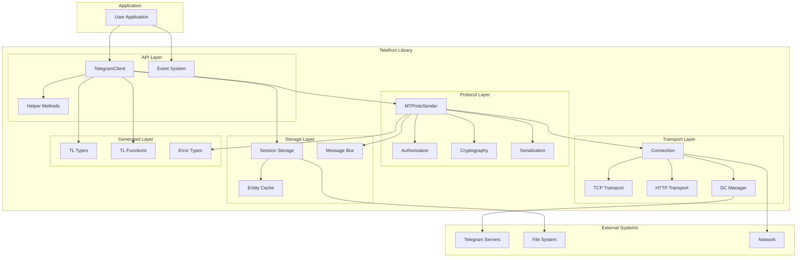
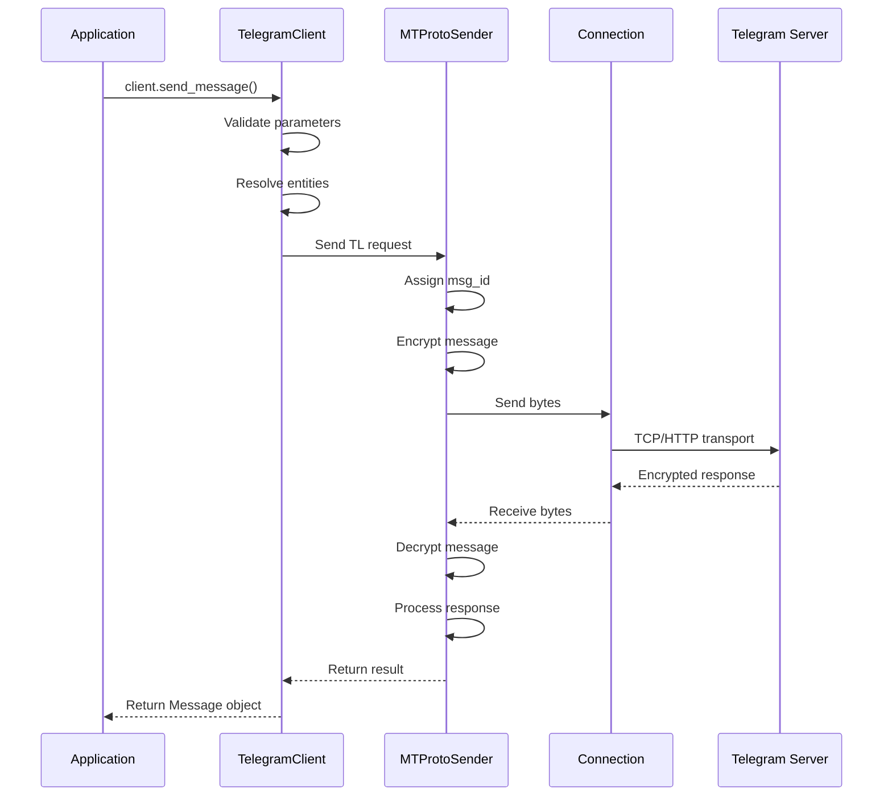
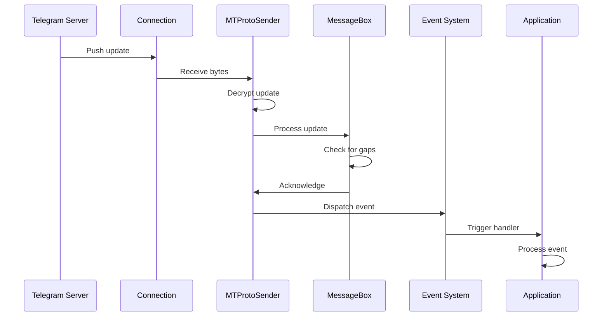
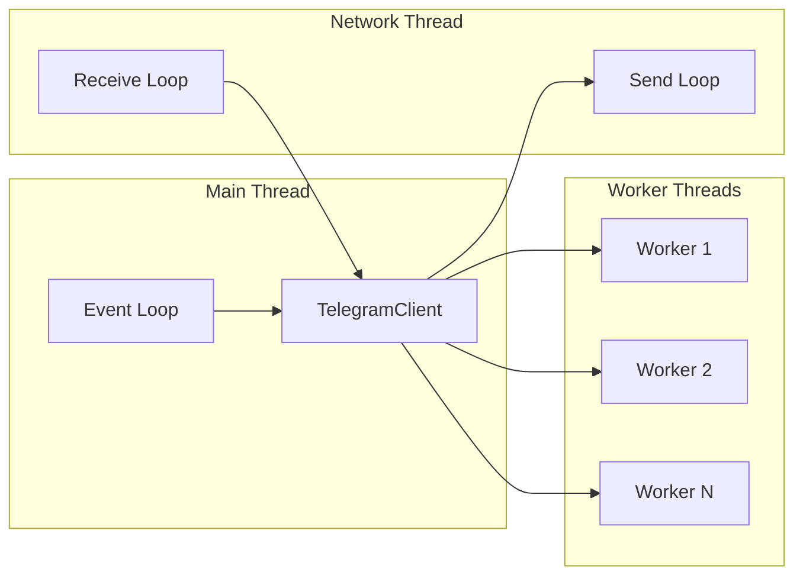
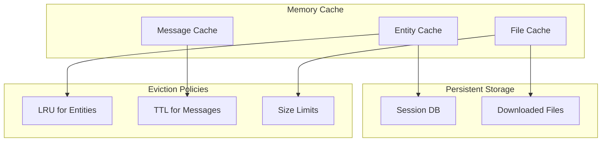
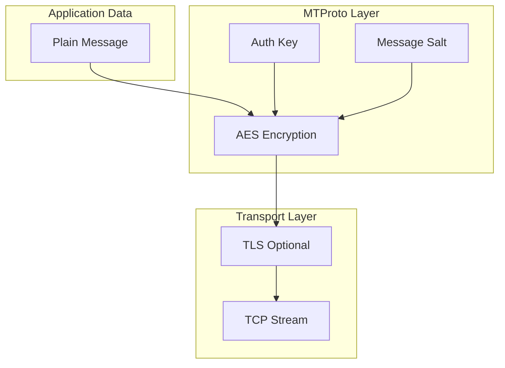

# Architecture Overview

---
**Navigation:** [← Introduction](introduction.md) | [Home](../index.md) | [Up](../index.md) | [Design Principles →](design-principles.md)

---

## System Architecture

Telethon follows a layered architecture design that separates concerns and provides multiple levels of abstraction. This design allows both low-level protocol access and high-level convenience methods.

## High-Level Architecture



## Component Layers

### 1. Application Layer
The topmost layer where user applications interact with Telethon.

**Key Components:**
- User application code
- Custom event handlers
- Business logic implementation

### 2. API Layer
Provides high-level interfaces for common operations.

**Key Components:**
- **TelegramClient**: Main client class with convenience methods
- **Event System**: Decorator-based event handling
- **Helper Methods**: Utility functions for common tasks
- **Mixins**: Modular functionality (messages, files, chats, etc.)

### 3. Protocol Layer
Implements the MTProto 2.0 protocol specification.

**Key Components:**
- **MTProtoSender**: Core protocol handler
- **Authorization**: Key exchange and authentication
- **Cryptography**: AES, RSA, and hash functions
- **Serialization**: Binary serialization of messages

### 4. Transport Layer
Manages network connections and data transmission.

**Key Components:**
- **Connection**: Abstract connection interface
- **Transports**: TCP, HTTP, and other implementations
- **DC Manager**: Data center selection and migration

### 5. Storage Layer
Handles persistent data and caching.

**Key Components:**
- **Session Storage**: Authentication persistence
- **Entity Cache**: User/chat information caching
- **Message Box**: Update gap detection and recovery

### 6. Generated Layer
Auto-generated code from Telegram's TL schema.

**Key Components:**
- **TL Types**: Data structures (User, Message, etc.)
- **TL Functions**: API methods (SendMessage, GetDialogs, etc.)
- **Error Types**: Typed error responses

## Data Flow

### Request Flow



### Update Flow



## Key Design Patterns

### 1. Mixin Pattern
Client functionality is divided into focused mixins:

```python
class TelegramClient(
    UserMethods,
    MessageMethods,
    FileMethods,
    ChatMethods,
    # ... other mixins
    TelegramBaseClient
):
    pass
```

### 2. Event-Driven Architecture
Events are handled through decorators:

```python
@client.on(events.NewMessage)
async def handler(event):
    # Handle new messages
    pass
```

### 3. Builder Pattern
Complex objects use builders:

```python
event = events.NewMessage.build(
    chats=['username'],
    pattern=r'hello'
)
```

### 4. Abstract Factory
Connection types are created through factories:

```python
connection = ConnectionTcpFull(
    ip='149.154.167.51',
    port=443
)
```

## Threading Model



**Key Points:**
- Single event loop for async operations
- Dedicated threads for network I/O
- Worker threads for CPU-intensive tasks
- Thread-safe queues for communication

## Memory Management

### Caching Strategy



### Resource Management
- Connection pooling for multiple DCs
- Automatic cleanup of expired data
- Configurable cache sizes
- Lazy loading of large data

## Security Architecture

### Encryption Layers



### Security Features
- End-to-end encryption for secret chats
- Perfect forward secrecy
- Replay attack prevention
- DH key exchange for authorization

## Scalability Considerations

### Horizontal Scaling
- Multiple client instances
- Connection pooling
- Load distribution across DCs

### Vertical Scaling
- Async I/O for concurrent operations
- Efficient binary protocol
- Minimal memory footprint
- Lazy evaluation

## Next Steps

- Continue to [Design Principles](design-principles.md) for architectural decisions
- See [Core Components](../core/components.md) for detailed component analysis
- Explore [MTProto Sender](../network/mtproto-sender.md) for protocol details

---
**Navigation:** [← Introduction](introduction.md) | [Home](../index.md) | [Up](../index.md) | [Design Principles →](design-principles.md)

---