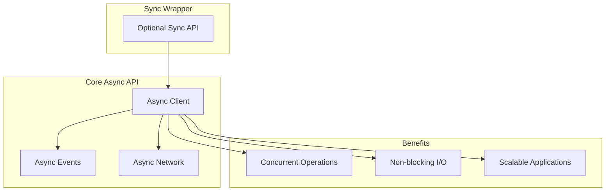
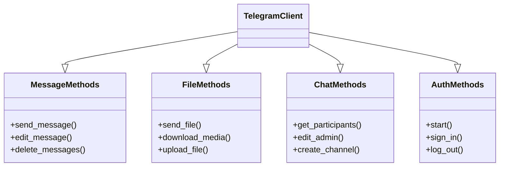
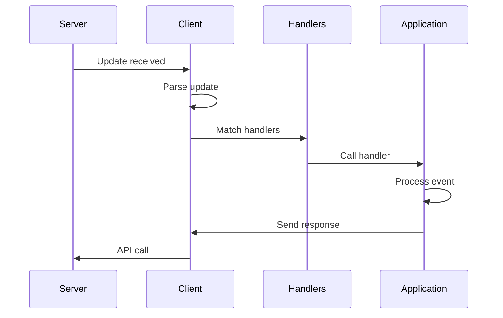
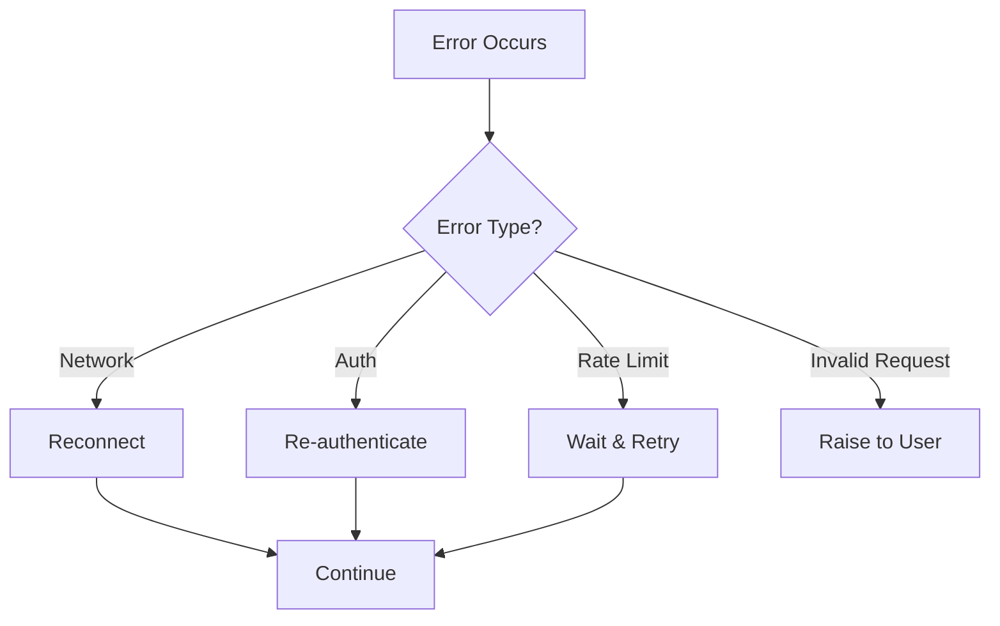
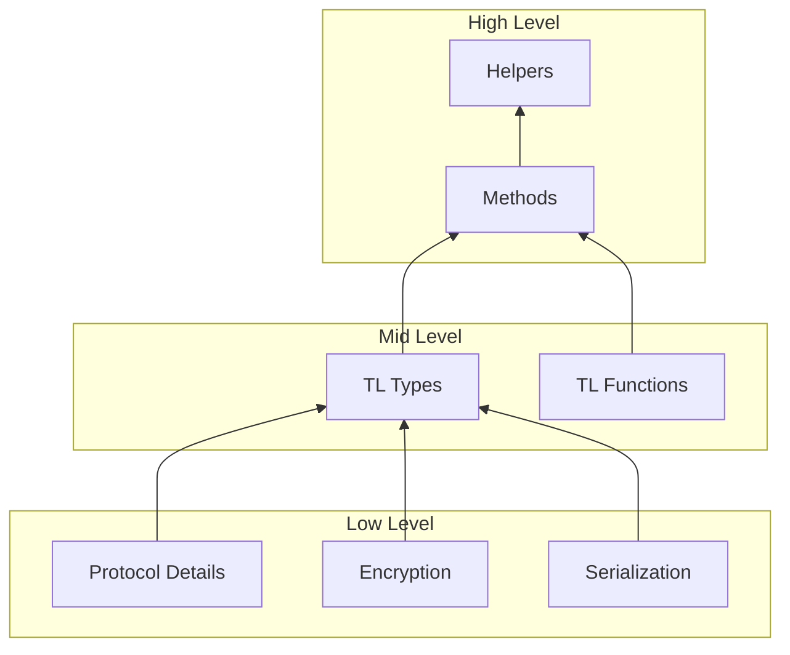
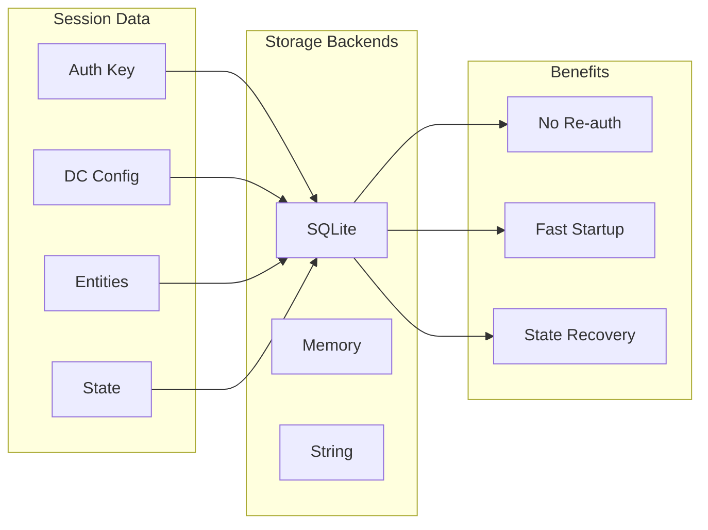
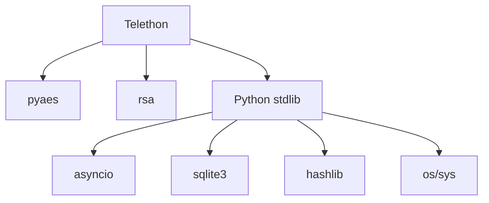

# Design Principles

---
**Navigation:** [← Architecture Overview](architecture-overview.md) | [Home](../index.md) | [Up](../index.md) | [Core Components →](../core/components.md)

---

## Core Design Principles

Telethon's architecture is guided by several key design principles that shape its implementation and usage patterns.

## 1. Simplicity First

### Principle
Make simple things easy and complex things possible.

### Implementation
```python
# Simple: Send a message
await client.send_message('username', 'Hello!')

# Complex: Send with advanced options
await client.send_message(
    entity=await client.get_input_entity('username'),
    message='Hello!',
    parse_mode='markdown',
    schedule=datetime.now() + timedelta(hours=1),
    reply_to=message_id,
    buttons=[[Button.url('Visit', 'https://example.com')]]
)
```

### Design Decisions
- High-level methods for common operations
- Low-level access when needed
- Progressive disclosure of complexity
- Sensible defaults for all parameters

## 2. Type Safety

### Principle
Leverage Python's type system for safer code.

### Implementation
```python
from telethon.tl.types import User, Message
from typing import List, Optional

async def get_user_messages(user: User) -> List[Message]:
    """Type-safe function with clear contracts"""
    return await client.get_messages(user, limit=10)

# IDE understands types
message: Message = await client.send_message(...)
print(message.id)  # Auto-completion works
```

### Benefits
- IDE auto-completion
- Static type checking with mypy
- Self-documenting code
- Fewer runtime errors

## 3. Async-First Design

### Principle
All I/O operations are asynchronous by default.

### Architecture Impact


### Example Usage
```python
# Concurrent operations
async def process_dialogs():
    dialogs = await client.get_dialogs()
    
    # Process all dialogs concurrently
    tasks = [process_dialog(d) for d in dialogs]
    await asyncio.gather(*tasks)
```

## 4. Modularity Through Mixins

### Principle
Separate concerns into focused, reusable components.

### Class Structure


### Benefits
- Clear separation of concerns
- Easier to maintain and test
- Prevents god objects
- Allows selective imports

## 5. Event-Driven Architecture

### Principle
React to events rather than polling for changes.

### Event System Design
```python
# Declarative event handling
@client.on(events.NewMessage(chats='username'))
async def handler(event):
    await event.reply('Received!')

# Multiple handlers for same event
@client.on(events.NewMessage(pattern=r'\.ping'))
async def ping_handler(event):
    await event.reply('Pong!')
```

### Event Flow


## 6. Fail-Safe Operations

### Principle
Handle errors gracefully and recover automatically.

### Error Handling Strategy


### Implementation
```python
# Automatic reconnection
client = TelegramClient(
    'session',
    api_id,
    api_hash,
    connection_retries=5,
    retry_delay=1,
    auto_reconnect=True
)

# Graceful error handling
try:
    await client.send_message(chat, message)
except FloodWaitError as e:
    print(f'Need to wait {e.seconds} seconds')
    await asyncio.sleep(e.seconds)
    await client.send_message(chat, message)
```

## 7. Zero-Copy Operations

### Principle
Minimize memory copies for large data operations.

### File Handling
```python
# Stream large files without loading into memory
async def upload_large_file(path):
    async with aiofiles.open(path, 'rb') as file:
        await client.upload_file(
            file,
            part_size_kb=512,
            file_name='large_file.bin'
        )

# Progressive downloads
async for chunk in client.iter_download(media):
    process_chunk(chunk)
```

## 8. Protocol Abstraction

### Principle
Hide protocol complexity while allowing low-level access.

### Abstraction Layers


### Usage Examples
```python
# High-level abstraction
messages = await client.get_messages('username', limit=10)

# Mid-level access
from telethon.tl.functions.messages import GetHistoryRequest
result = await client(GetHistoryRequest(
    peer='username',
    limit=10,
    offset_id=0,
    offset_date=None,
    add_offset=0,
    max_id=0,
    min_id=0,
    hash=0
))

# Low-level access (rarely needed)
from telethon.tl import TLObject
raw_bytes = bytes(some_tl_object)
```

## 9. Session Persistence

### Principle
Maintain state across application restarts.

### Session Architecture


## 10. Minimal Dependencies

### Principle
Reduce external dependencies to minimize complexity.

### Dependency Graph


### Benefits
- Easier installation
- Fewer version conflicts
- Better security audit
- Lighter deployment

## Design Trade-offs

### Performance vs Simplicity
- Choose simple implementations unless performance is critical
- Optimize hot paths only
- Profile before optimizing

### Flexibility vs Safety
- Provide safe defaults
- Allow overrides for advanced users
- Validate inputs at high level

### Features vs Maintenance
- Focus on core functionality
- Delegate specialized features to extensions
- Maintain backward compatibility

## Best Practices

### For Library Users
1. Use high-level methods when possible
2. Handle specific exceptions
3. Respect rate limits
4. Close clients properly
5. Use type hints

### For Contributors
1. Follow existing patterns
2. Maintain abstraction layers
3. Write comprehensive tests
4. Document edge cases
5. Consider backward compatibility

## Next Steps

- Explore [Core Components](../core/components.md) for implementation details
- See [TelegramClient](../client/telegram-client.md) for client design
- Review [Event System](../events/architecture.md) for event handling

---
**Navigation:** [← Architecture Overview](architecture-overview.md) | [Home](../index.md) | [Up](../index.md) | [Core Components →](../core/components.md)

---