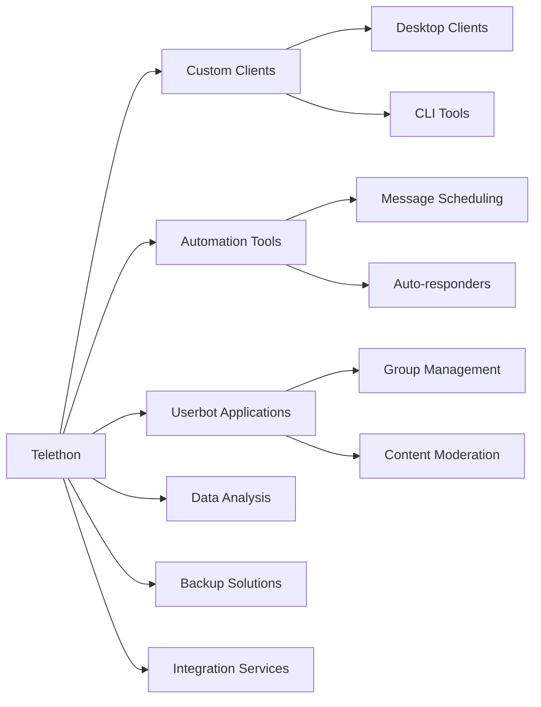
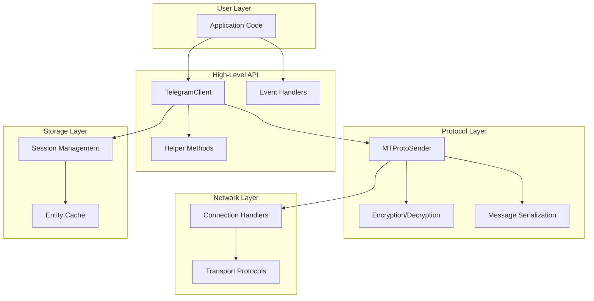

# Introduction to Telethon

---
**Navigation:** [← Home](../index.md) | [Up](../index.md) | [Architecture Overview →](architecture-overview.md)

---

## What is Telethon?

Telethon is a Python 3 library designed to make it easy to interact with Telegram's API. It's a full-featured client library that implements the MTProto protocol, allowing developers to build powerful Telegram clients, bots, and automation tools.

### Key Characteristics

- **Pure Python Implementation**: Written entirely in Python with minimal dependencies
- **Asynchronous Design**: Built on top of Python's `asyncio` for efficient concurrent operations
- **MTProto Protocol**: Direct implementation of Telegram's secure protocol (MTProto 2.0)
- **Type-Safe**: Automatically generated classes from Telegram's Type Language (TL) schema
- **Feature-Complete**: Supports all Telegram client features including secret chats

## Purpose and Goals

### Primary Goals

1. **Provide Full API Access**: Enable developers to use all Telegram features available to official clients
2. **Maintain Simplicity**: Offer both low-level and high-level APIs for different use cases
3. **Ensure Type Safety**: Generate strongly-typed objects from Telegram's schema
4. **Enable Async Operations**: Leverage Python's async/await for scalable applications
5. **Support Multiple Platforms**: Work across different operating systems and Python environments

### Use Cases



## Architecture Philosophy

### Design Principles

1. **Modularity**: Functionality is divided into focused, reusable components
2. **Abstraction Layers**: Multiple levels of abstraction from raw protocol to high-level methods
3. **Event-Driven**: Built around an event system for reactive programming
4. **Session Persistence**: Maintains authentication state across restarts
5. **Error Recovery**: Automatic reconnection and error handling

### Technical Approach

- **Code Generation**: TL schema is parsed to generate Python classes automatically
- **Mixin Pattern**: Client functionality is composed through multiple mixins
- **Async/Await**: All network operations are asynchronous by default
- **Type Annotations**: Full type hint support for better IDE integration

## Comparison with Alternatives

| Feature | Telethon | python-telegram-bot | Pyrogram |
|---------|----------|-------------------|----------|
| Protocol | MTProto | Bot API | MTProto |
| User Accounts | ✓ | ✗ | ✓ |
| Bot Support | ✓ | ✓ | ✓ |
| Async Support | ✓ | ✓ | ✓ |
| Code Generation | ✓ | ✗ | ✓ |
| Secret Chats | ✓ | ✗ | ✗ |
| Low-level Access | ✓ | ✗ | ✓ |

## Getting Started Example

```python
from telethon import TelegramClient, events

# Create a client instance
client = TelegramClient('session_name', api_id, api_hash)

# Define an event handler
@client.on(events.NewMessage(pattern='hello'))
async def handler(event):
    """Respond to messages containing 'hello'"""
    await event.reply('Hi there!')

# Run the client
async def main():
    await client.start()
    await client.run_until_disconnected()

# Start the async event loop
import asyncio
asyncio.run(main())
```

## Architecture Layers



## Key Components Overview

### 1. **TelegramClient**
The main interface for interacting with Telegram. Provides high-level methods for common operations.

### 2. **MTProtoSender**
Handles the MTProto protocol implementation, including encryption, message packing, and request management.

### 3. **Event System**
Allows reactive programming through decorators and event handlers for various Telegram updates.

### 4. **Session Management**
Persists authentication data and caches entities (users, chats) for efficient operations.

### 5. **Code Generation**
Automatically generates Python classes from Telegram's TL schema for type-safe operations.

## Next Steps

- Continue to [Architecture Overview](architecture-overview.md) for a high-level system view
- Jump to [Core Components](../core/components.md) for detailed component analysis
- See [TelegramClient](../client/telegram-client.md) for client implementation details

---
**Navigation:** [← Home](../index.md) | [Up](../index.md) | [Architecture Overview →](architecture-overview.md)

---