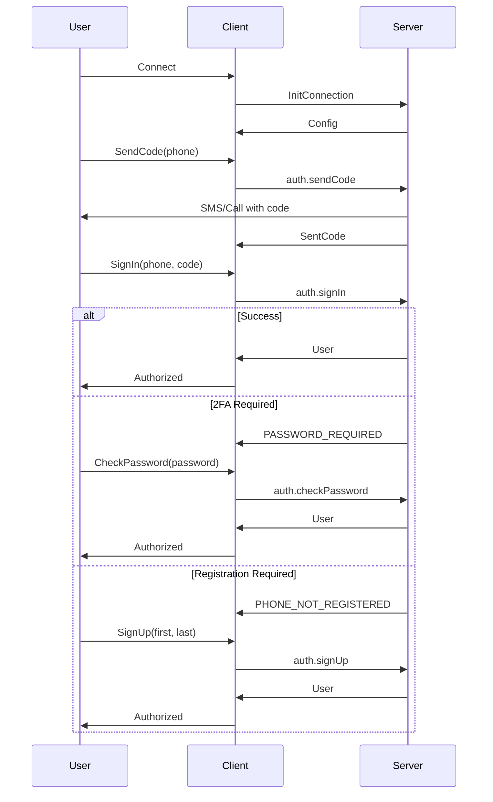
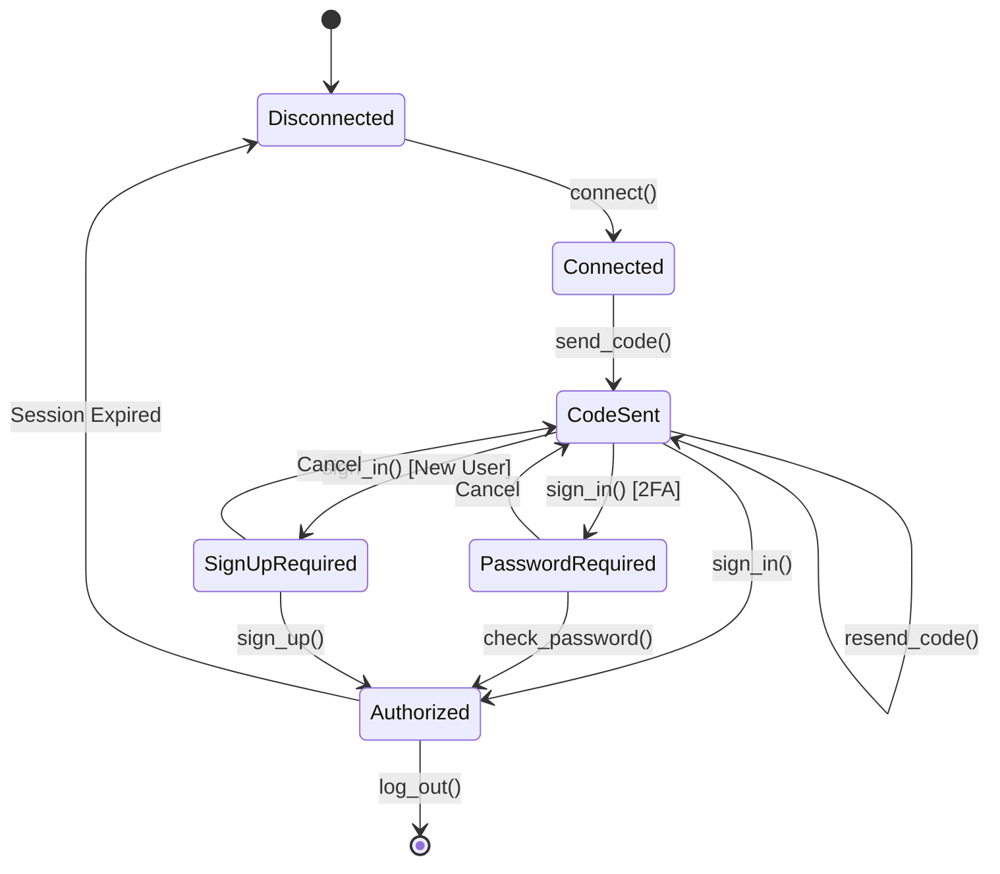

# Authorization Flow

---
**Navigation:** [← Encryption Details](encryption.md) | [Home](../index.md) | [Up](../index.md) | [Message Format →](message-format.md)

---

## Overview

The authorization flow in Telethon handles user authentication with Telegram servers. This process involves multiple steps including phone number verification, code validation, and optional two-factor authentication.

## Authorization Process



## Implementation Details

### Authorization Manager

```python
class AuthorizationManager:
    """
    Manages the complete authorization flow.
    """
    
    def __init__(self, client):
        self.client = client
        self.phone = None
        self.phone_code_hash = None
        self.state = 'disconnected'
        
    async def start(self, phone):
        """Start authorization process."""
        self.phone = self._normalize_phone(phone)
        
        # Send code
        result = await self.send_code()
        self.phone_code_hash = result.phone_code_hash
        self.state = 'code_sent'
        
        return result
        
    async def send_code(self):
        """Send verification code to phone."""
        try:
            result = await self.client(
                SendCodeRequest(
                    phone_number=self.phone,
                    api_id=self.client.api_id,
                    api_hash=self.client.api_hash,
                    settings=CodeSettings(
                        allow_flashcall=False,
                        current_number=False,
                        allow_app_hash=True
                    )
                )
            )
            
            return CodeSentResult(
                type=result.type,
                phone_code_hash=result.phone_code_hash,
                next_type=result.next_type,
                timeout=result.timeout
            )
            
        except errors.FloodWaitError as e:
            raise AuthFloodError(f"Too many attempts. Wait {e.seconds}s")
```

### Code Verification

```python
class CodeVerification:
    """
    Handles verification code validation.
    """
    
    def __init__(self, client):
        self.client = client
        self.max_attempts = 5
        self.attempts = 0
        
    async def sign_in(self, phone, code, phone_code_hash):
        """Sign in with verification code."""
        self.attempts += 1
        
        try:
            result = await self.client(
                SignInRequest(
                    phone_number=phone,
                    phone_code_hash=phone_code_hash,
                    phone_code=str(code)
                )
            )
            
            # Success - save session
            await self._save_session(result)
            return result
            
        except errors.SessionPasswordNeededError:
            # 2FA required
            return await self._handle_2fa()
            
        except errors.PhoneCodeInvalidError:
            if self.attempts >= self.max_attempts:
                raise AuthError("Too many invalid attempts")
            raise InvalidCodeError("Invalid code")
            
        except errors.PhoneNumberUnoccupiedError:
            # Need to sign up
            return SignUpRequired()
            
    async def resend_code(self, phone, phone_code_hash):
        """Resend verification code."""
        return await self.client(
            ResendCodeRequest(
                phone_number=phone,
                phone_code_hash=phone_code_hash
            )
        )
```

### Two-Factor Authentication

```python
class TwoFactorAuth:
    """
    Handles two-factor authentication.
    """
    
    def __init__(self, client):
        self.client = client
        self.password_helper = PasswordHelper()
        
    async def check_password(self, password):
        """Check 2FA password."""
        # Get password configuration
        pwd_info = await self.client(GetPasswordRequest())
        
        if not pwd_info.has_password:
            raise AuthError("2FA not enabled")
            
        # Calculate password hash
        pwd_hash = await self._compute_hash(pwd_info, password)
        
        try:
            result = await self.client(
                CheckPasswordRequest(password=pwd_hash)
            )
            
            return result
            
        except errors.PasswordHashInvalidError:
            raise InvalidPasswordError("Invalid password")
            
    async def _compute_hash(self, pwd_info, password):
        """Compute password hash using SRP."""
        algo = pwd_info.current_algo
        
        if not isinstance(algo, PasswordKdfAlgoSHA256SHA256PBKDF2HMACSHA512iter100000SHA256ModPow):
            raise AuthError("Unsupported password algorithm")
            
        # SRP calculations
        salt1 = algo.salt1
        salt2 = algo.salt2
        g = algo.g
        p = int.from_bytes(algo.p, 'big')
        
        # Hash password
        pw_hash = await self._pbkdf2(password, salt1, algo.iter)
        
        # Calculate x = H(salt2 + pw_hash + salt2)
        x_bytes = salt2 + pw_hash + salt2
        x = int.from_bytes(hashlib.sha256(x_bytes).digest(), 'big')
        
        # Generate a (random)
        a = int.from_bytes(os.urandom(256), 'big')
        
        # Calculate A = g^a mod p
        A = pow(g, a, p)
        
        # Get B from server
        B = int.from_bytes(pwd_info.srp_B, 'big')
        
        # Calculate u = H(A + B)
        u_bytes = A.to_bytes(256, 'big') + B.to_bytes(256, 'big')
        u = int.from_bytes(hashlib.sha256(u_bytes).digest(), 'big')
        
        # Calculate S = (B - g^x)^(a + u*x) mod p
        v = pow(g, x, p)
        S = pow((B - v) % p, (a + u * x) % (p - 1), p)
        
        # Calculate K = H(S)
        K = hashlib.sha256(S.to_bytes(256, 'big')).digest()
        
        # Calculate M1 = H(H(p) xor H(g) + H(salt1) + H(salt2) + A + B + K)
        M1 = self._calculate_m1(p, g, salt1, salt2, A, B, K)
        
        return InputCheckPasswordSRP(
            srp_id=pwd_info.srp_id,
            A=A.to_bytes(256, 'big'),
            M1=M1
        )
```

### Registration Flow

```python
class RegistrationManager:
    """
    Handles new user registration.
    """
    
    def __init__(self, client):
        self.client = client
        
    async def sign_up(self, phone, phone_code_hash, first_name, last_name=''):
        """Register new user."""
        # Validate names
        if not first_name or len(first_name) > 64:
            raise ValueError("Invalid first name")
            
        if len(last_name) > 64:
            raise ValueError("Invalid last name")
            
        try:
            result = await self.client(
                SignUpRequest(
                    phone_number=phone,
                    phone_code_hash=phone_code_hash,
                    first_name=first_name,
                    last_name=last_name
                )
            )
            
            # Save new user session
            await self._save_user_session(result)
            
            return result
            
        except errors.PhoneNumberOccupiedError:
            # Phone already registered
            raise AuthError("Phone number already registered")
            
    async def delete_account(self, reason=''):
        """Delete user account."""
        # Confirm deletion
        result = await self.client(
            DeleteAccountRequest(
                reason=reason
            )
        )
        
        # Clear session
        await self.client.log_out()
        
        return result
```

## Session Management

### Session State

```python
class SessionState:
    """
    Manages authorization session state.
    """
    
    def __init__(self, session_file):
        self.session_file = session_file
        self.auth_key = None
        self.user = None
        self.dc_id = 2  # Default DC
        
    async def save(self):
        """Save session to file."""
        data = {
            'auth_key': self.auth_key.key if self.auth_key else None,
            'dc_id': self.dc_id,
            'user_id': self.user.id if self.user else None,
            'is_bot': self.user.bot if self.user else False,
            'phone': self.user.phone if self.user else None
        }
        
        # Encrypt and save
        encrypted = self._encrypt_session_data(data)
        
        async with aiofiles.open(self.session_file, 'wb') as f:
            await f.write(encrypted)
            
    async def load(self):
        """Load session from file."""
        if not os.path.exists(self.session_file):
            return False
            
        async with aiofiles.open(self.session_file, 'rb') as f:
            encrypted = await f.read()
            
        # Decrypt and load
        data = self._decrypt_session_data(encrypted)
        
        if data.get('auth_key'):
            self.auth_key = AuthKey(data['auth_key'])
            self.dc_id = data.get('dc_id', 2)
            return True
            
        return False
```

### Multi-Account Support

```python
class MultiAccountManager:
    """
    Manages multiple authorized accounts.
    """
    
    def __init__(self, base_session_name):
        self.base_session_name = base_session_name
        self.accounts = {}
        self.active_account = None
        
    async def add_account(self, phone):
        """Add new account."""
        session_name = f"{self.base_session_name}_{phone}"
        
        client = TelegramClient(session_name, api_id, api_hash)
        await client.connect()
        
        # Authorize
        auth = AuthorizationManager(client)
        result = await auth.start(phone)
        
        self.accounts[phone] = {
            'client': client,
            'session': session_name,
            'user': None
        }
        
        return result
        
    async def switch_account(self, phone):
        """Switch active account."""
        if phone not in self.accounts:
            raise ValueError(f"Account {phone} not found")
            
        self.active_account = phone
        return self.accounts[phone]['client']
        
    async def remove_account(self, phone):
        """Remove account."""
        if phone in self.accounts:
            client = self.accounts[phone]['client']
            await client.log_out()
            
            # Delete session file
            session_file = f"{self.base_session_name}_{phone}.session"
            if os.path.exists(session_file):
                os.remove(session_file)
                
            del self.accounts[phone]
```

## Bot Authorization

### Bot Token Auth

```python
class BotAuthorization:
    """
    Handles bot authorization using tokens.
    """
    
    def __init__(self, client):
        self.client = client
        
    async def sign_in_bot(self, bot_token):
        """Sign in as bot using token."""
        # Validate token format
        if not self._validate_bot_token(bot_token):
            raise ValueError("Invalid bot token format")
            
        try:
            result = await self.client(
                ImportBotAuthorizationRequest(
                    flags=0,
                    api_id=self.client.api_id,
                    api_hash=self.client.api_hash,
                    bot_auth_token=bot_token
                )
            )
            
            # Save bot session
            await self._save_bot_session(result)
            
            return result
            
        except errors.AccessTokenInvalidError:
            raise AuthError("Invalid bot token")
            
    def _validate_bot_token(self, token):
        """Validate bot token format."""
        # Bot tokens are in format: 123456:ABC-DEF1234ghIkl-zyx57W2v1u123ew11
        parts = token.split(':')
        if len(parts) != 2:
            return False
            
        try:
            int(parts[0])  # Bot ID should be numeric
            return len(parts[1]) >= 35  # Hash part
        except ValueError:
            return False
```

## Authorization Helpers

### Phone Number Formatting

```python
class PhoneFormatter:
    """
    Formats and validates phone numbers.
    """
    
    COUNTRY_CODES = {
        'US': '1',
        'UK': '44',
        'RU': '7',
        'UA': '380',
        # ... more country codes
    }
    
    @staticmethod
    def normalize(phone, country=None):
        """Normalize phone number to international format."""
        # Remove all non-digits
        phone = re.sub(r'\D', '', phone)
        
        # Add country code if missing
        if country and not phone.startswith(PhoneFormatter.COUNTRY_CODES.get(country, '')):
            phone = PhoneFormatter.COUNTRY_CODES[country] + phone
            
        # Ensure starts with +
        if not phone.startswith('+'):
            phone = '+' + phone
            
        return phone
        
    @staticmethod
    def validate(phone):
        """Validate phone number."""
        # Must be 7-15 digits after +
        pattern = r'^\+[1-9]\d{6,14}$'
        return bool(re.match(pattern, phone))
```

### Authorization State Machine



## Error Handling

### Authorization Errors

```python
class AuthErrorHandler:
    """
    Handles authorization-specific errors.
    """
    
    ERROR_MESSAGES = {
        'PHONE_NUMBER_INVALID': "Invalid phone number format",
        'PHONE_CODE_INVALID': "Invalid verification code",
        'PHONE_CODE_EXPIRED': "Verification code has expired",
        'PHONE_NUMBER_BANNED': "This phone number is banned",
        'PHONE_NUMBER_FLOOD': "Too many attempts. Please try later",
        'SESSION_PASSWORD_NEEDED': "Two-factor authentication is enabled",
        'PASSWORD_HASH_INVALID': "Invalid password",
        'NEW_SESSION_CREATED': "New session created, please re-authorize",
        'AUTH_KEY_UNREGISTERED': "Authorization key is not registered",
        'USER_DEACTIVATED': "User account has been deactivated"
    }
    
    @classmethod
    def handle(cls, error):
        """Handle authorization error."""
        error_type = type(error).__name__
        
        if hasattr(error, 'message'):
            # Extract error code from message
            match = re.match(r'(\w+):', error.message)
            if match:
                error_code = match.group(1)
                return cls.ERROR_MESSAGES.get(
                    error_code,
                    f"Authorization error: {error_code}"
                )
                
        return f"Unknown authorization error: {error_type}"
```

## Security Considerations

### Best Practices

```python
class AuthSecurity:
    """
    Security helpers for authorization.
    """
    
    @staticmethod
    async def secure_password_input():
        """Securely input password."""
        import getpass
        
        # Use getpass for terminal password input
        password = getpass.getpass("Enter your 2FA password: ")
        
        # Clear from memory after use
        try:
            return password
        finally:
            password = '\x00' * len(password)
            
    @staticmethod
    def validate_session_file_permissions(file_path):
        """Ensure session file has secure permissions."""
        if os.path.exists(file_path):
            # Check file permissions
            stat_info = os.stat(file_path)
            mode = stat_info.st_mode
            
            # Should only be readable by owner
            if mode & 0o077:
                # Fix permissions
                os.chmod(file_path, 0o600)
                
    @staticmethod
    def generate_secure_session_name():
        """Generate secure random session name."""
        return 'session_' + secrets.token_urlsafe(16)
```

## Advanced Features

### QR Code Login

```python
class QRCodeLogin:
    """
    Implements QR code login flow.
    """
    
    def __init__(self, client):
        self.client = client
        self.qr_login_token = None
        
    async def request_qr_code(self):
        """Request QR code for login."""
        result = await self.client(
            ExportLoginTokenRequest(
                api_id=self.client.api_id,
                api_hash=self.client.api_hash,
                except_ids=[]
            )
        )
        
        self.qr_login_token = result.token
        
        # Generate QR code
        qr_data = f"tg://login?token={result.token.hex()}"
        return self._generate_qr_code(qr_data)
        
    async def wait_for_login(self, timeout=300):
        """Wait for QR code scan and login."""
        start_time = time.time()
        
        while time.time() - start_time < timeout:
            try:
                result = await self.client(
                    ImportLoginTokenRequest(token=self.qr_login_token)
                )
                
                if isinstance(result, LoginTokenSuccess):
                    return result.authorization
                    
            except errors.LoginTokenInvalidError:
                # Token expired
                return None
                
            await asyncio.sleep(1)
            
        return None  # Timeout
```

## Next Steps

- Continue to [Message Format](message-format.md) for protocol structure
- Review [Encryption Details](encryption.md) for security aspects
- See [Session Management](../sessions/overview.md) for session handling

---
**Navigation:** [← Encryption Details](encryption.md) | [Home](../index.md) | [Up](../index.md) | [Message Format →](message-format.md)

---