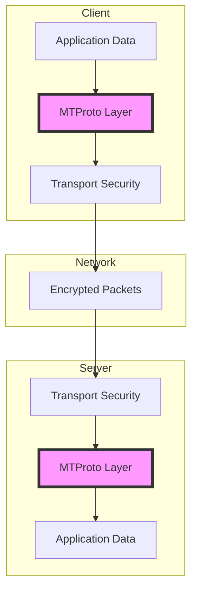
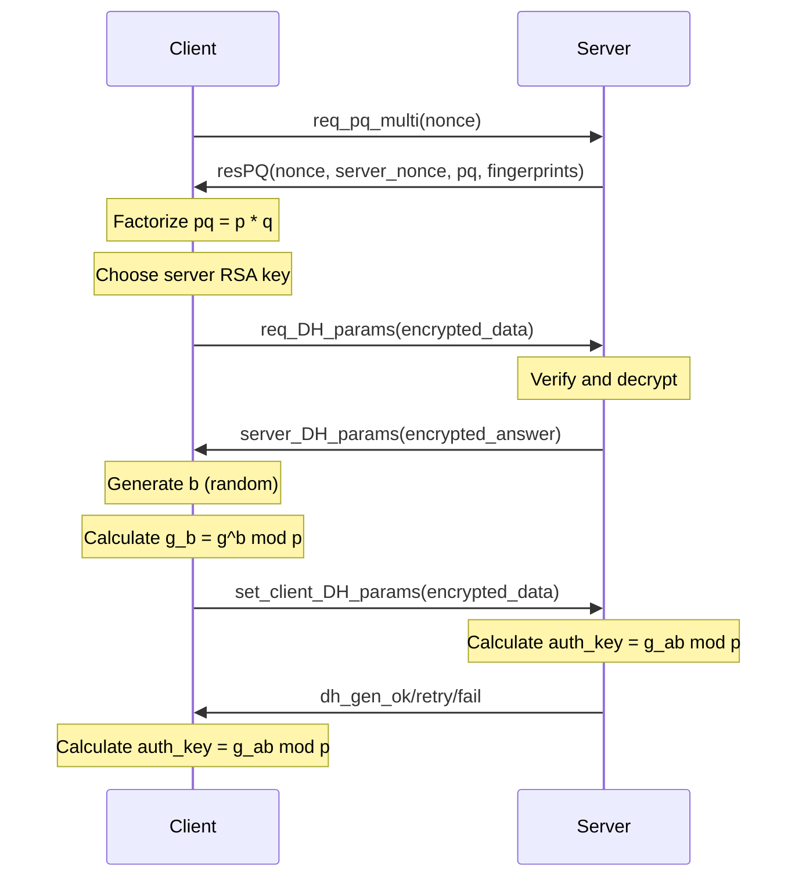
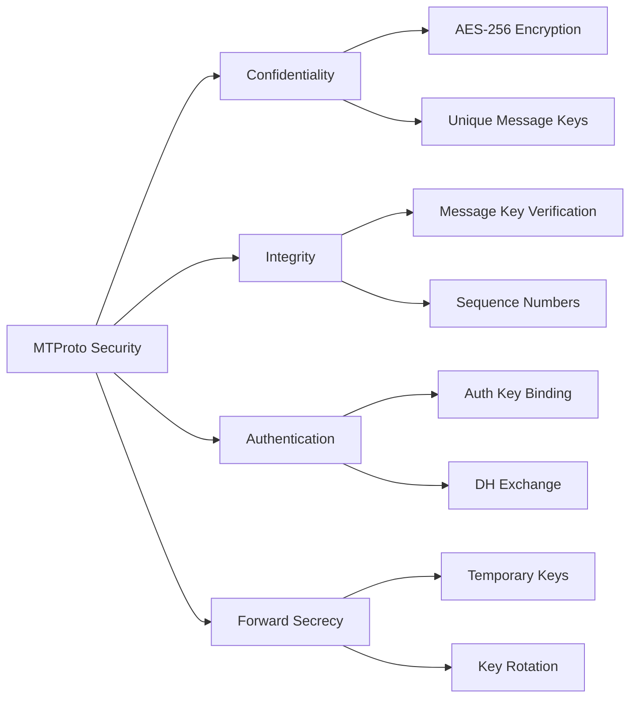

# Encryption Details

---
**Navigation:** [← MTProto Overview](overview.md) | [Home](../index.md) | [Up](../index.md) | [Authorization →](authorization.md)

---

## Overview

MTProto uses a multi-layered encryption approach to ensure secure communication between clients and Telegram servers. The protocol implements both transport-level encryption and end-to-end encryption for secret chats.

## Encryption Layers



## Key Generation and Exchange

### Authorization Key

```python
class AuthKey:
    """
    Represents an authorization key for MTProto encryption.
    """
    
    def __init__(self, data):
        self.key = data  # 2048-bit key
        self.key_id = self._calculate_key_id()
        self._aes_key = None
        self._aes_iv = None
        
    def _calculate_key_id(self):
        """Calculate 64-bit key ID from auth key."""
        # Key ID is lower 64 bits of SHA1(auth_key)
        sha = hashlib.sha1(self.key).digest()
        return int.from_bytes(sha[12:20], 'little')
        
    def calc_new_nonce_hash(self, new_nonce, number):
        """Calculate new nonce hash for DH exchange."""
        data = new_nonce + bytes([number]) + self.key_id.to_bytes(8, 'little')
        return hashlib.sha1(data).digest()[4:20]
        
    def prepare_aes(self, msg_key, is_content_related):
        """Prepare AES key and IV for message encryption."""
        if is_content_related:
            x = 0
        else:
            x = 8
            
        sha256a = hashlib.sha256(msg_key + self.key[x:x+36]).digest()
        sha256b = hashlib.sha256(self.key[x+40:x+76] + msg_key).digest()
        
        aes_key = sha256a[:8] + sha256b[8:24] + sha256a[24:32]
        aes_iv = sha256b[:8] + sha256a[8:24] + sha256b[24:32]
        
        return aes_key, aes_iv
```

### DH Key Exchange



### Implementation

```python
class DHExchange:
    """
    Implements Diffie-Hellman key exchange for MTProto.
    """
    
    def __init__(self):
        self.nonce = os.urandom(16)
        self.server_nonce = None
        self.new_nonce = os.urandom(32)
        self.g = None
        self.p = None
        self.time_offset = 0
        
    async def create_auth_key(self, connection):
        """Perform complete DH exchange to create auth key."""
        # Step 1: Request PQ
        pq_result = await self._request_pq(connection)
        
        # Step 2: Factorize PQ
        p, q = self._factorize_pq(pq_result.pq)
        
        # Step 3: Request DH params
        dh_params = await self._request_dh_params(
            connection, pq_result, p, q
        )
        
        # Step 4: Set client DH params
        auth_key = await self._set_client_dh_params(
            connection, dh_params
        )
        
        return auth_key
        
    def _factorize_pq(self, pq_bytes):
        """Factorize pq into p and q."""
        pq = int.from_bytes(pq_bytes, 'big')
        
        # Pollard's rho algorithm
        if pq % 2 == 0:
            return 2, pq // 2
            
        y, c, m = random.randint(1, pq-1), random.randint(1, pq-1), random.randint(1, pq-1)
        g, r, q = 1, 1, 1
        
        while g == 1:
            x = y
            for _ in range(r):
                y = (y * y + c) % pq
                
            k = 0
            while k < r and g == 1:
                ys = y
                for _ in range(min(m, r - k)):
                    y = (y * y + c) % pq
                    q = q * abs(x - y) % pq
                    
                g = math.gcd(q, pq)
                k += m
                
            r *= 2
            
        if g == pq:
            # Failed, try again
            return self._factorize_pq(pq_bytes)
            
        return min(g, pq // g), max(g, pq // g)
```

## Message Encryption

### Encryption Process

```python
class MessageEncryptor:
    """
    Handles message encryption for MTProto.
    """
    
    def __init__(self, auth_key):
        self.auth_key = auth_key
        
    def encrypt(self, message, is_content_related=True):
        """Encrypt a message using MTProto encryption."""
        # Prepare message data
        data = self._prepare_message(message)
        
        # Calculate msg_key
        msg_key = self._calculate_msg_key(data, is_content_related)
        
        # Get AES key and IV
        aes_key, aes_iv = self.auth_key.prepare_aes(
            msg_key, is_content_related
        )
        
        # Pad message to 16 bytes
        padding = os.urandom((16 - len(data) % 16) % 16)
        data += padding
        
        # Encrypt using AES-256-IGE
        encrypted = self._aes_ige_encrypt(data, aes_key, aes_iv)
        
        # Build encrypted message
        return self.auth_key.key_id.to_bytes(8, 'little') + msg_key + encrypted
        
    def _calculate_msg_key(self, data, is_content_related):
        """Calculate message key."""
        # msg_key = substr(SHA256(auth_key_part + data), 8, 16)
        if is_content_related:
            x = 0
        else:
            x = 8
            
        auth_key_part = self.auth_key.key[88+x:88+x+32]
        msg_key_large = hashlib.sha256(auth_key_part + data).digest()
        return msg_key_large[8:24]
        
    def _prepare_message(self, message):
        """Prepare message data for encryption."""
        # Build message container
        return (
            self.auth_key.key_id.to_bytes(8, 'little') +  # session_id
            message.msg_id.to_bytes(8, 'little') +         # msg_id  
            message.seq_no.to_bytes(4, 'little') +         # seq_no
            len(message.body).to_bytes(4, 'little') +      # msg_len
            message.body                                    # message body
        )
```

### AES-IGE Mode

```python
class AES_IGE:
    """
    AES encryption in IGE (Infinite Garble Extension) mode.
    """
    
    @staticmethod
    def encrypt(plaintext, key, iv):
        """Encrypt using AES-256-IGE."""
        cipher = Cipher(
            algorithms.AES(key),
            modes.ECB(),
            backend=default_backend()
        ).encryptor()
        
        iv1 = iv[:16]
        iv2 = iv[16:]
        
        ciphertext = b''
        
        for i in range(0, len(plaintext), 16):
            block = plaintext[i:i+16]
            
            # XOR with previous ciphertext
            block = bytes(a ^ b for a, b in zip(block, iv1))
            
            # AES encrypt
            encrypted_block = cipher.update(block)
            
            # XOR with previous plaintext  
            encrypted_block = bytes(
                a ^ b for a, b in zip(encrypted_block, iv2)
            )
            
            ciphertext += encrypted_block
            
            # Update IVs
            iv1 = encrypted_block
            iv2 = plaintext[i:i+16]
            
        return ciphertext
        
    @staticmethod
    def decrypt(ciphertext, key, iv):
        """Decrypt using AES-256-IGE."""
        cipher = Cipher(
            algorithms.AES(key),
            modes.ECB(),
            backend=default_backend()
        ).decryptor()
        
        iv1 = iv[:16]
        iv2 = iv[16:]
        
        plaintext = b''
        
        for i in range(0, len(ciphertext), 16):
            block = ciphertext[i:i+16]
            
            # XOR with previous plaintext
            temp = bytes(a ^ b for a, b in zip(block, iv2))
            
            # AES decrypt
            decrypted_block = cipher.update(temp)
            
            # XOR with previous ciphertext
            decrypted_block = bytes(
                a ^ b for a, b in zip(decrypted_block, iv1)
            )
            
            plaintext += decrypted_block
            
            # Update IVs
            iv1 = block
            iv2 = decrypted_block
            
        return plaintext
```

## Security Features

### Perfect Forward Secrecy

```python
class PFSManager:
    """
    Manages Perfect Forward Secrecy for MTProto.
    """
    
    def __init__(self):
        self.temp_auth_keys = {}
        self.key_lifetime = 86400  # 24 hours
        
    async def get_temp_auth_key(self, dc_id):
        """Get or create temporary auth key for DC."""
        if dc_id in self.temp_auth_keys:
            key, created_at = self.temp_auth_keys[dc_id]
            if time.time() - created_at < self.key_lifetime:
                return key
                
        # Create new temp auth key
        key = await self._create_temp_auth_key(dc_id)
        self.temp_auth_keys[dc_id] = (key, time.time())
        return key
        
    async def _create_temp_auth_key(self, dc_id):
        """Create new temporary auth key."""
        # Perform DH exchange with temp_key flag
        exchange = DHExchange()
        auth_key = await exchange.create_auth_key(
            self.get_connection(dc_id)
        )
        
        # Bind temp key to permanent key
        await self._bind_temp_auth_key(auth_key, dc_id)
        
        return auth_key
```

### Message Key Verification

```python
class MessageVerifier:
    """
    Verifies message integrity using message keys.
    """
    
    def verify_message(self, encrypted_msg, auth_key):
        """Verify and decrypt message."""
        # Extract components
        key_id = encrypted_msg[:8]
        msg_key = encrypted_msg[8:24]
        encrypted_data = encrypted_msg[24:]
        
        # Verify key ID
        if int.from_bytes(key_id, 'little') != auth_key.key_id:
            raise SecurityError("Invalid auth key ID")
            
        # Prepare AES key and IV
        aes_key, aes_iv = auth_key.prepare_aes(msg_key, True)
        
        # Decrypt
        decrypted = AES_IGE.decrypt(encrypted_data, aes_key, aes_iv)
        
        # Verify msg_key
        calculated_msg_key = self._calculate_msg_key(
            decrypted, auth_key, True
        )
        
        if msg_key != calculated_msg_key:
            raise SecurityError("Invalid message key")
            
        return self._parse_decrypted_message(decrypted)
```

## Secret Chats (E2E Encryption)

### Secret Chat Key Exchange

```python
class SecretChatManager:
    """
    Manages end-to-end encrypted secret chats.
    """
    
    def __init__(self, client):
        self.client = client
        self.secret_chats = {}
        
    async def create_secret_chat(self, user):
        """Create new secret chat with user."""
        # Generate a,p,g for DH
        a = int.from_bytes(os.urandom(256), 'big')
        p = self._get_dh_prime()
        g = self._get_dh_generator()
        
        # Calculate g_a
        g_a = pow(g, a, p)
        
        # Request secret chat
        result = await self.client(
            RequestEncryptionRequest(
                user_id=user,
                random_id=random.randint(0, 0x7fffffff),
                g_a=g_a.to_bytes(256, 'big')
            )
        )
        
        # Store secret chat info
        self.secret_chats[result.id] = {
            'a': a,
            'p': p,
            'g': g,
            'state': 'waiting_accept'
        }
        
        return result
        
    async def accept_secret_chat(self, chat):
        """Accept incoming secret chat request."""
        # Generate b
        b = int.from_bytes(os.urandom(256), 'big')
        
        # Get g_a from request
        g_a = int.from_bytes(chat.g_a, 'big')
        
        # Calculate g_b and shared key
        p = self._get_dh_prime()
        g = self._get_dh_generator()
        g_b = pow(g, b, p)
        auth_key = pow(g_a, b, p).to_bytes(256, 'big')
        
        # Accept chat
        result = await self.client(
            AcceptEncryptionRequest(
                peer=chat.peer,
                g_b=g_b.to_bytes(256, 'big'),
                key_fingerprint=self._calculate_fingerprint(auth_key)
            )
        )
        
        # Store secret chat
        self.secret_chats[chat.id] = {
            'auth_key': auth_key,
            'fingerprint': self._calculate_fingerprint(auth_key),
            'state': 'ready',
            'layer': 73,
            'in_seq_no': 0,
            'out_seq_no': 0
        }
        
        return result
```

### Secret Chat Encryption

```python
class SecretChatEncryption:
    """
    Handles encryption for secret chats.
    """
    
    def encrypt_message(self, chat_id, message):
        """Encrypt message for secret chat."""
        chat = self.secret_chats[chat_id]
        
        # Build decrypted message
        data = self._build_secret_message(chat, message)
        
        # Add padding
        padding_length = (16 - (len(data) + 4) % 16) % 16
        padding = os.urandom(padding_length)
        
        # Build full message
        full_data = (
            len(data).to_bytes(4, 'little') +
            data +
            padding
        )
        
        # Calculate message key
        msg_key = hashlib.sha256(
            chat['auth_key'][88:88+32] + full_data
        ).digest()[8:24]
        
        # Prepare AES
        aes_key, aes_iv = self._kdf(chat['auth_key'], msg_key, True)
        
        # Encrypt
        encrypted = AES_IGE.encrypt(full_data, aes_key, aes_iv)
        
        return msg_key + encrypted
        
    def _build_secret_message(self, chat, message):
        """Build secret chat message."""
        # Increment seq_no
        chat['out_seq_no'] += 1
        
        return (
            chat['fingerprint'].to_bytes(8, 'little') +
            msg_id.to_bytes(8, 'little') +
            chat['out_seq_no'].to_bytes(4, 'little') +
            message.to_bytes()
        )
```

## Security Considerations

### Cryptographic Primitives

| Component | Algorithm | Key Size | Purpose |
|-----------|-----------|----------|---------|
| DH Exchange | DH-2048 | 2048 bits | Key agreement |
| Auth Key | Random | 2048 bits | Session key |
| Message Encryption | AES-IGE | 256 bits | Data encryption |
| Message Key | SHA-256 | 128 bits | Message authentication |
| RSA | RSA-2048 | 2048 bits | DH parameter encryption |
| Fingerprint | SHA-1 | 160 bits | Key identification |

### Security Properties



### Attack Prevention

```python
class SecurityValidator:
    """
    Validates security properties of MTProto messages.
    """
    
    def __init__(self):
        self.seen_msg_ids = set()
        self.time_offset = 0
        
    def validate_message(self, message):
        """Validate message security properties."""
        # Check message ID uniqueness
        if message.msg_id in self.seen_msg_ids:
            raise SecurityError("Duplicate message ID")
            
        self.seen_msg_ids.add(message.msg_id)
        
        # Check message ID time
        msg_time = message.msg_id >> 32
        current_time = int(time.time()) + self.time_offset
        
        if abs(msg_time - current_time) > 300:  # 5 minutes
            raise SecurityError("Message time too far off")
            
        # Check sequence numbers
        if not self._validate_seq_no(message):
            raise SecurityError("Invalid sequence number")
            
        return True
        
    def _validate_seq_no(self, message):
        """Validate sequence numbers."""
        # Content-related messages must have odd seq_no
        # Service messages must have even seq_no
        is_content_related = message.is_content_related()
        expected_parity = 1 if is_content_related else 0
        
        return (message.seq_no & 1) == expected_parity
```

## Best Practices

### Key Management

1. **Rotate Keys Regularly**: Use temporary auth keys with limited lifetime
2. **Secure Storage**: Store auth keys encrypted in secure storage
3. **Key Derivation**: Use proper KDF for deriving encryption keys
4. **Unique Keys**: Never reuse keys across sessions or DCs
5. **Secure Deletion**: Properly delete old keys from memory

### Implementation Security

1. **Constant Time Operations**: Avoid timing attacks in crypto operations
2. **Secure Random**: Use cryptographically secure random generators
3. **Memory Protection**: Clear sensitive data from memory after use
4. **Error Handling**: Don't leak information through error messages
5. **Protocol Validation**: Strictly validate all protocol parameters

## Next Steps

- Continue to [Authorization Flow](authorization.md) for auth details
- Review [Message Format](message-format.md) for protocol structure
- See [Network Security](../network/mtproto-sender.md) for transport security

---
**Navigation:** [← MTProto Overview](overview.md) | [Home](../index.md) | [Up](../index.md) | [Authorization →](authorization.md)

---