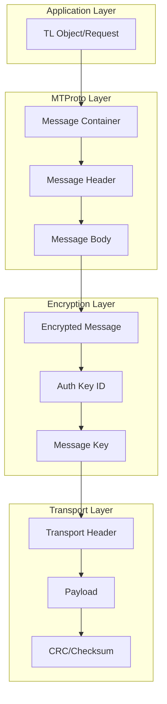

# Message Format

---
**Navigation:** [← Authorization](authorization.md) | [Home](../index.md) | [Up](../index.md) | [Sessions →](../sessions/README.md)

---

## Overview

MTProto messages follow a specific binary format that ensures efficient transmission, security, and proper ordering. This document details the structure of messages at various protocol layers.

## Message Structure Layers



## Unencrypted Messages

### Basic Format

```python
class UnencryptedMessage:
    """
    Format for unencrypted messages (used during auth).
    """
    
    # Structure:
    # auth_key_id (8 bytes) = 0
    # message_id (8 bytes)
    # message_length (4 bytes)
    # message_body (variable)
    
    def __init__(self, body):
        self.auth_key_id = 0
        self.message_id = self._generate_message_id()
        self.body = body
        
    def to_bytes(self):
        """Serialize to bytes."""
        body_bytes = self.body.to_bytes()
        
        return (
            self.auth_key_id.to_bytes(8, 'little') +
            self.message_id.to_bytes(8, 'little') +
            len(body_bytes).to_bytes(4, 'little') +
            body_bytes
        )
        
    def _generate_message_id(self):
        """Generate unique message ID."""
        # msg_id = (unix_time << 32) | (random & 0xFFFFFFFF)
        # Must be divisible by 4
        msg_id = int(time.time() * 2**32)
        msg_id = (msg_id & ~3) | 0  # Make divisible by 4
        return msg_id
        
    @classmethod
    def from_bytes(cls, data):
        """Parse from bytes."""
        reader = BinaryReader(data)
        
        auth_key_id = reader.read_long()
        if auth_key_id != 0:
            raise ValueError("Expected unencrypted message")
            
        message_id = reader.read_long()
        length = reader.read_int()
        body = reader.read(length)
        
        return cls(TLObject.from_bytes(body))
```

## Encrypted Messages

### Message Container

```python
class EncryptedMessage:
    """
    Format for encrypted messages.
    """
    
    # Structure:
    # auth_key_id (8 bytes)
    # msg_key (16 bytes)
    # encrypted_data (variable)
    #   Inside encrypted_data:
    #   salt (8 bytes)
    #   session_id (8 bytes)
    #   message_id (8 bytes)
    #   seq_no (4 bytes)
    #   message_length (4 bytes)
    #   message_body (variable)
    #   padding (0-15 bytes)
    
    def __init__(self, auth_key, salt, session_id, body):
        self.auth_key = auth_key
        self.salt = salt
        self.session_id = session_id
        self.message_id = self._generate_message_id()
        self.seq_no = self._calculate_seq_no()
        self.body = body
        
    def encrypt(self):
        """Encrypt message."""
        # Build inner data
        inner_data = self._build_inner_data()
        
        # Calculate msg_key
        msg_key = self._calculate_msg_key(inner_data)
        
        # Get AES key and IV
        aes_key, aes_iv = self.auth_key.prepare_aes(msg_key, True)
        
        # Pad to 16 bytes
        padding_length = (16 - len(inner_data) % 16) % 16
        inner_data += os.urandom(padding_length)
        
        # Encrypt
        encrypted = AES_IGE.encrypt(inner_data, aes_key, aes_iv)
        
        # Build final message
        return (
            self.auth_key.key_id.to_bytes(8, 'little') +
            msg_key +
            encrypted
        )
        
    def _build_inner_data(self):
        """Build inner encrypted data."""
        body_bytes = self.body.to_bytes()
        
        return (
            self.salt.to_bytes(8, 'little') +
            self.session_id.to_bytes(8, 'little') +
            self.message_id.to_bytes(8, 'little') +
            self.seq_no.to_bytes(4, 'little') +
            len(body_bytes).to_bytes(4, 'little') +
            body_bytes
        )
```

### Sequence Numbers

```python
class SequenceManager:
    """
    Manages message sequence numbers.
    """
    
    def __init__(self):
        self._seq_no = 0
        
    def get_seq_no(self, is_content_related):
        """
        Get next sequence number.
        
        Rules:
        - Content-related messages have odd seq_no
        - Service messages have even seq_no
        - Each message increments internal counter by 1
        - seq_no = counter * 2 + (1 if content_related else 0)
        """
        seq_no = self._seq_no * 2
        
        if is_content_related:
            seq_no += 1
            
        self._seq_no += 1
        
        return seq_no
        
    def confirm_received(self, seq_no):
        """Confirm message received (for acks)."""
        # Update internal state based on received seq_no
        received_counter = seq_no // 2
        
        if received_counter >= self._seq_no:
            self._seq_no = received_counter + 1
```

## Message Types

### Content Messages

```python
class ContentMessage:
    """
    Messages that affect the server state.
    """
    
    CONTENT_RELATED = True
    
    # Examples of content-related messages:
    TYPES = [
        'messages.sendMessage',
        'messages.editMessage', 
        'messages.deleteMessages',
        'channels.joinChannel',
        'account.updateStatus',
        'contacts.addContact',
        # ... any message that changes server state
    ]
    
    def __init__(self, request):
        self.request = request
        self.msg_id = generate_message_id()
        self.seq_no = None  # Set by sequence manager
        
    def requires_ack(self):
        """Content messages always require acknowledgment."""
        return True
```

### Service Messages

```python
class ServiceMessage:
    """
    Messages that don't affect server state.
    """
    
    CONTENT_RELATED = False
    
    # Examples of service messages:
    TYPES = [
        'Ping',
        'MsgsAck',
        'BadMsgNotification',
        'NewSessionCreated',
        'RpcDropAnswer',
        'GetFutureSalts',
        'DestroySession',
    ]
    
    def __init__(self, body):
        self.body = body
        self.msg_id = generate_message_id()
        self.seq_no = None  # Set by sequence manager
        
    def requires_ack(self):
        """Most service messages don't require ack."""
        return False
```

## Container Messages

### Message Container

```python
class MessageContainer:
    """
    Container for multiple messages in single packet.
    """
    
    CONSTRUCTOR_ID = 0x73f1f8dc
    
    def __init__(self, messages):
        self.messages = messages
        
    def to_bytes(self):
        """Serialize container."""
        # Container header
        data = struct.pack('<I', self.CONSTRUCTOR_ID)
        data += struct.pack('<I', len(self.messages))
        
        # Add each message
        for msg in self.messages:
            msg_data = self._pack_message(msg)
            data += msg_data
            
        return data
        
    def _pack_message(self, msg):
        """Pack individual message in container."""
        body = msg.to_bytes()
        
        return (
            msg.msg_id.to_bytes(8, 'little') +
            msg.seq_no.to_bytes(4, 'little') +
            len(body).to_bytes(4, 'little') +
            body
        )
        
    @classmethod
    def from_bytes(cls, data):
        """Parse container from bytes."""
        reader = BinaryReader(data)
        
        constructor = reader.read_int()
        if constructor != cls.CONSTRUCTOR_ID:
            raise ValueError("Not a message container")
            
        count = reader.read_int()
        messages = []
        
        for _ in range(count):
            msg_id = reader.read_long()
            seq_no = reader.read_int()
            length = reader.read_int()
            body = reader.read(length)
            
            messages.append({
                'msg_id': msg_id,
                'seq_no': seq_no,
                'body': TLObject.from_bytes(body)
            })
            
        return cls(messages)
```

### Packed Messages

```python
class PackedMessage:
    """
    Gzip-compressed message.
    """
    
    CONSTRUCTOR_ID = 0x3072cfa1  # gzip_packed
    
    def __init__(self, body):
        self.body = body
        
    def to_bytes(self):
        """Pack and compress message."""
        uncompressed = self.body.to_bytes()
        
        # Only compress if it saves space
        compressed = gzip.compress(uncompressed)
        
        if len(compressed) < len(uncompressed):
            return (
                struct.pack('<I', self.CONSTRUCTOR_ID) +
                TLBytes.serialize(compressed)
            )
        else:
            # Don't compress
            return uncompressed
            
    @classmethod  
    def from_bytes(cls, data):
        """Unpack compressed message."""
        reader = BinaryReader(data)
        
        constructor = reader.read_int()
        if constructor != cls.CONSTRUCTOR_ID:
            # Not compressed
            reader.seek(0)
            return TLObject.from_bytes(data)
            
        compressed = reader.tgread_bytes()
        uncompressed = gzip.decompress(compressed)
        
        return TLObject.from_bytes(uncompressed)
```

## Special Messages

### Acknowledgments

```python
class MsgsAck:
    """
    Acknowledgment of received messages.
    """
    
    CONSTRUCTOR_ID = 0x62d6b459
    
    def __init__(self, msg_ids):
        self.msg_ids = msg_ids
        
    def to_bytes(self):
        """Serialize acknowledgment."""
        return (
            struct.pack('<I', self.CONSTRUCTOR_ID) +
            TLVector.serialize(self.msg_ids, 'long')
        )
        
    @classmethod
    def from_bytes(cls, data):
        """Parse acknowledgment."""
        reader = BinaryReader(data)
        
        constructor = reader.read_int()
        if constructor != cls.CONSTRUCTOR_ID:
            raise ValueError("Not an acknowledgment")
            
        msg_ids = TLVector.deserialize(reader, 'long')
        
        return cls(msg_ids)
```

### Bad Message Notification

```python
class BadMsgNotification:
    """
    Notification about problematic message.
    """
    
    CONSTRUCTOR_ID = 0xa7eff811
    
    ERROR_CODES = {
        16: "Message ID too low",
        17: "Message ID too high", 
        18: "Incorrect two lower order message ID bits",
        19: "Container ID is the same as message ID",
        20: "Message too old",
        32: "Sequence number too low",
        33: "Sequence number too high",
        34: "Even sequence number for content message",
        35: "Odd sequence number for service message",
        48: "Incorrect server salt",
        64: "Invalid container"
    }
    
    def __init__(self, bad_msg_id, bad_msg_seq_no, error_code):
        self.bad_msg_id = bad_msg_id
        self.bad_msg_seq_no = bad_msg_seq_no
        self.error_code = error_code
        
    @property
    def error_message(self):
        """Get human-readable error message."""
        return self.ERROR_CODES.get(
            self.error_code,
            f"Unknown error {self.error_code}"
        )
```

## Binary Serialization

### TL Serialization

```python
class TLSerializer:
    """
    Serializes TL objects to binary format.
    """
    
    @staticmethod
    def serialize(obj):
        """Serialize TL object."""
        buffer = BytesIO()
        
        # Write constructor ID
        buffer.write(struct.pack('<I', obj.CONSTRUCTOR_ID))
        
        # Write each field
        for field in obj.get_fields():
            value = getattr(obj, field.name)
            TLSerializer._serialize_field(buffer, field, value)
            
        return buffer.getvalue()
        
    @staticmethod
    def _serialize_field(buffer, field, value):
        """Serialize individual field."""
        if field.type == 'int':
            buffer.write(struct.pack('<i', value))
        elif field.type == 'long':
            buffer.write(struct.pack('<q', value))
        elif field.type == 'int128':
            buffer.write(value.to_bytes(16, 'little'))
        elif field.type == 'int256':
            buffer.write(value.to_bytes(32, 'little'))
        elif field.type == 'double':
            buffer.write(struct.pack('<d', value))
        elif field.type == 'string':
            TLBytes.serialize(value.encode('utf-8'), buffer)
        elif field.type == 'bytes':
            TLBytes.serialize(value, buffer)
        elif field.type == 'Bool':
            # True: 0x997275b5, False: 0xbc799737
            buffer.write(struct.pack('<I', 
                0x997275b5 if value else 0xbc799737))
        elif field.type.startswith('Vector'):
            TLVector.serialize(value, field.inner_type, buffer)
        else:
            # Nested object
            buffer.write(TLSerializer.serialize(value))
```

### Binary Reader

```python
class BinaryReader:
    """
    Reads binary data with TL deserialization.
    """
    
    def __init__(self, data):
        self.buffer = BytesIO(data)
        
    def read_int(self):
        """Read 32-bit integer."""
        return struct.unpack('<i', self.buffer.read(4))[0]
        
    def read_long(self):
        """Read 64-bit integer."""
        return struct.unpack('<q', self.buffer.read(8))[0]
        
    def read_int128(self):
        """Read 128-bit integer."""
        return int.from_bytes(self.buffer.read(16), 'little')
        
    def read_double(self):
        """Read double."""
        return struct.unpack('<d', self.buffer.read(8))[0]
        
    def tgread_bytes(self):
        """Read TL bytes."""
        first_byte = self.buffer.read(1)[0]
        
        if first_byte == 254:
            # Long format
            length = struct.unpack('<I', 
                bytes([first_byte]) + self.buffer.read(3))[0] >> 8
        else:
            # Short format
            length = first_byte
            
        # Read data and padding
        data = self.buffer.read(length)
        padding = (4 - (length + 1) % 4) % 4
        self.buffer.read(padding)
        
        return data
        
    def tgread_string(self):
        """Read TL string."""
        return self.tgread_bytes().decode('utf-8')
```

## Message Validation

### Validator

```python
class MessageValidator:
    """
    Validates message format and content.
    """
    
    def __init__(self):
        self.time_offset = 0
        self.last_msg_id = 0
        
    def validate(self, message):
        """Validate message format."""
        errors = []
        
        # Check message ID
        if not self._validate_msg_id(message.msg_id):
            errors.append("Invalid message ID")
            
        # Check sequence number
        if not self._validate_seq_no(message):
            errors.append("Invalid sequence number")
            
        # Check size
        if not self._validate_size(message):
            errors.append("Message too large")
            
        return errors
        
    def _validate_msg_id(self, msg_id):
        """Validate message ID."""
        # Must be divisible by 4
        if msg_id % 4 != 0:
            return False
            
        # Must be greater than previous
        if msg_id <= self.last_msg_id:
            return False
            
        # Check time component
        msg_time = msg_id >> 32
        current_time = int(time.time())
        
        # Allow 5 minute window
        if abs(msg_time - current_time) > 300:
            return False
            
        self.last_msg_id = msg_id
        return True
        
    def _validate_seq_no(self, message):
        """Validate sequence number."""
        is_content = message.is_content_related()
        seq_no = message.seq_no
        
        # Content messages must have odd seq_no
        if is_content and seq_no % 2 == 0:
            return False
            
        # Service messages must have even seq_no
        if not is_content and seq_no % 2 == 1:
            return False
            
        return True
```

## Best Practices

### Message Construction

1. **Always Set Proper Message IDs**: Use timestamp-based unique IDs
2. **Maintain Sequence Numbers**: Track content vs service messages
3. **Handle Containers Efficiently**: Batch related messages
4. **Compress Large Messages**: Use gzip_packed for large payloads
5. **Validate Before Sending**: Check all message constraints

### Error Handling

1. **Handle Bad Message Notifications**: Adjust time/sequence as needed
2. **Retry with New Message ID**: Don't reuse IDs on retry
3. **Monitor Message Size**: Stay within MTProto limits
4. **Track Acknowledgments**: Ensure important messages are received
5. **Log Protocol Errors**: For debugging protocol issues

## Next Steps

- Explore [Session Management](../sessions/overview.md) for state handling
- Review [API Types](../api/types-functions.md) for message contents
- See [Error Handling](../internals/errors.md) for error messages

---
**Navigation:** [← Authorization](authorization.md) | [Home](../index.md) | [Up](../index.md) | [Sessions →](../sessions/README.md)

---