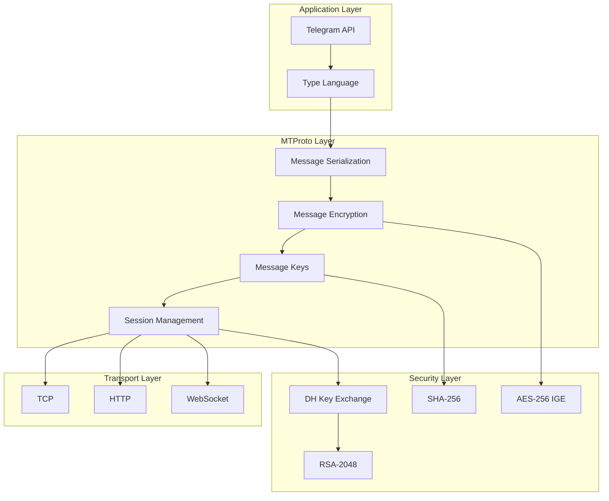
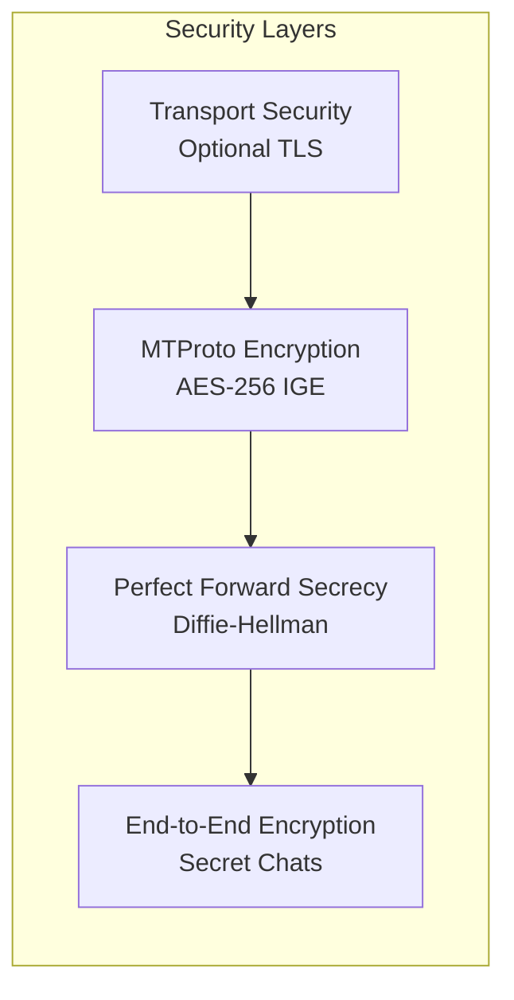
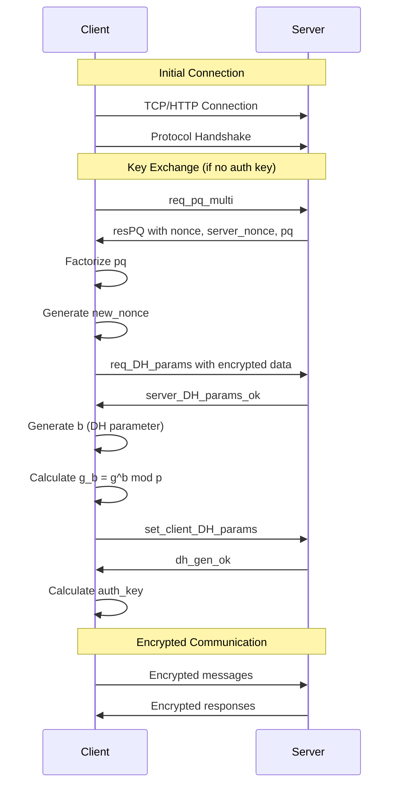
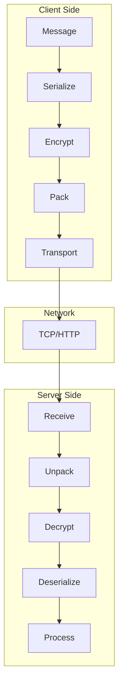
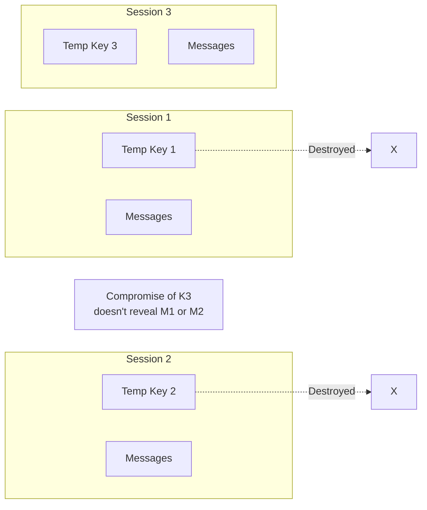
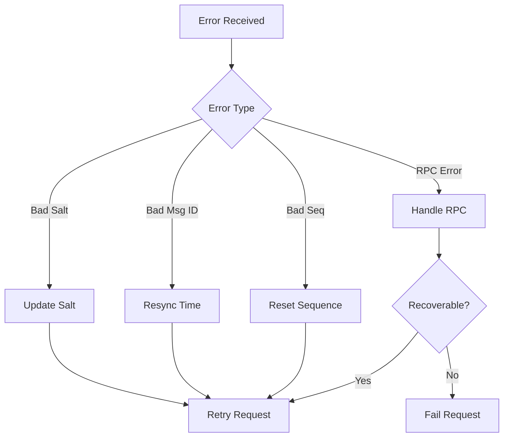

# MTProto Protocol Overview

---
**Navigation:** [← Protocol](README.md) | [Home](../index.md) | [Up](../index.md) | [Encryption →](encryption.md)

---

## Introduction

MTProto is Telegram's proprietary protocol designed for fast and secure message exchange. Telethon implements MTProto 2.0, providing end-to-end encryption for secret chats and client-server encryption for regular messages. This document provides a comprehensive overview of the protocol implementation.

## Protocol Architecture



## Core Concepts

### 1. Security Model

MTProto provides multiple layers of security:



### 2. Message Types

```python
class MessageType(Enum):
    """MTProto message types"""
    
    # Plain messages (unencrypted)
    PLAIN = 0x00000000
    
    # Encrypted messages
    ENCRYPTED = 0x00000001
    
    # Service messages
    MSG_CONTAINER = 0x73f1f8dc
    MSG_COPY = 0xe06046b2
    GZIP_PACKED = 0x3072cfa1
    
    # Acknowledgments
    MSGS_ACK = 0x62d6b459
    
    # Errors
    BAD_MSG_NOTIFICATION = 0xa7eff811
    BAD_SERVER_SALT = 0xedab447b
    
    # Session messages  
    NEW_SESSION_CREATED = 0x9ec20908
    MSGS_STATE_REQ = 0xda69fb52
    MSGS_STATE_INFO = 0x04deb57d
    MSGS_ALL_INFO = 0x8cc0d131
    MSG_DETAILED_INFO = 0x276d3ec6
    MSG_NEW_DETAILED_INFO = 0x809db6df
    
    # RPC
    RPC_RESULT = 0xf35c6d01
    RPC_ERROR = 0x2144ca19
    RPC_DROP_ANSWER = 0x58e4a740
    
    # Updates
    FUTURE_SALT = 0x0949d9dc
    FUTURE_SALTS = 0xae500895
    
    # Ping/Pong
    PING = 0x7abe77ec
    PONG = 0x347773c5
    PING_DELAY_DISCONNECT = 0xf3427b8c
    
    # Other
    DESTROY_SESSION = 0xe7512126
    DESTROY_SESSION_OK = 0xe22045fc
    DESTROY_SESSION_NONE = 0x62d350c9
    
    # HTTP
    HTTP_WAIT = 0x9299359f
```

## Protocol Flow

### Connection Establishment



### Message Exchange



## Message Structure

### Encrypted Message Format

```
+----+----+----+----+----+----+----+----+
|         auth_key_id (8 bytes)         |
+----+----+----+----+----+----+----+----+
|         msg_key (16 bytes)            |
|                                       |
+----+----+----+----+----+----+----+----+
|                                       |
|         encrypted_data                |
|         (variable length)             |
|                                       |
+----+----+----+----+----+----+----+----+
```

### Decrypted Data Structure

```
+----+----+----+----+----+----+----+----+
|           salt (8 bytes)              |
+----+----+----+----+----+----+----+----+
|         session_id (8 bytes)          |
+----+----+----+----+----+----+----+----+
|          msg_id (8 bytes)             |
+----+----+----+----+----+----+----+----+
|          seq_no (4 bytes)             |
+----+----+----+----+----+----+----+----+
|      message_length (4 bytes)         |
+----+----+----+----+----+----+----+----+
|                                       |
|         message_body                  |
|         (message_length bytes)        |
|                                       |
+----+----+----+----+----+----+----+----+
|         padding (0-15 bytes)          |
+----+----+----+----+----+----+----+----+
```

## Key Components

### 1. Authorization Key

```python
class AuthKey:
    """
    Represents a 2048-bit authorization key.
    """
    
    def __init__(self, data):
        if len(data) != 256:
            raise ValueError('Auth key must be 256 bytes')
            
        self.key = data
        
        # Calculate key ID (last 8 bytes of SHA1)
        self.key_id = hashlib.sha1(self.key).digest()[-8:]
        
        # Pre-calculate auxiliary hashes for performance
        self.aux_hash = hashlib.sha1(self.key).digest()[:8]
        
    def calc_new_nonce_hash(self, new_nonce, number):
        """
        Calculate new nonce hash for DH exchange.
        """
        data = new_nonce + bytes([number]) + self.aux_hash
        return hashlib.sha1(data).digest()[-16:]
```

### 2. Message ID Generation

```python
class MessageIdGenerator:
    """
    Generates unique message IDs based on time.
    """
    
    def __init__(self):
        self._last_id = 0
        self._time_offset = 0
        
    def generate(self):
        """
        Generate a new message ID.
        
        Message ID format:
        - Lower 32 bits: fractional part of time * 2^32
        - Upper 32 bits: unix timestamp
        - Must be divisible by 4
        - Must be greater than previous ID
        """
        now = time.time() + self._time_offset
        msg_id = int(now * 2**32)
        
        # Ensure divisible by 4
        msg_id = msg_id & ~3
        
        # Ensure monotonic increase
        if msg_id <= self._last_id:
            msg_id = self._last_id + 4
            
        self._last_id = msg_id
        return msg_id
```

### 3. Sequence Numbers

```python
class SequenceManager:
    """
    Manages message sequence numbers.
    """
    
    def __init__(self):
        self._sequence = 0
        
    def get_seq_no(self, content_related):
        """
        Get next sequence number.
        
        Rules:
        - Content-related: seq * 2 + 1 (odd)
        - Not content-related: seq * 2 (even)
        - Increment for content-related only
        """
        if content_related:
            result = self._sequence * 2 + 1
            self._sequence += 1
        else:
            result = self._sequence * 2
            
        return result
```

## Protocol Features

### 1. Perfect Forward Secrecy



### 2. Message Acknowledgment

```python
class AcknowledgmentSystem:
    """
    Handles message acknowledgments.
    """
    
    def __init__(self):
        self._pending_ack = set()
        self._max_pending = 8192
        
    def add_pending(self, msg_id):
        """Add message ID to pending acknowledgments."""
        self._pending_ack.add(msg_id)
        
        # Send acks if too many pending
        if len(self._pending_ack) > self._max_pending:
            return self._create_ack_message()
            
    def _create_ack_message(self):
        """Create acknowledgment message."""
        if not self._pending_ack:
            return None
            
        ack = MsgsAck(msg_ids=list(self._pending_ack))
        self._pending_ack.clear()
        return ack
```

### 3. Time Synchronization

```python
class TimeSynchronizer:
    """
    Synchronizes time with server.
    """
    
    def __init__(self):
        self._time_offset = 0
        self._last_sync = 0
        
    def update_time_offset(self, msg_id):
        """
        Update time offset based on server message ID.
        """
        # Extract server time from message ID
        server_time = msg_id / 2**32
        local_time = time.time()
        
        # Calculate offset
        time_offset = server_time - local_time
        
        # Smooth the offset to avoid jumps
        if self._time_offset == 0:
            self._time_offset = time_offset
        else:
            # Exponential moving average
            alpha = 0.1
            self._time_offset = (
                alpha * time_offset + 
                (1 - alpha) * self._time_offset
            )
            
        self._last_sync = local_time
```

## Error Handling

### Error Codes

```python
class BadMsgNotification:
    """MTProto error codes"""
    
    MSG_ID_TOO_LOW = 16
    MSG_ID_TOO_HIGH = 17
    MSG_ID_BAD_ODD_EVEN = 18
    MSG_ID_DUPLICATE = 19
    MSG_SEQNO_TOO_LOW = 32
    MSG_SEQNO_TOO_HIGH = 33
    MSG_SEQNO_EXPECTED_EVEN = 34
    MSG_SEQNO_EXPECTED_ODD = 35
    BAD_SERVER_SALT = 48
    BAD_CONTAINER = 64
```

### Error Recovery



## Performance Considerations

### 1. Message Containers

```python
class MessageContainer:
    """
    Groups multiple messages for efficiency.
    """
    
    CONSTRUCTOR_ID = 0x73f1f8dc
    MAX_SIZE = 1044456  # ~1MB
    MAX_COUNT = 1020
    
    def __init__(self):
        self.messages = []
        self.size = 8  # Header size
        
    def add(self, message):
        """Add message to container if fits."""
        msg_size = len(message.body) + 16  # Include header
        
        if (self.size + msg_size > self.MAX_SIZE or
            len(self.messages) >= self.MAX_COUNT):
            return False
            
        self.messages.append(message)
        self.size += msg_size
        return True
```

### 2. Compression

```python
class MessageCompressor:
    """
    Compresses messages when beneficial.
    """
    
    GZIP_PACKED_ID = 0x3072cfa1
    MIN_SIZE = 256  # Don't compress small messages
    
    def try_compress(self, data):
        """Compress if it reduces size."""
        if len(data) < self.MIN_SIZE:
            return None
            
        compressed = gzip.compress(data, compresslevel=9)
        
        # Only use if >10% reduction
        if len(compressed) < len(data) * 0.9:
            return struct.pack('<I', self.GZIP_PACKED_ID) + compressed
            
        return None
```

## Security Best Practices

### 1. Key Management

- Never reuse authorization keys across sessions
- Destroy temporary keys after use
- Use secure random generation for all keys
- Implement key rotation for long-lived sessions

### 2. Message Security

- Always verify message authenticity
- Check message IDs for replay attacks
- Validate sequence numbers
- Use fresh salts for each session

### 3. Implementation Security

- Constant-time comparison for crypto operations
- Secure memory handling for keys
- Proper random number generation
- Side-channel attack mitigation

## Next Steps

- Continue to [Encryption Details](encryption.md) for crypto implementation
- See [Authorization Flow](authorization.md) for key exchange
- Explore [Message Format](message-format.md) for serialization

---
**Navigation:** [← Protocol](README.md) | [Home](../index.md) | [Up](../index.md) | [Encryption →](encryption.md)

---