# Session Data

---
**Navigation:** [← Session Types](types.md) | [Home](../index.md) | [Up](../index.md) | [Entity Cache →](entity-cache.md)

---

## Overview

Session data in Telethon encompasses all the persistent information required to maintain a connection with Telegram servers. This includes authentication keys, server configurations, entity cache, and update states.

## Core Session Data

### Data Structure

```mermaid
graph TB
    subgraph "Session Data"
        A[Auth Key]
        B[DC Configuration]
        C[User Information]
        D[Update States]
        E[Entity Cache]
        F[File References]
        G[Temporary Data]
    end
    
    A --> A1[Key Material]
    A --> A2[Key ID]
    A --> A3[Creation Time]
    
    B --> B1[DC ID]
    B --> B2[IP Address]
    B --> B3[Port]
    B --> B4[Public Key]
    
    C --> C1[User ID]
    C --> C2[Is Bot]
    C --> C3[Phone/Token]
    
    D --> D1[PTS]
    D --> D2[QTS]
    D --> D3[Date]
    D --> D4[Seq]
    
    E --> E1[Users]
    E --> E2[Chats]
    E --> E3[Channels]
    
    F --> F1[Sent Files]
    F --> F2[Downloaded Files]
    
    G --> G1[Message IDs]
    G --> G2[Salts]
    G --> G3[Time Offset]
```



### Authentication Data

```python
@dataclass
class AuthenticationData:
    """
    Core authentication information.
    """
    
    # Primary auth key (2048-bit)
    auth_key: bytes
    
    # Computed from auth_key
    auth_key_id: int
    
    # Per-DC auth keys
    dc_auth_keys: Dict[int, bytes]
    
    # Temporary auth keys (for PFS)
    temp_auth_keys: Dict[int, Tuple[bytes, int]]  # key, expires_at
    
    # Server salts
    server_salts: List[ServerSalt]
    
    # Time synchronization
    time_offset: int
    
    # Layer version
    layer: int = LAYER
    
    def get_auth_key(self, dc_id: int = None) -> Optional[AuthKey]:
        """Get auth key for specific DC."""
        if dc_id is None:
            return AuthKey(self.auth_key)
            
        if dc_id in self.dc_auth_keys:
            return AuthKey(self.dc_auth_keys[dc_id])
            
        # Check temp keys
        if dc_id in self.temp_auth_keys:
            key, expires = self.temp_auth_keys[dc_id]
            if expires > time.time():
                return AuthKey(key)
                
        return None
        
    def add_server_salt(self, salt: int, valid_since: int, valid_until: int):
        """Add server salt."""
        self.server_salts.append(
            ServerSalt(salt, valid_since, valid_until)
        )
        # Keep sorted by valid_since
        self.server_salts.sort(key=lambda s: s.valid_since)
        
    def get_current_salt(self) -> int:
        """Get current valid salt."""
        now = int(time.time())
        
        for salt in reversed(self.server_salts):
            if salt.valid_since <= now <= salt.valid_until:
                return salt.salt
                
        # No valid salt, return newest
        return self.server_salts[-1].salt if self.server_salts else 0
```

### DC Configuration

```python
@dataclass
class DCConfiguration:
    """
    Data center configuration.
    """
    
    # Primary DC
    dc_id: int = 2
    
    # DC addresses
    dc_addresses: Dict[int, DCAddress] = field(default_factory=dict)
    
    # DC options from server
    dc_options: List[DcOption] = field(default_factory=list)
    
    # CDN configuration
    cdn_config: Optional[CdnConfig] = None
    
    # Public keys for each DC
    public_keys: Dict[int, RSAPublicKey] = field(default_factory=dict)
    
    def get_dc_address(self, dc_id: int, ipv6: bool = False, 
                       media: bool = False, cdn: bool = False) -> DCAddress:
        """Get address for specific DC."""
        # Try cached addresses first
        key = (dc_id, ipv6, media, cdn)
        if key in self.dc_addresses:
            return self.dc_addresses[key]
            
        # Search in dc_options
        for opt in self.dc_options:
            if (opt.id == dc_id and 
                opt.ipv6 == ipv6 and 
                opt.media_only == media and
                opt.cdn == cdn):
                
                addr = DCAddress(
                    ip=opt.ip_address,
                    port=opt.port,
                    dc_id=dc_id,
                    ipv6=ipv6,
                    media_only=media,
                    cdn=cdn
                )
                
                self.dc_addresses[key] = addr
                return addr
                
        # Fallback to defaults
        return self._get_default_dc_address(dc_id)
```

### User State

```python
@dataclass
class UserState:
    """
    Current user state information.
    """
    
    # User identification
    user_id: Optional[int] = None
    is_bot: bool = False
    is_premium: bool = False
    
    # Bot-specific
    bot_token: Optional[str] = None
    
    # User-specific
    phone: Optional[str] = None
    username: Optional[str] = None
    
    # Authorization state
    is_authorized: bool = False
    
    # Takeout session
    takeout_id: Optional[int] = None
    
    # Account settings
    two_factor_enabled: bool = False
    
    def to_dict(self) -> dict:
        """Convert to dictionary for storage."""
        return {
            'user_id': self.user_id,
            'is_bot': self.is_bot,
            'is_premium': self.is_premium,
            'bot_token': self.bot_token,
            'phone': self.phone,
            'username': self.username,
            'is_authorized': self.is_authorized,
            'takeout_id': self.takeout_id,
            '2fa_enabled': self.two_factor_enabled
        }
        
    @classmethod
    def from_dict(cls, data: dict) -> 'UserState':
        """Create from dictionary."""
        return cls(
            user_id=data.get('user_id'),
            is_bot=data.get('is_bot', False),
            is_premium=data.get('is_premium', False),
            bot_token=data.get('bot_token'),
            phone=data.get('phone'),
            username=data.get('username'),
            is_authorized=data.get('is_authorized', False),
            takeout_id=data.get('takeout_id'),
            two_factor_enabled=data.get('2fa_enabled', False)
        )
```

## Update States

### Update State Management

```python
@dataclass
class UpdateState:
    """
    Tracks update sequence for proper synchronization.
    """
    
    # Points in time sequence (messages)
    pts: int = 0
    
    # Queue time sequence (secret chats)
    qts: int = 0
    
    # Date of last update
    date: int = 0
    
    # General sequence number
    seq: int = 0
    
    # Unprocessed updates
    pending_updates: List[Update] = field(default_factory=list)
    
    def update_from_difference(self, diff):
        """Update state from getDifference result."""
        if hasattr(diff, 'pts'):
            self.pts = diff.pts
        if hasattr(diff, 'qts'):
            self.qts = diff.qts
        if hasattr(diff, 'date'):
            self.date = diff.date
        if hasattr(diff, 'seq'):
            self.seq = diff.seq
            
    def is_outdated(self, current_time: int) -> bool:
        """Check if state is outdated."""
        # Consider outdated if more than 30 minutes old
        return current_time - self.date > 1800
        
    def should_get_difference(self, update) -> bool:
        """Check if we need to call getDifference."""
        if hasattr(update, 'pts'):
            if update.pts > self.pts + 1:
                return True
                
        if hasattr(update, 'qts'):
            if update.qts > self.qts + 1:
                return True
                
        return False
```

### Channel States

```python
class ChannelStates:
    """
    Manages per-channel update states.
    """
    
    def __init__(self):
        self._states: Dict[int, ChannelState] = {}
        self._lock = threading.Lock()
        
    def get_state(self, channel_id: int) -> Optional[ChannelState]:
        """Get state for channel."""
        with self._lock:
            return self._states.get(channel_id)
            
    def update_state(self, channel_id: int, pts: int):
        """Update channel state."""
        with self._lock:
            if channel_id not in self._states:
                self._states[channel_id] = ChannelState(channel_id)
                
            self._states[channel_id].pts = pts
            self._states[channel_id].last_update = int(time.time())
            
    def get_outdated_channels(self, max_age: int = 3600) -> List[int]:
        """Get channels with outdated states."""
        current_time = int(time.time())
        outdated = []
        
        with self._lock:
            for channel_id, state in self._states.items():
                if current_time - state.last_update > max_age:
                    outdated.append(channel_id)
                    
        return outdated
        
    def cleanup_old_states(self, max_age: int = 86400):
        """Remove old channel states."""
        current_time = int(time.time())
        
        with self._lock:
            to_remove = []
            for channel_id, state in self._states.items():
                if current_time - state.last_update > max_age:
                    to_remove.append(channel_id)
                    
            for channel_id in to_remove:
                del self._states[channel_id]
```

## File References

### Sent Files Cache

```python
@dataclass
class SentFileReference:
    """
    Reference to previously sent file.
    """
    
    # File identification
    md5_digest: bytes
    file_size: int
    
    # Telegram file reference
    file_id: int
    access_hash: int
    file_reference: bytes
    
    # Metadata
    mime_type: Optional[str] = None
    attributes: List[DocumentAttribute] = field(default_factory=list)
    
    # Upload info
    parts: int = 0
    uploaded_at: int = field(default_factory=lambda: int(time.time()))
    
    def to_input_document(self) -> InputDocument:
        """Convert to input document."""
        return InputDocument(
            id=self.file_id,
            access_hash=self.access_hash,
            file_reference=self.file_reference
        )
        
    def is_expired(self, current_time: int) -> bool:
        """Check if file reference might be expired."""
        # File references typically expire after 24 hours
        return current_time - self.uploaded_at > 86400
```

### Download Progress

```python
class DownloadProgress:
    """
    Tracks file download progress.
    """
    
    def __init__(self, file_id: int, expected_size: int):
        self.file_id = file_id
        self.expected_size = expected_size
        self.downloaded_parts: Set[int] = set()
        self.completed_bytes = 0
        self.start_time = time.time()
        
    def add_part(self, part_num: int, part_size: int):
        """Record downloaded part."""
        if part_num not in self.downloaded_parts:
            self.downloaded_parts.add(part_num)
            self.completed_bytes += part_size
            
    @property
    def progress(self) -> float:
        """Get download progress percentage."""
        if self.expected_size == 0:
            return 0.0
        return (self.completed_bytes / self.expected_size) * 100
        
    @property
    def speed(self) -> float:
        """Get download speed in bytes/second."""
        elapsed = time.time() - self.start_time
        if elapsed == 0:
            return 0.0
        return self.completed_bytes / elapsed
```

## Session Persistence

### Serialization Format

```python
class SessionSerializer:
    """
    Handles session data serialization.
    """
    
    VERSION = 1
    
    @staticmethod
    def serialize(session_data: dict) -> bytes:
        """Serialize session data to bytes."""
        # Add version header
        data = {
            'version': SessionSerializer.VERSION,
            'timestamp': int(time.time()),
            'data': session_data
        }
        
        # Use msgpack for efficient binary serialization
        return msgpack.packb(data, use_bin_type=True)
        
    @staticmethod
    def deserialize(data: bytes) -> dict:
        """Deserialize session data from bytes."""
        unpacked = msgpack.unpackb(data, raw=False)
        
        # Check version compatibility
        version = unpacked.get('version', 0)
        if version > SessionSerializer.VERSION:
            raise ValueError(f"Unsupported session version: {version}")
            
        # Migrate old versions if needed
        session_data = unpacked['data']
        if version < SessionSerializer.VERSION:
            session_data = SessionSerializer._migrate_data(
                session_data, version
            )
            
        return session_data
        
    @staticmethod
    def _migrate_data(data: dict, from_version: int) -> dict:
        """Migrate data from old version."""
        # Example migration logic
        if from_version == 0:
            # Version 0 -> 1: Add missing fields
            data.setdefault('layer', LAYER)
            data.setdefault('cdn_config', None)
            
        return data
```

### Data Validation

```python
class SessionValidator:
    """
    Validates session data integrity.
    """
    
    @staticmethod
    def validate(session_data: dict) -> List[str]:
        """Validate session data, return list of errors."""
        errors = []
        
        # Check required fields
        if 'auth_key' not in session_data:
            errors.append("Missing auth_key")
            
        if 'dc_id' not in session_data:
            errors.append("Missing dc_id")
            
        # Validate auth key
        if 'auth_key' in session_data:
            auth_key = session_data['auth_key']
            if not isinstance(auth_key, bytes) or len(auth_key) != 256:
                errors.append("Invalid auth_key format")
                
        # Validate DC ID
        if 'dc_id' in session_data:
            dc_id = session_data['dc_id']
            if dc_id not in range(1, 6):
                errors.append(f"Invalid dc_id: {dc_id}")
                
        # Validate update states
        if 'update_state' in session_data:
            state = session_data['update_state']
            for field in ['pts', 'qts', 'date', 'seq']:
                if field in state and state[field] < 0:
                    errors.append(f"Invalid {field} value: {state[field]}")
                    
        return errors
```

## Memory Management

### Session Memory Pool

```python
class SessionMemoryPool:
    """
    Manages memory usage for session data.
    """
    
    def __init__(self, max_entities: int = 10000, max_files: int = 1000):
        self.max_entities = max_entities
        self.max_files = max_files
        
        # LRU caches
        self.entity_cache = LRUCache(max_entities)
        self.file_cache = LRUCache(max_files)
        
        # Memory tracking
        self._memory_usage = 0
        self._peak_usage = 0
        
    def add_entity(self, entity_id: int, entity_data: dict):
        """Add entity to cache."""
        size = self._estimate_size(entity_data)
        
        # Check if we need to evict
        while self._memory_usage + size > self.max_memory:
            self._evict_oldest()
            
        self.entity_cache[entity_id] = entity_data
        self._memory_usage += size
        self._peak_usage = max(self._peak_usage, self._memory_usage)
        
    def _estimate_size(self, obj) -> int:
        """Estimate memory size of object."""
        return len(pickle.dumps(obj))
        
    def get_stats(self) -> dict:
        """Get memory usage statistics."""
        return {
            'current_usage': self._memory_usage,
            'peak_usage': self._peak_usage,
            'entity_count': len(self.entity_cache),
            'file_count': len(self.file_cache),
            'cache_hit_rate': self.entity_cache.hit_rate
        }
```

## Best Practices

### Data Management

1. **Regular Cleanup**: Remove outdated entities and file references
2. **Atomic Updates**: Ensure session updates are atomic
3. **Validation**: Validate data before persistence
4. **Compression**: Compress large session files
5. **Backup**: Regular backups for important sessions

### Performance

1. **Lazy Loading**: Load session data on demand
2. **Batch Updates**: Group multiple updates together
3. **Memory Limits**: Set appropriate cache limits
4. **Efficient Storage**: Use appropriate data structures
5. **Index Key Data**: Index frequently accessed data

## Next Steps

- Continue to [Entity Cache](entity-cache.md) for caching details
- Review [Session Types](types.md) for storage options
- See [Update Handling](../internals/updates.md) for update processing

---
**Navigation:** [← Session Types](types.md) | [Home](../index.md) | [Up](../index.md) | [Entity Cache →](entity-cache.md)

---