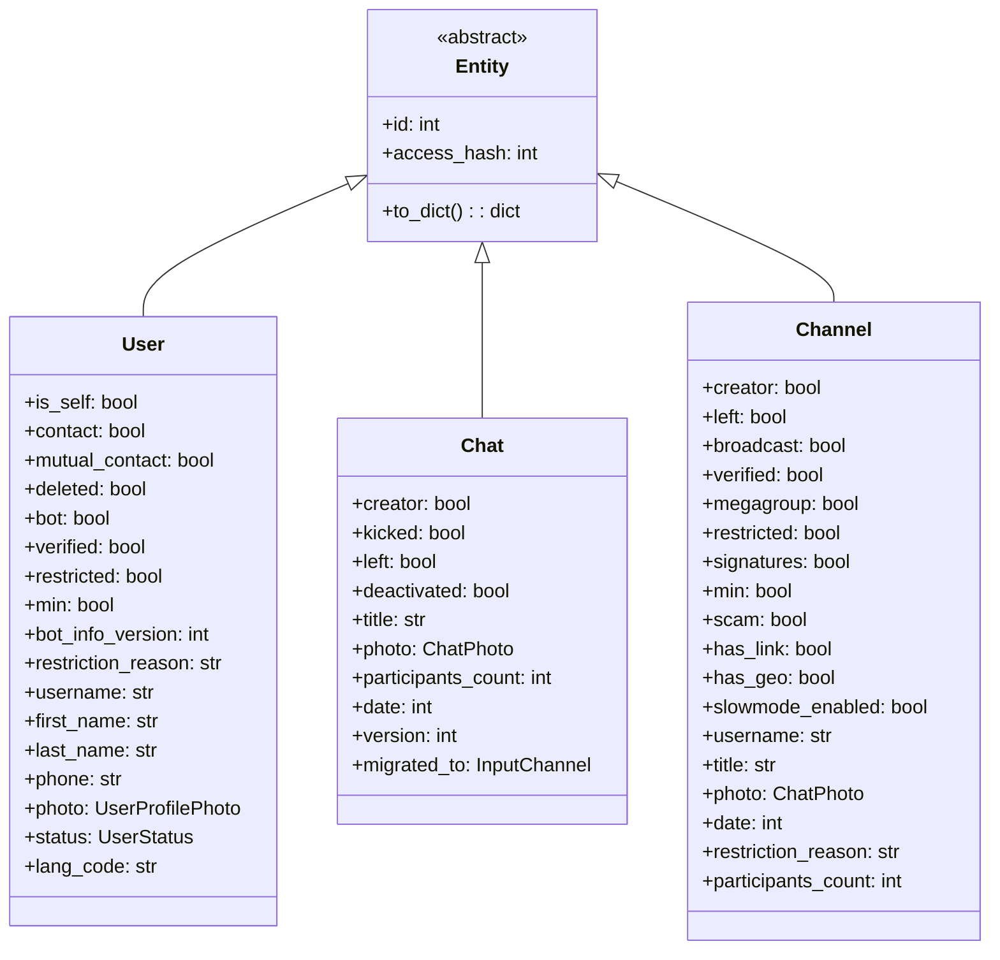

# Entity Cache

---
**Navigation:** [← Session Data](data.md) | [Home](../index.md) | [Up](../index.md) | [API →](../api/README.md)

---

## Overview

The entity cache is a critical component of Telethon's session system that stores information about users, chats, and channels. This cache enables efficient entity resolution, reduces API calls, and provides offline access to basic entity information.

## Entity Types

### Entity Hierarchy



### Entity Resolution

```python
class EntityCache:
    """
    Manages cached entities for efficient lookup.
    """
    
    def __init__(self, session):
        self.session = session
        self._entities = {}  # id -> entity
        self._usernames = {}  # username -> id
        self._phones = {}  # phone -> id
        self._cache_time = {}  # id -> timestamp
        self._lock = threading.RLock()
        
    def add_entity(self, entity):
        """Add or update entity in cache."""
        with self._lock:
            entity_id = self._get_entity_id(entity)
            
            # Store main entity
            self._entities[entity_id] = entity
            self._cache_time[entity_id] = time.time()
            
            # Store username lookup
            if hasattr(entity, 'username') and entity.username:
                self._usernames[entity.username.lower()] = entity_id
                
            # Store phone lookup (users only)
            if isinstance(entity, User) and entity.phone:
                self._phones[entity.phone] = entity_id
                
            # Persist to session
            self.session.cache_entity(entity)
            
    def get_entity(self, entity_id):
        """Get entity by ID."""
        with self._lock:
            # Check memory cache
            if entity_id in self._entities:
                return self._entities[entity_id]
                
            # Try loading from session
            entity = self.session.get_entity(entity_id)
            if entity:
                self._entities[entity_id] = entity
                return entity
                
            return None
            
    def get_entity_by_username(self, username):
        """Get entity by username."""
        with self._lock:
            username = username.lower().lstrip('@')
            
            if username in self._usernames:
                entity_id = self._usernames[username]
                return self.get_entity(entity_id)
                
            return None
            
    def _get_entity_id(self, entity):
        """Extract entity ID with proper handling."""
        if isinstance(entity, User):
            return entity.id
        elif isinstance(entity, (Chat, Channel)):
            # Chats use positive IDs, channels use negative
            if isinstance(entity, Channel):
                return -1000000000000 - entity.id
            else:
                return -entity.id
        else:
            raise TypeError(f"Unknown entity type: {type(entity)}")
```

## Cache Operations

### Bulk Operations

```python
class BulkEntityCache(EntityCache):
    """
    Optimized for bulk entity operations.
    """
    
    def add_entities(self, entities):
        """Add multiple entities efficiently."""
        with self._lock:
            entities_to_save = []
            
            for entity in entities:
                entity_id = self._get_entity_id(entity)
                
                # Update memory cache
                self._entities[entity_id] = entity
                self._cache_time[entity_id] = time.time()
                
                # Update lookup tables
                if hasattr(entity, 'username') and entity.username:
                    self._usernames[entity.username.lower()] = entity_id
                    
                if isinstance(entity, User) and entity.phone:
                    self._phones[entity.phone] = entity_id
                    
                entities_to_save.append(entity)
                
            # Bulk save to session
            self.session.cache_entities_bulk(entities_to_save)
            
    def get_entities(self, entity_ids):
        """Get multiple entities efficiently."""
        with self._lock:
            results = {}
            missing_ids = []
            
            # Check memory cache first
            for entity_id in entity_ids:
                if entity_id in self._entities:
                    results[entity_id] = self._entities[entity_id]
                else:
                    missing_ids.append(entity_id)
                    
            # Load missing from session
            if missing_ids:
                loaded = self.session.get_entities_bulk(missing_ids)
                for entity_id, entity in loaded.items():
                    if entity:
                        self._entities[entity_id] = entity
                        results[entity_id] = entity
                        
            return results
            
    def search_entities(self, query, limit=50):
        """Search entities by name or username."""
        with self._lock:
            results = []
            query_lower = query.lower()
            
            for entity in self._entities.values():
                # Search in username
                if hasattr(entity, 'username') and entity.username:
                    if query_lower in entity.username.lower():
                        results.append(entity)
                        continue
                        
                # Search in name
                name = self._get_display_name(entity).lower()
                if query_lower in name:
                    results.append(entity)
                    
                if len(results) >= limit:
                    break
                    
            return results
```

### Cache Invalidation

```python
class CacheInvalidator:
    """
    Handles cache invalidation and refresh.
    """
    
    def __init__(self, cache, max_age=3600):
        self.cache = cache
        self.max_age = max_age  # seconds
        self._refresh_queue = asyncio.Queue()
        self._refresh_task = None
        
    def start(self):
        """Start cache refresh task."""
        self._refresh_task = asyncio.create_task(self._refresh_loop())
        
    async def _refresh_loop(self):
        """Background task to refresh stale entities."""
        while True:
            try:
                # Check for stale entities
                stale = self._find_stale_entities()
                
                for entity_id in stale:
                    await self._refresh_queue.put(entity_id)
                    
                # Process refresh queue
                while not self._refresh_queue.empty():
                    entity_id = await self._refresh_queue.get()
                    await self._refresh_entity(entity_id)
                    
                # Wait before next check
                await asyncio.sleep(60)
                
            except asyncio.CancelledError:
                break
                
    def _find_stale_entities(self):
        """Find entities that need refresh."""
        current_time = time.time()
        stale = []
        
        with self.cache._lock:
            for entity_id, cache_time in self.cache._cache_time.items():
                if current_time - cache_time > self.max_age:
                    stale.append(entity_id)
                    
        return stale
        
    async def _refresh_entity(self, entity_id):
        """Refresh single entity from server."""
        try:
            # Get fresh entity from server
            if entity_id > 0:
                # User
                entities = await self.cache.session.client(
                    GetUsersRequest([InputUser(entity_id, 0)])
                )
            elif entity_id < -1000000000000:
                # Channel
                channel_id = -entity_id - 1000000000000
                entities = await self.cache.session.client(
                    GetChannelsRequest([InputChannel(channel_id, 0)])
                )
            else:
                # Chat
                chat_id = -entity_id
                full_chat = await self.cache.session.client(
                    GetFullChatRequest(chat_id)
                )
                entities = full_chat.chats
                
            # Update cache
            if entities:
                self.cache.add_entity(entities[0])
                
        except Exception as e:
            logger.warning(f"Failed to refresh entity {entity_id}: {e}")
```

## Input Entity Resolution

### Smart Resolution

```python
class EntityResolver:
    """
    Resolves various entity formats to InputPeer.
    """
    
    def __init__(self, cache, client):
        self.cache = cache
        self.client = client
        
    async def resolve(self, entity):
        """Resolve entity to InputPeer."""
        # Already an InputPeer
        if isinstance(entity, (InputPeerUser, InputPeerChat, InputPeerChannel)):
            return entity
            
        # Entity ID
        if isinstance(entity, int):
            return await self._resolve_id(entity)
            
        # Username
        if isinstance(entity, str):
            if entity.startswith('@'):
                return await self._resolve_username(entity[1:])
            elif entity.startswith('+'):
                return await self._resolve_phone(entity)
            elif entity.startswith('https://t.me/'):
                return await self._resolve_invite_link(entity)
            else:
                # Try as username without @
                return await self._resolve_username(entity)
                
        # Entity object
        if hasattr(entity, 'id'):
            return self._entity_to_input_peer(entity)
            
        raise ValueError(f"Cannot resolve entity: {entity}")
        
    async def _resolve_id(self, entity_id):
        """Resolve entity by ID."""
        # Check cache first
        cached = self.cache.get_entity(entity_id)
        if cached:
            return self._entity_to_input_peer(cached)
            
        # Try to guess type and fetch
        if entity_id > 0:
            # Probably user
            try:
                users = await self.client(
                    GetUsersRequest([InputUser(entity_id, 0)])
                )
                if users:
                    self.cache.add_entity(users[0])
                    return InputPeerUser(entity_id, users[0].access_hash)
            except:
                pass
                
        # Handle other cases...
        raise ValueError(f"Cannot resolve entity ID: {entity_id}")
        
    async def _resolve_username(self, username):
        """Resolve entity by username."""
        # Check cache
        cached = self.cache.get_entity_by_username(username)
        if cached:
            return self._entity_to_input_peer(cached)
            
        # Resolve from server
        result = await self.client(ResolveUsernameRequest(username))
        
        # Cache the result
        if hasattr(result, 'users'):
            for user in result.users:
                self.cache.add_entity(user)
        if hasattr(result, 'chats'):
            for chat in result.chats:
                self.cache.add_entity(chat)
                
        # Return the peer
        return result.peer
```

## Performance Optimization

### Memory-Efficient Cache

```python
class MemoryEfficientCache:
    """
    Optimized entity cache for memory-constrained environments.
    """
    
    def __init__(self, max_size=5000):
        self.max_size = max_size
        self._cache = OrderedDict()
        self._access_count = Counter()
        self._lock = threading.RLock()
        
    def add_entity(self, entity):
        """Add entity with LRU eviction."""
        with self._lock:
            entity_id = self._get_entity_id(entity)
            
            # Remove if already exists (to update order)
            if entity_id in self._cache:
                del self._cache[entity_id]
                
            # Add to end (most recent)
            self._cache[entity_id] = self._minimize_entity(entity)
            
            # Evict if over limit
            while len(self._cache) > self.max_size:
                # Remove least recently used
                self._cache.popitem(last=False)
                
    def _minimize_entity(self, entity):
        """Store minimal entity data to save memory."""
        minimal = {
            'id': entity.id,
            'type': type(entity).__name__
        }
        
        # Essential fields only
        if hasattr(entity, 'access_hash'):
            minimal['access_hash'] = entity.access_hash
            
        if hasattr(entity, 'username'):
            minimal['username'] = entity.username
            
        if isinstance(entity, User):
            minimal['first_name'] = entity.first_name
            minimal['last_name'] = entity.last_name
            minimal['phone'] = entity.phone
            minimal['bot'] = entity.bot
        elif isinstance(entity, (Chat, Channel)):
            minimal['title'] = entity.title
            
        return minimal
        
    def get_entity(self, entity_id):
        """Get entity with access tracking."""
        with self._lock:
            if entity_id in self._cache:
                # Move to end (most recent)
                self._cache.move_to_end(entity_id)
                
                # Track access
                self._access_count[entity_id] += 1
                
                return self._expand_entity(self._cache[entity_id])
                
            return None
```

### Cache Statistics

```python
class CacheStatistics:
    """
    Tracks cache performance metrics.
    """
    
    def __init__(self):
        self.hits = 0
        self.misses = 0
        self.evictions = 0
        self.additions = 0
        self._start_time = time.time()
        
    def record_hit(self):
        """Record cache hit."""
        self.hits += 1
        
    def record_miss(self):
        """Record cache miss."""
        self.misses += 1
        
    def record_eviction(self):
        """Record cache eviction."""
        self.evictions += 1
        
    def record_addition(self):
        """Record entity addition."""
        self.additions += 1
        
    @property
    def hit_rate(self):
        """Calculate cache hit rate."""
        total = self.hits + self.misses
        if total == 0:
            return 0.0
        return self.hits / total
        
    def get_report(self):
        """Get detailed statistics report."""
        uptime = time.time() - self._start_time
        
        return {
            'hits': self.hits,
            'misses': self.misses,
            'hit_rate': f"{self.hit_rate * 100:.2f}%",
            'evictions': self.evictions,
            'additions': self.additions,
            'uptime_seconds': int(uptime),
            'avg_hits_per_minute': self.hits / (uptime / 60) if uptime > 0 else 0
        }
```

## Integration with Session

### Session Entity Methods

```python
class SessionEntityMixin:
    """
    Entity cache methods for session classes.
    """
    
    def cache_entity(self, entity):
        """Cache single entity."""
        raise NotImplementedError
        
    def cache_entities_bulk(self, entities):
        """Cache multiple entities."""
        for entity in entities:
            self.cache_entity(entity)
            
    def get_entity(self, entity_id):
        """Get entity from cache."""
        raise NotImplementedError
        
    def get_entities_bulk(self, entity_ids):
        """Get multiple entities."""
        return {
            entity_id: self.get_entity(entity_id)
            for entity_id in entity_ids
        }
        
    def get_entity_by_username(self, username):
        """Get entity by username."""
        raise NotImplementedError
        
    def get_entity_by_phone(self, phone):
        """Get entity by phone."""
        raise NotImplementedError
        
    def search_entities(self, query, limit=50):
        """Search entities."""
        raise NotImplementedError
        
    def clear_entity_cache(self):
        """Clear all cached entities."""
        raise NotImplementedError
```

### SQLite Implementation

```python
class SQLiteEntityCache(SessionEntityMixin):
    """
    SQLite implementation of entity cache.
    """
    
    def cache_entity(self, entity):
        """Cache entity in SQLite."""
        entity_id = self._get_entity_id(entity)
        entity_hash = entity.access_hash if hasattr(entity, 'access_hash') else 0
        
        username = None
        phone = None
        name = None
        
        if hasattr(entity, 'username'):
            username = entity.username
            
        if isinstance(entity, User):
            phone = entity.phone
            name = f"{entity.first_name or ''} {entity.last_name or ''}".strip()
        elif isinstance(entity, (Chat, Channel)):
            name = entity.title
            
        # Insert or update
        self._execute("""
            INSERT OR REPLACE INTO entities 
            (id, hash, username, phone, name) 
            VALUES (?, ?, ?, ?, ?)
        """, (entity_id, entity_hash, username, phone, name))
        
    def get_entity(self, entity_id):
        """Get entity from SQLite."""
        row = self._query_one("""
            SELECT id, hash, username, phone, name 
            FROM entities 
            WHERE id = ?
        """, (entity_id,))
        
        if row:
            return self._row_to_entity(row)
            
        return None
        
    def get_entity_by_username(self, username):
        """Get entity by username from SQLite."""
        row = self._query_one("""
            SELECT id, hash, username, phone, name 
            FROM entities 
            WHERE username = ? COLLATE NOCASE
        """, (username,))
        
        if row:
            return self._row_to_entity(row)
            
        return None
```

## Best Practices

### Cache Management

1. **Set Appropriate Limits**: Configure cache size based on memory
2. **Regular Cleanup**: Remove stale entries periodically
3. **Batch Operations**: Use bulk methods for efficiency
4. **Handle Conflicts**: Resolve entity conflicts properly
5. **Monitor Performance**: Track cache statistics

### Entity Resolution

1. **Cache First**: Always check cache before API calls
2. **Batch Requests**: Resolve multiple entities together
3. **Handle Failures**: Gracefully handle resolution failures
4. **Update Cache**: Keep cache updated with fresh data
5. **Use Minimal Data**: Store only essential fields

## Next Steps

- Explore [API Types](../api/types-functions.md) for entity details
- Review [Update Handling](../internals/updates.md) for entity updates
- See [Session Types](types.md) for storage implementations

---
**Navigation:** [← Session Data](data.md) | [Home](../index.md) | [Up](../index.md) | [API →](../api/README.md)

---