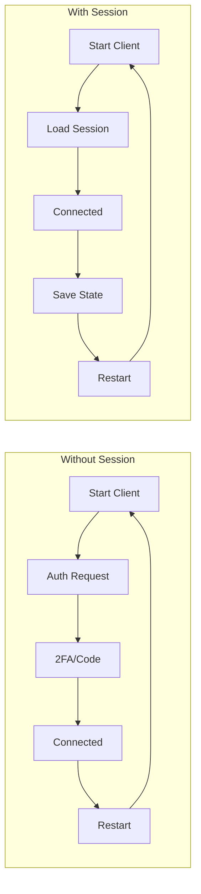
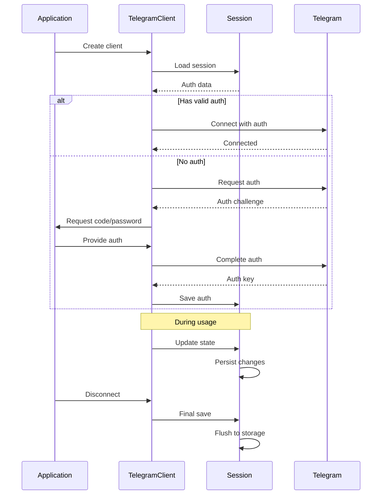
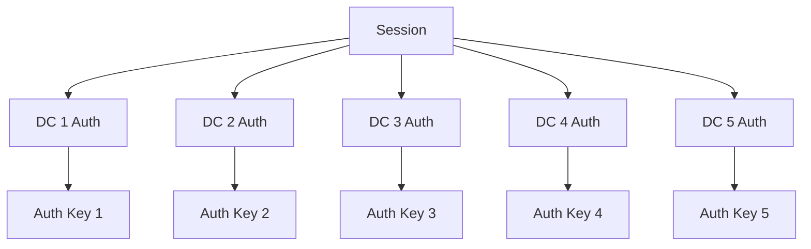
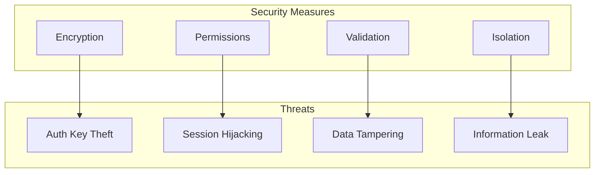

# Session Management Overview

---
**Navigation:** [← Sessions](README.md) | [Home](../index.md) | [Up](../index.md) | [Session Types →](types.md)

---

## Introduction

Session management is a critical component of Telethon that handles persistent storage of authentication data, server configuration, and entity information. Sessions allow clients to maintain their state across restarts without requiring re-authentication.

## Session Architecture

```mermaid
graph TB
    subgraph "Client Layer"
        TC[TelegramClient]
        BC[BaseClient]
    end
    
    subgraph "Session Interface"
        AS[Abstract Session]
        SM[Session Manager]
    end
    
    subgraph "Session Implementations"
        MS[MemorySession]
        SS[SQLiteSession]
        ST[StringSession]
        CS[Custom Sessions]
    end
    
    subgraph "Session Data"
        AK[Auth Key]
        DC[DC Config]
        US[Update State]
        EC[Entity Cache]
        FR[File References]
    end
    
    TC --> BC
    BC --> SM
    SM --> AS
    
    AS <|-- MS
    AS <|-- SS
    AS <|-- ST
    AS <|-- CS
    
    MS --> AK
    MS --> DC
    SS --> AK
    SS --> DC
    SS --> US
    SS --> EC
    SS --> FR
```

## Core Concepts

### What is a Session?

A session in Telethon represents the persistent state of a client's connection to Telegram. It stores:

1. **Authentication Data**: Authorization keys and server salts
2. **Connection Information**: Data center addresses and configuration
3. **Update State**: Synchronization points for receiving updates
4. **Entity Cache**: Information about users, chats, and channels
5. **File References**: Cached file metadata for efficient access

### Why Sessions Matter



## Session Lifecycle

### Session Flow



## Session Components

### 1. Authentication State

```python
@dataclass
class AuthenticationState:
    """Core authentication data"""
    dc_id: int                    # Data center ID
    auth_key: Optional[bytes]     # 256-byte authorization key
    server_address: str           # DC IP address
    port: int                     # DC port
    key_id: bytes                 # Auth key ID (8 bytes)
    server_salt: int              # Current server salt
    time_offset: int              # Time difference with server
    sequence: int                 # Message sequence number
```

### 2. Update State

```python
@dataclass
class UpdateState:
    """Tracks update synchronization"""
    pts: int          # Persistent timestamp
    qts: int          # Queue timestamp  
    date: int         # Update date
    seq: int          # Sequence number
    unread_count: int # Unread message count
```

### 3. Entity Cache

```python
class EntityCache:
    """Cached entity information"""
    def __init__(self):
        self._users = {}      # id -> User
        self._chats = {}      # id -> Chat
        self._channels = {}   # id -> Channel
        self._usernames = {}  # username -> id
        self._phones = {}     # phone -> id
```

## Session Interface

### Abstract Base Class

```python
class Session(ABC):
    """
    Abstract base class for all session implementations.
    """
    
    @abstractmethod
    def set_dc(self, dc_id, server_address, port):
        """Set the data center information."""
        raise NotImplementedError
        
    @abstractmethod
    def get_auth_key(self, dc_id=None):
        """Get the authorization key for a DC."""
        raise NotImplementedError
        
    @abstractmethod
    def set_auth_key(self, auth_key, dc_id=None):
        """Set the authorization key for a DC."""
        raise NotImplementedError
        
    @abstractmethod
    def get_update_state(self, entity_id):
        """Get the update state for an entity."""
        raise NotImplementedError
        
    @abstractmethod
    def set_update_state(self, entity_id, state):
        """Set the update state for an entity."""
        raise NotImplementedError
        
    @abstractmethod
    def save(self):
        """Save the session to persistent storage."""
        raise NotImplementedError
        
    @abstractmethod
    def close(self):
        """Close the session and free resources."""
        raise NotImplementedError
        
    @abstractmethod
    def process_entities(self, tlo):
        """Process and cache entities from a TLObject."""
        raise NotImplementedError
        
    @abstractmethod
    def get_entity_rows_by_username(self, username):
        """Get entity by username."""
        raise NotImplementedError
        
    @abstractmethod
    def get_entity_rows_by_phone(self, phone):
        """Get entity by phone number."""
        raise NotImplementedError
        
    @abstractmethod
    def get_entity_rows_by_id(self, id, exact=True):
        """Get entity by ID."""
        raise NotImplementedError
```

## Session Features

### Multi-DC Support

Sessions can store authentication keys for multiple data centers:



### Entity Caching Strategy

```python
class EntityCacheManager:
    """
    Manages entity caching with eviction policies.
    """
    
    def __init__(self, max_size=5000):
        self.max_size = max_size
        self._cache = OrderedDict()
        self._access_count = Counter()
        
    def add_entity(self, entity):
        """Add entity with LRU eviction."""
        entity_id = utils.get_peer_id(entity)
        
        # Move to end if exists (LRU)
        if entity_id in self._cache:
            self._cache.move_to_end(entity_id)
        else:
            # Evict oldest if at capacity
            if len(self._cache) >= self.max_size:
                self._evict_lru()
                
            self._cache[entity_id] = entity
            
        self._access_count[entity_id] += 1
        
    def _evict_lru(self):
        """Evict least recently used entity."""
        oldest = next(iter(self._cache))
        del self._cache[oldest]
        del self._access_count[oldest]
```

## Session Security

### Security Considerations



### Security Implementation

```python
class SecureSession(Session):
    """
    Session with additional security measures.
    """
    
    def __init__(self, path, key=None):
        self._path = path
        self._key = key or self._derive_key()
        self._setup_encryption()
        
    def _derive_key(self):
        """Derive encryption key from system."""
        # Use system-specific data
        machine_id = self._get_machine_id()
        user_id = os.getuid()
        
        # Derive key using PBKDF2
        return hashlib.pbkdf2_hmac(
            'sha256',
            f'{machine_id}:{user_id}'.encode(),
            b'telethon-session-salt',
            100000
        )
        
    def _encrypt_data(self, data):
        """Encrypt sensitive session data."""
        iv = os.urandom(16)
        cipher = AES.new(self._key, AES.MODE_CBC, iv)
        
        # Pad data to 16-byte boundary
        padded = pad(data, 16)
        encrypted = cipher.encrypt(padded)
        
        # Return IV + encrypted data
        return iv + encrypted
        
    def _decrypt_data(self, data):
        """Decrypt session data."""
        iv = data[:16]
        encrypted = data[16:]
        
        cipher = AES.new(self._key, AES.MODE_CBC, iv)
        padded = cipher.decrypt(encrypted)
        
        return unpad(padded, 16)
```

## Session Migration

### Version Migration

```python
class SessionMigrator:
    """
    Handles migration between session versions.
    """
    
    CURRENT_VERSION = 3
    
    @classmethod
    def migrate(cls, session_data, from_version):
        """Migrate session data to current version."""
        migrations = {
            1: cls._migrate_v1_to_v2,
            2: cls._migrate_v2_to_v3,
        }
        
        current_version = from_version
        while current_version < cls.CURRENT_VERSION:
            migration = migrations.get(current_version)
            if not migration:
                raise ValueError(f'No migration from v{current_version}')
                
            session_data = migration(session_data)
            current_version += 1
            
        return session_data
        
    @staticmethod
    def _migrate_v1_to_v2(data):
        """Migrate from v1 to v2 format."""
        # Add new fields
        data['update_states'] = {}
        data['version'] = 2
        return data
        
    @staticmethod
    def _migrate_v2_to_v3(data):
        """Migrate from v2 to v3 format."""
        # Convert entity format
        data['entities'] = {
            'users': data.pop('users', {}),
            'chats': data.pop('chats', {}),
            'channels': data.pop('channels', {})
        }
        data['version'] = 3
        return data
```

## Performance Optimization

### Lazy Loading

```python
class LazySession(Session):
    """
    Session that loads data on demand.
    """
    
    def __init__(self, path):
        self._path = path
        self._auth_key = None
        self._entities = None
        self._loaded = {
            'auth': False,
            'entities': False,
            'state': False
        }
        
    def get_auth_key(self, dc_id=None):
        """Load auth key only when needed."""
        if not self._loaded['auth']:
            self._load_auth()
            self._loaded['auth'] = True
        return self._auth_key
        
    def _load_auth(self):
        """Load authentication data from disk."""
        with open(f'{self._path}.auth', 'rb') as f:
            self._auth_key = f.read()
```

### Write Batching

```python
class BatchedSession(Session):
    """
    Session that batches writes for performance.
    """
    
    def __init__(self, path, batch_interval=5.0):
        self._path = path
        self._batch_interval = batch_interval
        self._pending_writes = {}
        self._write_task = None
        
    def set_update_state(self, entity_id, state):
        """Queue state update for batched write."""
        self._pending_writes[entity_id] = state
        
        if not self._write_task:
            self._write_task = asyncio.create_task(
                self._batch_writer()
            )
            
    async def _batch_writer(self):
        """Write pending changes in batches."""
        await asyncio.sleep(self._batch_interval)
        
        if self._pending_writes:
            # Write all pending changes
            self._do_batch_write(self._pending_writes)
            self._pending_writes.clear()
            
        self._write_task = None
```

## Best Practices

### Session Management

1. **Choose Appropriate Type**: Use SQLite for persistence, Memory for testing
2. **Regular Saves**: Call save() periodically, not just on exit
3. **Handle Corruption**: Implement recovery for corrupted sessions
4. **Secure Storage**: Protect session files with proper permissions
5. **Clean Up**: Remove old sessions when no longer needed

### Security Guidelines

1. **Protect Auth Keys**: Never expose or log authorization keys
2. **Validate Data**: Check session data integrity
3. **Isolate Sessions**: One session per account
4. **Encrypt Sensitive Data**: Consider encryption for session files
5. **Monitor Access**: Log session usage for security

## Next Steps

- Continue to [Session Types](types.md) for implementation details
- See [Session Data](data.md) for data structure
- Explore [Entity Cache](entity-cache.md) for caching strategies

---
**Navigation:** [← Sessions](README.md) | [Home](../index.md) | [Up](../index.md) | [Session Types →](types.md)

---