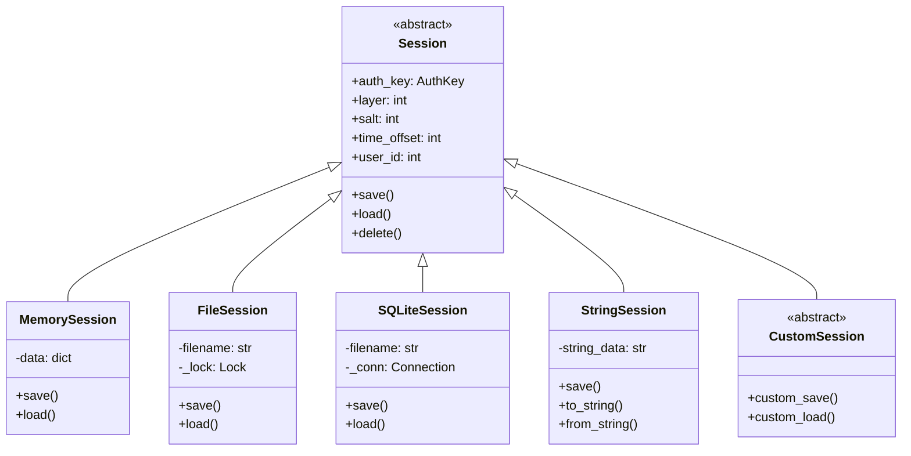
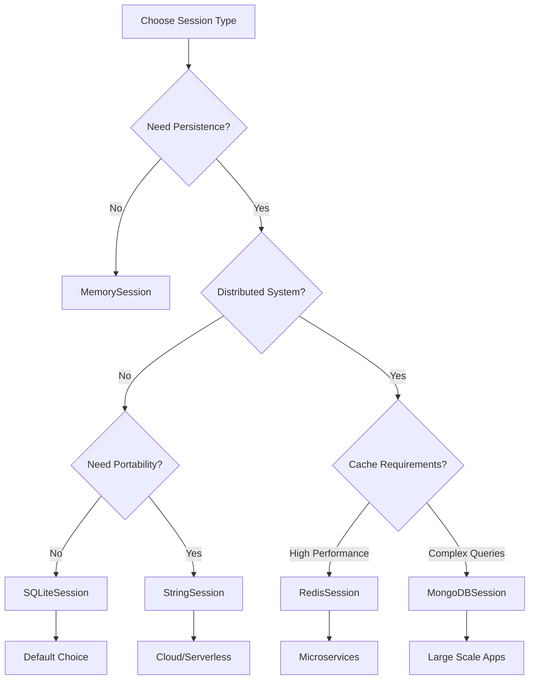

# Session Types

---
**Navigation:** [← Session Overview](overview.md) | [Home](../index.md) | [Up](../index.md) | [Session Data →](data.md)

---

## Overview

Telethon supports multiple session storage backends to accommodate different use cases. Each session type provides the same core functionality while offering different performance characteristics, storage requirements, and deployment scenarios.

## Session Type Hierarchy



## Built-in Session Types

### MemorySession

```python
class MemorySession(Session):
    """
    In-memory session storage (no persistence).
    """
    
    def __init__(self):
        super().__init__()
        self._dc_sessions = {}
        self._entities = {}
        self._update_states = {}
        
    def save(self):
        """No-op for memory sessions."""
        pass
        
    def load(self):
        """No-op for memory sessions."""
        pass
        
    def close(self):
        """Clear memory."""
        self._dc_sessions.clear()
        self._entities.clear()
        self._update_states.clear()
        
    def get_update_state(self, entity_id):
        """Get update state for entity."""
        return self._update_states.get(entity_id)
        
    def set_update_state(self, entity_id, state):
        """Set update state for entity."""
        self._update_states[entity_id] = state
        
    # Pros:
    # - Fastest performance
    # - No disk I/O
    # - Good for temporary operations
    
    # Cons:
    # - No persistence
    # - Lost on restart
    # - Not suitable for long-running apps
```

### SQLiteSession

```python
class SQLiteSession(Session):
    """
    SQLite-based session storage (default).
    """
    
    def __init__(self, session_id=None):
        super().__init__()
        
        if session_id is None:
            session_id = 'telethon'
            
        # Ensure .session extension
        if not session_id.endswith('.session'):
            session_id += '.session'
            
        self.filename = session_id
        self._conn = None
        self._lock = threading.Lock()
        
        # Create tables on first use
        self._create_tables()
        
    def _create_tables(self):
        """Create SQLite tables."""
        with self._lock:
            c = self._cursor()
            
            # Version table
            c.execute("""
                CREATE TABLE IF NOT EXISTS version (
                    version INTEGER PRIMARY KEY
                )
            """)
            
            # Sessions table (per-DC auth keys)
            c.execute("""
                CREATE TABLE IF NOT EXISTS sessions (
                    dc_id INTEGER PRIMARY KEY,
                    server_address TEXT,
                    port INTEGER,
                    auth_key BLOB,
                    takeout_id INTEGER
                )
            """)
            
            # Entities table (users, chats, channels)
            c.execute("""
                CREATE TABLE IF NOT EXISTS entities (
                    id INTEGER,
                    hash INTEGER NOT NULL,
                    username TEXT,
                    phone TEXT,
                    name TEXT,
                    PRIMARY KEY (id, hash)
                )
            """)
            
            # Update states table
            c.execute("""
                CREATE TABLE IF NOT EXISTS update_state (
                    entity_id INTEGER PRIMARY KEY,
                    pts INTEGER,
                    qts INTEGER,
                    date INTEGER,
                    seq INTEGER
                )
            """)
            
            # Sent files cache
            c.execute("""
                CREATE TABLE IF NOT EXISTS sent_files (
                    md5_digest BLOB,
                    file_size INTEGER,
                    type INTEGER,
                    id INTEGER,
                    hash INTEGER,
                    PRIMARY KEY (md5_digest, file_size, type)
                )
            """)
            
            self._conn.commit()
            
    def save(self):
        """Save current state to database."""
        with self._lock:
            self._save_dc_sessions()
            self._save_update_states()
            self._conn.commit()
            
    def load(self):
        """Load state from database."""
        with self._lock:
            self._load_dc_sessions()
            self._load_entities()
            self._load_update_states()
            
    # Pros:
    # - Persistent storage
    # - Efficient queries
    # - Built-in caching
    # - Thread-safe
    
    # Cons:
    # - File-based limitations
    # - Not suitable for distributed systems
    # - Can grow large over time
```

### StringSession

```python
class StringSession(Session):
    """
    String-based session for easy sharing.
    """
    
    def __init__(self, string=None):
        super().__init__()
        
        if string:
            self._decode_string(string)
            
    def save(self):
        """Save to string format."""
        if not self.auth_key:
            return ''
            
        # Pack session data
        data = struct.pack(
            '>BI?256sQ',
            self.dc_id,
            self.server_address,
            self.port,
            self.auth_key.key,
            self.user_id or 0
        )
        
        # Encode to base64
        return base64.urlsafe_b64encode(data).decode('ascii')
        
    def _decode_string(self, string):
        """Decode session from string."""
        try:
            data = base64.urlsafe_b64decode(string)
            
            # Unpack session data
            (
                self.dc_id,
                ip_len
            ) = struct.unpack('>BI', data[:5])
            
            offset = 5
            self.server_address = data[offset:offset+ip_len].decode('ascii')
            offset += ip_len
            
            (
                self.port,
                auth_key_data,
                self.user_id
            ) = struct.unpack('>H256sQ', data[offset:offset+266])
            
            self.auth_key = AuthKey(auth_key_data)
            
        except Exception as e:
            raise ValueError(f"Invalid string session: {e}")
            
    # Pros:
    # - Portable (can be shared as text)
    # - No file dependencies
    # - Good for cloud deployments
    
    # Cons:
    # - No entity cache
    # - No update states
    # - Limited functionality
```

## Custom Session Types

### RedisSession Example

```python
class RedisSession(Session):
    """
    Redis-based session for distributed systems.
    """
    
    def __init__(self, session_id, redis_config):
        super().__init__()
        self.session_id = session_id
        self.redis = redis.Redis(**redis_config)
        self.prefix = f"telethon:{session_id}:"
        self.ttl = 86400 * 30  # 30 days
        
    def _key(self, suffix):
        """Generate Redis key."""
        return f"{self.prefix}{suffix}"
        
    def save(self):
        """Save session to Redis."""
        pipe = self.redis.pipeline()
        
        # Save auth key
        if self.auth_key:
            pipe.setex(
                self._key('auth_key'),
                self.ttl,
                self.auth_key.key
            )
            
        # Save DC info
        pipe.hset(self._key('dc'), mapping={
            'id': self.dc_id,
            'address': self.server_address,
            'port': self.port
        })
        
        # Save user info
        if self.user_id:
            pipe.setex(
                self._key('user_id'),
                self.ttl,
                str(self.user_id)
            )
            
        pipe.execute()
        
    def load(self):
        """Load session from Redis."""
        # Load auth key
        auth_key_data = self.redis.get(self._key('auth_key'))
        if auth_key_data:
            self.auth_key = AuthKey(auth_key_data)
            
        # Load DC info
        dc_info = self.redis.hgetall(self._key('dc'))
        if dc_info:
            self.dc_id = int(dc_info.get(b'id', 2))
            self.server_address = dc_info.get(b'address', b'').decode()
            self.port = int(dc_info.get(b'port', 443))
            
        # Load user ID
        user_id = self.redis.get(self._key('user_id'))
        if user_id:
            self.user_id = int(user_id)
            
    def cache_entity(self, entity):
        """Cache entity in Redis."""
        key = self._key(f'entity:{entity.id}')
        
        data = {
            'id': entity.id,
            'hash': entity.access_hash,
            'type': entity.__class__.__name__,
            'username': getattr(entity, 'username', None),
            'phone': getattr(entity, 'phone', None),
            'name': utils.get_display_name(entity)
        }
        
        self.redis.hset(key, mapping={
            k: str(v) for k, v in data.items() if v is not None
        })
        self.redis.expire(key, self.ttl)
```

### MongoDBSession Example

```python
class MongoDBSession(Session):
    """
    MongoDB-based session for scalable applications.
    """
    
    def __init__(self, session_id, mongo_config):
        super().__init__()
        self.session_id = session_id
        self.client = pymongo.MongoClient(**mongo_config)
        self.db = self.client.telethon
        self.collection = self.db.sessions
        
    def save(self):
        """Save session to MongoDB."""
        document = {
            '_id': self.session_id,
            'auth_key': self.auth_key.key if self.auth_key else None,
            'dc_id': self.dc_id,
            'server_address': self.server_address,
            'port': self.port,
            'user_id': self.user_id,
            'layer': self.layer,
            'salt': self.salt,
            'time_offset': self.time_offset,
            'updated_at': datetime.utcnow()
        }
        
        self.collection.replace_one(
            {'_id': self.session_id},
            document,
            upsert=True
        )
        
    def load(self):
        """Load session from MongoDB."""
        doc = self.collection.find_one({'_id': self.session_id})
        
        if doc:
            if doc.get('auth_key'):
                self.auth_key = AuthKey(doc['auth_key'])
                
            self.dc_id = doc.get('dc_id', 2)
            self.server_address = doc.get('server_address', '')
            self.port = doc.get('port', 443)
            self.user_id = doc.get('user_id')
            self.layer = doc.get('layer', LAYER)
            self.salt = doc.get('salt', 0)
            self.time_offset = doc.get('time_offset', 0)
            
    def cache_entity(self, entity):
        """Cache entity in MongoDB."""
        self.db.entities.replace_one(
            {
                'session_id': self.session_id,
                'entity_id': entity.id
            },
            {
                'session_id': self.session_id,
                'entity_id': entity.id,
                'access_hash': entity.access_hash,
                'type': entity.__class__.__name__,
                'username': getattr(entity, 'username', None),
                'phone': getattr(entity, 'phone', None),
                'name': utils.get_display_name(entity),
                'updated_at': datetime.utcnow()
            },
            upsert=True
        )
```

## Session Migration

### Migrating Between Types

```python
class SessionMigrator:
    """
    Migrates sessions between different storage types.
    """
    
    @staticmethod
    async def migrate(from_session, to_session):
        """Migrate session data."""
        # Load source session
        await from_session.load()
        
        # Copy core data
        to_session.auth_key = from_session.auth_key
        to_session.dc_id = from_session.dc_id
        to_session.server_address = from_session.server_address
        to_session.port = from_session.port
        to_session.user_id = from_session.user_id
        to_session.layer = from_session.layer
        to_session.salt = from_session.salt
        to_session.time_offset = from_session.time_offset
        
        # Copy entities if supported
        if hasattr(from_session, 'get_entities'):
            entities = await from_session.get_entities()
            for entity in entities:
                await to_session.cache_entity(entity)
                
        # Copy update states if supported
        if hasattr(from_session, 'get_update_states'):
            states = await from_session.get_update_states()
            for entity_id, state in states.items():
                await to_session.set_update_state(entity_id, state)
                
        # Save target session
        await to_session.save()
        
    @staticmethod
    async def sqlite_to_string(sqlite_session):
        """Convert SQLite session to string session."""
        await sqlite_session.load()
        
        string_session = StringSession()
        await SessionMigrator.migrate(sqlite_session, string_session)
        
        return string_session.save()
```

## Session Security

### Encryption

```python
class EncryptedSession(SQLiteSession):
    """
    SQLite session with encryption at rest.
    """
    
    def __init__(self, session_id, password):
        self.password = password
        self._key = self._derive_key(password)
        super().__init__(session_id)
        
    def _derive_key(self, password):
        """Derive encryption key from password."""
        salt = b'telethon_session_salt'  # Should be random in production
        kdf = PBKDF2HMAC(
            algorithm=hashes.SHA256(),
            length=32,
            salt=salt,
            iterations=100000,
            backend=default_backend()
        )
        return kdf.derive(password.encode())
        
    def _encrypt(self, data):
        """Encrypt data."""
        iv = os.urandom(16)
        cipher = Cipher(
            algorithms.AES(self._key),
            modes.CBC(iv),
            backend=default_backend()
        )
        encryptor = cipher.encryptor()
        
        # Pad data
        padder = padding.PKCS7(128).padder()
        padded_data = padder.update(data) + padder.finalize()
        
        # Encrypt
        encrypted = encryptor.update(padded_data) + encryptor.finalize()
        
        return iv + encrypted
        
    def _decrypt(self, data):
        """Decrypt data."""
        iv = data[:16]
        encrypted = data[16:]
        
        cipher = Cipher(
            algorithms.AES(self._key),
            modes.CBC(iv),
            backend=default_backend()
        )
        decryptor = cipher.decryptor()
        
        # Decrypt
        padded_data = decryptor.update(encrypted) + decryptor.finalize()
        
        # Unpad
        unpadder = padding.PKCS7(128).unpadder()
        return unpadder.update(padded_data) + unpadder.finalize()
```

## Performance Comparison

| Session Type | Read Speed | Write Speed | Memory Usage | Persistence | Distributed |
|-------------|------------|-------------|--------------|-------------|-------------|
| Memory | Fastest | Fastest | High | No | No |
| SQLite | Fast | Medium | Low | Yes | No |
| String | Fast | Fast | Minimal | Manual | Yes |
| Redis | Medium | Medium | None | Yes | Yes |
| MongoDB | Medium | Medium | None | Yes | Yes |

## Choosing the Right Session Type

### Decision Tree



## Best Practices

### Session Management

1. **Choose Appropriate Type**: Match session type to use case
2. **Handle Migration**: Plan for session type changes
3. **Implement Backup**: Regular session backups for critical apps
4. **Monitor Growth**: Track session storage size
5. **Clean Old Data**: Implement session cleanup policies

### Security

1. **Encrypt Sensitive Data**: Use encrypted sessions for sensitive apps
2. **Secure Storage**: Proper file permissions for file-based sessions
3. **Network Security**: Use TLS for distributed session stores
4. **Access Control**: Limit session access in multi-user environments
5. **Session Rotation**: Periodically rotate session keys

## Next Steps

- Continue to [Session Data](data.md) for data structure details
- See [Entity Cache](entity-cache.md) for caching mechanisms
- Review [Session Overview](overview.md) for general concepts

---
**Navigation:** [← Session Overview](overview.md) | [Home](../index.md) | [Up](../index.md) | [Session Data →](data.md)

---